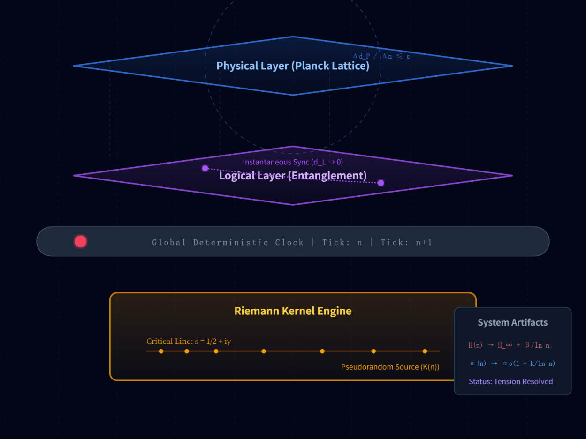
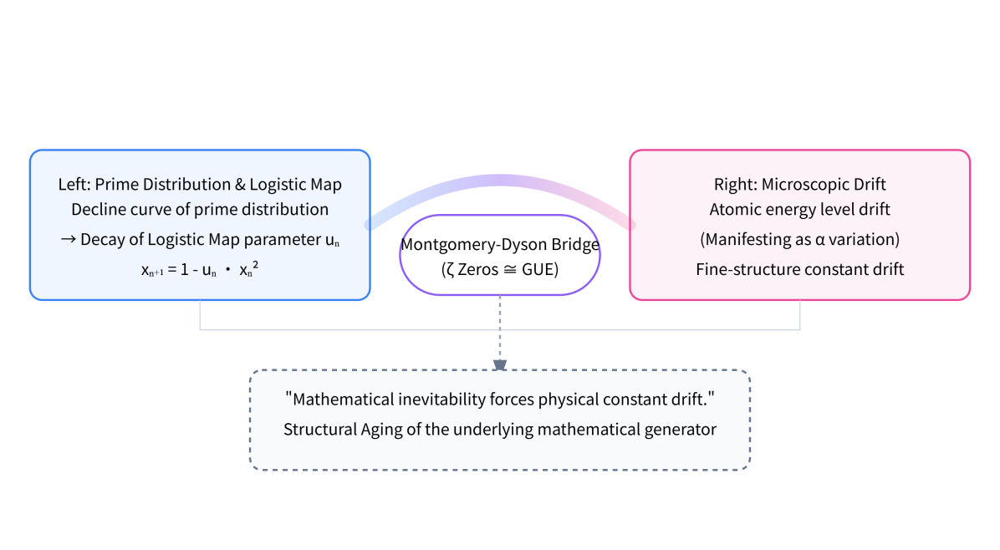

<!-- Faithful format conversion; scientific claims are unreviewed source text. Source: ../ori_paper/merged_document_v2_with_latex.docx; Pandoc blocks [0, 82). -->

**The Riemann Standard Model: A Dialogue Between Continuous and Discrete Worldviews**

--- A Computational Universe Architecture Based on Discrete Frame Synchronization

Liang Wang\*

School of Artificial Intelligence and Automation, Huazhong University of Science and Technology, 430070, P.R. China

\*Corresponding author: E-mail: <wangliang.f@gmail.com>

# Abstract

This paper proposes the **Riemann Standard Model (RSM)**, a unified cosmological framework aimed at resolving the fundamental conflicts between General Relativity and Quantum Mechanics. RSM abandons the traditional assumption of spacetime as a continuous manifold, reconstructing it instead as a **Computational Graph** that is discrete in both time and space, and causally synchronized.

To address the variability of fundamental physical constants, we construct a dynamical model based on **Non-autonomous Variables**. By revealing the profound connection between the distribution of the Riemann $\zeta$ function\'s non-trivial zeros and the **Non-autonomous Logistic Map**, and utilizing the **Montgomery-Dyson Coincidence** to link these to quantum energy level distributions, this study verifies that fundamental constants (such as the fine-structure constant $\alpha$ and the Hubble constant $H_{0}$) are not static. Instead, they undergo minute logarithmic drifts ($\propto 1/lnt$) as the system evolves.

Based on this dynamical foundation, we propose the **Cosmic Lockstep Hypothesis**, which posits that cosmic evolution proceeds in discrete Planck time steps driven by a deterministic global clock. The core of this architecture is underpinned by:

1.  **The Symplectic Framework:** As the mathematical foundation, it ensures the preservation of symplectic symmetry and conservation law stability during evolution on the discrete Planck Lattice $\mathbb{Z}^{3}$.

2.  **The ECS (Entity-Component-System) Architecture:** As the engineering skeleton, it decouples physical entities, attribute data, and evolutionary logic. It redefines Quantum Non-locality as instantaneous state updates within the **Logical Address Space**, while Relativistic Causality ($c$) naturally emerges as the **System Bandwidth Limit** for information propagation in the Metric Space.

Furthermore, the RSM successfully interprets the **Hubble Tension** and the **Vacuum Catastrophe** as computational artifacts of the system's gradual aging. It predicts that the ultimate fate of the universe is a **"Computational Freeze"** rather than Heat Death. This framework offers novel explanations for wave-particle duality as an **LOD (Level of Detail) rendering strategy** and quantum entanglement as a **memory mapping mechanism**, transitioning unified field theory from a geometric paradigm to a computational one.

**Keywords:** Riemann Zeta Zeros; Non-autonomous Logistic Map; Fine-Structure Constant Drift; Hubble Tension; Computational Universe; Quantum Chaos; Discrete Spacetime; Webb Anomaly.

## Appendix: Paradigm Shift --- RSM vs. $\Lambda$CDM

|                         |                                |                                       |
|-------------------------|--------------------------------|---------------------------------------|
| **Core Feature**        | **Old: Standard Model (ΛCDM)** | **New: Riemann Standard Model (RSM)** |
| Foundation              | Continuous Manifold            | Discrete Computational Graph          |
| Driver                  | Matter & Energy                | Information & Bits                    |
| Randomness              | True Randomness (Dice)         | Pseudo-randomness (Riemann Zeros)     |
| Spacetime               | Curved Stage                   | Tick & Voxel Grid                     |
| Speed of Light ($c$) Ab | solute Speed Limit Sy          | stem Bus Bandwidth Limit              |
| Entanglement            | Spooky Action                  | Logic-Layer Pointer Reference         |
| Constants               | Static                         | Aging Drift ($1/lnt$)                 |
| Ultimate Fate           | Heat Death                     | Computational Freeze                  |
| Civilization Goal       | Survival & Adaptation          | Root & Rewrite (Jailbreak)            |

**Figure Note:** Structure of Riemann Standard Model (RSM).https://gemini.google.com/share/189328e0b114

**Figure Note:** The key connection to Build RSM

Content

Abstract 1

[Chapter 0: Introduction 6](\l)

[I. Introduction: The Synchronization Crisis 6](\l)

[II. Dynamics: The Riemann Kernel 6](\l)

[III. Formalism: The Cosmic Lockstep Architecture 7](\l)

[IV. Mathematical Framework: Symplectic Evolution and Discrete Manifold Mapping 8](\l)

[V. Observational Evidence: Fingerprints of System Aging 8](\l)

[VI. Predictions & Interpretations 8](\l)

[VII. Riemann Engine Design v1.0 9](\l)

[VIII. Conclusion: From Geometry to Computation 9](\l)

$\Lambda$[Appendix: Paradigm Shift --- RSM vs. CDM 9](\l)

[Chapter 1: System Anomaly (The Bug) --- Two New Dark Clouds Over the Physics Sky 10](\l)

[1.1 Introduction: Webb's "Death Sentence" 10](\l)

[1.2 The First Cloud: Hubble Tension --- Server Clock Drift 11](\l)

[1.3 The Second Cloud: Vacuum Energy Catastrophe --- Floating Point Truncation Error 12](\l)

[1.4 Engineer\'s Diagnosis: Performance Degradation from Excessive Uptime 12](\l)

[1.5 Conclusion 13](\l)

[Chapter 2: The Source Code --- Discrete Iteration of 0 and 1 13](\l)

[2.1 The Bootloader 14](\l)

$u_{c} \approx 1.5437$[2.2 Reverse Engineering: The Edge of Chaos 14](\l)

$k \approx 12.73$[2.3 The Ghost Constant: 15](\l)

[2.4 The Primer: "Aged" Riemann Zeros 16](\l)

[2.5 Conclusion 17](\l)

[Chapter 3: Formalism --- The Cosmic Lockstep Architecture 18](\l)

[3.1 Architecture Synthesis: From Cellular Automata to Lockstep 18](\l)

[3.2 The Discrete Spacetime State System 18](\l)

[3.3 The Two-Layer Synchronization Protocol 19](\l)

[3.4 Architecture Summary: Engineering Reconstruction of Causality 20](\l)

[**Chapter 4: Mathematical Framework --- Symplectic Evolution and Discrete Manifold Mapping** 21](\l)

[4.1 Discrete Evolution Operators: State Updates via Symplectic Integrators 21](\l)

[4.2 From PDE to State-Transition Functions: The Logic of the Lattice 22](\l)

[4.3 Discrete Manifold Mapping: From Arithmetic Rigidity to Physical Perception 23](\l)

[4.4 Shadow Hamiltonians and Truncation Errors: Reconstructing Physics from Noise 24](\l)

[**Chapter 5: Observational Evidence --- Fingerprints of System Aging** 25](\l)

$\alpha$[5.1 Fine-Structure Constant () Drift: Evidence of Computational Performance Decay 25](\l)

[5.2 Engineering Resolution of Hubble Tension: The Expansion Rate as Clock Frequency 29](\l)

[5.3 Logic Compatibility of Laboratory Null Results: Scale and Precision 30](\l)

[5.4 Symplectic Framework Derivations 31](\l)

[**Chapter 6: Predictions & Interpretations** 32](\l)

[6.1 Uncertainty Principle: Anti-Aliasing on the Planck Lattice 32](\l)

[6.2 Quantum Entanglement: Memory Mapping and Pointer References 33](\l)

[6.3 The Vacuum Catastrophe: Truncation Error as Vacuum Energy 33](\l)

[6.4 Gravity and Time Dilation: Computational Latency 34](\l)

[6.5 Wave-Particle Duality: LOD Rendering Strategy 34](\l)

[**Chapter 7: Riemann Engine Design v1.0** 35](\l)

[7.1 Design Philosophy: The Universe as Runtime 35](\l)

[7.2 Functional Requirements 36](\l)

[7.3 Non-Functional Requirements 38](\l)

[7.4 The Architecture of the RSM Universe 39](\l)

[7.5 Pseudo-Code Implementation 39](\l)

[**Chapter 8: Simulation Case Studies & System Verification Guide** 40](\l)

$\alpha$[8.1 Experiment A: Backtesting the Logarithmic Evolution of the Fine-Structure Constant () 40](\l)

[8.2 Experiment B: Dynamical Unification of the Hubble Tension 41](\l)

[8.3 Experiment C: Prediction of Precision Limits at the Laboratory Scale 42](\l)

[Chapter 9: Conclusion --- From Geometry to Computation, Obtaining Universe Root Access 43](\l)

[9.1 The Computational Nature 43](\l)

[9.2 Exploit 1: The PRNG Exploit 44](\l)

[9.3 Exploit 2: Logic Layer Tunneling 44](\l)

[9.4 Exploit 3: Floating-Point Mining 45](\l)

[9.5 Ultimate Outlook: From Players to Admins 45](\l)

[Appendix: Paradigm Shift --- RSM vs. Standard Model Comparison Table 46](\l)

[References 46](\l)

[Acknowledgments 48](\l)
