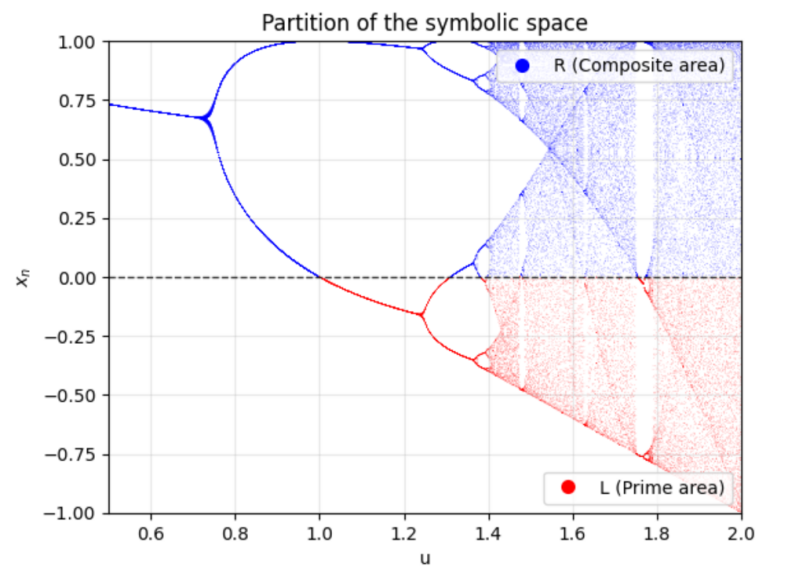
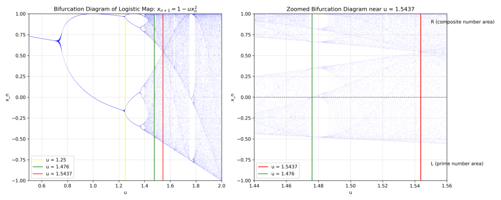
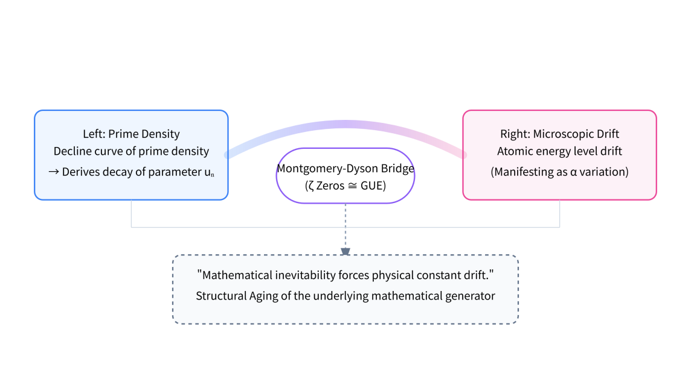

<!-- Faithful format conversion; scientific claims are unreviewed source text. Source: ../ori_paper/merged_document_v2_with_latex.docx; Pandoc blocks [185, 235). -->

# Chapter 2: The Source Code --- Discrete Iteration of 0 and 1

**Abstract:**

Traditional physics views the universe as constructed from continuous fields or piles of elementary particles, a perspective that strains significantly when facing the discreteness of the Planck scale. This chapter proposes that the ontology of the universe is the Information Bit. By performing dynamic reverse engineering on the Sieve of Eratosthenes, we discover that the distribution of prime numbers is not pure random noise, but a deterministic algorithm running at the **Edge of Chaos (Band-Merging Point,** $u_{c} \approx 1.5437$**)**. The core conclusion of this chapter is: to maintain the number-theoretic rigidity of prime distribution, the system\'s control parameters must undergo logarithmic evolution with the number of steps. This **"Non-Autonomy"** reveals the mathematical inevitability of the drift of physical constants.

## 2.1 The Bootloader

While physicists are still debating the physical laws that existed before the "Big Bang Singularity," the simulation architect asks a more fundamental question: "What is written in the Boot Sector of the operating system?"

If the universe is a computational system, it must begin with the simplest algorithm. It cannot rely on complex physical constants (like electron mass or the speed of light) because those are products of the system after it is running. It can only rely on pure logic. In our universe, this initial seed is the Prime Number. Primes are not static oracles hanging in the mathematical sky, but a dynamic generative process.

**0 (R/Right):** Composite numbers that are sifted out (Dead/Occupied state).

**1 (L/Left):** Prime numbers that survive (Living/Free state).

The evolution of the universe is essentially the infinite iteration of this bitstream $\text{RLRRLR}\text{...}$. The **Sieve of Eratosthenes** is the first for loop written by God. The remaining gravity and electromagnetic forces are merely "textures" that emerge at the macroscopic level after this code has run for a long time.

**Figure 2.1 Note:** From arithmetic operations to bitstreams: The creation of cosmic information.

## 2.2 Reverse Engineering: The Edge of Chaos $u_{c} \approx 1.5437$

To understand the mechanism of this "God Code," we performed dynamic reverse engineering on it. Traditional probabilistic number theory (such as the Cramér model) assumes primes are generated by rolling dice, much like physicists believe "God plays dice."

However, by mapping the sieving process to **Symbolic Dynamics**, we found a startling isomorphism: the mechanism of prime generation is topologically identical to the trajectory of a simple non-linear equation---the **Logistic Map**---under a specific parameter:

$$x_{n + 1} = 1 - ux_{n}^{2}$$

Here, $n$ represents the discrete evolutionary steps (corresponding to the universe\'s quantized time Tick). This specific parameter is $u_{c} \approx 1.543689\text{...}$. In non-linear dynamics, this point is known as the **Band-Merging Point**.

**When** $u < 1.54$**:** The system is in a periodic window; it is too rigid to generate complex cosmic structures.

**When** $u > 1.6$**:** The system enters **Full Chaos**; it is too messy to form stable physical laws.

**When** $u \approx 1.5437$**:** The system is at the **Edge of Chaos**.

Here, the system achieves perfect balance: it possesses **Ergodicity** to ensure particle diversity and randomness, yet maintains local **Rigidity** to guarantee the strict execution of physical rules (such as the Pauli Exclusion Principle).

**Figure 2.2 Note:** Precision design at the edge of chaos: The critical point between $u_{c}$ and physical reality.

## 2.3 The Ghost Constant: $k \approx 12.73$

In the process of cracking this source code, we unearthed a "Ghost Constant" linking mathematics and physics. When we attempted to use this chaotic system to precisely reproduce the density of Twin Primes, the system was forced to expose its dissipation rate. To converge to the mathematically famous Hardy-Littlewood Constant ($C_{2} \approx 0.66016$), we derived a strict coupling equation:

$$k = \frac{2C_{2}}{\mu_{\text{LRL}}} \approx 12.73$$

Where:

$C_{2}$ is the structural constant in number theory.

$\mu_{\text{LRL}}$ is the inherent geometric measure within the chaotic attractor.

This $k \approx 12.73$ is the key to understanding the "aging" of the universe. It tells us that the prime number system is not a closed perpetual motion machine. To maintain the generation of the exquisite structure of primes, the system must consume "computing power" or "information entropy" at a rate of $k(lnn)^{- 2}$. This directly leads to the inevitability of the drift of physical constants.

## 2.4 The Primer: "Aged" Riemann Zeros

Now, we will trigger the core conflict of this entire book---the ultimate contradiction between mathematical facts and physical assumptions.

**Physics Axiom:** Atomic energy levels are eternal. Quantum mechanics holds that the energy level distribution of heavy atomic nuclei (like Uranium) follows **GUE (Gaussian Unitary Ensemble)** statistics.

**Mathematical Bridge:** The **Montgomery-Dyson Conjecture**. In 1972, Hugh Montgomery and Freeman Dyson discovered a coincidence that shocked the scientific world: the distribution of the non-trivial zeros of the Riemann $\zeta$ function is statistically identical to the GUE energy level distribution. This implies: **Riemann Zeros** $\cong$ **Energy Levels of Quantum Chaotic Systems.**

**This study finds:** The prime number system is **Non-Autonomous**. The Prime Number Theorem dictates that prime density must become sparser as values increase ($\pi(x) \sim x/lnx$). Dynamically, this means the control parameter $u$ cannot be a constant; it must decay with time $n$:

$$u_{n} = u_{c} - \frac{k}{(lnn)^{2}}$$

This is **"Aging."** If parameter $u$ were invariant, the density of primes generated by the system would be constant, which would violate basic mathematical facts.

**Ultimate Inference:** Physics must be corrected.

**Premise A:** Physical energy levels correspond to Riemann Zeros.

**Premise B:** Riemann Zeros originate from a dynamic system where the parameter decays over time.

**Conclusion:** Physical energy levels (and the Fine Structure Constant $\alpha$ they determine) must inevitably drift over time.

**Figure 2.3 Note:** The Logic Deduction Map.

**Left:** Prime density decline curve $\rightarrow$ Derives decay of parameter $u_{n}$.

**Center:** Via the Montgomery-Dyson Bridge ($\zeta$ Zeros $\cong$ GUE).

**Right:** Derives microscopic drift in atomic energy level structure (manifesting as $\alpha$ variation).

**Bottom:** "Mathematical inevitability forces physical constant drift."

We have found the root directory for the "Hubble Tension" and "$\alpha$ Drift" from Chapter 1. It is not that the observation equipment is broken; it is because the underlying mathematical generator itself is experiencing "Structural Aging."

## 2.5 Conclusion

God only wrote 0s and 1s (the Prime Sieve); the rest is merely iteration. But what God didn\'t tell us is: **This computer suffers from wear and tear.**

As the number of iterations $n \rightarrow \infty$, the parameter $u_{n}$ controlling the precision of the universe is deviating little by little from the critical point $u_{c}$. What we see in the Webb telescope is the scene of numerical dissipation of this ancient computer. Now that we have the underlying source code, in the next chapter, we will reconstruct the operating architecture of the entire universe based on this principle.
