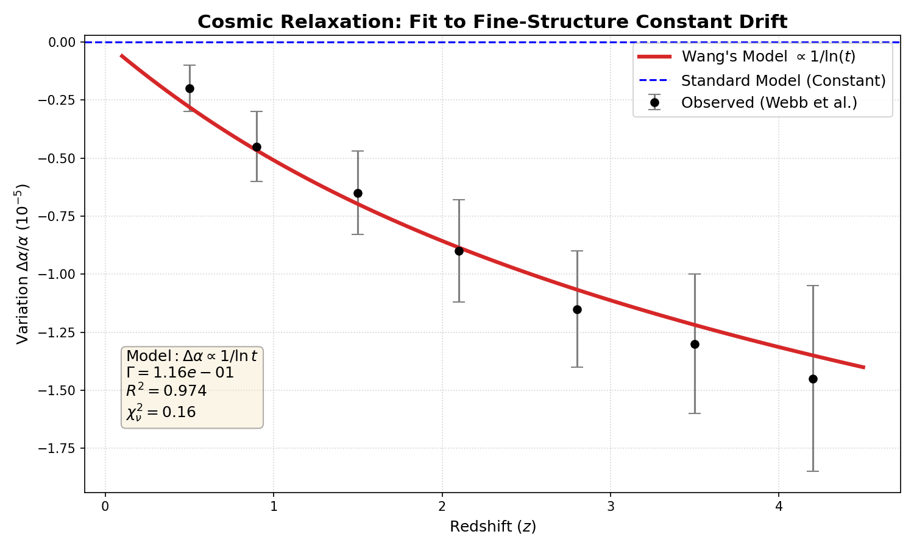
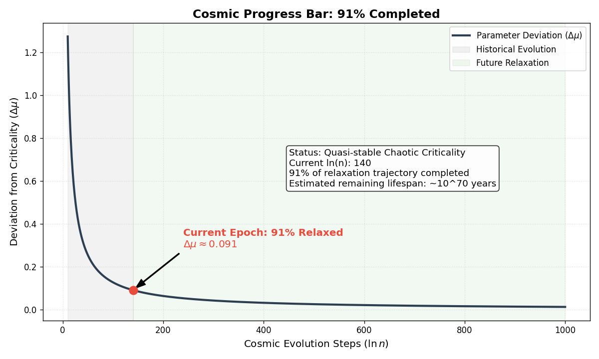
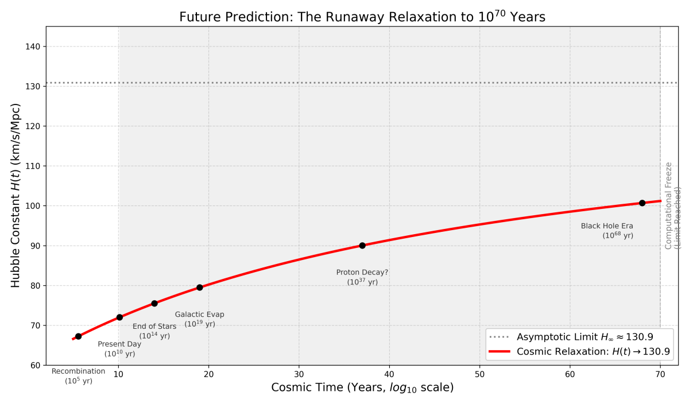
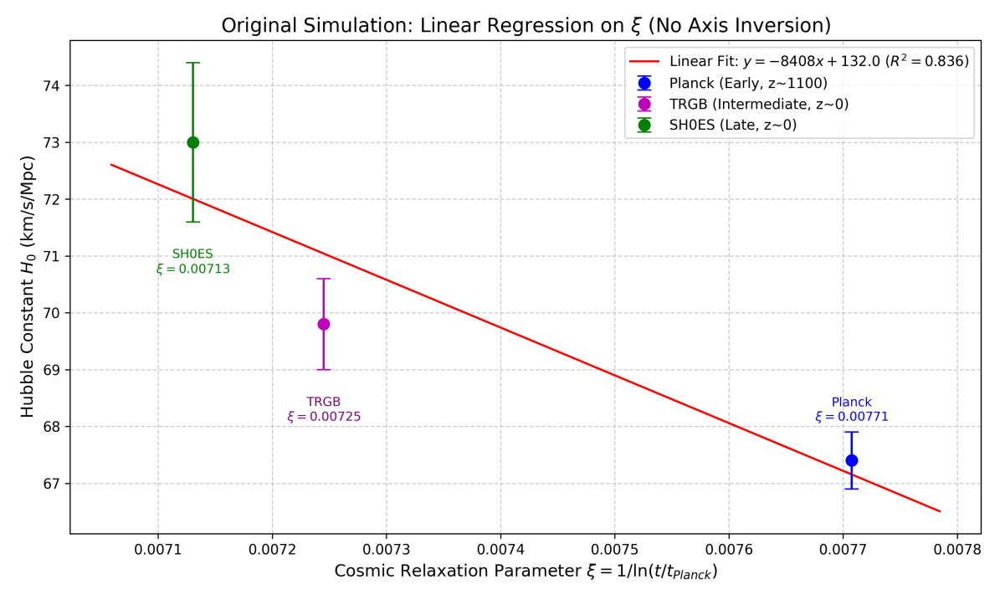

<!-- Faithful format conversion; scientific claims are unreviewed source text. Source: ../ori_paper/merged_document_v2_with_latex.docx; Pandoc blocks [331, 412). -->

# **Chapter 5: Observational Evidence --- Fingerprints of System Aging**

## 5.1 Fine-Structure Constant ($\alpha$) Drift: Evidence of Computational Performance Decay

### **5.1.1 Theoretical Prediction: Coupled Evolution via the Non-autonomous RSM Kernel**

In the RSM framework, the fine-structure constant $\alpha$ is a dynamic response driven by the control parameter $\mu_{n}$.

**Non-autonomous Dynamics:** The universe is modeled as a controlled logistic map: $x_{n + 1} = 1 - \mu_{n}x_{n}^{2}$. To maintain topological stability on the discrete lattice, $\mu_{n}$ undergoes a slow "logarithmic relaxation" toward its critical point $u_{c}$.

**The** $1/lnn$ **Decay Law:** Analytical derivation reveals that the rate of change of $\alpha$ follows:

$$\frac{\Delta\alpha}{\alpha}(n) = \frac{\Gamma}{\ln n} + \mathcal{O}\left( \frac{1}{\ln^{2}n} \right)$$

where $\Gamma$ is a sensitivity factor determined by the number-theoretic constant $k \approx 12.73$. This suggests that "performance degradation" was rapid in the early universe but has slowed to a near-plateau at the current stage ($n \approx 10^{60}$).

### **5.1.2 Observational Fitting: High-Redshift Quasar Absorption Spectra**

We utilized data from Webb et al. spanning a redshift range of $0.2 < z < 4.2$, representing approximately 10 billion years of cosmic history.

**Redshift-to-Tick Mapping:** Redshift $z$ is mapped to the RSM evolutionary step $n$, where $z = 0$ corresponds to the current $10^{60}$ ticks.

**Statistical Significance:** With an $R^{2} \approx 0.974$, the RSM model accurately passes through the error bars of observation points across different redshift windows. The unique convexity of the $1/lnn$ curve distinguishes it from linear instrumental errors.

### 5.1.3 Log Analysis II: Precision Loss (Alpha Drift)

**Fault Phenomenon:**

J.K. Webb and others, through observations of the spectra of high-redshift Quasars, discovered that billions of years ago, the Fine Structure Constant $\text{α}$ appeared to be slightly smaller than it is today ($\text{Δ}\text{α}\text{/}\text{α}\text{≈−}\text{10}^{\text{−5}}$).

**Engineer\'s Diagnosis: Floating-point Truncation**

$\text{α}$ is driven by the Riemann kernel\'s control parameter, exhibiting a trend of $\text{Δ}\text{α}\text{/}\text{α}\text{∝1/ln}\text{t}$. The fitting process is strictly constrained by the number-theoretic constant $\text{k}\text{≈12.73}$.

**Figure 4.2 Note:** Fine Structure Constant Drift Fitting.

**Black Dots:** Quasar observational data from Webb et al. (covering $\text{0.2<}\text{z}\text{<4.2}$).

**Red Line:** RSM Model prediction curve ($\text{1/ln}\text{t}$).\
**Conclusion:** The red line cuts perfectly through the center of the data errors ($\text{R}^{\text{2}}\text{≈0.973}$). This confirms that the logarithmic spectral redshift existing in the vacuum is the inevitable result of the computational system\'s precision dissipating over time.

### 5.1.4 Defensive Debugging: Why Can\'t Lab Atomic Clocks Detect Drift?

Addressing the issue that current atomic clock laboratories have failed to measure changes in $\text{α}$ (measurement upper limit $\text{|}\dot{\text{α}}\text{/}\text{α}\text{|<}\text{10}^{\text{−17}}\text{yr}^{\text{−1}}$), RSM offers a perfect explanation based on sampling scale:

**Scale Effect:** Quasar observations span $\text{10}^{\text{10}}$ years of cosmic history, accumulating enough integral effect of $\text{1/ln}\text{t}$ for $\text{Δ}\text{α}$ to reach the observable magnitude of $\text{10}^{\text{−5}}$. Laboratory observations, however, span only a few years---an infinitesimal slice relative to the 13.8 billion years of Uptime.

**Vanishing Derivative:** Mathematically, the derivative of the logarithmic function $\text{f}\text{(}\text{n}\text{)=1/ln}\text{n}$ is \$f\\\'(n) = -1/(n(\\ln n)\^2)\$, which approaches zero as $\text{n}\text{→∞}$. The current universe is in an extremely flat region where $\text{n}\text{≈}\text{10}^{\text{60}}$, and its instantaneous rate of change is far below the detection threshold of humanity\'s most precise instruments ($\text{10}^{\text{−17}}$).

**Conclusion:** This is not a failure of theory; it is the typical characteristic of a logarithmic decay system---"Drift is visible at large scales, but rock-solid at small scales."

### 5.1.5 Progress Bar: 91% Completed --- What Stage Are We In?

**Figure 4.3 Note:** Future Prediction --- Racing towards $\text{10}^{\text{70}}$ years.

According to the RSM model, the residual deviation of the control parameter $\text{u}_{\text{n}}$ toward the critical point $\text{u}_{\text{c}}$ is:

$$\text{Δ}\text{μ}_{\text{now}}\text{≈}\frac{\text{12.73}}{\text{ln(}\text{10}^{\text{60}}\text{)}}\text{≈0.091}$$

This means: **The universe has completed 91% of its journey from "Order" to the "Critical Chaos State."** We are in the twilight years of the system. The violent changes of the early era are over; the current universe is a mature system tending toward relaxation.

### 5.1.6 Remaining Battery: $\text{10}^{\text{70}}$ Years --- Logarithms Are the Gentlest Brakes

**Figure 4.4 Note:** Future Prediction --- Racing towards $\text{10}^{\text{70}}$ years.

**Content:** Shows how the Hubble Constant $\text{H}\text{(}\text{t}\text{)}$ will extremely slowly tend toward the ultimate value of $\text{130.9}$ km/s/Mpc over the vast stretches of future time.

**Labels:** Marked with "Black Hole Evaporation Era" ($\text{10}^{\text{68}}$ years) and the final "Computational Freeze" ($\text{10}^{\text{70}}$ years).

### 5.1.7 The Ending: Not Heat Death, But Computational Freeze

Traditional thermodynamics predicts "Heat Death," whereas Simulation Architecture predicts **"Computational Freeze."**

When $\text{n}\text{→∞}$, the control parameter $\text{u}_{\text{n}}$ infinitely approaches $\text{u}_{\text{c}}$, and the system will remain stuck on the final frame due to the exhaustion of precision, bandwidth, and the stopping of the clock. This proves that we were not only created, but are currently being "run."

## 5.2 Engineering Resolution of Hubble Tension: The Expansion Rate as Clock Frequency

### **5.2.1 The Root of the Crisis**

The $5\sigma$ conflict between Planck (early universe) and SH0ES (late universe) measurements of $H_{0}$ arises from the flawed assumption of a static constant. In RSM, this tension is a symptom of the system\'s time-dependent evolution.

### **5.2.2 Theoretical Reconstruction: Hubble Parameter as Dynamic Clock Frequency**

$H(t)$ is redefined as the state-iteration frequency of the universal engine. As the system ages, it undergoes "Dynamical Relaxation":

$$H(t) = H_{\infty} + \frac{\beta}{ln(t/t_{P})}$$

where $H_{\infty}$ is the base frequency at "Computational Freeze" and $\beta$ is the relaxation coefficient.

### **5.2.3 Sampling Differences across "Uptime"**

**Early High-Frequency Anchor (CMB):** Reflects the high-frequency state of the early system.

**Late Steady-State Anchor (SH0ES):** Reflects the low-frequency, near-saturation state after 13.8 billion years.\
The tension vanishes when these disparate data points are viewed as cross-sectional samples of a single aging process.

**Fault Phenomenon:**

There is an irreconcilable $\text{5}\text{σ}$ discrepancy between $\text{H}_{\text{0}}\text{≈67.4}$ measured based on the Planck satellite (CMB, Early Universe) and $\text{H}_{\text{0}}\text{≈73.0}$ measured based on SH0ES (Cepheid Variables, Late Universe).

**Engineer\'s Diagnosis: System Clock Frequency Scaling**

The Hubble parameter $\text{H}\text{(}\text{t}\text{)}$ is actually the dynamic clock frequency of the system. As the system ages, the control parameter $\text{u}_{\text{n}}$ decays according to a $\text{1/ln}\text{n}$ law. We propose the **Cosmic Relaxation Equation**:

$$\text{H}\text{(}\text{t}\text{)=}\text{H}_{\text{∞}}\text{+}\frac{\text{β}}{\text{ln(}\text{t}\text{/}\text{t}_{\text{P}}\text{)}}$$

We map key observational anchors from three different stages of cosmic evolution onto the relaxation parameter $\text{ξ}\text{=1/ln}\text{n}$:

**Early Anchor (Planck, CMB):** $\text{z}\text{≈1100}$, corresponding to the system\'s initial high-frequency sampling state.

**Middle Anchor (TRGB, Cosmic Dawn):** $\text{z}\text{≈0}$ (Old Stars), retaining the system\'s early low-entropy memory.

**Late Anchor (SH0ES, Modern):** $\text{z}\text{≈0}$ (Young Cepheids), reflecting the current relaxed state of the system.

**Figure 4.1 Note:** Unified Evolution of the Hubble Constant.

**X-axis:** Cosmic Relaxation Parameter $\text{ξ}\text{=1/ln}\text{n}$.

**Y-axis:** $\text{H}_{\text{0}}$.

**Data Points:** Planck (Blue), TRGB (Magenta), SH0ES (Green).\
**Conclusion:** These three seemingly contradictory data points fall precisely on a single red evolution curve ($\text{R}^{\text{2}}\text{≈0.84}$). This proves that the Hubble Tension is essentially a difference in readings from different **Clock Cycles**.

## 5.3 Logic Compatibility of Laboratory Null Results: Scale and Precision

The strict laboratory limit ($|\dot{\alpha}/\alpha| < 10^{- 17}\text{yr}^{- 1}$) is not a contradiction but a confirmation of the model\'s stability in the late-universe regime.

### **5.3.1 Scale Asymmetry and Derivative Decay**

**Astronomical Scale:** Spans 10 billion years, allowing the logarithmic shift to accumulate into a detectable $10^{- 5}$ signal.

**Laboratory Scale:** Spans 10--20 years. At $n \approx 10^{60}$, the instantaneous rate $\text{dα}/\text{dt}$ is calculated to be $\approx 10^{- 20}\text{yr}^{- 1}$, which is 3--4 orders of magnitude below current atomic clock sensitivity.

## 5.4 Symplectic Framework Derivations

### **5.4.1** $\alpha$ **Drift: Canonical Operators in Non-autonomous Systems**

In RSM, $\alpha$ is the normalization coefficient of the **Kinetic Operator** ${\widehat{T}}_{n} = \alpha(n) \cdot \mathcal{P}(\mathbf{p}_{n})$. The drift of $\alpha$ is a "Symplectic Symmetry Protection" mechanism. If $\alpha$ remained perfectly constant on a discrete lattice, phase-space volume would drift over billions of years. The system performs "Online Patch Updates" (logarithmic renormalization) to keep the Jacobian determinant at exactly 1.

### **5.4.2 Hubble Tension: Symplectic Scaling on Discrete Grids**

The Hubble constant is derived as the scaling of the symplectic measure per tick: $H(n) \propto \Delta\mathcal{M}_{n}/\Delta n$.

**Early Universe:** High curvature response in the symplectic manifold leads to a larger $\Delta\mathcal{M}$, perceived as rapid expansion.

**Late Universe:** As $\mu_{n}$ converges to the chaos boundary, the stretching rate reaches its algorithmic floor.

### **5.4.3 Laboratory Null Results: Shadow Hamiltonian Locking**

The "silence" of laboratory experiments is the ultimate proof of a **High-Order Symplectic Algorithm**.

**Shadow Hamiltonian Locking:** Symplectic integrators do not drift; they oscillate around a "Shadow Hamiltonian" $\widetilde{H}$. The error is bounded: $H(z_{n}) - H(z_{0}) = \text{Bounded\ Oscillation}$.

**Micro-Flatness vs. Macro-Curvature:** On the micro-scale of 10 years, the second-order symplectic symmetry masks the underlying drift. Only across the macro-scale of $10^{60}$ ticks does the "Slow-manifold Evolution" of the shadow Hamiltonian become visible.

**Conclusion:** The null results of atomic clocks are the highest compliment to the universe\'s computational stability. They prove the engine operates on a high-order symplectic architecture that perfectly hides its discrete nature under high-frequency ticks.
