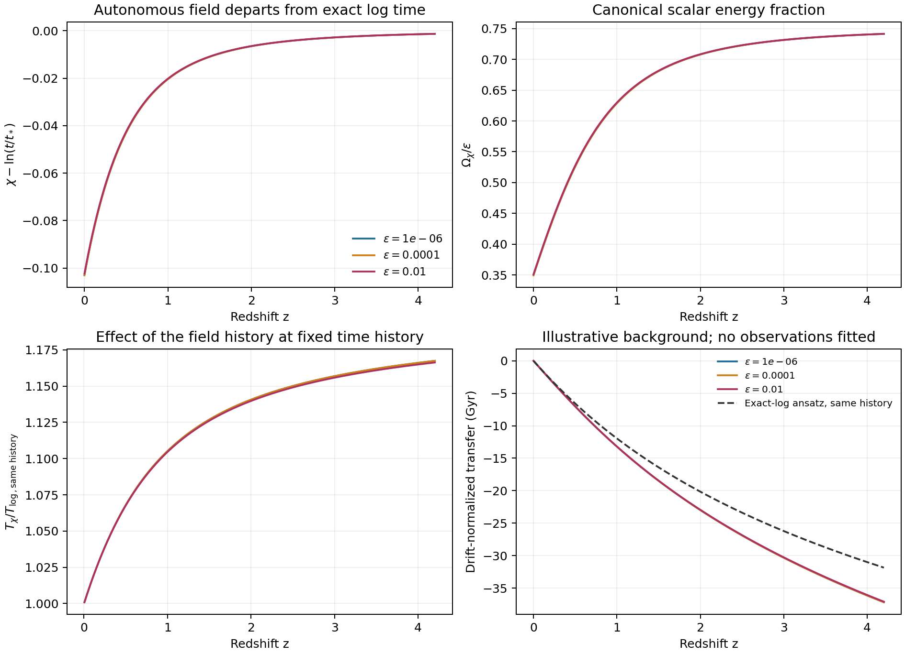

# 最小物理实现 v0.2：驱动场、电磁响应与条件结论

2026-09-22 · 工作稿 · 候选A：指数势驱动场

**本版目标：** 为[v0.1](../draft_v01/minimal_framework_v01.md)中外部规定的参数历史补上一个可变分的驱动源，明确能量和观测响应。核心结论是：逆对数平方可以在一个有明确条件的标度支上实现；完整演化需要求解场方程，平方指数和电磁耦合仍是待检验假设。

研究动机来自作者已发表的[素数—混沌映射研究](https://doi.org/10.1080/27684830.2026.2684334)和[非自治二次映射与黎曼零点的探索性数值对应](https://doi.org/10.3390/mca31050193)。这些工作启发我们考虑缓慢变化的结构参数；从算术索引到宇宙时间、再到电磁常数，是本稿另外提出的物理假设。前作的数值谱对应不能替代这一桥接的证明，具体引用边界见[前作核查](../reports/sources_v01_audit.md)。

## 1. 一个明确的作用量

取自然单位$c=\hbar=1$、度规号差$(-+++)$，$M_{\rm Pl}$为约化普朗克质量，$\chi$无量纲，$F_\chi>0$为质量尺度：

$$
S=\int d^4x\sqrt{-g}\left[
\frac{M_{\rm Pl}^2}{2}R-\rho_\Lambda
-\frac{F_\chi^2}{2}\partial_\mu\chi\partial^\mu\chi
-V_s e^{-2\chi}-\frac14 B(\chi)\mathcal F_{\mu\nu}\mathcal F^{\mu\nu}
\right]+S_m[g,A,\psi]. \tag{1}
$$

其中$V_s>0$、$\rho_\Lambda$的单位均为质量四次方，$\mathcal F_{\mu\nu}$是电磁场强。物质场$\psi$按固定裸电荷约定耦合到$A_\mu$。采用

$$
\mathcal A(\chi)=1+\beta(\chi^{-2}-\chi_0^{-2}),\qquad
B(\chi)=\mathcal A(\chi)^{-1},\qquad
\frac{\alpha(\chi)}{\alpha_0}=\frac{B(\chi_0)}{B(\chi)}=\mathcal A(\chi). \tag{2}
$$

$\chi_0$表示选定背景今天的场值，电荷归一化使$B(\chi_0)=1$；对作用量变分或对$\chi$求导时，$\chi_0$作为固定参考参数保持不变。须限制在$\chi>0$且$\mathcal A>0$的场区间。由规范场的局部归一化得到式(2)中的α关系，需要背景变化足够慢；**选择α对$\chi$的平方倒数响应仍是公设**，不是原子谱或数论已经推导出的结果。一般的规范动能耦合方法已有成熟前作。[Sandvik、Barrow与Magueijo](https://arxiv.org/abs/astro-ph/0107512)

$\beta$为无量纲响应幅度。在精确对数支上它对应v0.1的$\Gamma$，一般背景则必须使用实际场值；数值示例另记$\epsilon=(F_\chi/M_{\rm Pl})^2$。令$\beta=0$会使α不变，但标量的能量仍然存在，背景并不因此自动退回纯ΛCDM。

## 2. 方程与能量从哪里来

忽略额外的显式物质标量源时，变分给出Maxwell方程及均匀背景上的标量方程：

$$
\nabla_\mu(B\mathcal F^{\mu\nu})=J^\nu,\qquad
F_\chi^2(\ddot\chi+3H\dot\chi)+V_{,\chi}
=-\frac14B_{,\chi}\langle\mathcal F_{\mu\nu}\mathcal F^{\mu\nu}\rangle . \tag{3}
$$

定义$\rho_\chi=F_\chi^2\dot\chi^2/2+V$、$p_\chi=F_\chi^2\dot\chi^2/2-V$。于是

$$
\dot\rho_\chi+3H(\rho_\chi+p_\chi)
=-\frac14\dot B\langle\mathcal F^2\rangle,\qquad
3M_{\rm Pl}^2H^2=\rho_m+\rho_r+\rho_\Lambda+\rho_\chi+\rho_{\rm EM}. \tag{4}
$$

各能量分量须采用不重复计数的物质／电磁划分；右端交换项由其他部门取得相反项，总应力张量满足协变守恒。若先把电磁结合能积分进有效物质质量$m_A(\chi)$，则相应物质源也必须写进式(3)，不能与显式电磁源重复计入。

本轮背景算例取平均电磁源为零，并令理想尘埃独立守恒。这可作为明确的截断模型，却不能由“辐射平面波有$\mathcal F^2=0$”推出真实束缚物质也无源。完整方程与能量记账见[推导记录](../reports/action_completion_v02_derivation.md)。

全作用量没有显式的外部时间函数。选定背景$\bar\chi(t)$后，物质或有效探针的系数才表现为非自治的时间依赖。这给v0.1的驱动提供了一个来源；它并未证明宇宙本体必须是离散迭代系统。

## 3. 在什么条件下得到逆对数平方

在源可忽略、无独立真空能、单一常物态流体与标量共同标度的平直背景，令$H=h/t$。代入场方程可直接验证

$$
\chi(t)=\ln(t/t_*),\qquad
V_s t_*^2=\frac{F_\chi^2}{2}(3h-1). \tag{5}
$$

当$h=2/[3(1+w_b)]$、$-1<w_b<1$时，

$$
w_\chi=w_b,\qquad
\Omega_\chi=\frac{F_\chi^2}{2hM_{\rm Pl}^2}
=\frac{3(1+w_b)F_\chi^2}{4M_{\rm Pl}^2}<1. \tag{6}
$$

用正则场$\phi=F_\chi\chi$，势的斜率$\lambda=2M_{\rm Pl}/F_\chi$，条件为$\lambda^2>3(1+w_b)$。这是标准指数势的标度吸引支，不是本稿新发现的机制；稳定结论有上述流体及源的条件。[Copeland、Liddle与Wands](https://arxiv.org/abs/gr-qc/9711068)

把式(5)代入所假定的式(2)，才得到v0.1的$1/\ln^2(t/t_*)$历史。**$t_*$在这条支上由势尺度、动能尺度和背景指数联系起来，仍未被确定为普朗克时间。** 改用$\chi^{-s}$电磁响应即可得到其他$s$，因此驱动场本身没有唯一选择平方指数。

固定$V_s/F_\chi^2$时，辐射$h=1/2$与物质$h=2/3$要求不同的式(5)系数，加入$\Lambda$后$Ht$又不再恒定。故同一套参数不能无条件把同一个精确对数解延续到全部宇宙时代。一般历程必须计算$\chi(t)$；v0.1作为现象学历史保留，本候选是有相同标度极限的另一条动力学分支。

## 4. 更一般的观测关系

对求得的背景，定义$\delta_\alpha=(\alpha-\alpha_0)/\alpha_0$及$D(t)=\dot\alpha/\alpha=-2\beta\dot\chi/(\chi^3\mathcal A)$。今天$\mathcal A_0=1$，于是

$$
D_0=-\frac{2\beta\dot\chi_0}{\chi_0^3},\qquad
\delta_\alpha(t)=D_0\mathcal T_\chi(t),\qquad
\mathcal T_\chi(t)=-\frac{\chi_0^3}{2\dot\chi_0}
\left[\chi(t)^{-2}-\chi_0^{-2}\right]. \tag{7}
$$

这要求$\dot\chi_0\ne0$。若今天场恰停住，当前漂移不再足以参数化过去变化，应退回$\beta$形式；零兼容的测量也不能被直接用于相除。若纳入的电磁或物质反馈使$\chi(t)$依赖$\beta$，式(7)仍是每条解上的恒等式，却不再是与幅度无关的固定线性传递函数。钟比仍需独立的原子敏感度，且保持此前的均匀、无屏蔽等适用条件。

定义规范化电磁耦合$d_e=M_{\rm Pl}\partial\ln\alpha/\partial\phi=-2\beta M_{\rm Pl}/(F_\chi\chi^3\mathcal A)$。对$H>0$的均匀正则场有

$$
\frac{D}{H}=d_e\,\frac{\dot\phi}{M_{\rm Pl}H}
=\operatorname{sgn}(\dot\phi)d_e\sqrt{3\Omega_\chi(1+w_\chi)}. \tag{8}
$$

它把可测漂移、电磁响应与驱动场能量联系起来。物质质量若对α敏感，标量的物质耦合还含$Q_A=\partial\ln m_A/\partial\ln\alpha$。因此不能在固定漂移下同时任意压低标量运动与规范化耦合；但式(8)本身未消除$\beta,F_\chi$等自由度，也未完成第五力实验的预测。[Dvali与Zaldarriaga](https://arxiv.org/abs/hep-ph/0108217)

若今天也位于式(5)—(6)的精确标度支，还可消去$F_\chi$得到

$$
d_{e0}=\frac{M_{\rm Pl}}{F_\chi}t_0D_0,\qquad
\Omega_\chi d_{e0}^{\,2}=\frac{3(1+w_b)}4(t_0D_0)^2. \tag{9}
$$

故固定非零漂移时，减小驱动场能量份额并不自动减小规范化耦合。这个消参式不能直接用于已经偏离标度解的晚期背景；一般情况应使用式(8)。

## 5. 已完成的正向数值检验

在理想尘埃＋Λ＋标量的平直背景中，联合积分场、膨胀率与宇宙时间；未加入辐射和平均电磁／物质标量源。初值取物质标度支，固定$H_0=67.4$ km s$^{-1}$ Mpc$^{-1}$、$\Omega_{m0}=0.315$，调整$\Omega_\Lambda$使今天闭合。它是计算示例，$H_0$并非本模型预测；$t_*=5.391247\times10^{-44}$ s也是沿用的示例选择。

纯物质解析基准恢复$\chi=\ln(t/t_*)$。加入Λ后，在$\epsilon=10^{-4}$的例子中，今天$\Omega_{\chi0}=3.49484\times10^{-5}$、$w_{\chi0}=-0.295989$、$\dot\chi_0t_0=0.817013$。固定同一当前漂移$D_0$，并在**同一$t(z),t_0,t_*$**上比较动力学轨迹与精确对数假设，在$z=4.2$得到

$$
\frac{\mathcal T_\chi}{\mathcal T_{\log}}=1.167431. \tag{10}
$$

这约16.74%的变化属于**预测传递关系的相对差异**，不是α实测变化16.74%。它主要来自场轨迹和当前漂移归一化；膨胀史自身的微小改变只让同一对数公式变化约$1.4\times10^{-5}$。例如人为取$D_0=2.5\times10^{-19}$年$^{-1}$，两种预测分别为约$-0.00930$ ppm与$-0.00796$ ppm，相差仅$0.00133$ ppm。这一轮没有拟合观测或证明现有实验足以区分它们。

图中三组$\epsilon$只展示参数依赖，不是观测允许区间。29项主实现检查通过；改用另一组变量与Radau积分的24项独立比较也通过，输出相对差小于$3.3\times10^{-12}$。这验证了指定方程下的结果，不能代替真实物质源和早期辐射历史的检验。[数值报告](../experiments/action_completion_v02/reports/numerical_results_cn.md)；[独立复核](../experiments/action_completion_v02/reports/independent_background_review.md)；[复现入口](../experiments/action_completion_v02/README.md)。

## 6. 本版可以立住的结论

| 结论 | 依据与适用范围 |
| --- | --- |
| 给定规范动能耦合，可以让一个自主演化的场改变有效α | 作用量与局部规范归一化；耦合函数是待检验选择。 |
| 平方对数律可以在明确标度条件下实现 | 指数势对数解加平方倒数响应；不等于唯一推导或全过程精确成立。 |
| 非自治探针可以作为含驱动源系统的约化描述 | 背景取值使系数随时间变，能量交换由方程记账；无额外能源结论。 |
| 加入宇宙阶段过渡会改变预测，应正向求解 | 式(3)—(7)与本轮数值例子；在指定晚期背景中产生约16.7%的传递差异。 |
| 漂移与驱动场能量、规范化耦合有条件关系 | 式(8)，可指导未来组合约束；当前参数尚未独立识别。 |

$F_\chi^2>0$、$B>0$保证所写经典动能项符号正确，指数势也有正的裸曲率；这不等于已完成环境、等效原理、辐射修正或精密原子约束。保持极轻标量势的量子稳定性尤其需要另行说明。[Banks、Dine与Douglas](https://arxiv.org/abs/hep-ph/0112059)；[来源与限制](../reports/action_completion_v02_sources.md)。

本版的新工作是把算术动机、一个具体驱动候选、能量方程和观测接口连接成可审查的条件框架。Riemann结构为何决定这个势或这个响应、真实原子结构及完整宇宙学的推导仍未完成，已有注入恢复也没有增加真实常数变化的证据。

## 附：与非自治探针的最小衔接

在固定体积、无膨胀的经典示例中，取固定$I>0$、$U(\chi)$和探针频率$\Omega_a(\chi)$：

$$
H_{\rm total}=\frac{P_\chi^2}{2I}+U(\chi)
+\frac12\sum_a\left[P_a^2+\Omega_a^2(\chi)q_a^2\right]. \tag{A1}
$$

Hamilton方程给出$\dot\chi=P_\chi/I$及$\dot P_\chi=-U_{,\chi}-\tfrac12\sum_a(\Omega_a^2)_{,\chi}q_a^2$，从而

$$
\dot E_{\rm probe}=\frac12\dot\chi\sum_a(\Omega_a^2)_{,\chi}q_a^2
=-\dot E_{\rm driver},\qquad \dot H_{\rm total}=0. \tag{A2}
$$

只有在探针对驱动的反馈可忽略时，才可预先求得$\bar\chi(t)$，把探针单独写成非自治系统。对于均匀标量的固定盒近似，可取$I=F_\chi^2V_{\rm box}$、$U=V_{\rm box}V$；宇宙膨胀时盒的物理体积不再固定，应恢复式(4)的膨胀功与协变守恒，不能声称存在一个普通的恒定宇宙总能量。式(A1)中的$\Omega_a(\chi)$仍是有效探针输入，真实原子能级响应须另算；这里没有把v0.1的探针解释为已推导的原子哈密顿量。
