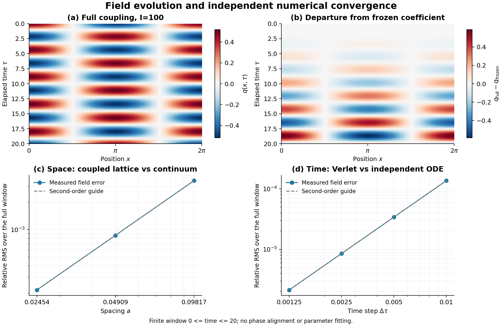

# 逆对数平方驱动与非线性场的自主桥接 v0.4

2026-09-22 · 条件模型、解析结果与确定性数值基准

**本稿推进研究的核心设想：让黎曼零点研究启发的逆对数平方包络进入实际动力学，并允许系统反作用改变驱动。** v0.3 的限制是“尚未加入 $(1/\ln^2 t)$ 驱动，也未从黎曼结构导出真实物理相互作用”。本轮已完成前一项的候选实现与反馈计算；后一项仍是待解决的问题。

## 1. 数论动机及新增假设

作者已发表的零点论文采用非自治二次映射

$$
x_{n+1}=1-\left(\mu_c+\frac{k_1}{\ln^2n}+\frac{k_2}{\ln^3n}\right)x_n^2,
\qquad \mu_c\simeq1.543689.
$$

这是受零点平均间距启发、经校准的数值对应；$n$ 是迭代／谱尺度索引。平方指数及高阶修正并非物理定理，论文也没有构造自伴物理算符。[出版稿 §2.1–2.2，第 3–4 页](../../riemann_hubble/docs/mca-31-00193.pdf)；[Wang，MCA 31(5), 193 (2026)](https://doi.org/10.3390/mca31050193)

本稿保留平方包络，新增内部坐标 $R$ 及响应假设：

$$
\chi=\ln(R/R_*),\quad \chi_i=\ln(R_i/R_*),\quad
M^2(R)=m_0^2+b(\chi^{-2}-\chi_i^{-2}). \tag{1}
$$

$R>R_*>0$ 是全盒均匀的时钟坐标，不是宇宙尺度因子；$\tau$ 是经过时间，点号表示 $d/d\tau$。$M^2$ 是场的线性回复系数，尚未对应真实粒子质量或精细结构常数。选择 $R$、将包络接到 $M^2$ 及给定幅度 $b$，都属于新增物理假设，不能从前作拟合参数直接继承。

## 2. 同一个 Hamilton 量产生驱动与反作用

固定周期长度 $L$，令 $a=L/N$、$p_j=a\dot q_j$、$P_R=I\dot R$，取

$$
H=\frac{P_R^2}{2I}+\sum_j\left[
\frac{p_j^2}{2a}+\frac{v^2(q_{j+1}-q_j)^2}{2a}
+\frac a2M^2(R)q_j^2+\frac{ag}{4}q_j^4\right]. \tag{2}
$$

要求 $I>0,g\ge0$、$0<b<m_0^2\chi_i^2$，且初始 $\dot R_i>0$。正则方程为

$$
\ddot q_j=v^2\frac{q_{j+1}-2q_j+q_{j-1}}{a^2}-M^2(R)q_j-gq_j^3,
\qquad
I\ddot R=\frac{bQ_2}{R\chi^3},\quad Q_2=a\sum_jq_j^2. \tag{3}
$$

因此 $R$ 单调加速，回复项逐渐变软，且

$$
\dot H_{\rm field}=-\frac{b\dot RQ_2}{R\chi^3}
=-\dot H_{\rm clock},\qquad \dot H=0. \tag{4}
$$

本分支的能量从场转移给时钟；“驱动”指调制作用，不指定供能方向。场能有非负下界，交换总量有限。

这与 [v0.2](../draft_v02/action_framework_v02.md) 是两个候选：v0.2 的正则 $\chi$ 与正势能 $V_s e^{-2\chi}$ 借助 FLRW 膨胀获得条件对数解；本稿采用自由 $R$ 的正动能。改用 $\chi$ 坐标时，动能为 $IR_*^2e^{2\chi}\dot\chi^2/2$，系数不恒定，不能当成同一个正则标量方案。

## 3. 有限反馈改变轨迹，保留条件晚时尺度

忽略反作用时 $R_{\rm ext}=R_i+u_i\tau$，其中 $u_i=\dot R_i$，故

$$
\chi_{\rm ext}=\ln\frac{\tau+R_i/u_i}{R_*/u_i}. \tag{5}
$$

这使回复系数具有精确的逆对数平方时间形式；分子中的时间平移来自初值，尚不是宇宙年龄标定。完整反馈时必须求解式 (3)，不能每步强制重设这条外部轨迹。

**命题（固定有限格点）。** 在上述正能量条件、固定有限 $N,L$ 及有限初始能量下，解对所有 $\tau\ge0$ 存在，$\dot R\to u_\infty>0$。令 $M_\infty^2=m_0^2-b/\chi_i^2$、$\tau_{\rm eff}=R_*/u_\infty$，则

$$
\frac{R(\tau)}{\tau}\longrightarrow u_\infty,
\qquad
M^2(\tau)-M_\infty^2\sim
\frac{b}{\ln^2(\tau/\tau_{\rm eff})}. \tag{6}
$$

证明要点是：总正能量约束速度与场，$R\ge R_i+u_i\tau$ 避开对数奇点；场能单调有下界，时钟速度单调有上界，因而趋于正极限。反馈决定有效尺度，却不改变预设响应的这个渐近指数。[推导及条件](../experiments/log_clock_coupling_v01/reports/derivation_and_limits.md)

该命题不选择平方指数：其他响应可能也有相应尾律；它也不保证有限观测窗口已经进入渐近区间，不能把 $\tau_{\rm eff}$ 当作全时间曲线的重新拟合修补。

## 4. 连续场桥接

固定 $L,I$，对光滑长波场取 $a\to0$，形式主阶为

$$
\phi_{\tau\tau}=v^2\phi_{xx}-M^2(R)\phi-g\phi^3,
\qquad
I\ddot R=\frac{b}{R\chi^3}\int_0^L\phi^2dx. \tag{7}
$$

格点的最近邻算子给出空间二阶一致性，解的收敛另需稳定性和正则性。场的空间算子局部，但 $R$ 与全盒积分耦合：这是均匀模式截断，尚不是所有自由度都局域传播的相对论理论。有限格点全局存在的证明也不自动等于 PDE 全局正则性定理。

## 5. 数值例子及其含义

取无量纲 $L=2\pi$、$v=m_0=g=1$、$R_i=1$、$R_*=e^{-2}$、$u_i=0.1$、$b=2$，初值 $q=0.5\cos x$、$\dot q=0$，演化到 $\tau=20$。此时外部时钟 $R_{\rm ext}=3$。独立高精度格点参考在 $N=128$ 给出：

| $I$ | 完整反馈的终点 $R$ | 相对外部时钟的终点偏离 | 终点 $M^2$ |
| ---: | ---: | ---: | ---: |
| 10 | 3.74334456 | 24.7782% | 0.68145093 |
| 100 | 3.08072522 | 2.69084% | 0.70477837 |
| 1000 | 3.00814992 | 0.271664% | 0.70793872 |

外部驱动的终点 $M^2=0.70830300$；冻结对照始终为一。$I=100$ 时，场向时钟转移约 $0.0596711767$ 的能量，高精度参考的最大相对总能量漂移约 $1.9\times10^{-12}$。[参考结果](../experiments/log_clock_coupling_v01/results/reference_summary.json)

完整反馈相对于规定外部驱动的场差异，随 $I=10,100,1000$ 分别为 **7.4096%、0.863395%、0.0878651%**。这里相对 RMS 是所有共同采样时空点上场差的 RMS 除以对照场的 RMS，不调整相位或重拟合幅度。它衡量有限窗口内忽略反作用的代价，不是拟合观测的优度。

改变 $I$ 时保持初速度，因此三个初始时钟动能分别是 $0.05,0.5,5$，并不是同总能量比较。空间加密则固定 $I$，避免用网格数暗中改变物理时钟。主积分采用同时更新两类力的 Störmer–Verlet，并分别与同格点高精度 ODE、独立 Fourier–Galerkin 连续解比较；有限步长的辛性不表示原 Hamilton 量数值严格守恒。[格点计算记录](../experiments/log_clock_coupling_v01/results/lattice_summary.json)

固定 $I=100$ 时，$N=64,128,256$ 的空间比较给出约二阶收敛；固定 $N=128$、步长从 $0.01$ 逐次减半至 $0.00125$，时间比较也约为二阶。最细步长相对于同格点 ODE 参考的场相对 RMS 为 $2.1303\times10^{-6}$；空间比较则以独立连续场为分母参考，沿用上述共同采样 RMS 定义。两个误差来源分开核对，29 项比较诊断通过。[比较结果与误差定义](../experiments/log_clock_coupling_v01/results/comparison_summary.json)

上述数值条件支持指定模型的实现、反馈与有限窗口收敛，不证明其真实物理来源。回复系数的变化是输入假设的后果，尚非观测发现；本轮没有做天文或原子钟拟合。

## 6. 下一步：检验特殊算术结构是否必要

当前已接入**核心平滑包络及其双向能量反馈**，但尚未输入真实零点序列或算术残差，也未从黎曼结构导出式 (1)–(2)。下一步应预先规定算术输入、去趋势方法、参数预算与留出指标，比较同一包络下的真实算术残差、统计性质匹配的替代残差及纯包络驱动。在独立区间增加预测信息，才能为特殊算术结构的额外作用提供证据；合成动力学中的差异仍须另行连接真实观测。[算术桥接状态](../experiments/log_clock_coupling_v01/reports/arithmetic_bridge_status.md)
