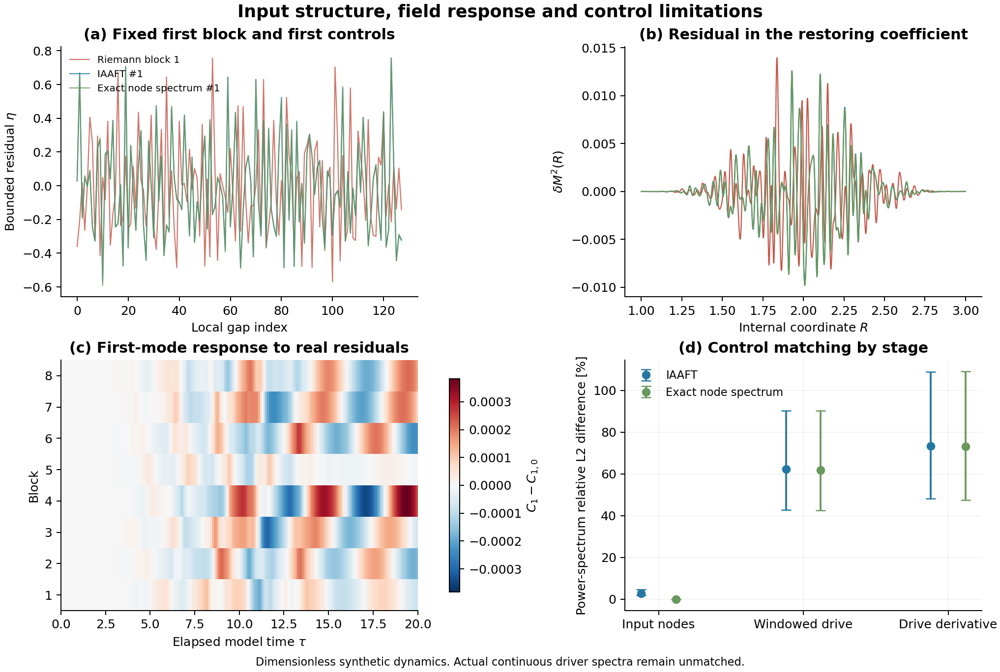

# 黎曼结构启发的假设性动力学框架：零点残差的条件检验

*逆对数平方内部时钟模型 · v0.5 · 计算：2026-09-22；定位修订：2026-09-23*

本文提出一个黎曼结构启发的假设性动力学框架，把逆对数平方响应、内部时钟与非线性格点写入同一 Hamilton 量，再将真实数学零点的间距残差作为输入，检验其相对于统计匹配替代输入是否产生特殊能量交换。1593 例计算显示，残差确实改变候选模型的轨迹，但八个真实零点块均处于替代集合的中心范围。目前建立并核验了一个可计算的响应接口；本轮未提供黎曼排列独有宏观效应的增量证据，也未检验该接口的真实物理对应。未检出特殊响应不构成物理等效性的证明。

## 框架定位与论证层次

研究目标是考察：受非自治算术动力学启发的时间依赖，能否在明确的正则模型中产生可计算的集体响应。为区分模型构造与物理解释，本文采用以下层次：

| 层次 | 本文所指 | 结论范围 |
| --- | --- | --- |
| 输入假设 | 逆对数平方响应、内部时钟、格点相互作用，以及零点索引到时钟的对应和残差耦合。 | 平方指数与耦合形式是候选选择，尚未由黎曼结构唯一导出。 |
| 条件推论与数值结果 | 给定 Hamilton 量后的双向反馈、能量交换，以及指定初值、时段和对照下的响应。 | 说明所给模型的性质；[前阶段的晚时尾律](../draft_v04/log_clock_bridge_v04.md)另有固定有限格点和所选正能量分支等条件。 |
| 待验证的物理对应 | 内部时钟与宇宙时间、格点自由度与真实物质、模型响应与可观测量之间的关系。 | 仍需物理机制与独立数据检验，不能由模型内轨迹变化直接推出能级或基本常数随时间变化。 |

本文的内部一致性依据限于已写出的方程、能量收支及已核验的数值范围。它不证明整个物理框架成立，也不表示已排除所有观测冲突。模型的价值在于给出明确计算和能够限制假设的检验；未检出结果、匹配不足及精度失败均应保留。

## 思想来源与输入

前作报道了非自治二次映射与黎曼零点的探索性数值对应，其逆对数平方驱动是本框架的动机，而非已导出的物理定律。[Wang，MCA 31, 193 (2026)](https://doi.org/10.3390/mca31050193) 本文保留这一核心，进一步区分平滑包络与零点的细节排列。

采用前作固定提交中的 10,000 个零点虚部 $\gamma_j$。与 Odlyzko 表逐项比较，最大差为 $2.9123\times10^{-9}$ 以下；本地 83 个高位参考转为 float64 后全部一致。这是数学参考缓存，不是新宇宙观测，也没有区间认证。[来源与精度核查](../experiments/arithmetic_residual_v01/reports/source_inventory.md)

定义平滑展开和间距残差

$$
\overline N(y)=\frac{y}{2\pi}\ln\frac{y}{2\pi}-\frac{y}{2\pi}+\frac78,
\qquad r_j=\overline N(\gamma_{j+1})-\overline N(\gamma_j)-1.
$$

仅由开发段 $j=1001,\ldots,2024$ 确定均值 $\mu$ 和标准差 $\sigma$，再固定 $\eta_j=\tanh[(r_j-\mu)/(3\sigma)]$。评价段 $j=4097,\ldots,5120$ 共 1024 个间距，分成八个连续、不重叠的 128 点块。零点序号 $j$、原映射步数 $n$、内部坐标 $R$ 与时间 $\tau$ 分别定义；它们之间的对应仍是新增假设。

## 共同动力学与对照

每块在 $R\in[1,3]$ 上作自然三次样条 $S(R)$，规定

$$
M^2(R)=1+2\left[\ln^{-2}(R/e^{-2})-\frac14\right]
+0.02\,w(R)S(R),
$$

其中区间内 $w(R)=\sin^4[\pi(R-1)/2]$，区间外为零。逆对数平方项保留；残差是有限支撑的小幅脉冲。其幅度、插值与索引—时钟对应都未从前作推导。

在无量纲周期格点上采用同一 Hamilton 量

$$
H=\frac{P_R^2}{2I}+\sum_j\left[
\frac{p_j^2}{2a}+\frac{(q_{j+1}-q_j)^2}{2a}
+\frac a2M^2(R)q_j^2+\frac a4q_j^4\right].
$$

主计算取 $L=2\pi,N=64,a=L/N,I=100$，$q_j(0)=0.5\cos x_j$、$\dot q_j(0)=0$、$R(0)=1,\dot R(0)=0.1$，且 $p_j=a\dot q_j,P_R=I\dot R$。完整反馈为

$$
I\ddot R=-\frac{Q_2}{2}\frac{dM^2}{dR},\qquad
Q_2=a\sum_jq_j^2,\qquad
\dot H_{\rm field}=-\dot H_{\rm clock}
=\frac{Q_2\dot R}{2}\frac{dM^2}{dR}.
$$

导数包含窗和样条，不能因脉冲幅度小而忽略反作用。每块比较真实序列、99 个 IAAFT 替代序列及其 99 个配对精确节点谱序列，另有纯包络 $S=0$。IAAFT 精确保留节点值分布、近似保留频谱；配对族精确保留频谱但放松分布。替代输入使用完整评价块的统计量，故这是条件结构检验，不是预测未知未来零点。[固定方案](../experiments/arithmetic_residual_v01/protocol.md)

## 结果与计算可信度

预设唯一主指标为 $T=[H_{\rm clock}(20)-H_{\rm clock}(0)]/H(0)$。纯包络 $T_0=0.045139422$，八个真实块平均为 $0.045041791$。每个真实块都落在两族各自的中心 95% 范围内；八块等权汇总的双侧经验尾部秩分别为 **0.40、0.36**，不是经校准的 $p$ 值。

相对纯包络，真实输入使时钟能量增益改变 **−0.982% 至 +0.600%**；第一空间余弦模轨迹的相对 RMS 变化为 **0.0104% 至 0.0479%**。这些是模型内差异，不能写成已测得能级或常数变化。

步长减半后，对照差 $D=T-T_0$ 的变化不超过对应替代分布四分位距的 $3.98\times10^{-6}$；选定案例从 $N=64$ 增至 128 后，该比例不超过 0.002607。另用 DOP853 独立实现核验，初始参考的两项精度失败已保留，收紧设置后通过。两种网格不足以确定收敛阶；这些属于同一模型系列内的独立实现与代理复核，并非跨模型证实。[数值摘要](../experiments/arithmetic_residual_v01/results/comparison_summary.json)

## 未解决的识别问题

792 个 IAAFT 样本中，4 个超过预定节点幅度谱误差 5% 门限，全部保留。更大的限制发生在实际驱动层：窗化插值后的功率谱相对差中位数为 **62.25%**，导数功率谱差为 **73.31%**；精确节点谱配对族仍分别约为 61.86%、73.06%。这些是谱差，并非 RMS 幅度差。窗函数混合频率，节点匹配因此未隔离纯粹的高阶排列效应。[方法学复核](../experiments/arithmetic_residual_v01/reports/methodology_review.md)

本轮没有预设等效界限，也未完成检出能力分析，所以“未检出特殊响应”不等于“没有算术信息”。下一步应先改进实际作用于系统的驱动及其导数的匹配，量化本指标能识别多大差异；或由物理机制约束耦合与时钟映射。不得通过挑选区间、指标或参数追求显著结果。**逆对数平方规律及黎曼结构仍是主线；真实零点残差已实际接入，尚未从黎曼结构导出真实物理相互作用。**
