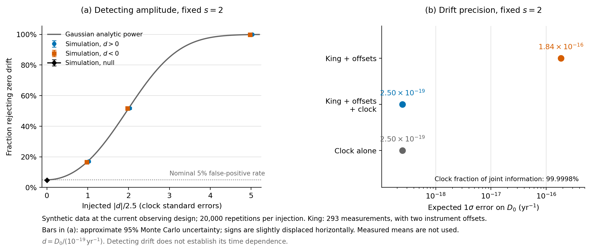
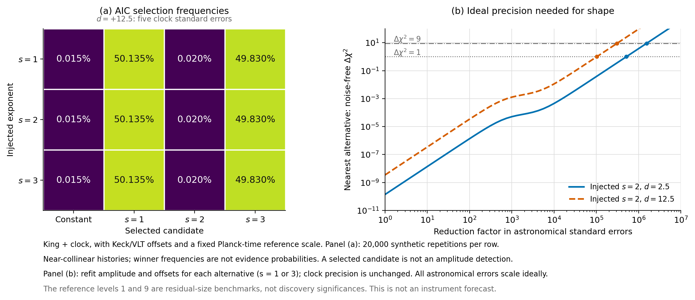

# 当前数据能检出变化，还是能认出平方对数律？

日期：2026-09-22。状态：模拟执行完成。**结论是两者相差很大：在所设高斯误差成立时，可以恢复足够强的当前漂移；现有天文精度不足以识别$s=2$的曲线形状。** 本轮没有产生新的观测发现。

## 1. 做了什么

保留King2012的293行测量的红移、误差和仪器标签，响应由模型加噪声生成。目录来自131个QSO，红移0.2223—4.1798，不能称293个独立吸收体。原子钟采用一次Filzinger2023的漂移标准误$2.5\times10^{-19}\,\mathrm{yr}^{-1}$，不把实测均值放入模拟。另把一个ESPRESSO吸收体作为单独分支，不与King合并，也不把共用原子钟的分支再相乘。[数据审计](data_design_audit.md)

共7种设计：King单独／加钟，有无Keck与VLT两个自由偏移；ESPRESSO加钟；以及同一QSO内相关系数$\rho=0.25$的两种King场景。后者是明确设定的敏感性模型，不是从数据测得的协方差。

每种设计先用30,000次零模拟校准扫描三个指数的检验，再用独立的20,000次重复评估。每个指数均注入正负漂移，共133种情形；它们共享部分随机噪声以便比较，不能把所有行当成独立重复证据。背景、时间尺度和误差处理见[协议](../protocol.md)，全部结果见[CSV](../results/recovery.csv)。

## 2. 幅度能恢复，检验也按预期工作

下表是主场景“King+钟，并拟合两个望远镜偏移”，固定真实指数$s=2$。采用预固定$s=2$对常数零假设的双侧5%检验。

| 注入的$D_0$ / yr$^{-1}$ | 相对当前钟标准误 | 检出率 | 解析预期 | 真指数固定时95%区间覆盖率 |
| --- | ---: | ---: | ---: | ---: |
| 0 | 0 | 4.795%（误报率） | 5.000% | 95.205% |
| $2.5\times10^{-19}$ | 1倍 | 16.960% | 17.008% | 95.205% |
| $5.0\times10^{-19}$ | 2倍 | 51.760% | 51.601% | 95.205% |
| $1.25\times10^{-18}$ | 5倍 | 99.885% | 99.882% | 95.205% |

例如1倍注入的检出率蒙特卡洛标准误约0.27个百分点，2倍约0.35个百分点。全部正确误差场景的覆盖率为94.75%—95.205%，标准化偏差绝对值不超过0.0086。覆盖率指**预固定正确指数**的区间，不是看完数据选择指数后仍保证95%的区间。各注入共享噪声，所以同一指数下出现完全相同的覆盖率是设计结果。

三指数扫描经独立零样本校准后的主场景误报率为4.630%。接近完全相关时，校准与评估合并的蒙特卡洛标准误约0.199个百分点；不能只用20,000次评估误差来判断其是否偏离5%。AIC在零信号时仍有15.02%选择某个非零模型，**AIC选择与5%显著性检验不是同一个规则**。[统计设计说明](statistical_design_review.md)

5倍注入用于检验强信号能否恢复，并不表示这样的漂移仍获现实钟数据允许。当前真实结果与零漂移相容，不能用上表的检出率替代真实发现。

## 3. 联合恢复主要是原子钟的贡献

令$d=D_0/(10^{-19}\,\mathrm{yr}^{-1})$。由设计矩阵得到：

| 数据设计 | $\sigma_d$ | 钟占总幅度信息的比例 |
| --- | ---: | ---: |
| King，无额外仪器偏移 | 509.124 | — |
| King，两个自由仪器偏移 | 1842.627 | — |
| King+钟，无额外仪器偏移 | 2.499970 | 99.99759% |
| King+钟，两个自由仪器偏移 | 2.499998 | 99.99982% |
| King+钟，偏移及$\rho=0.25$ | 2.499998 | 99.99983% |
| ESPRESSO单吸收体+钟 | 2.499992 | 99.99939% |

因此上节强注入的高检出率主要来自“现在的漂移可测”。相同$D_0=1.25\times10^{-18}$注入在King单独且有偏移时，检出率仅4.85%，接近检验本身的零误报率。**它没有表明高红移数据恢复出了整条演化曲线。**

这也说明多行旧目录和少量高精度点不能简单按数量衡量其作用；需要看它们是否补充了原子钟尚未测量的历史形状信息。

图1：左为指定检验的模拟检出率和解析功效；右为幅度精度及原子钟的信息贡献。均非实测响应拟合。[PDF与完整图注](../figures/captions.md)

## 4. 即使信号明显非零，平方指数仍认不出来

把真曲线的均值投影到另一个候选，并重新拟合幅度和相同仪器偏移，剩余均值差的噪声加权平方记为$\lambda_{2\mid s}$。它衡量错误曲线仍无法吸收的差别，不把$\sqrt\lambda$当作已校准的发现σ。

| 主场景，真$s=2$ | 1倍钟误差注入的$\lambda$ | 5倍钟误差注入的$\lambda$ |
| --- | ---: | ---: |
| 拟合$s=1$ | $1.3635\times10^{-10}$ | $3.4087\times10^{-9}$ |
| 拟合$s=3$ | $1.3891\times10^{-10}$ | $3.4727\times10^{-9}$ |

这些差异远低于噪声水平。5倍正注入时，AIC选择常数、$s=1,2,3$的比例约为0.015%、50.135%、0.020%、49.830%；三种真实指数得到几乎相同的选择率。这里平方指数少被选中，**不能解释为平方律被否定**：近重合的候选沿着极小的形状方向被噪声推向两端，强制排名也会给出一个名字。胜率不是理论为真的概率。

该主场景20,000次重复中，最优和次优指数之间没有一次达到$\Delta\mathrm{AIC}\ge2$。这一阈值只是描述性分离标准；即使达到也不能自动视为某个发现显著性。仅凭当前这些设计，很难从“非零幅度”进一步识别平方指数。[形状距离表](../results/shape_geometry.csv)

图2：热图三行对应不同真实指数，几乎相同的输出说明无法辨识；右图的误差缩小倍数依赖下一节的理想假设，不能解释为仪器升级预测。选择率不是理论为真的概率。[PDF与完整图注](../figures/captions.md)

## 5. 系统误差、参考尺度与精度要求

**相关误差。** 指定同一QSO内$\rho=0.25$并正确使用协方差时，模拟覆盖率仍接近95%。若真实模拟含这种相关性，却用独立误差拟合King单独数据，误报率升至7.38%、覆盖率降至92.62%；解析值分别为7.21%与92.79%。联合钟的变化较小，是因为其幅度信息几乎由钟提供，不能据此宣称天文系统误差已被解决。

**参考尺度。** 固定共同$L_0$为10、30、70、140.244、280都不能在这些注入幅度下解决分辨问题。若错误候选还能调整自己的$t_*$，$s=1$和$s=3$分别可在$L_0\simeq93.71,186.77$处把1倍注入的残差降至约$1.4\times10^{-16}$和$3.5\times10^{-17}$。这是额外自由度吸收形状的诊断，不能拿来增加发现显著性。

**理想精度预算。** 固定主背景、尺度和King红移覆盖，保留两个仪器偏移，只同比缩小全部天文标准误，钟误差保持当前值：

| 注入幅度 | 最近相邻指数的目标均值残差$\Delta\chi^2$ | 天文标准误所需缩小倍数 |
| --- | ---: | ---: |
| 1倍钟误差 | 1 | 约$5.15\times10^5$ |
| 1倍钟误差 | 9 | 约$1.55\times10^6$ |
| 5倍钟误差 | 1 | 约$1.03\times10^5$ |
| 5倍钟误差 | 9 | 约$3.09\times10^5$ |

这个量级是本样本和本模型的理想设计计算，假设连现有系统误差都能同比缩小。它不是仪器升级预测；$\Delta\chi^2=9$也不自动代表非嵌套指数比较的3σ。它说明：在固定微观参考尺度和现有红移范围内，仅增加少量同等质量测量，难以认出平方指数。

ESPRESSO单点与钟联用可以约束过去与当前的一条关系，但若给这个单点一个完全自由的校准偏移，历史信息会被全部吸收，三个候选只剩相同的钟约束。这一边界已通过投影秩核验。

## 6. 相位误差没有被当成新物理

恢复实验直接计算解析关系$\delta_\alpha=D_0\mathcal T_s$，不逐周期积分原子振荡。在独立的示意光学探针预算中，30组设定均保持$A>0$，局部绝热指标网格最大值约$8.96\times10^{-40}$。冻结积分器相位误差按步长平方减小；固定步长对固定频率只造成固定偏置，不凭空产生漂移。[相位预算及适用条件](phase_budget_cn.md)

本轮没有证明实际非自治图系统的长期稳定性，也没有从数论推导原子的微观哈密顿量；这些仍是另外的理论任务。

## 7. 对论文和下一项工作的影响

现在可以写入的结果是：**这套条件模型已经有可复现的注入恢复和失效边界；目前的主要瓶颈是时间形状信息不足。** 不能写成现有数据验证了逆对数平方，也不能因各指数拟合接近就认为它们已获同等观测支持。

下一步更值得补的是物理约束：参考时间尺度为何取该值、响应幅度能否由另一实验限制、是否存在不能被自由幅度和校准吸收的独立观测关系。若继续做观测设计，应围绕这些关系计算信息增益。自主驱动、能量收支与真实原子响应的推导应与数据检验并行推进。

## 8. 执行与复核记录

主程序133种情形，183项数值一致性检查通过，覆盖完整观测最小二乘与QR分数、解析功效和覆盖率。这里的检查数不是独立物理证据数量。[汇总JSON](../results/summary.json)记录随机种子、输入哈希和版本；[独立统计复核](statistical_result_review.md)另列其实际覆盖范围。

首次启动在把钟标准误换算成无量纲$d$时，严格浮点等号断言失败；改为容差比较后运行完成，没有改变注入值、误差预算或选择规则。复核还修正了旧α接口说明中不用于本轮$s=1,2,3$实验的$s\to0$奇异极限前号；主模型计算未受影响。

本轮结果依赖既有已核查数据设计；没有新增文献穷尽搜索或原始观测归约。所有零结果、强注入和敏感性情形均保存。
