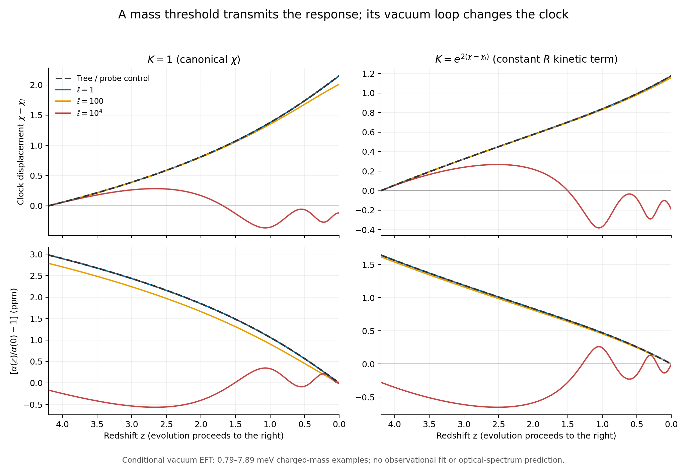
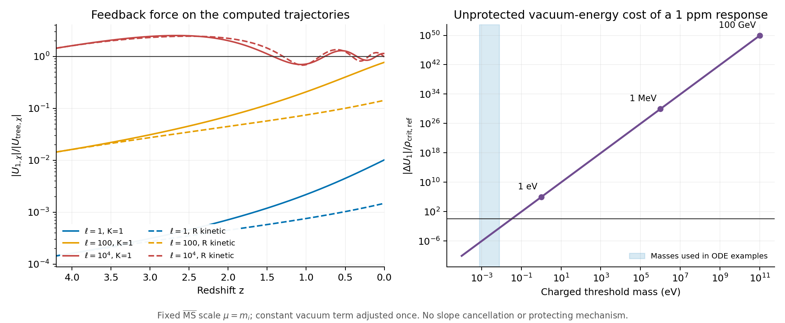

# 从逆对数质量律到电磁响应：一次含量子反馈的条件计算

日期：2026-09-25。材料范围：项目已有宇宙背景、一个新增的带电复标量EFT假设，以及公开的一圈匹配公式。本轮没有观测拟合，没有读取新的黎曼零点，也没有给参数选择赋予观测显著性。

**本次得到一个可计算的连接，同时定位了它的主要困难：指定质量律可以传递为低能α响应，但量子势会改变驱动时钟；对于较重的带电阈值，保护慢变势比计算响应函数困难得多。** 8条预定轨迹均算到今天，强反馈的两条均出现时钟反转。这个反例说明不能从质量函数中的χ⁻²直接跳到宇宙时间的ln⁻²(t/t*)。

## 1. 本次实际新增了什么

已有固定盒动力学给出内时钟R和回复系数的逆对数平方候选。此前对[常数—共轭时钟框架](../../../reports/constant_clock_bridge_20260925/README.md)的核查表明，可以做正则改写，但这不会自动给出真实物理常数。Bassani与Magueijo的全局正则框架是结构参考；本次加入的局域场动能、带电物质和标准Einstein引力是额外完成，不能称为其原模型的严格子类。[框架原文](https://arxiv.org/abs/2502.00081)

本次选择一个电荷Q=1的复标量X，假设

$$
m_X^2(\chi)=m_\infty^2(1+\xi/\chi^2)>0,
\qquad \chi=\ln(R/R_*),
$$

将其接入时钟与电磁场的作用量。单个带电质量阈值能改变低能α是已有机制；新增部分是把项目的质量律、时钟反作用和宇宙背景放进同一受控计算。[阈值机制原文，式(2)—(3)](https://arxiv.org/pdf/hep-ph/0204142v2)

平方指数、带电自由度、物理质量、动能及势的选择仍是输入假设；尚未从黎曼结构推导真实相互作用。此前零点拟合论文可支持研究动机，不能用来证明新增X粒子存在。

## 2. 同一重场一圈匹配的三个结果必须一起保留

采用(-+++)和自然单位。积分掉无实际占据的X，保留一圈二导数近似：

$$
\mathcal L_{\rm eff}=\sqrt{-g}\left[
\frac{M_{\rm Pl}^2}2\mathcal R
-\frac{G(\chi)}2(\partial\chi)^2
-U_{\rm tree}(\chi)-U_1(\chi)-U_{\rm ct}(\chi)
-\frac{B(\chi)}4 F^2\right]+\mathcal L_{\rm fluids}.
\tag{1}
$$

令s=m_X²，重场一圈系数为

$$
U_1=\frac{s^2}{32\pi^2}\left[\ln\frac{s}{\mu^2}-\frac32\right],
\quad
G=F_\chi^2K+\frac{s_{,\chi}^2}{96\pi^2s},
\quad
B=1-\frac{\alpha_0}{12\pi}\ln\frac{s}{s_0}.
\tag{2}
$$

这是单Q=1复标量的结果，b_em=1/3。规范系数、势与二导数归一核对了Henning等原始论文，另对泡积分做了独立计算。[原始匹配公式，式(2.54)—(2.55)](https://arxiv.org/pdf/1412.1837v2) 作用量、源项、适用域及10项代数核验详见[解析审计](../../../reports/charged_threshold_action_audit_20260925.md)。本报告的后续方程是将这些系数代入指定质量律与背景后的推导。

α=α₀/B，因此若ε_m=(m²−m₀²)/m₀²很小，

$$
\delta_\alpha=\frac{c\ln(1+\epsilon_m)}{1-c\ln(1+\epsilon_m)}
\simeq \frac{\alpha_0m_\infty^2\xi}{12\pi m_0^2}
(\chi^{-2}-\chi_0^{-2}),\qquad c=\frac{\alpha_0}{12\pi}.
\tag{3}
$$

保留分母是一次代数求逆，不表示计算了全部高阶圈图。每条轨迹内部的UV边界保持固定；不同case将今天α统一标为α₀属于共同读数校准，不代表所有case的数值UV耦合也完全相同。

适用条件包括H/m≪1、|ṁ|/m²≪1、探测动量远小于m、弱耦合及无阈值交叉。这里没有给RG能标μ赋予宇宙时间含义。没有计算真实X粒子、热效应、物质结合能源或相干电磁背景；这些不能由H/m很小自动排除。曲时空还需要曲率与非最小耦合反项，本次仅研究低曲率局部平直匹配的主导项。

## 3. 宇宙背景与能量收支

定义N=ln a，q=dχ/dN，E=H/H_ref，ε=Fχ²/Mpl²，A=G/Fχ²，V=U/(Fχ²H_ref²)。势的常数部分只在初始点扣一次：

$$
g(\chi)=\frac{1+\xi/\chi^2}{1+\xi/\chi_i^2},\quad
\xi=\chi_i^2,\quad \mu=m_i,\quad
\ell=\frac{m_i^4}{32\pi^2 F_\chi^2H_{\rm ref}^2},
$$

$$
V=W_i e^{-2(\chi-\chi_i)}
+\ell\left[g^2(\ln g-3/2)+3/2\right].
\tag{4}
$$

只调整初始真空能常数已经是声明过的一项重整化条件；不扣斜率或曲率，不沿轨迹逐点相消，不为让结果接近目标重新设定Λ。V及其CW部分可以为负，程序保留其实际符号。

两种候选分别取K=1和K=exp[2(χ−χ_i)]。后者保留常R动能，前者保留常χ动能；它们是不同物理完成，不能当成同一理论的坐标选择。用同一初始切片的χ、q、势、年龄和Λ比较：

$$
E^2=\frac{\Omega_r e^{-4N}+\Omega_m e^{-3N}+\Omega_\Lambda+\epsilon V/3}
{1-\epsilon A q^2/6},
\qquad
f=\frac{d\ln E}{dN}=-\frac{4\Omega_r e^{-4N}+3\Omega_m e^{-3N}}{2E^2}
-\frac{\epsilon A q^2}{2},
$$

$$
q'=-(3+f)q-\frac{A_{,\chi}}{2A}q^2-\frac{V_{,\chi}}{AE^2},
\quad \chi'=q,\quad (H_{\rm ref}t)'=E^{-1}.
\tag{5}
$$

这里Ωm、Ωr和ΩΛ是按固定H_ref归一的输入密度系数；各例今天的E(0)可以不同，因此不能把这些输入直接当作各例今天的实际密度分数。

初值取自已归档的辐射+尘埃+Λ+正则χ背景，z_i=4.2，χ_i=137.642299955，q_i=1.489177577，W_i=50.275934697；ε=10⁻⁴。只把共同初态作为有限区间比较条件；没有构造R分支自己的早期宇宙史。t*是旧势的预选锚点，不能把其数值当作新推导。

无显式粒子/电磁源时，实际核验的连续方程为

$$
\rho_\chi=F_\chi^2H_{\rm ref}^2\left(\frac12 AE^2q^2+V\right),\qquad
\frac{d\rho_\chi}{dN}=-3F_\chi^2H_{\rm ref}^2 AE^2q^2.
\tag{6}
$$

因此阈值反馈不是无代价的外部驱动。有限ℓ包括U1及ΔG；树级probe对照故意关闭反馈，只用质量比生成形式读数，不能把它解释成m_i=0而仍能积分掉重场。

## 4. 全部预定结果

生产前冻结的[协议](../protocol.md)规定两种K各有probe和ℓ=1、100、10⁴，共8条轨迹。有限ℓ对应m_i约0.789、2.494、7.888 meV。这些极轻带电阈值是计算反馈的示例；它们不满足光学动量远小于m的要求，也没有经过粒子/热史约束。因此下表ppm只是形式低能α读数，不是光学谱线或现实宇宙的新预测。

| 动能 | 反馈ℓ | Δχ（z=4.2到0） | α(4.2)/α(0)−1（ppm） | 是否出现时钟反转 |
|---|---:|---:|---:|---|
| 常χ | probe | 2.15204 | +2.97974 | 否 |
| 常χ | 1 | 2.15060 | +2.97778 | 否 |
| 常χ | 100 | 2.00992 | +2.78580 | 否 |
| 常χ | 10⁴ | −0.11964 | −0.16839 | 是 |
| 常R | probe | 1.17736 | +1.64167 | 否 |
| 常R | 1 | 1.17717 | +1.64141 | 否 |
| 常R | 100 | 1.15823 | +1.61523 | 否 |
| 常R | 10⁴ | −0.19585 | −0.27582 | 是 |

**图1。** 横轴沿z=4.2到今天，左列是常χ动能，右列是常R动能；上排为时钟位移，下排以各轨迹今天为零点的低能响应。弱反馈与树级对照近乎重合；强反馈先阻滞，随后反转并振荡。全部模型配置、初值和停止条件预先指定；本轮没有因出现反转而更换参数。

需要分开报告两层形状检验：

- **质量律到α。** 全部8条轨迹中，式(3)线性近似相对完整阈值的最大差异，除以该轨迹α响应的最大绝对值，均小于0.78%。这说明选定质量律的小变化传递有效，不说明平方指数被推导出来。
- **时钟到宇宙年龄。** 将χ⁻²和ln⁻²(t/t*)各自扣今天并按z=4.2端点归一，常χ弱反馈ℓ=1的最大形状差异为2.03%；直接用完整α曲线比较为1.86%。常R弱反馈分别为12.44%和12.34%。这两种动能已经给出不同时间规律。
- **强反馈。** 两条ℓ=10⁴分支均非单调，不能用“仍然接近单调逆对数时间律”概括。其端点变化小于中途峰值，按端点归一的误差很大且受端点抵消影响；原始CSV和JSON保留该指标，但主要结论依据轨迹反转本身。

这不是用数据比较p=1、2、3的模型优劣。α幅度由预设质量函数与量子数决定，未被观测选择；其中原子钟量级的形式漂移也尚不能绕过重阈值适用条件。

## 5. 真正的难点：量子势能的尺度

在上述未保护的一圈方案中，参考点μ=m₀附近有

$$
\Delta\alpha/\alpha_0\simeq\frac{\alpha_0}{6\pi}\Delta\ln m,
\qquad
|\Delta U_1|\simeq\frac{3m_0^4}{4\pi\alpha_0}
|\Delta\alpha/\alpha_0|.
\tag{7}
$$

若只要求1 ppm的响应，以本项目H_ref和约化Mpl构成的ρ_crit,ref=3.6768×10⁻¹¹ eV⁴为标尺：

| 假设带电质量 | 未保护的势能变化 / ρ_crit,ref |
|---|---:|
| 1 eV | 8.90×10⁵ |
| 1 MeV | 8.90×10²⁹ |
| 100 GeV | 8.90×10⁴⁹ |

这是式(7)的共同1 ppm量级比较，不是这三种质量的已算宇宙轨迹。另在本轮树级χ轨迹上直接计算完整CW差值，相应三个比值为2.63×10⁶、2.63×10³⁰、2.63×10⁵⁰；它们的响应约为2.98 ppm，所以不能与1 ppm表混为同一结果。两套预算均保存在[radiative_budget.json](../results/radiative_budget.json)。

**图2。** 左图给实际算出轨迹上的量子力/树级力；右图是指定方案中1 ppm响应的m⁴势能预算，不是排除曲线。动能修正极小也不能抵消势能问题；本次三个较重质量预算的ΔG/Fχ²仅约10⁻⁵⁹、10⁻⁴⁷、10⁻³⁷，但量子势斜率远大于树势。

这是**指定重整化条件、没有保护机制或特殊抵消时的诊断**，不是与方案无关的普遍不可能定理。通过有限反项扣除斜率/曲率可以重新指定EFT，但必须把它登记为额外调整；改用μ=m(χ)同时冻结其他参数也不构成解决。本次没有声称这些条件排除了全部常数变化理论。

所有有限质量示例H/m最大约1.23×10⁻²⁹，|ṁ|/m²最大约6.62×10⁻³²，说明所算均匀真空背景的绝热近似很好。这只检验了这些慢背景比率；没有检验光学动量、粒子占据、热环境或第五力。

## 6. 数值和来源复核

- 主程序以N为时间，67/67项参考复现、连续方程、Friedmann约束及收紧容差检查通过。最大积分能量残差约1.14×10⁻¹²（以初始标量能量归一）。全部8条到N=0，没有触发预设有效域停止。
- 独立程序以宇宙时间τ和动量p=A dχ/dτ求解，没有导入主模型。8/8案例的χ、H、年龄、α、能量、速度及导数/连续方程检查通过，最大归一误差5.121×10⁻¹⁰，低于10⁻⁶门限；强反馈反转独立复现。[独立报告](independent_audit.md)
- 解析审计10/10符号恒等式通过。不同程序共享声明的物理假设，因此它们检验实现一致性，不是对这些假设的独立观测验证。
- 协议、实际输入、来源和代码SHA256已记录；主运行约4.3秒（本机本次，不是与其他理论比较的性能基准）。本轮没有求解失败或参数重试；日志及完整轨迹均保留。

本次产物由AI协助建立模型、编程、推导和内部审计；不同代理的复核属于项目内交叉检查，不是外部同行评审或作者已逐字确认的标记。

## 7. 对论文与下一步的具体含义

现在可以把“常数可能随内时钟变化”的设想写成更具体的条件命题：**若带电物质质量继承χ⁻²项，并且有明确机制维持慢变时钟，则低能α获得可计算的主阶χ⁻²响应；其宇宙时间历史须由完整背景方程决定。**

本轮支持将“可计算的物质接口及辐射稳定性障碍”加入候选理论讨论；不支持写成“已从黎曼结构推导精细结构常数演化”或“已自然实现真实宇宙的逆对数时间律”。因此先归档这份独立实验与理论报告，正式86页正文保持原版本。

下一理论任务应当先比较能否构造一个**有保护机制的粒子谱**：例如对称性约束下的玻色/费米势能抵消，同时检查电磁阈值是否仍保留、对称性破缺后的残余势有多大。不能仅手工相消一圈势就宣称自然。通过这一关后，再加入实际物质、热史与当地场响应，决定是否能落到现有原子钟及高红移光谱。直接把重质量样例放进旧慢时钟轨迹再拟合数据，会跳过本轮已经暴露的关键条件。
