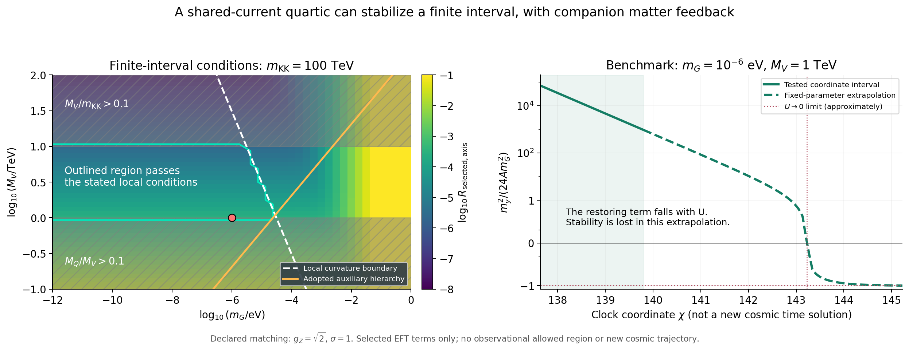

# 时钟横向稳定与共同边界反馈

承接[空间隔离检验](../sequestering_test_v01/README.md)。本轮给出一个明确的局部重矢量共享流候选，推导其同时产生的时钟四次稳定项与物质接触，并计算它们的共同影响。

**找到有限χ区间内通过所列条件的分支；尚未解决渐近真空稳定。** 四次项使横向质量增加12U/Λ²而保持树级轴势；共同边界接触不能删除，加入所选带电圈后，代表例反馈约0.0253%。但U趋零时稳定项消失，原负曲率会重新出现。

- [中文结果报告](reports/results_cn.md)
- [模型、匹配与执行约定](protocol.md)
- [独立数值核验](reports/independent_results_cn.md)
- [完整K/W及共同接触推导](../../reports/clock_quartic_geometry_20260926.md)
- [重矢量候选与来源核查](../../reports/clock_stabilizer_sources_20260926.md)
- [摘要与代表例](results/summary.json)、[材料清单](materials_manifest.json)



代表例mG=10⁻⁶eV、MV=1TeV、mKK=100TeV、MQ=100GeV，gZ=√2、σ=1；这些都是本轮选择的条件参数。相位0及π/2都通过当前局部曲率、质量层次、辅助场层次与已选反馈检查。没有求新宇宙背景，图中χ外推不是宇宙时间预言。

复算：

```bash
python experiments/clock_stabilization_v01/code/run_stabilization.py
python experiments/clock_stabilization_v01/code/plot_results.py
python experiments/clock_stabilization_v01/code/independent_check.py --derive --compare
python reports/clock_quartic_geometry_20260926_checks.py
python reports/clock_stabilizer_sources_20260926_checks.py
```

使用Python、NumPy、SciPy、Matplotlib、mpmath、SymPy。执行后的时间戳会变化，材料清单对应归档版本；仅核查归档时使用 `python experiments/clock_stabilization_v01/code/audit_archive.py`。新一轮输出完成后可用 `--write-manifest` 明确更新清单。初始精度问题和符号、相消修正均保留。

86页正式正文及历史实验保持原版。新重多重态的完整谱、全部圈修正、未来持续稳定来源和黎曼到物理相互作用的推导均未完成；1/ln²t继续是核心响应假设。
