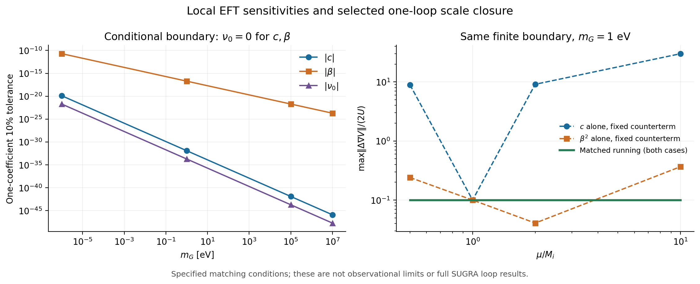

# EFT matching v0.1：未定系数、阈值与尺度闭合

承接 [no-scale 几何保护](../noscale_protection_v01/README.md)。本轮把此前的局部小反馈结果推进为明确的匹配条件：完成一个选定部门的反项/RG 闭合和最小 U(1) 超场阈值，计算物质曲率 c、额外双线性 β、有限局部势 ν 的条件预算，并用独立双实标量模型说明轻重混合图不能遗漏。**完整 $O(Q^2)$ 一环有效作用量及完整 SUGRA 量子保护仍未完成。**

- [中文结果与图](reports/results_cn.md)
- [实施说明与系数定义](protocol.md)
- [独立数值复核](reports/independent_results_cn.md)
- [算符与场重定义](../../reports/matching_operator_audit_20260925.md)
- [规范超场阈值和 RG](../../reports/matching_gauge_rg_20260925.md)
- [混合行列式诊断](../../reports/matching_mixed_sector_20260925.md)
- [机器可读主摘要](results/summary.json)、[条件预算表](results/coefficient_budgets.csv)、[材料清单](materials_manifest.json)

代表例 $m_G=1$ eV、带电初始质量 100 GeV，在固定有限匹配输入下，单独变化 c 时的 10% 力预算约要求 $|c|\le1.2320\times10^{-32}$。这不是观测界或 UV 普遍界，而是模型必须解释的一项条件。对所选势有 $K_c+2K_{\beta^2}=K_\nu$，三个系数只能给出两种独立响应形状；未知系数不能由该响应分别确定。改变计算尺度并同步运行反项保持结果不变，改变有限匹配边界则改变模型条件。



从仓库根目录复算（Python 3，NumPy、Matplotlib、SymPy、mpmath）：

```bash
python experiments/eft_matching_v01/code/run_matching.py
python experiments/eft_matching_v01/code/plot_results.py
python experiments/eft_matching_v01/code/independent_check.py --derive --compare
python reports/matching_operator_audit_20260925_checks.py
python reports/matching_gauge_rg_20260925_checks.py
python reports/matching_mixed_sector_20260925_checks.py
```

输入来自仓库内 `sugra_shift_v01` 的已存参数及 1025 个旧 χ 坐标；不重跑旧宇宙 ODE，不拟合观测。160/220 位谱核验需要比主程序更长的时间。材料哈希对应归档版本；复跑脚本产生的时间戳可能改变 JSON 字节。

本实验的主程序有 300 项实现核验；独立数值路径及专题核验分别记录，不合并为物理证据数。图可同时以 PNG/PDF 使用。所有结果独立于 86 页正式论文归档，尚未从黎曼结构导出真实物理相互作用或唯一的 $1/\ln^2t$ 规律。
