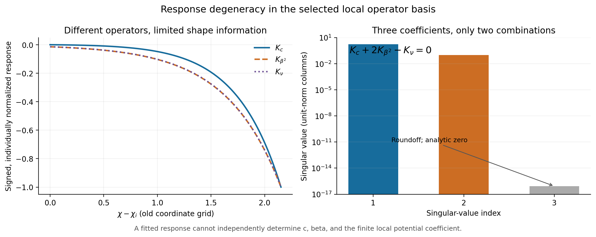

# 从局部抵消到有效作用量匹配：条件预算与未定系数

2026-09-25，承接 [几何保护实验](../../noscale_protection_v01/reports/results_cn.md)。本轮的核心结果是：**指定几何中的小反馈可以保留为一个条件窗口，但它依赖哪些额外物质耦合和有限匹配系数被允许；上一轮的小数值不能代表这些未知项也小。** 我们现在把这个要求写成可计算的系数条件，补上选定部门的尺度闭合、规范超场阈值和轻重混合图诊断。完整超引力量子匹配尚未完成。

## 1. 这次完成了什么

本轮按 [实施说明](../protocol.md) 固定参考质量、局部场坐标和匹配约定。新增计算没有使用观测数据，继续把旧轨迹的 1025 个 χ 值当作评价坐标；它们不是新作用量已经解出的宇宙轨迹。正式 86 页论文保留原版，新增材料独立归档。

| 项目 | 已完成范围 | 仍未完成 |
|---|---|---|
| 带电二阶作用量 | 列出物质度规、质量、双线性、规范函数及反项；推导三个代表系数的局部响应 | 完整的一环动能、辅助场和全部物质系数匹配 |
| 规范阈值 | 一个重带电对、超势质量来源、小分裂下的辅助分量匹配 | Kähler 双线性质量、真实标准模型和测量算符 |
| 重整化尺度 | 选定带电行列式及局部反项的显式对数闭合 | 全部算符混合、参数运行与完整 SUGRA RG |
| 模量—物质混合 | 明确双实标量截断的完整常背景行列式及二阶项 | 原几何中的完整玻色、费米、引力与 ghost 合并 |
| 慢时钟保护 | 给出固定有限边界下的系数容忍度与退化关系 | 证明这些系数由对称或 UV 理论自动保持足够小 |

因此，本轮是量子匹配的一部分已闭合，并把其余自由度显式化；不是已计算完整 $O(Q^2)$ 有效作用量。这里 $O(Q^2)$ 是带电背景的场次数，与“一环、两环”的展开阶数不同。

## 2. 为什么一个未含显式时钟的接触项也重要

沿用 $P=M_p^2$、$Z=F_\chi(\chi+iy)/\sqrt2$、$W=W_c+w(Z)+M(Z)Q_+Q_-$，并把一般物质度规写为

\[
\mathcal Z_\pm=e^{K_0/(3P)}e^{\ell_\pm}.
\]

在报告约定的负号辅助场定义下，忽略额外 Kähler 双线性质量来源时，正则化物质的共同软项满足

\[
d_\pm=\frac{2V_0}{3P}-F^i\bar F^{\bar j}
\partial_i\partial_{\bar j}\ell_\pm.
\]

这来自一般超引力软项关系，而不是额外的粒子质量猜测。一般公式的原始来源为 [Brignole、Ibáñez、Muñoz，§2](https://arxiv.org/html/hep-ph/9707209v3)；本模型的变形、双线性及场重定义细节见 [独立算符报告](../../../reports/matching_operator_audit_20260925.md)。

在 $T=1/2,y=0$ 的局部几何中心，新增

\[
\ell_+=\ell_-=c(T-1/2)(\bar T-1/2)
\]

不改变该点物质质量的归一化，也不引入线性度规 jet，却产生

\[
\Delta d=-c|F^T|^2=-cX.
\]

它是不能由全纯物质场重定义移除的混合曲率接触。即使 c 本身不含 χ，带电质量 $M(\chi)$ 的变化也会把它传到时钟势。这就是上一轮只检查特定几何谱还不够的原因。

定义 $w_r=-F_\chi\sqrt{U}/\sqrt2$，在中心有

\[
X=\left|m_Ge^{i\theta}+\frac{w_r}{P}\right|^2,
\quad X_\chi=2\operatorname{Re}\left[
\left(m_Ge^{-i\theta}+\frac{w_r}{P}\right)\frac{-w_r}{P}\right],
\quad X_y=-\frac{2m_Gw_r\sin\theta}{3P}.
\]

横向的 $1/3$ 来自 $S=3W-\bar k_Zw_Z$ 的辅助场组合，不能将实轴 $|W|^2$ 的写法直接当作整个复场空间的函数。本次两个时钟方向都参与预算。

另外定义一个实的正则双线性变形参数 β，使 $\Delta B=\beta M F^T$，以及代表性有限局部势项 $\nu sX/(8\pi^2)$。β 表示给定场基底中规范化双线性的额外幅度；它在场重定义时要与超势、物质度规、异常规范项一起追踪，不能等同于一个不变的原始度规斜率。ν 是未定作用量在背景上的一个投影系数，不代表已经构造或匹配了完整超对称反项；更一般的场依赖函数仍未确定。

## 3. 可闭合的带电部门

精确初始质量归一化为

\[
s=M_i^2\frac{1+\xi/\chi^2}{1+\xi/\chi_i^2},
\quad M_i=100\ \mathrm{GeV},\quad p=sX,\quad L=\ln\frac{s}{\mu^2}.
\]

对两个复标量与一个 Dirac 费米子的给定有限减法，

\[
V_{1,Q}=\frac{F(s+d+h)+F(s+d-h)-2F(s)}{32\pi^2},
\quad F(x)=x^2[\ln(x/\mu^2)-3/2],\quad h=|B|.
\]

保留额外 $d=-cX$ 的一阶及额外 B 的平方阶，选定的势为

\[
\boxed{V_{\rm sel}=\frac{p}{8\pi^2}
\left[A L+c+\nu(\mu)\right],\qquad A=-c+\frac{\beta^2}{2}.}
\]

此式只隔离新系数的主要响应，没有把既有的小时钟 F 分裂冒充为零。已知基线 B 与新增 B 的交叉项另作检查：在本次单系数 β 预算边界处，其最大额外力相对 $2U$ 约为 $6.35\times10^{-18}$。这个数只支持这些边界点上的主导平方近似，不意味着在任意趋零 β 下交叉项仍然更小。基线共同质量及其他混合匹配仍须在完整作用量中处理。

精确带电行列式的显式尺度导数是

\[
\partial_{\ln\mu}V_{1,Q}
=-\frac{2sd+d^2+h^2}{8\pi^2}.
\]

这可与一般软破缺理论真空能 beta 函数交叉核对，见 [Martin，式 (7.11)](https://arxiv.org/html/hep-ph/0111209v2)。我们只使用此处的行列式恒等式，没有把可重整化理论的全部 RG 直接套给非线性超引力。

在所保留阶数上取

\[
\nu(\mu)=\nu_0+2A\ln\frac{\mu}{M_i}
\]

即可取消显式尺度依赖。固定相同的 $\nu_0$，在 $\mu/M_i=0.5,1,2,10$ 上比较，主实现的最大差异相对 $2U$ 为 $9.00\times10^{-15}$，属于浮点运算残差。独立的精确行列式核验还保留了 $d^2$ 所需的局部结构，详见 [规范与 RG 报告](../../../reports/matching_gauge_rg_20260925.md)。

例如 c 单独取到参考尺度的 10% 预算时，若错误地在改变 μ 后冻结反项，预算会从 0.1 变为约 8.906、9.106 或 30.017；正确运行反项后都保持 0.1。因此，上一阶段随尺度变化的诊断根不能当作物理质量上限。不同有限边界值是不同的匹配输入；同一模型单纯更换计算尺度则不应改变这一选定结果。

图1：左图为三个系数逐个变化的条件预算；测试 c 或 β 时固定 $\nu_0=0$，测试 ν 时 c=β=0。右图显示反项随尺度运行的重要性。纵轴小数不是观测上限，也不覆盖遗漏部门。

## 4. 具体的系数条件

令二维梯度为 $\nabla=(\partial_\chi,\partial_y)$。局部中心两方向动能采用同一 $F_\chi$，因此这个比值与共同正则化后的比值一致。本次比较标准为

\[
R=\max_{\rm old\ grid}\frac{\|\nabla V_{\rm sel}\|}{2U}\le0.1.
\]

参考力取指定中心的指数势力 $2U$；没有把旧轨迹势系数或新量子谷底混用。以下每一列只让一个参数变化，另外两个置零。实相位结果为：

| $m_G$ | $|c|$ 的 10% 容忍值 | $|\beta|$ 的 10% 容忍值 | $|\nu_0|$ 的 10% 容忍值 |
|---:|---:|---:|---:|
| $10^{-6}$ eV | $1.2320\times10^{-20}$ | $1.9627\times10^{-11}$ | $1.8964\times10^{-22}$ |
| $1$ eV | $1.2320\times10^{-32}$ | $1.9627\times10^{-17}$ | $1.8964\times10^{-34}$ |
| $10^5$ eV | $1.2320\times10^{-42}$ | $1.9627\times10^{-22}$ | $1.8964\times10^{-44}$ |
| $10^7$ eV | $1.2320\times10^{-46}$ | $1.9627\times10^{-24}$ | $1.8964\times10^{-48}$ |

三种相位在表格所示有效位数上一致，因为该响应主要由 $s(\chi)$ 的变化驱动；相位控制的微小 X 梯度并未从计算中删除。这不是任意相位模型的普遍排除。

四个质量点用于比较**新增系数的敏感度**，不表示四个点的总模型都通过预算。例如上一轮标量重调分支在 $m_G=10^7$ eV 的已选背景反馈已经远超 10%；把本表中的新增系数压小，并不能消除那个既有问题。只有在既有贡献也满足要求、且其他未定部门受到控制后，才能讨论总预算。

以 1 eV 为例，若新增相同的曲率接触而没有相应的其他有限势补偿，c 需要小到约 $10^{-32}$。这表明**“额外物质耦合默认很小”是一项极强的要求，需要从明确机制推导，不能凭局部树级抵消推断。** 我们没有算出真实 UV 系数等于多少，也没有证明必然大于这个值，所以这里不是理论已被排除的证据。

改变一个固定有限边界就会改变单系数数值：若 c 分支改取 $\nu_0=-c$，其 1 eV 容忍值变为 $1.9261\times10^{-34}$；若 β 分支改取 $\nu_0=-\beta^2/2$，则 $|\beta|$ 容忍值变为 $1.5697\times10^{-16}$。这些边界在整个 χ 区间只设一次，没有逐点调节。它们说明匹配输入的重要性，不能作为任意可调参数已经解释现实的证据。

若要求保守的联合充分条件，可使用各响应范数的和，例如

\[
|c|\max\frac{\|K_c\|}{2U}
+\beta^2\max\frac{\|K_{\beta^2}\|}{2U}
+|\nu_0|\max\frac{\|K_\nu\|}{2U}\le0.1,
\]

而不能让三列各自同时用完 10%。这只是所选部门的无相消预算，仍不界定未知的其他算符。

## 5. 三个系数只有两种独立的势形

定义 $K_c=\partial_c\nabla V_{\rm sel}$ 等，可直接得到

\[
K_c+2K_{\beta^2}-K_\nu=0.
\]

因为势实际上只含 $A=-c+\beta^2/2$ 和 $D=c+\nu_0$ 两个组合。参数同时变换

\[
c\to c+\delta,\quad \beta^2\to\beta^2+2\delta,
\quad \nu_0\to\nu_0-\delta
\]

在 $\beta^2\ge0$ 的适用区域内不改变本阶选定势。粒子谱和其他算符通常仍然改变；这既不是整个理论的物理等价，也不是已找到保护对称。

图2：左图为同一 1 eV 示例的有符号 χ 方向响应，各自按最大值归一化；右图对三列单位范数的二维响应矩阵取奇异值，约为 1.72935、0.09670 及 $10^{-16}$。第三项为精确零关系的舍入残差，不是一个弱检出的新模式。

因此，即便将来测得一条这样的势响应，也不能仅凭它分别测出 c、β 和 ν。若允许任意的有限时钟势函数，自由度更多，单独从所选圈图作唯一预测就更不成立。需要由具体匹配或对称减少自由度，再讨论观测约束。

## 6. 阈值和混合图：补上的两个接口

### 6.1 空的低能带电谱不消除所有规范阈值

本模型在退耦唯一带电对后有 $b_{\rm IR}=0$。但超势质量 $M(Z)$ 自身带辅助分量。按明确的规范超场和费米子相位约定，合并高能异常项与超场阈值后有

\[
M_{\lambda,\rm IR}=M_\lambda^{\rm UV}
-\frac{2g^2}{16\pi^2}F^i\partial_i\ln M.
\]

补偿量及物质度规的线性辅助项抵消，质量函数的贡献保留。常质量极限则恢复零的新增匹配项。固定全纯 UV 规范函数是额外边界；真实标准模型、轻带电探针及 Kähler 双线性来源仍未加入。故这里是最小 U(1) 的接口结果，不能写成现实电磁或 gaugino 预言。两条独立推导、原始文献及约定见 [规范报告](../../../reports/matching_gauge_rg_20260925.md)。

### 6.2 小模量圈图不代表所有同阶图都小

在 1 eV 示例中，$m_T\simeq6.93$ eV，而带电对约为 100 GeV。两者相差约 $1.44\times10^{10}$ 倍。Wilson 匹配应先处理带电对并保留 T，再处理低得多的模量尺度；或直接使用不遗漏混合项的统一常背景 1PI 方法。

独立研究一个明确的平坦动能双实标量截断，质量矩阵为

\[
\mathcal H(q)=\begin{pmatrix}A+uq^2&vq\\vq&B+wq^2\end{pmatrix},
\]

其行列式的 $q^2$ 系数包含

\[
uF'(A)+wF'(B)+v^2\frac{F'(A)-F'(B)}{A-B}.
\]

最后一项是混合传播，分开计算两个对角块就会遗漏。取 $s(\sigma)=M_i^2e^{-\sqrt{2/3}\sigma/M_p}$ 所定义的截断，在 $\mu=100$ GeV 时得到混合曲率项 $-7.1202\times10^{-14}$ eV²，而模量蝌蚪分项为 $-8.1658\times10^{-33}$ eV²。两者同为一环，层级相差很大。

**不能将这两个标量数字代入前面的 c 表并宣称原模型已失败。** 这是另行规定动能的诊断截断；完整 Kähler 模型的背景规范化、导数顶点、费米子、辅助场和局部反项尚未合并。固定背景的曲率也不是已经求出的量子真空或极点质量。它说明的是必须计算哪些图。该截断中局部质量反项能取消显式尺度变化，精确 Schur 消元的两种顺序一致；错误动量范围内的局部截断则不受这个恒等式保证。详见 [完整推导与核验](../../../reports/matching_mixed_sector_20260925.md)。

### 6.3 环阶必须另行分账

| 输入或步骤 | 环阶说明 |
|---|---|
| 指定 K、W 中的度规曲率 c 和双线性 β | 若作为独立树级/匹配边界，其环阶需由定义指定 |
| 将这些边界谱放入带电 CW | 一个带电一环行列式 |
| 一环生成的 $\delta d$ 线性插入带电 CW，或一环 $\delta B$ 与树级 $B_0$ 干涉 | 原理论的两环子集；不能省略同阶其他图和反项 |
| 一环生成的 $\delta B$，只取其绝对值平方插入带电 CW | 通常为原理论三环阶；须与上述干涉项分别计数 |
| 上轮用标量一环真空能重调 η，再让 η 改变带电 CW | 同样混入更高环的选定项 |
| 两个实标量的混合 $q^2$ 项 | 一环，但不是完整物质/SUGRA 一环匹配 |

尺度闭合只验证所保留的图及局部投影。任意尺度依赖消除与有限系数大小已知，是两个不同要求。

## 7. 核验、材料与下一步

主实现 [run_matching.py](../code/run_matching.py) 的 300 项检查通过，保存 12 组质量—相位配置、3075 行 1 eV 响应核及 192 行 RG 对照。检查覆盖质量归一化、两种分裂主阶、基线 B 交叉项、阈值层次、退化关系和尺度闭合；这些条目互相关联，不是独立物理证据数。

独立数值结果见 [独立复核报告](independent_results_cn.md)：22/22 项推导与精度检查、261/261 项主输出比较通过，另以 160/220 位精度计算 1344 个直接谱函数点。在该指定谱部门，保留阶与直接谱的最大力差除以 $2U$ 为 $2.17\times10^{-54}$；这不包含遗漏图的误差。代码不导入主实现，保留一项初始精度不足及提高精度后的复核。专题推导另有 [26 项算符核验](../../../reports/matching_operator_audit_20260925_checks.json)、[34 项规范/RG 检查](../../../reports/matching_gauge_rg_20260925_checks.json)、[10 项独立代码审阅恒等式](../../../reports/matching_gauge_rg_20260925_adversarial.json)及[122 项混合标量检查](../../../reports/matching_mixed_sector_20260925_checks.json)。不将这些重叠检查累加成物理置信度。

材料护照在 [materials_manifest.json](../materials_manifest.json)：代码、输入来源、输出、图及关联报告按 SHA-256 记录。原始方法文献的 URL、实际读取范围和下载异常在各专题来源清单中；没有声称研究者人工通读这些文献。工作采用 AI 辅助推导、编程及项目内部独立子任务复核，没有外部同行评议或额外观测证据。确定性计算不使用 p 值。

归档前补充了 β 插入可为两环干涉或三环平方项的文字说明，主计算和独立计算重新运行。随后哈希审计发现独立符号审阅仍指向澄清前的实施说明；该次失败保存在 [初次归档诊断](../results/archive_initial_diagnostic.json)。在符号检查尚未结束时又触发了一次审计，[相同的待完成状态](../results/archive_pending_check_diagnostic.json)也保留；等其 10 项检查全部结束后再更新记录。它们是来源版本与执行时序问题，不是物理方程或容差变更；最终状态见 [归档核验](../results/archive_audit.json)。

下一步最有价值的工作是**选一个能固定 c、β、ν 及相关几何系数的明确保护机制，计算它的完整混合玻色—费米部门和匹配条件**。先检验哪些项受对称限制、哪些须由 UV 数据给定，再判断慢时钟能否稳定保留；不能以更多同类参数扫描或逐点反项调整代替这个任务。当前也尚未求新的量子谷底和宇宙背景，不应先拿旧轨迹重新拟合。

逆对数平方仍是我们的核心响应假设及研究动机。本轮把它需要面对的量子条件写得更具体，但没有导出平方指数，也没有从黎曼结构导出真实物理相互作用。假设可以继续研究，其成立必须由后续匹配和观测检验决定。
