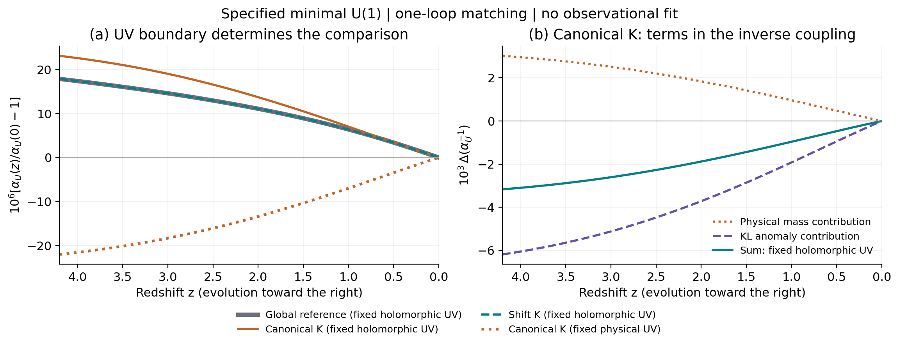
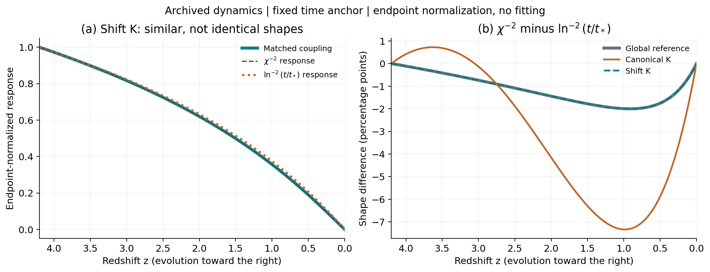

# 补齐最小 U(1) 一圈匹配后，逆对数响应保留多少？

## Material Passport

- 日期：2026-09-25。材料为上一阶段归档的3条背景、物理质量谱、冻结输入及一手理论文献；没有新增观测。
- 工作：将局部物理质量阈值与 KL/Konishi 匹配合并，比较两个明确高能边界；不重跑背景、不调参、不改86页正文。
- 结果性质：指定最小 U(1) 的局部一圈有效耦合计算；AI辅助推导、代码和内部独立核验，不是外部同行评审或观测确认。
- [协议](../protocol.md)、[材料清单](../materials_manifest.json)、[理论与原式核查](../../../reports/gauge_matching_theory_20260925.md)、[独立推导](../../../reports/gauge_matching_independent_20260925.md)。协议先于主全轨迹生产，但晚于独立探索性端点检查，不称盲态预注册。

**本轮解决了上一阶段的一处实质缺口。固定全纯高能耦合时，物理重质量中的显式 Kähler 因子被同圈阶匹配项抵消；标准型候选原先局部阈值的负向变化因此不再是匹配后的方向。移位型候选的条件读数基本保留。** 这一抵消使用已有量子场论关系，不是新的基本定律；本项目的工作是将它具体应用到所选动力学轨迹并检验。

## 1. 先明确算的是哪个耦合

使用[上一阶段模型](../../sugra_shift_v01/README.md)：中性复时钟 $Z=F_\chi(\chi+iy)/\sqrt2$、单位电荷 $Q_+,Q_-$、U(1)矢量多重态及

$$
W=W_0(Z)+M(Z)Q_+Q_-,\qquad
M^2(\chi)=m_\infty^2(1+\xi/\chi^2).
$$

沿三条既有实轴背景取 $\xi=\chi_i^2$，全纯初始质量为100 GeV。移位型、标准型与全局参考的背景及初态均保持原值。树级带电场度规 $\mathcal Z_\pm=1$；以下保留一般度规符号，是为了追踪物质场归一和验证结果不依赖场坐标。

高能最小谱有两个带电手征多重态，低能将它们全部积分掉，**没有电子或其他动力学轻带电粒子**。因此用外部测试电荷定义该U(1)规范动能系数，记 $\alpha_U=g^2/(4\pi)$；取今天的归一值为 $1/137.035999084$，只是一项边界输入，不构成与真实电磁物质的同一性证明。上轮CSV的 `delta_alpha` 是局部阈值代理值，本轮新CSV明确分列两种UV条件。

固定 Einstein-frame 的物理单位与场无关的UV参考尺度，例如10 TeV，并在远低于重质量的探针尺度匹配。这里采用质量无关方案的局部首阶匹配，忽略有限高／低动量的幂次修正；所称物理UV边界是在这一近似层次定义的，不等于计算10 TeV有限动量下的完整二点函数。共同常数尺度在差分中消去。若改变标尺及匹配参数，须一同作RG匹配；本轮没有扫描截断取得有利结果。

## 2. 漏掉的项怎样进入

令 $Y=g^{-2}$，$k=K_0/M_p^2$，$\mathcal Z_p=\mathcal Z_+\mathcal Z_-$。对单位电荷对有 $T(G)=0$、$b_H=c_H=2$。高能物理耦合与全纯Wilson耦合的局部一圈关系给出

$$
Y_H(\mu)=\operatorname{Re}f_H+
\frac{2}{16\pi^2}\ln\frac{\Lambda^2}{\mu^2}
+\frac{k}{8\pi^2}-\frac{\ln\mathcal Z_p}{8\pi^2}.
\tag{1}
$$

这是 [Kaplunovsky 与 Louis, hep-th/9402005v2，式(3.4)、(3.7)](https://arxiv.org/pdf/hep-th/9402005v2)在本谱的一圈特化。超Weyl/Kähler与Konishi相关修正已经组合在这里，不能再作为几个独立项重复相加。

重带电谱为

$$
s=\frac{e^k|M|^2}{\mathcal Z_p},\qquad
m_\pm^2=s+d\pm h,\qquad m_\psi^2=s,
\quad h=|\mathcal B|.
$$

对同一轨迹定义 $\Delta A=A(z)-A(0)$，并写

$$
R=(1+d/s)^2-h^2/s^2.
$$

两复标量及一个Dirac场的权重 $(1/3,1/3,4/3)$ 给出物理质量对数之和

$$
\mathcal L=2\ln s+\frac13\ln R+\text{常数}.
$$

将重阈值的 $-\Delta\mathcal L/(16\pi^2)$ 与式(1)的高能场依赖合并，得到

$$
\boxed{\Delta Y_L=\Delta\operatorname{Re}f_H
-\frac{\Delta\ln|M|^2}{8\pi^2}
-\frac{\Delta\ln R}{48\pi^2}.}
\tag{2}
$$

$k$ 与 $\ln\mathcal Z_p$ 的显式项抵消。这与KL式(3.26)—(3.29)的高低能匹配一致。完整推导、Kähler和Konishi变换见[理论报告](../../../reports/gauge_matching_theory_20260925.md)。这里的KL主体在近超对称重阈值极限使用，另加既有极小分裂的局部分量阈值；没有据此证明一般滚动、强破缺超引力都能用同一式精确描述。

指定今天 $\alpha_{U0}$ 后，记录

$$
\frac{\alpha_U(z)}{\alpha_{U0}}-1
=-\frac{4\pi\alpha_{U0}\Delta Y_L}
{1+4\pi\alpha_{U0}\Delta Y_L}.
\tag{3}
$$

这是对一圈逆耦合的代数求逆，不包含全部高阶圈图。

## 3. 两个高能边界必须分别陈述

**主候选：固定全纯 $f_H$。** 在本报告声明的Kähler与物质场坐标约定中取 $f_H$ 为常数，因此式(2)只剩全纯质量与极小分裂。若换等价的场坐标，须同步变换 $f_H$；不能在每个规范中都重新强制它为同一常数。

**对照：沿实轴固定物理高能 $g_H$。** 此时由式(1)要求

$$
\Delta\operatorname{Re}f_H
=-\frac{\Delta k}{8\pi^2}
+\frac{\Delta\ln\mathcal Z_p}{8\pi^2}.
\tag{4}
$$

这会恢复上一轮局部质量阈值的曲线。它与主候选有不同的UV函数，是另一物理假设，不是同一理论的重整化方案切换。对标准型 $K$、$\mathcal Z_p=1$，可用

$$
f_H(Z)=f_0-\frac{Z^2-Z_0^2}{8\pi^2M_p^2}
$$

在实轴实现式(4)。但 $K=Z\bar Z$ 在全复场域并非调和函数，不能把这个实轴条件误称为全复域的物理耦合常数。各模型分别以今天的同一数值 $\alpha_{U0}$ 确定常数项；这不表示不同模型具有同一个数值UV常数。

因此，质量律本身尚不能唯一决定常数变化；还须给定规范耦合函数及物质谱。本轮把这项自由度显式展示，没有选择边界去拟合观测。

## 4. 三条轨迹的重算结果

每条轨迹1025点，全区间 $z=4.2\to0$ 后处理，共3075点。

| 候选 | 固定全纯 $f_H$，匹配后端点 (ppm) | 固定物理 $g_H$，端点 (ppm) | 固定全纯 $f_H$ 时今天 $\dot\alpha_U/\alpha_U$ (yr$^{-1}$) |
|---|---:|---:|---:|
| 全局参考 | +17.878729 | +17.878729 | $-4.84466\times10^{-16}$ |
| 标准型 $K$ | **+23.116249** | −22.023599 | $-4.47994\times10^{-16}$ |
| 移位型 $K$ | +17.877965 | +17.877965 | $-4.84466\times10^{-16}$ |

端点定义为 $10^6[\alpha_U(4.2)/\alpha_U(0)-1]$。列出的位数用于复现，不代表物理预测精度。当前漂移由式(2)对场的导数乘同一归档背景的物理 $\dot\chi_0$ 得到，不把数值步长当物理时间。由于没有真实电磁物质与当地场机制，本表没有进行原子钟约束检验。

标准型的变化可以在逆耦合中直接核对：

| $z=4.2$ 的 $\Delta(\alpha_U^{-1})$ | 数值 |
|---|---:|
| 物理质量阈值项 | +0.0030180923 |
| KL异常匹配项 | −0.0061857773 |
| 固定全纯 $f_H$ 的合计 | −0.0031676850 |

负的逆耦合变化对应过去较大的 $\alpha_U$。移位型沿实轴 $k=0$，其显式异常项在当前约定中没有额外场依赖，所以该读数保留。标准型与移位型匹配后仍不完全相同，因为既有宇宙背景给出了不同的 $\chi(t)$，不是匹配未抵消干净。

**图1。** 左图实线／虚线为固定全纯 $f_H$，点线为标准型固定物理UV边界；两种边界都保留。右图在可线性相加的逆耦合层面展示标准型的质量项、异常项与总量。图中没有观测点，不能将方向一致解释为理论已获观测支持。

## 5. 逆对数平方是近似链条，不是精确输入结果

忽略极小分裂，固定全纯边界给

$$
\Delta Y_L=-\frac1{8\pi^2}
\ln\frac{1+\xi/\chi(z)^2}{1+\xi/\chi_0^2}.
$$

定义 $X=\xi(\chi^{-2}-\chi_0^{-2})/(1+\xi/\chi_0^2)$，对数是 $\ln(1+X)$。$|X|\ll1$ 时才可取主阶 $X$；这一展开不要求 $\xi/\chi^2$ 本身很小。再在动力学接近 $\chi=\ln(t/t_*)$ 的范围，才得到逆对数平方规模。

本轮保持原 $t_*$ 与所有参数，报告两个不同误差：将完整质量对数换为 $X$ 所造成的幅度误差；以及分别将 $\chi^{-2}$、$\ln^{-2}(t/t_*)$ 响应归一为初端1、今天0后的最大形状差。

| 候选 | $\max|X|$ | 对数线性化误差／完整读数峰值 | 两种归一响应最大差（百分点） |
|---|---:|---:|---:|
| 全局参考 | 0.0155128 | 0.7737% | 2.0004 |
| 标准型 | 0.0201025 | 1.0018% | 7.3363 |
| 移位型 | 0.0155121 | 0.7736% | 1.9999 |

移位型完整匹配读数与 $\chi^{-2}$ 的端点归一形状最大差另为0.1920个百分点。**质量律的近似误差与宇宙时间映射误差是两件事**；不能只因质量律包含平方指数就宣称时间规律精确成立。端点归一仅用于形状诊断，不是重新拟合模型幅度，也不把晚期偏离藏进 $t_*$。

**图2。** 左图展示移位型的完整耦合、场逆平方和时间逆对数平方的归一形状。右图展示三个模型的场响应减时间响应；全局与移位型近乎重合，标准型偏离更大。归一之后的相似仍不能证明质量律的真实算术来源。

## 6. 分裂、坐标变换与数值核验

本谱中 $d/s\sim10^{-90}$，$h/s\sim10^{-46}$。直接在双精度算 $R$ 会舍入成1，因此主实现计算

$$
\ln R=\operatorname{log1p}\left[2d/s+(d/s)^2-h^2/s^2\right].
$$

由最终分式求逆定义的极小分裂端点增量约为全局 $-5.2407\times10^{-95}$、标准型 $+3.5226\times10^{-94}$、移位型 $+3.4580\times10^{-94}$，均指相对 $\alpha_U$ 变化的无量纲增量，不是ppm。这些是指定谱中很小项的数学预算；远低于本例其他尚未计算的有效理论误差，不能称可测信号或完整理论的绝对精度。独立探索报告中的一阶分裂预算与这里分式求逆后的量有预期的高阶代数差，未将它误判为独立复算失败。

真正的Kähler变换同步修改 $K,W,f_H$ 后，重物理质量与最终耦合保持不变；物质场的全纯重定义同步修改度规、质量与Konishi项后也保持不变。主实现另保留漏变换 $f_H$ 的负对照，确认这种做法确实改变结果。因此这次显式消去 $k$ 并不允许把两种不同 $K,W$ 模型混称为一个规范选择。

主全轨迹38项数值检查与22项独立符号恒等式通过；另一路125项探索核验使用180位直接谱求和，未读取主匹配实现。进一步的独立3075点、180位复算149项全部通过，见[完整复算记录](independent_results_cn.md)。全曲线按各量峰值归一的最大差为 $4.01\times10^{-14}$，18点极小分裂的精确代数差比较不超过 $4.44\times10^{-14}$，今天漂移的相对差不超过 $3.03\times10^{-16}$。合计334项检查；这包括重叠的代数与数值核对，不代表334个独立物理实验。输入、代码哈希、全部检查值和输出都已归档。

首次主程序执行在解析阶段因一个多余右括号退出，未开始科学计算；修正语法后生产完成，两个日志原样保存，没有修改物理公式、样本、协议或门限。文献结构自动预检因缺少 `pypdf` 不可用，但直接文本读取与关键公式的本地PDF页图核对完成；工具边界见[来源清单](../../../reports/gauge_matching_theory_20260925_sources.json)。

## 7. 可以得到什么，下一步还缺什么

本轮在**给定粒子谱、给定全纯UV边界、近超对称重阈值和局部一圈范围**内，把此前漏掉的规范匹配项补齐。移位型慢时钟对应的条件响应保留，标准型局部阈值的反向被纠正；仍可以通过改变高能函数得到另一条曲线，所以不存在仅凭质量律就唯一决定的常数演化。

接下来应构造实际隐藏／可见区破缺及其传递，检查它是否超过之前很小的慢时钟预算；引入电子、标准模型或其他真实轻带电探针后，高低能系数、质量和响应也须重新匹配。横向场仍然很轻，外部Λ／流体仍未统一到一个作用量，完整引力和曲时空量子项仍未完成。最小U(1)结果可以作为论文的条件推导，但尚不能提升为现实精细结构常数的预测或黎曼结构导出的唯一物理定律。
