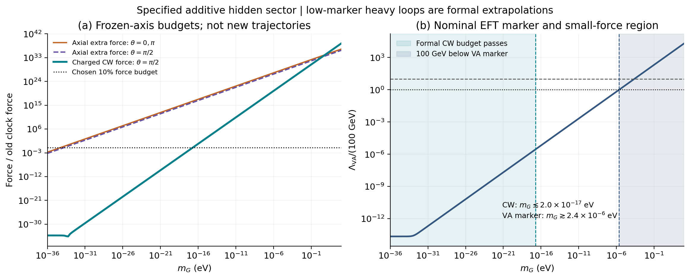
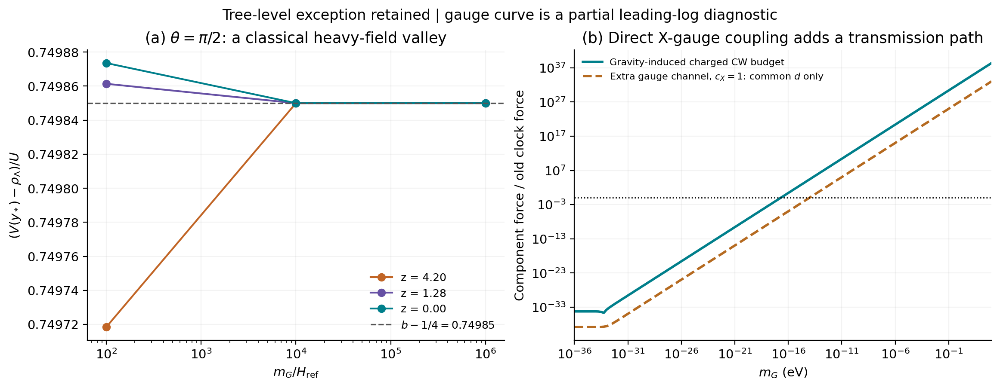

# 隐藏破缺传入慢时钟：指定模型的受力、重场谷与有效理论边界

**本轮结论：最简单的加性隐藏部门没有自动保护慢时钟。** 一般相位会产生很大的树级交叉力；恰好正交的相位存在一个保留指数势形状的局部重场谷，但带电谱仍然分裂。在本轮扫描和固定有限匹配条件下，带电圈图的 10% 小反馈预算与 nilpotent 理论计算 100 GeV 重阈值所需的名义能标标志没有交集。这个结果筛选的是下面明确写出的实现，不能推广为逆对数设想或所有超引力完成不可能。

## 1. 材料与研究问题

**Material Passport（2026-09-25）**：用户授权的理论与确定性数值续作；无新增观测、无参数拟合、无统计显著性检验。固定参数和背景取自 [移位型超引力实验](../../sugra_shift_v01/README.md)，共同软项对照取自 [保护阈值实验](../../protected_threshold_v01/README.md)。本轮复用 1025 个 `shift_axis` 点，原 86 页正文和旧实验均保持原样。协议、代码、数据、日志和哈希见 [材料清单](../materials_manifest.json)。

上一阶段已完成指定最小 U(1) 的规范匹配，但并未提供真实物质部门或解释其他部门的破缺如何与慢时钟隔离。本轮问一个更具体的问题：**把破缺源写进同一个作用量后，原来可容忍的带电质量分裂还能自然保持很小吗？**

原思路仍是用慢变量 χ 构造 $M^2(\chi)\propto1+\xi/\chi^2$，在满足相应动力学条件时联系 $\chi\sim\ln(t/t_*)$。这条质量律和本轮作用都是候选假设，尚未从黎曼动力学唯一导出；也未证明候选 U(1) 就是真实电磁作用。遇到新反馈后，不能把旧 χ(t) 直接当作新模型的解。

[协议](../protocol.md) 在主完整扫描前冻结；两条解析路径和部分探索性预算已先完成，因此不称盲态预注册。内部 AI 协助推导、独立实现和写作均已披露，不属于外部同行评审。

## 2. 明确隐藏作用：只调一次常数真空能

令约化普朗克质量为 $M_p$，正则时钟尺度为 $F_\chi$，并取

$$
Z=\frac{F_\chi}{\sqrt2}(\chi+iy),\qquad X^2=0,
$$
$$
K=-\frac12(Z-\bar Z)^2+X\bar X+|Q_+|^2+|Q_-|^2,
$$
$$
W=W_\chi(Z)+W_c+fX+M(Z)Q_+Q_-,\qquad
W_c=m_GM_p^2e^{i\theta},
$$
$$
W_\chi=-\frac{F_\chi\sqrt{U_i}}{\sqrt2}
\exp\left[-\frac{\sqrt2(Z-Z_i)}{F_\chi}\right],\qquad
M(Z)=m_\infty\sqrt{1+\frac{\xi}{(\sqrt2Z/F_\chi)^2}}.
$$

全纯质量分支只在所用正实轴附近定义。本轮沿用 $F_\chi^2/M_p^2=10^{-4}$、初始 $M=100$ GeV；没有另外加入可调的 $XQ_+Q_-$ 或 $X\bar XQ\bar Q$ 耦合。

选定

$$
|f|^2-3m_G^2M_p^2=\rho_\Lambda,
\qquad \rho_\Lambda=2.51814\times10^{-11}\ {
m eV}^4.
$$

这把旧模型的外加宇宙学常数移入隐藏 F 项，Friedmann 方程中不得再次叠加它。每个 $m_G$ 的 f 由此确定；没有沿时间重新调整，也没有减去场依赖斜率或曲率。这是明确的常数真空能调节，并未解决宇宙学常数问题。

nilpotent 场在玻色背景上取最低标量 $x=0$，但必须保留 $D_XW=f$ 对势的贡献，不能先把整个 X 部门删除。约束解需要非零 $F^X$，其高能适用范围还受到破缺能标限制。[Dall’Agata 与 Zwirner，§2.2、§5](https://arxiv.org/html/1411.2605v3)

记

$$
\epsilon=F_\chi^2/M_p^2,\quad b=1-3\epsilon/2=0.99985,
\quad U=U_i e^{-2(\chi-\chi_i)},\quad
C=\sqrt2F_\chi m_G\sqrt U.
$$

直接由超引力 F 项得到完整两实场势

$$
V=e^{\epsilon y^2}\left[\rho_\Lambda+U(b+\epsilon^2y^2)
+2F_\chi^2m_G^2y^2
+C\left\{(3-2\epsilon y^2)\cos(y+\theta)+2y\sin(y+\theta)\right\}\right].
\tag{1}
$$

其推导和带电二阶展开在 [理论核查](../../../reports/hidden_transfer_theory_20260925.md) 与 [独立解析核查](../../../reports/hidden_transfer_independent_20260925.md)。$m_G$ 只是常数超势参数；实际局部引力微子质量为

$$
m_{3/2}=e^{K/(2M_p^2)}\frac{|W_\chi+W_c|}{M_p^2},
$$

二者不能在慢尺度处混用。$m_G=0$ 时，实轴背景恢复旧结果；离轴的 $e^{\epsilon y^2}\rho_\Lambda$ 则增加横向正则质量平方 $2\rho_\Lambda/M_p^2$。

## 3. 轴上受力很大，但特殊相位有真实的树级例外

在实轴 $y=0$ 上，式 (1) 给出

$$
V=bU+\rho_\Lambda+3C\cos\theta,\qquad
V_\chi=-2bU-3C\cos\theta,\qquad V_y=-C\sin\theta.
$$

新增二维力的模为 $C\sqrt{1+8\cos^2\theta}$。以旧树力 $2bU$ 的 10% 为内部诊断，沿旧背景得到：

| 相位 | 原实轴额外力预算对应 $m_G$ | 解释 |
|---|---:|---|
| $0,\pi$ | $5.5861\times10^{-35}$ eV | 主要是沿时钟方向的新力 |
| $\pi/2$ | $1.6758\times10^{-34}$ eV | 此界测量实轴处的横向力，不是新谷底上的界 |

这不能直接证明所有新背景均失败。特别是在 $m_G\gg\sqrt U/F_\chi$ 且 $m_G^2\gg\rho_\Lambda/M_p^2$ 时，横向曲率约为 $4F_\chi^2m_G^2$；较大的初始梯度可以只对应很小的谷底位移：

$$
y_*\simeq\frac{\sqrt U}{2\sqrt2F_\chi m_G}\sin\theta,
\qquad
V_{\rm eff}\simeq\rho_\Lambda+3C\cos\theta+
\left(b-\frac14\sin^2\theta\right)U.
\tag{2}
$$

恰好 $\theta=\pi/2$ 时，$V_{\rm eff}\simeq\rho_\Lambda+0.74985U$，**指数形状保留，振幅发生有限改变**。不能因位移小就忽略 $-U/4$ 的势能变化，也不能因实轴 tadpole 大就断言该谷不存在。

在三个旧 χ 位置、三个 $\beta=m_G/H_{\rm ref}$ 上，直接对完整势求得全部 9 个局部极小值。以下展示起点 $z=4.2$：

| $\beta$ | $(V(y_*)-\rho_\Lambda)/U$ | 位移相对渐近式偏差 |
|---:|---:|---:|
| $10^2$ | 0.7497185155 | $8.41\times10^{-4}$ |
| $10^4$ | 0.7498499869 | $8.39\times10^{-8}$ |
| $10^6$ | 0.7498499999987 | $8.39\times10^{-12}$ |

这些是局部经典消去重场的检查，并非从原初态积分得到的宇宙历史，也不证明全局吸引性。精确相位尚无保护机制，偏离它会重新产生 $3C\cos\theta$。这里所取 β 对应的实际 $m_G$ 很低，谷底测试本身不意味着其 nilpotent 有效理论可以计算 100 GeV 圈图。

## 4. 隐藏部门给出的带电谱与局部一圈力

在实轴定义 $s=M^2$、$r=M_\chi/M=-\xi/[\chi(\chi^2+\xi)]$。直接二阶展开给出

$$
m_\pm^2=s+d\pm|\mathcal B|,\qquad m_\psi^2=s,
$$
$$
d=m_G^2+\frac{(1-\epsilon)U+\rho_\Lambda+2C\cos\theta}{M_p^2},
$$
$$
\mathcal B=M\left[\frac{\sqrt{2U}}{F_\chi}
\left(r+\frac\epsilon2\right)-m_Ge^{-i\theta}\right].
\tag{3}
$$

f 是常数且 M 不依赖 X，所以没有额外的 $F_XM_X$ 项，但 f 通过背景势进入共同标量项 d。这类引力传递的一般结构见 [Brignole、Ibáñez 与 Muñoz，§2](https://arxiv.org/html/hep-ph/9707209v3)；式 (3) 由当前滚动模型直接展开，并未套用驻定真空假设。

固定 $\mu=M_i=100$ GeV 的局部有限 Coleman–Weinberg 核为

$$
V_1=\frac{f_{\rm CW}(s+d+|\mathcal B|)+f_{\rm CW}(s+d-|\mathcal B|)-2f_{\rm CW}(s)}{32\pi^2},
$$
$$
f_{\rm CW}(x)=x^2[\ln(x/\mu^2)-3/2].
\tag{4}
$$

主代码保留 d、$|\mathcal B|^2$ 的完整 χ 导数，用小分裂展开稳定计算；没有把 d 再手动设为独立可调常数。54 点原始超迹的高精度直接计算另外检验了这个展开。

当 $m_G\gg\sqrt U/F_\chi$ 且 $m_G\ll M$ 时，$d\simeq m_G^2$、$|\mathcal B|^2\simeq m_G^2s$，于是

$$
V_1\simeq\frac{m_G^2s(3L-2)}{16\pi^2},\qquad
V_{1,\chi}\simeq\frac{m_G^2s_{,\chi}(3L+1)}{16\pi^2},
\quad L=\ln(s/\mu^2).
\tag{5}
$$

初端 $L=0$ 仍有非零力；遗漏双线性分裂会错过这一点。恰好正交相位也不能移除式 (5) 的主阶尺度。局部重场谷上的主阶结论沿用相同分裂量级，但本轮没有计算全部离轴量子有效作用量。

## 5. 小反馈区域与重阈值适用域没有重叠

扫描 $m_G=0$ 及 $10^{-36}$—$10^3$ eV 的 157 个对数点，乘三个相位，共 474 组；每组覆盖 1025 个旧背景点。全部标量谱为正，最大相对分裂约 $1.01\times10^{-8}$，在设定的小分裂域内。这不意味着量子力相对极小的宇宙树力也小。

定义 $R_{\rm CW}=\max_{\text{旧轨迹}}\left[|V_{1,\chi}|/(2bU)\right]$。在预算边界附近，三相位均得到

$$
R_{\rm CW}\simeq2.51517\times10^{32}(m_G/{\rm eV})^2,
\qquad R_{\rm CW}\le0.1\ \Rightarrow\
m_G\lesssim1.99396\times10^{-17}\ {
m eV}.
\tag{6}
$$

这个边界是旧背景、固定有限匹配方案下的形式结果，不能单独宣布为可行解。当前 nilpotent 理论还需满足高能使用条件。取名义量纲标志

$$
\Lambda_{\rm VA}\equiv\sqrt{|f|}
=(3m_G^2M_p^2+\rho_\Lambda)^{1/4}.
\tag{7}
$$

要求 100 GeV 重场位于这个标志以下，得到 $m_G\gtrsim2.37105\times10^{-6}$ eV；要求十倍能标余量则为 $2.37105\times10^{-4}$ eV。该标志的系数是量级约定，不是精确 UV 截止；即使通过它，也未给出 sgoldstino 质量、解耦层次和完整 UV 匹配。[适用层次的讨论：Argurio 等，§2](https://arxiv.org/html/1705.06788v2)

| 条件或诊断 | 本轮结果 | 可得出的结论 |
|---|---:|---|
| 实轴上带电 CW 力 ≤ 旧树力的 10% | $m_G\lesssim1.99\times10^{-17}$ eV | 形式小反馈预算，低于已说明的重阈值计算域 |
| $\pi/2$ 谷底用 $0.74985U$ 替换树力的主阶预算 | $m_G\lesssim1.73\times10^{-17}$ eV | 只作重场渐近诊断，不是新宇宙解 |
| 名义 $\Lambda_{\rm VA}\ge100$ GeV | $m_G\gtrsim2.37\times10^{-6}$ eV | 必要量纲标志，不保证 UV 受控 |
| 两参数边界的比值 | $1.19\times10^{11}$ | 当前实现存在约 11 个数量级的间隔 |
| 在上述名义门槛处的 $R_{\rm CW}$ | $1.41\times10^{21}$ | 原慢背景不能在同一参数下直接沿用 |

**图 1。** 左图为固定旧实轴上的额外树力与正交相位带电 CW 力，不是新演化轨迹；右图为形式小反馈域与名义有效理论域。在低标志区绘制的 100 GeV 圈图是形式延拓，不能称为该 nilpotent EFT 内受控计算。扫描上限为 1 keV，远小于重带电质量；本图不声称研究了强分裂区或任意 UV 完成。

本轮允许常数减法，未引入抵消斜率、曲率的场依赖反项。其他重整化边界、no-scale 或隔离几何、线性隐藏完成都可能改变结果，必须另外明确写出并核算；这里没有给出一般不可行定理。

## 6. 额外规范传递：计算了一个分量，没有冒充总力

基准取不依赖 X 的 $f_U$，因此无该直接树级规范费米子质量，但并未证明异常传递等量子项也消失。作为额外明确接口，再取

$$
f_U(X)=f_0+X/M_p,\qquad
|M_\lambda|=\frac{g^2}{2}\frac{|f|}{M_p},\qquad g^2=4\pi\alpha_0.
$$

这只是该直接树级项；候选 U(1) 尚未接入真实标准模型。以 10 TeV 处额外共同软质量为零，固定 g、$M_\lambda$，运行至 100 GeV，领先对数给出

$$
16\pi^2\frac{dm_Q^2}{d\ln\mu_R}=-8g^2|M_\lambda|^2,
\qquad d_{\rm gauge}=\kappa|M_\lambda|^2,
\quad \kappa=0.02139396.
$$

因此 $m_{\rm soft}=0.1462667|M_\lambda|$。旧共同软项预算可换算为 $|M_\lambda|\lesssim7.59\times10^{-16}$ eV，对该直接接口约为 $m_G\lesssim9.55\times10^{-15}$ eV。这些只限制选出的共同软项分量，不是总反馈界限，也不是实验限值。

同一运行还生成 $b_Q\simeq-\kappa M_\lambda M$，完整两圈图、既有 B 项交叉、联合运行与有限匹配尚未相加。因此共同分量不能称为总力的严格下限。[Martin–Vaughn，式 (2.16)、(2.19)](https://arxiv.org/html/hep-ph/9311340v4) 的代入、1 GeV 规范费米子示例和独立 RGE 核验见 [规范传递报告](../../../reports/gauge_leakage_20260925.md)。

**图 2。** 左图显示完整经典势的局部谷底趋近 $0.74985U+\rho_\Lambda$，不是对额外方向进行冻结；右图分别画引力诱导的带电 CW 诊断与额外规范共同软项分量，二者未相加成完整高圈结果。

## 7. 复核、异常与下一步

| 核查路径 | 结果 | 范围 |
|---|---:|---|
| 主计算 | 35/35 | 预算根、谱正性、小分裂、局部谷、零参数轴向极限 |
| 第一条解析路径 | 29/29 | 完整势、轴上导数、带电二阶展开与主阶 CW |
| 第二条独立解析路径 | 24/24 | 独立重建势、Hessian、相位及谷底系数 |
| 独立数值重算 | 2015/2015 | 全部扫描摘要、直接超迹、K/W 梯度、谷底根与预算根 |
| 额外规范分量 | 9/9 | RGE 独立积分、共同软力与旧预算重建 |

独立数值实现未读取、导入或调用主生产代码。它重建全部 $474\times1025$ 个背景采样的摘要，最大归一差 $1.29\times10^{-14}$；54 个固定点以 180/240 位直接计算原始超迹及数值导数，主 CW 值、导数相对对应组峰值的最大差分别为 $3.51\times10^{-16}$、$6.96\times10^{-16}$。另有 54 点直接 K/W 势与梯度、9 谷独立数值求根；定义和全部结果见 [独立数值报告](independent_results_cn.md)。高精度为避免消减误差，不表示物理参数精确到相同位数。

主计算与独立数值第一次运行均通过。文献获取中旧版 Martin–Vaughn HTML 返回 404，随后读取含勘误的 v4；独立来源读取的一次 PDF 截图失败，实际使用提取文本，来源文件保留了记录。图初稿经视觉检查后改正相位曲线标签与负零显示，科学数据没有改变。全部来源、版本和具体读取范围见 [隐藏理论来源记录](../../../reports/hidden_transfer_theory_20260925_sources.json)、[独立解析来源记录](../../../reports/hidden_transfer_independent_20260925_sources.json) 与 [规范来源记录](../../../reports/gauge_leakage_20260925_sources.json)。没有把未读取章节或文献自己的物理结论充作本模型证据。

实现检查通过不意味着物理假设成立。当前最有用的下一步是：**选定一个明确的 no-scale、几何隔离或其他对称保护作用，同时推导时钟交叉项和带电 d、B 项，检查它们是否一起受到抑制。** 只让树级相位恰好正交还不够；候选结构还应说明其重场有效理论域。本轮到此完成指定模型检验，没有继续重调参数、生成新 α 曲线或把它接入真实常数变化的观测拟合。
