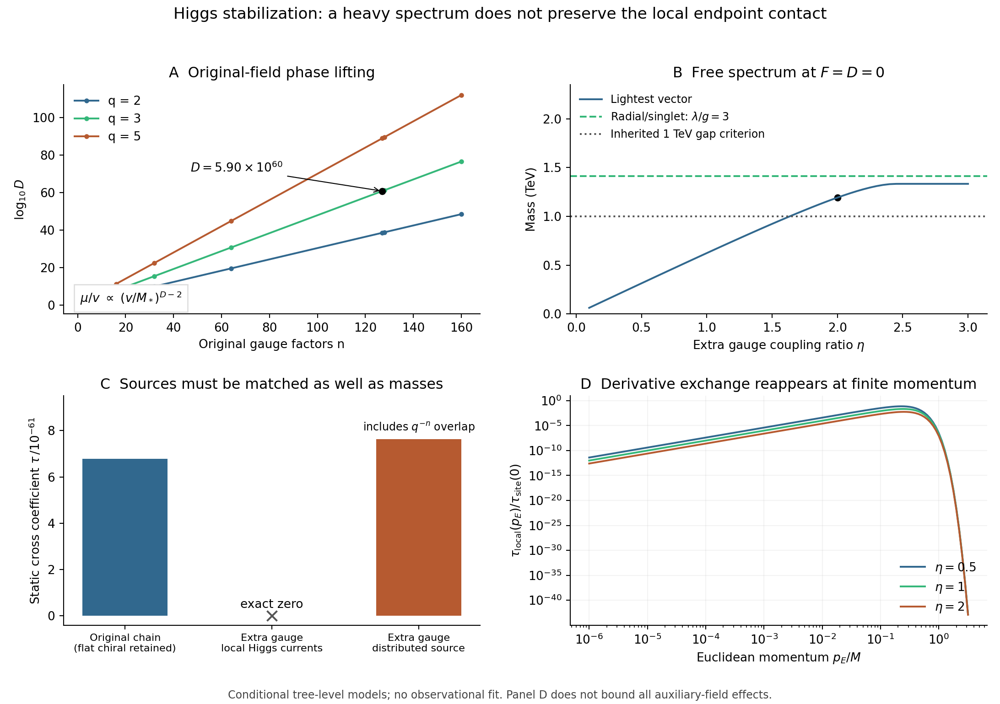

# Higgs剩余模稳定：重谱与所需端点恢复项之间的取舍

日期：2026-09-26。承接 [threshold_rg_v01](../../threshold_rg_v01/README.md)。

**本轮把“剩余模如何稳定”落实为两个明确构造，结果均未完成原先期望的全重、局域端点持续恢复机制。** 原场内容允许的相位提升算符次数极高，在受控的有效理论中抬不重；额外规范群能产生全重自由谱，但实际局域Higgs端点流的交叉接触严格消失。有限辅助场的直接核验表明，在下述刚性时钟关闭分支中，该恢复势也没有重新出现。这些是指定候选的限制，不是所有稳定机制的排除，更不是逆对数响应设想被观测证实或否定。

## 材料、假设和适用范围

- 输入：旧规范链的电荷矩阵、127站点低源例及2 TeV左端接触归一化。没有新观测数据；旧阈值/RG数值保留为原作用量下的结果。
- 新假设：规范Higgs动能、相等真空模长、无FI项、乘积约束超势，以及明确的非最小局域模平方差耦合。源的选择不是由规范对称性唯一推出，也没有自动禁止其他中性接触。
- 计算：整数核、超势质量及径向混合、完整自由超多重态谱、物理流匹配、有限欧氏动量核、有限辅助场非线性驻点。独立推导和输出比较来自同模型家族的内部代理，不是外部同行评议。
- 输出：[协议](../protocol.md)、[主结果与哈希](../results/summary.json)、[独立输出比较](independent_results_cn.md)、[归档清单](../materials_manifest.json)。检查数量不转换成物理置信度。
- 未完成：破缺超对称后的完整标量谱、原体模量的高维局域实现、全部圈修正与有限反项、完整超引力真空、新宇宙轨迹及真实物质读数。原有86页正式稿和历史实验保持原版。

**图1。** A：原场内容中最小相位敏感不变量的次数。B：新增规范群后的刚性 $F=D=0$ 自由质量，水平1 TeV线来自旧100 GeV探针与质量比0.1的诊断要求，并非观测下限。C：重矢量消元得到的交叉系数；原链还保留一个物理手征模，右侧非零柱需要不同的跨链接源，不能当成中间局域源方案的预测。D：有限欧氏动量的树级传播核，不是宇宙时间曲线，也不约束所有辅助场高阶作用。可下载[矢量PDF图](../figures/stabilization_tradeoff.pdf)。

## 1. 为什么原链仍有一个自由度

有 $n$ 个 $U(1)$、$n+1$ 对共轭Higgs场和 $n+1$ 个中性场 $Z_a$。电荷矩阵 $Q$ 的行是

\[
Q_0=q e_0^T,\qquad Q_a=e_{a-1}^T-qe_a^T\ (1\le a<n),
\qquad Q_n=e_{n-1}^T,
\]
\[
W_{\rm link}=\lambda\sum_{a=0}^n Z_a(\Phi_a\widetilde\Phi_a-v^2).
\]

Higgs真空产生 $H=Q^TQ$，其对角元为 $q^2+1$，相邻元为 $-q$。这个**矢量**矩阵满秩，不意味着整个Higgs部门没有无质量模。乘积约束后有 $n+1$ 个手征方向，只有 $n$ 个被矢量吸收，因此还剩一个，方向为

\[
w=(1,-q,-q^2,\ldots,-q^n)^T,\qquad Q^Tw=0.
\]

由链接真空生成规范质量的组织方式可参考deconstruction；有轻零模的clockwork与本项目原先全重矢量链应区分。原始背景来源及本轮阅读范围见[来源记录](../../../reports/higgs_phase_operators_20260926_sources.json)，具体电荷、质量与流公式是本轮推导。相关方法背景见[(De)Constructing Dimensions](https://arxiv.org/html/hep-th/0104005v1)和[A Clockwork Theory](https://arxiv.org/pdf/1610.07962)。

## 2. 路线一：原场内容的多项式提升为何太弱

任一规范不变单项式的净指数向量必须是整数倍 $w$。零倍只给出相位无关的乘积；非零倍的最小次数是

\[
\mathcal O=\Phi_0\prod_{a=1}^n\widetilde\Phi_a^{q^a},\qquad
D=\frac{q^{n+1}-1}{q-1}.
\]

对 $q=3,n=127$，$D=5.8950922889\times10^{60}$。任意增加中性乘子都不改变这个整数核。一个明确候选是

\[
W_{\rm lift}=\frac{\kappa Y}{M_*^{D-2}}(\mathcal O-v^D),\qquad
\frac{\mu}{v}=\kappa\sqrt{\frac{\mathcal W}{2}}
\left(\frac v{M_*}\right)^{D-2},\qquad
\mathcal W=\sum_{a=0}^n q^{2a}.
\]

$\mu$ 是局部规范化超势质量参数。在可先消去径向模的极限，轻质量为 $|\mu|$。取 $\kappa=1,v/M_*=0.9$，实际计算的是

\[
\log_{10}(|\mu|/v)=-2.6974463\times10^{59}.
\]

所以这里的“极轻”不是浮点程序下溢得到的零。形式上要令 $|\mu|=v$，需

\[
1-v/M_*\simeq2.3618982\times10^{-59},
\]

已经失去通常按场/截断比截断高维算符的依据。提升变强时，径向混合也不能忽略。完整相关二次块为

\[
W_2=m_RZR+\mu YR+\mu YC,\quad m_R=\sqrt2\lambda v,
\quad x_\pm=\frac{m_R^2+2|\mu|^2\pm\sqrt{m_R^4+4|\mu|^4}}2.
\]

因此不能把任意大的裸 $\mu$ 当成正确轻谱。声明坐标中的高阶展开系数也会极大；它们可以经场重定义移入其他相互作用，本轮未用单个系数声称证明完整散射幺正性失效。

高维不变量保护未吸收相位的机制有既有研究，[Axions in a highly protected gauge symmetry model](https://link.springer.com/article/10.1140/epjc/s10052-018-6528-z)提供了相关Abelian链实例。本轮的超对称配对质量和径向混合另行计算，详见[算符独立审计](../../../reports/higgs_phase_operators_20260926.md)。这条限制只覆盖所列场内容的解析多项式路线，不覆盖新带电场、强动力学等所有可能完成。

## 3. 路线二：新增规范群确实能产生全重自由谱

给右端对增加电荷 $\pm1$ 的 $U(1)_*$，取规范耦合比 $\eta=g_*/g$。$\eta$ 是耦合比而非非整数电荷。吸收耦合权重的方阵与Gram矩阵为

\[
Q_+=\bigl(Q\mid\eta e_n\bigr),\qquad
H_+=\begin{pmatrix}H&\eta e_{n-1}\\\eta e_{n-1}^T&\eta^2\end{pmatrix},
\qquad \det H_+=\eta^2q^{2n}>0.
\]

对任意 $\eta\ne0$，所有连续Higgs方向都被约束或吸收。整数电荷仍留下离散 $\mathbb Z_{q^n}$，不产生连续平坦模；共轭对抵消新增部门的规范与混合引力异常。规范Higgs动能下定义**物理**共同质量尺度

\[
M=2gv,\quad m_{V,j}=M\sqrt{\lambda_j(H_+)},\quad
m_R=\frac{\lambda}{\sqrt2 g}M.
\]

本报告固定左接触归一化为 $\Lambda=2$ TeV，选择 $M=\Lambda/q=0.666667$ TeV；与原链 $M=\Lambda\sqrt{G_{00}}$ 的差别在主例指数小。非最小流的共同系数可独立按这个约定归一化。独立局域流报告使用超场二次Kähler型的质量记号，其共同因子不同；无量纲投影相同，物理质量采用此处的规范分量约定。

| $\eta$ | 最轻矢量（TeV） | 径向/单态质量，$\lambda/g=3$（TeV） | 100 GeV / 最轻重场 |
|---:|---:|---:|---:|
| 0.5 | 0.313708 | 1.414214 | 0.3188，未过0.1要求 |
| 1 | 0.623610 | 1.414214 | 0.1604，未过要求 |
| 2 | 1.192570 | 1.414214 | 0.08385，通过此项 |

$\lambda/g=1$ 时径向/单态质量只有0.471405 TeV，不能遗漏它来声称整体满足旧层次要求。$\eta=2,\lambda/g=3$ 表明**存在全重且满足该自由谱层次的例子**，尚不表明破缺超对称、量子或完整超引力模型已经稳定。完整二次多重态计数见[重谱审计](../../../reports/higgs_extra_gauge_20260926.md)。

## 4. 真正的局域端点源使所需交叉项精确抵消

选择规范不变的局域Higgs模平方差与轻场流相乘。若左流为 $I$、右流为 $S_X=|X_c|^2$，在Higgs真空附近，其规范源方向分别是Higgs电荷矩阵的端点行。为与旧站点约定对应，取

\[
a=Q_{+,0}^T/q=(e_0,0),\qquad
b=Q_{+,n}^T=(e_{n-1},\eta).
\]

新增规范场也耦合右端Higgs，故 $b$ 的最后一个分量不能删除。两导数Kähler匹配核满足

\[
Q_+(Q_+^TQ_+)^{-1}Q_+^T=\mathbf1,
\quad a^TH_+^{-1}b=0,
\quad a^TH_+^{-1}a=q^{-2},\quad b^TH_+^{-1}b=1.
\]

因而左端自项归一化后得到

\[
\boxed{\Delta K=-\frac{I^2+q^2 S_X^2}{\Lambda^2},\qquad\tau_{\rm local}=0.}
\]

右端自项从旧归一化1变为9，仍然存在。交叉为零是可逆矩阵恒等式的结果，不能解释成 $10^{-61}$ 信号被双精度舍入。完整领先导数Kähler商也得到各Higgs行可分离的平方根函数，独立确认没有漏掉源依赖的二次项，见[局域物理流审计](../../../reports/higgs_local_currents_20260926.md)。

相反，若继续把右源定义成抽象旧规范站点 $b_{\rm site}=(e_{n-1},0)$，确实有

\[
\tau_{\rm site,+}=q^{1-n}=7.6334683\times10^{-61},
\quad \tau_{\rm old}=6.7853051\times10^{-61}.
\]

但是在Higgs行表示中

\[
b_{\rm site}=q^{-n}Q_{+,0}^T-
\sum_{a=1}^{n-1}q^{-(n-a)}Q_{+,a}^T.
\]

这个源涉及多个链接，右端Higgs行系数反而是零；与左源共享的微小成分已经包含 $q^{-n}=2.5444894\times10^{-61}$。它在四维时空仍可局部，但在链的链接空间中是分布式的。**这个不同源结构可以另作假设，却还没有解释极小重叠为何产生及如何受保护。** 因此不能只报告非零逆质量矩阵元素，就认定原局域耦合完成成功。

## 5. 有限辅助场：直接检查了恢复势，没有只用零动量作推断

有限动量传播确实可重新产生交叉。令 $s=p_E^2/M^2$，匹配过的左右源给

\[
a^T(H_++s\mathbf1)^{-1}b
=\frac{s q^{n-1}}{\det(H_++s\mathbf1)}
=\frac{s}{\eta^2q^{n+1}}+O(s^2).
\]

但超协变导数作用在非零辅助场上，也能产生静态分量项。所以不能仅凭 $p_E$ 很小就说全部有限辅助场效应消失。我们另作了显式分量计算。

在刚性 $W=fX$、$X=Z_a=0$、无时钟超势的局部支，令 $k=y^2$ 为时钟横向变量平方，取

\[
K=k+|X|^2+\sum_a(|\Phi_a|^2+|\widetilde\Phi_a|^2+|Z_a|^2)
+c_I k d_0+c_X|X|^2d_n,
\]
\[
d_a=|\Phi_a|^2-|\widetilde\Phi_a|^2,\quad
s_a=|\Phi_a|^2+|\widetilde\Phi_a|^2,\quad
W=fX+W_{\rm link}.
\]

带电范数的规范指数隐含在式中，$c_I,c_X$ 的质量维数为−2。在这条支上辅助场逆度规可明确分块，故

\[
V_F=\frac{S}{1+c_Xd_n}+\lambda^2\sum_a|\Phi_a\widetilde\Phi_a-v^2|^2,
\quad S=|f|^2,
\quad V_D=\frac{g^2}{2}\left|Q_+^T(d+c_Ik s_0e_0)\right|^2.
\]

左端实变换 $\Phi_0\mapsto e^\xi\Phi_0,\ \widetilde\Phi_0\mapsto e^{-\xi}\widetilde\Phi_0$ 保持乘积与右端 $V_F$。重场驻点条件因此要求左行的D力投影为零；而 $\partial_k V$ 正比于同一投影。对正定度量、$|c_Ik|<1$、连续驻点支，有

\[
\frac{d V_{\rm stat}}{dk}=0.
\]

这直接排除了该刚性支的新增静态时钟恢复质量，且保留了有限 $F_X$。108个不同源强、短链、耦合比和时钟坐标的直接非线性驻点复核支持公式；最大梯度残差 $5.76\times10^{-15}$，固定源能量跨度最大 $8.88\times10^{-16}$，均为无量纲内部检查。

**隐扇区自身反馈仍在。** 若 $t=c_Xd_n$，这条支满足

\[
t(1+t)^2=\frac{Sc_X^2}{g^2\eta^2},\qquad
V_{\rm stat}(S)=\frac{S}{1+t}+\frac{St}{2(1+t)^2}.
\]

若 $S$ 随另一背景变化，其响应也随之变化，不能继续沿用旧0.00200086%的预算。我们没有把原体模量偷偷替换成新独立隐场；$W=fX$ 是为了隔离本地恢复通道的刚性诊断。完整原模量的超引力嵌入、非零时钟辅助场、其他相互作用和圈图仍须另算。详见[有限辅助场审计](../../../reports/higgs_finite_auxiliary_20260926.md)。

## 6. 复核、失败记录与研究判断

主实现245项代数和数值检查通过，输出108行相位提升、59行规范耦合扫描和393行动量传播表。独立算符、重谱、局域流及有限辅助场审计分别为271、594、227、678项；内容有重叠，不把它们相加为自然界支持度。全表独立比较通过4087项检查，覆盖560行、4009个CSV数值/分类单元，采用直接电荷矩阵SVD和链接空间线性求解，未读取或导入主实现；范围和容差见[比较报告](independent_results_cn.md)。

主程序首次计算在写JSON时遇到NumPy布尔类型序列化错误；[原日志](../logs/main_initial_failure.log)和[原脚本](../code/run_stabilization_initial.py)保留，修复仅转换为Python布尔类型，没有改公式、扫描或阈值。独立输出比较的初次语法错误及3262/4087结果也保留：初次用精确十分位对数网格，而主表的指数由双精度网格产生，导致165行动量输入有约 $10^{-15}$ 相对差异；改为在实际记录的 $s$ 上比较响应，仍保持 $10^{-58}$ 相对响应容差，同时另查双精度网格位置。相位算符与重谱专题初次各有一个SymPy符号对象/展开式结构比较失败；专题原记录保留，修正为同一符号和精确多项式比较后通过，没有放松物理要求。$\eta=0.5,1$ 的旧谱隙条件不通过，以及所有额外规范局域源的交叉消失，都是保留的物理结果。

本轮可以写入后续修订稿的结论是：**为质量矩阵找到Higgs来源还不够；剩余模的处理、物理源的实现与有限辅助场响应必须在同一作用量下匹配。** 这里给出一个可复算的具体限制：最小多项式路线无法受控地产生所需重提升，而最小再规范化路线失去原持续恢复接触。正式正文尚未据此改写。

下一项有界任务应先把原链未吸收的手征模保留为真实低能自由度，推导其在原隐扇区辅助场背景下的势、动能和端点耦合，判断是否存在驻点或沿实方向跑逸；再决定是否必须引入新的相位破缺场内容。不能把未稳定模直接删掉，也不以反复增加重场或重设极小系数代替推导。**$1/\ln^2t$ 仍是基础响应设想；其平方指数、宇宙时间对应以及真实物理相互作用的黎曼来源尚未导出。**
