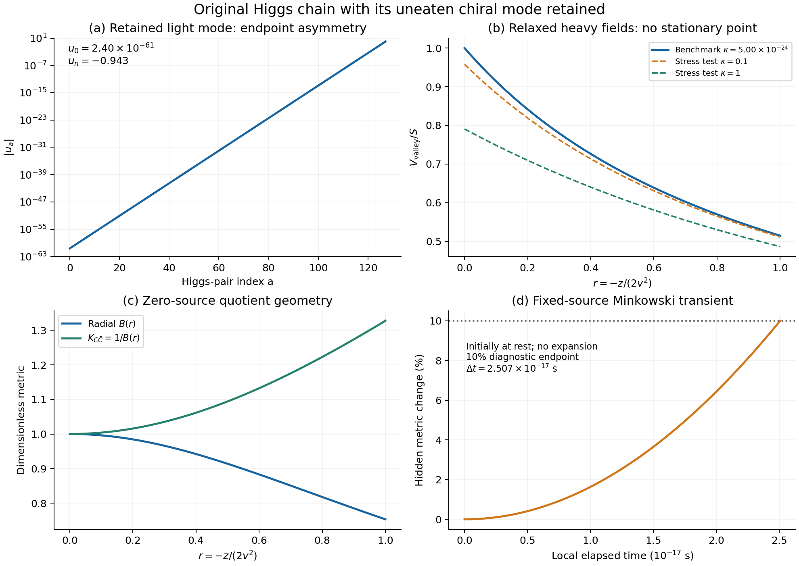

# 保留未被吸收的轻模后：原Higgs链的条件低能理论

日期：2026-09-26。基线提交 `fbfae9851ce0c38452d18d2ec8d70b1d840e6c6d`。

**这轮补齐了原链此前省略的轻自由度，并得到一个明确限制：在指定非零辅助场源下，剩余实方向没有有限内部驻点。小端点交叉项仍然存在，却没有压低右端源对轻模的直接推动。** 因此，旧的固定轻模背景不能直接升级为完整模型的稳定真空。这是一项作用量层面的条件结果，不是对逆对数平方设想或所有完成方式的排除。

## 1. 材料、问题与范围

输入为上一轮原始 $U(1)^n$ Higgs链及其明确的端点局域源。本轮不加入额外规范群，不删除剩余模，也不引入观测数据。继承的数值能标只用于可比较的微观切片，原始数据、代码和假设见[协议](../protocol.md)与[清单](../materials_manifest.json)。

作用量为

\[
\begin{aligned}
K={}&k+|X|^2+\sum_{a=0}^n
(|\Phi_a|^2+|\widetilde\Phi_a|^2+|Z_a|^2)
+c_Ikd_0+c_X|X|^2d_n,\\
W={}&fX+\lambda\sum_{a=0}^nZ_a(\Phi_a\widetilde\Phi_a-v^2),\\
k={}&y^2=-(T-\bar T)^2/2,\qquad
d_a=|\Phi_a|^2-|\widetilde\Phi_a|^2,\qquad S=|f|^2.
\end{aligned}
\tag{1}
\]

带电模平方隐含相应规范因子。$T$ 是时钟手征坐标；$X$ 是此前模量的局部位移诊断，不能将刚性 $W=fX$ 的结论冒充完整旧超引力模量势的结果。$Z_a$ 是乘积约束场，$c_I,c_X$ 的质量维数为 $-2$。

驻点结论限定在 $X=Z_a=0$、无时钟超势、全部Higgs pair非零、完整动能正定的刚性树级分支。有限 $\lambda$、有限辅助场和乘积方向偏移均可保留。全局商空间几何则单独在零源约束面推导，两者不混为同一个“精确消元”。

## 2. 剩余的一个复模量及其非线性动能

原电荷矩阵的行是 $q e_0$、$e_{a-1}-qe_a$ 和最后的 $e_{n-1}$。归一化左零向量为

\[
w=(1,-q,-q^2,\ldots,-q^n)^T,\qquad
u=\frac{w}{\sqrt{\sum_{a=0}^nq^{2a}}},\qquad Q^Tu=0.
\tag{2}
\]

规范群吸收 $n$ 个复组合后，还留有一个完整手征模，包括实幅度和相位。在乘积 $\Phi_a\widetilde\Phi_a=v^2$ 的零源D平坦面上，

\[
d_a=u_a z,\qquad s_a=\sqrt{4v^4+u_a^2z^2},\qquad
h_G(z)=\sum_a\frac{u_a^2}{s_a}.
\]

直接从原场动能并消去规范相位速度，得到

\[
\mathcal L_{\rm kin}=\frac{h_G}{4}(\partial z)^2
+\frac1{h_G}(\partial\theta)^2,\qquad
\theta=u\cdot\arg\Phi.
\tag{3}
\]

局部全纯坐标 $C=\sqrt2v\sum_a u_a\ln(\Phi_a/v)$ 满足

\[
K_{C\bar C}=\frac1{2v^2h_G},\qquad
C=\frac{\sigma+ia}{\sqrt2},\qquad
\sigma=\frac{z}{2v}+O(z^3/v^5),\quad a=2v\theta.
\tag{4}
\]

$C$ 仅在原点规范化；$z/(2v)$ 不是全局规范场。相位在式(1)的乘积超势和模平方源下仍无势，相关微扰异常在矢量型场对之间抵消；这不声明量子引力中的精确全局对称性。详见[独立几何推导](../../../reports/light_modulus_geometry_20260926.md)。

## 3. 很小的交叉接触与不小的轻模源

重方向的投影为 $P=I-uu^T$。固定轻全纯坐标，仅消去重矢量后，局部有效Kähler势同时包含

\[
K_{\rm eff}\supset\sigma^2+
\beta_I\sigma k+\beta_X\sigma|X|^2-v^2J^TPJ,
\quad J=c_Ik e_0+c_X|X|^2e_n,
\quad\beta_I=2vc_Iu_0,\quad\beta_X=2vc_Xu_n.
\tag{5}
\]

采用 $v^2c_I^2P_{00}=\Lambda^{-2}$、$c_X=qc_I$，重接触恢复

\[
\Delta K=-\Lambda^{-2}(k^2+2\tau k|X|^2+|X|^4),
\qquad \tau=\frac{q-q^{-1}}{q^n-q^{-n}}.
\]

与此同时，必须保留

\[
\beta_I\beta_X\Lambda^2=-4\tau,
\qquad \beta_X^2\Lambda^2=
\frac{4(q^2-1)}{1-q^{-2n}}.
\tag{6}
\]

链长压低左端接入和两端交叉项，没有压低右端源对轻模的作用。在 $q=3,n=127$ 的主例，

\[
u_0=2.39896764\times10^{-61},\quad u_n=-0.942809042,
\quad\tau=6.78530514\times10^{-61},\quad\beta_X^2\Lambda^2\simeq32.
\]

右端投影到轻模式与重子空间的平方权重之比约为8。因此遗漏这个轻模，会遗漏右端源的主要接入方向。

## 4. 有限辅助场下的驻点障碍

先取 $k=0$。式(1)在所述分支的完整标量势为

\[
V=\frac{S}{1+c_Xd_n}
+\lambda^2\sum_a|p_a-v^2|^2+\frac{g^2}{2}|Q^Td|^2,
\qquad p_a=\Phi_a\widetilde\Phi_a.
\tag{7}
\]

保持所有 $p_a$ 不变，作 $\delta d=\varepsilon u$。由于 $Q^Tu=0$，乘积势和D势都不变，而

\[
\boxed{\frac{dV}{d\varepsilon}
=-\frac{Sc_Xu_n}{(1+c_Xd_n)^2}\ne0.}
\tag{8}
\]

这个允许方向的一阶导数不为零，足以排除本分支内的驻点；不需要将辅助场当成无穷小量。对有限 $k$，改用 $\rho=d+c_Ik s_0e_0$，在正定开集内映射可逆，取 $\delta\rho=\varepsilon u$ 得到相同结论。完整推导与正定条件见[驻点审计](../../../reports/light_modulus_stationarity_20260926.md)。

重方向仍可以在每个固定 $z=u\cdot d$ 下达到条件极小值。设

\[
A=QQ^T,\quad h_A=(A^+)_{nn},\quad
B_0=1+c_Xu_nz,\quad\kappa=\frac{Sc_X^2h_A}{g^2},
\]

则唯一正度规解由 $D=B_0+t>0$、$tD^2=\kappa$ 决定，且

\[
d=zu+\frac{Sc_X}{g^2D^2}A^+e_n,\qquad
V_{\rm valley}=\frac SD+\frac{g^2t^2}{2c_X^2h_A}.
\tag{9}
\]

其沿谷底的导数为

\[
V'_{\rm valley}=-\frac{Sc_Xu_n}{D^2}\ne0,\qquad
V''_{\rm valley}=\frac{2S(c_Xu_n)^2}{D^2(D+2t)}>0.
\tag{10}
\]

**单调的凸势没有极小值。** 在允许域内，场被推动向更大的幅度或域边界。形式上把谷底延伸到无穷远可能先跨过时钟动能退化或EFT场幅边界，因此本报告不宣称已得到无限延伸的物理跑逸轨迹。

## 5. 基准、局部曲率和有界瞬态

沿用 $\Lambda=2$ TeV、$g=1$、$v=\Lambda/6$、$m_G=10^{-15}$ eV 和 $S=3M_{\rm Pl}^2m_G^2$。此处最后一个关系只固定数值源，不代表已接回超引力背景。

| 量 | 结果 | 含义 |
|---|---:|---|
| $\kappa$ | $5.00278359\times10^{-24}$ | 重方向的有限源偏移参数 |
| 原点 $\partial_\sigma V$，领先源阶 | $5.03111425\times10^{13}$ eV³ | 非零轻模梯度 |
| 普通 $yy$ Hessian | $1.20694803\times10^{-59}$ eV² | 固定 $C$ 的局部坐标曲率 |
| 协变 $yy$ Hessian | $6.03474013\times10^{-60}$ eV² | 保留场空间联络后的曲率 |
| 局部 $X$ Hessian | $88.938375$ eV² | 包含 $C-X$ 度规混合 |

后面三行均在非驻点计算，不能称为稳定真空粒子质量。特别是保留轻模后，$X$ 局部指标为 $S(4/\Lambda^2+\beta_X^2/2)$，而不是冻结轻模时的 $4S/\Lambda^2$。即使精确平移方向在非驻点也可有非零协变势Hessian；滚动稳定还须联同背景和动能分析。见[独立局部有效作用报告](../../../reports/light_modulus_response_20260926.md)。

令 $r=-z/(2v^2)$，在主例 $0\le r\le1$ 区间，有限源谷底相对零源D平坦近似的势梯度差最大约 $1.001\times10^{-23}$，径向动能系数差最大约 $3.541\times10^{-25}$。重场偏移非常小，却不会把式(8)的梯度变成零。

为展示其局部后果，附加一个固定源、无膨胀、均匀Minkowski背景、初始静止的短程计算：

\[
B(r)=\sum_a\frac{u_a^2}{\sqrt{1+u_a^2r^2}},\quad
b=-2v^2c_Xu_n=0.942809042,\quad
\mathcal L_{\rm kin}=\frac{v^2B(r)}2(\partial r)^2,
\quad V=\frac S{1+br}.
\]

以 $s=\sqrt S\,\Delta t/v$ 为自然单位时间，求解到隐藏度规增加10%，即 $br=0.1$，得到

\[
s_*=0.4819126356,\qquad
\Delta t_*=2.50699365\times10^{-17}\ \mathrm{s}.
\tag{11}
\]

独立能量积分给出同一终点。这个时间只反映所选固定源的局部推动，10%是诊断阈值；它不是宇宙寿命、常数变化观测或对真实宇宙年代的预测。加入引力、完整原模量势和其他部门后必须重新求背景。

图：左上显示轻模在端点上的极大不对称；右上显示重场松弛后仍单调的势，较大的 $\kappa$ 仅用于公式压力测试；左下比较零源商空间的径向与全纯坐标度规；右下是式(11)限定的局部瞬态。[矢量PDF](../figures/light_modulus_diagnostics.pdf)。

## 6. 复核与保留的失败

主计算使用110位运算，输出五张CSV共759行；内置549项一致性检查通过。独立几何507项、驻点1435项、局部有效作用110项检查分别归档。驻点审计包含216个从零log-amplitude初值出发的完整Higgs幅度约束求解，最大KKT残差 $6.89\times10^{-11}$，全部采样解均满足所检查的完整动能正定条件。独立逐行比较的覆盖范围、容差及结果见[比较报告](../../../reports/light_modulus_output_comparison_20260926.md)。

驻点审计首次为1423/1435：12项二阶有限差分误差超过预设阈值。保留首次脚本和结果，以同一步长四阶差分替换后通过，未修改模型、网格或放宽容差。物理上的“无驻点”始终作为结果保留，不是通过修改参数消除的测试失败。

这些是内部AI辅助推导与独立实现核验，范围部分重叠，不累加为自然界支持，也不代替外部同行评议。此轮没有新增观测材料；重场消元背景文献只核查了明确记录的摘要范围，见[来源记录](../../../reports/light_modulus_geometry_20260926_sources.json)。

## 7. 对主流程的具体影响

此前阈值阶段的有限小反馈是在遗漏或冻结本轻模的指定有效作用中计算的。那些数值继续作为原模型结果保留，但不能移植为这条完整Higgs链已经通过真空与慢演化检验。

下一步应从一个明确、规范不变且保留相位对称性的微观作用开始，研究能否稳定**实方向**并保持目标端点接触。需要同时推导驻点、正定动能、混合谱和全部伴随接触；新的稳定参数与场内容计入模型假设，不靠手工补质量或删除线性推动项。相位可以继续保留为轻自由度，是否需要破缺应由物理用途决定。

只有新候选形成可用背景，才重新计算净慢轴反馈、完整超引力和物质读数。当前尚未从黎曼结构导出真实物理相互作用，也未在这个微观候选中导出 $1/\ln^2t$ 驱动及平方指数；这两项仍是主线的核心未完成任务。86页正式稿、历史实验与独立的RH临时讨论均保持原有边界。
