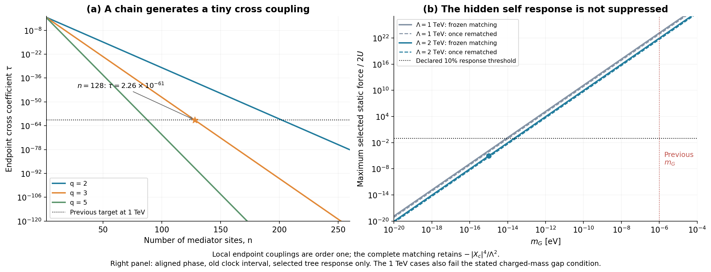

# 用中介链产生小耦合：机制推进与新的反馈限制

2026-09-26，`mediator_chain_v01`。承接上一轮尚未解释的$\tau\sim10^{-61}$。**树级上，可以用百余个相邻耦合的重场及数量级正常的局部参数产生这样小的端点耦合；但完整匹配同时留下不小的模量自作用，它使上一轮代表能标严重破坏慢驱动。降低能标后可通过本轮选定的静态响应和谱隙条件，仍未得到受到量子保护的完整模型。**

## Material Passport

本轮使用原有时钟坐标和理论参数，没有新增观测数据或宇宙积分。新材料是一个明确作用量候选的解析匹配、完整局部重场静态响应、有限超引力核验，以及明确范围内的Gaussian圈计算。实施范围见[protocol](../protocol.md)。这些是AI辅助的内部交叉核验，不是外部同行评议或物理发现。历史实验和86页正文保持原版。

## 1. 这次具体尝试的机制

将单一中介换为n个相邻耦合的有质量矢量超多重态。时钟和带电物质接在一端，已有模量的规范位移X接在另一端。局部输入取$q=2,3,5$及$g=\sqrt2$，不用在每个连接处放入$10^{-61}$这样的数。

取规范Maxwell动能与$J_a=S_a+\bar S_a+\sqrt2MV_a$，质量度规和流耦合为

\[
H_{ab}=(q^2+1)\delta_{ab}-q(\delta_{a,b+1}+\delta_{a,b-1}),\quad
B_h=\tfrac12J^THJ+\frac{\sqrt2}{M}(J_0I+J_{n-1}|X_c|^2),
\]

其中$I=k_c+\sigma S_{Qc}$。时钟原来的实方向移位结构保留在$k_c$中。树级消元由$G=H^{-1}$决定，取$M^2=\Lambda^2G_{00}$后，

\[
\tau=\frac{G_{0,n-1}}{G_{00}}
=\frac{q-q^{-1}}{q^n-q^{-n}}.
\]

例如$q=3,n=128$给$\tau=2.26177\times10^{-61}$；在$\Lambda=1$ TeV下对应$r_H=3.09286>2$，满足之前持续恢复项的主阶门槛。这确实将极小的**局部输入**换成了较长的链及连接规则，但并没有消除模型复杂度。

该结构受已有clockwork及理论空间局域性思路启发，不过这里全部对角元为$q^2+1$，**没有零模**，其小量来自有质量间隙的端点传播。标准零模clockwork的边界矩阵和机制不同，不能把其保护性质直接移植过来。[Giudice–McCullough，§2.2、§2.4](https://arxiv.org/html/1610.07962)；[原始来源与读取范围](../../../reports/mediator_chain_sources_20260926.md)。

## 2. 完整匹配揭示了不能省略的代价

本候选精确产生

\[
\boxed{\Delta B=-\frac{I^2+2\tau I|X_c|^2+|X_c|^4}{\Lambda^2}.}
\]

上一轮单一共享流平方的最后一项是$-\tau^2|X_c|^4/\Lambda^2$。现在它的系数为1。即使交叉作用小到$10^{-61}$，远端的自作用也没有随之变小。删掉它会改变模型。

相应局部质量为

\[
\Delta m_y^2=\frac{12U+4\tau|F_X|^2}{\Lambda^2},\qquad
\Delta d_Q=\frac{2\sigma(U+\tau|F_X|^2)}{\Lambda^2},\qquad
\Delta m_X^2=\frac{4|F_X|^2+2\tau U}{\Lambda^2}.
\]

时钟恢复力与物质软项的关系依旧存在，而模量自质量显著增大。在原$m_G=10^{-6}$ eV、$\Lambda=1$ TeV例子中，新增模量质量约为8.435 GeV。完整新增混合Hessian与正定条件见[独立几何和矩阵推导](../../../reports/mediator_chain_algebra_20260926.md)。

所有中介的未破缺超对称质量都已明确：

\[
m_k=M\sqrt{q^2+1-2q\cos\frac{k\pi}{n+1}},\qquad k=1,\ldots,n.
\]

$q=3,n=128,\Lambda=1$ TeV的最轻质量约666.815 GeV，最重约1333.259 GeV。因此100 GeV带电探针与最轻中介之比约0.150，**没有通过原先0.1的谱隙门限**。这项失败保留；2 TeV对照将该比值降到约0.075。有限动量相对修正还会受链长影响，单看最轻质量不能估计极小端点振幅的全部相对误差。

## 3. 小重场偏移也可能产生很大的相对反馈

仅用$K_J=0$消元还不够。非零模量辅助场会推动重场底分量j。在局部刚性子模型中，令$S=|F_X|^2$，则

\[
V(j)=\frac{S}{1+\sqrt2j_e/M}+\frac{M^2}{4}j^TH^2j.
\]

定义$h_2=(H^{-2})_{ee}$、$\kappa=4h_2S/M^4$。令$x=\sqrt2j_e/M$，极小化可精确化为

\[
x(1+x)^2=\kappa,\qquad
\Delta V=S\left[\frac{1+3x/2}{(1+x)^2}-1\right],\qquad
\partial_\chi\Delta V=-\frac{x}{1+x}\,\partial_\chi S.
\]

当$n$很大，$h_2\to1/[q^2(q^2-1)]$，没有端点指数抑制。这正是自作用导致的新反馈通道。

原$q=3,n=128,m_G=10^{-6}$ eV例子的$x\simeq8.00317\times10^{-5}$，重场偏移看起来很小，但其选定静态力在旧区间末端已达原慢驱动力的约$1.43238\times10^{23}$倍。极小慢驱动的比较尺度，使“重场偏移小”和“反馈足够小”成为两个不同条件。

这项结果还经过[完整局部超引力检查](../../../reports/mediator_sugra_response_20260926.md)：保留Kähler逆矩阵、混合辅助场及D项后，领先响应没有被no-scale结构取消。正交相位也不能只通过消掉实轴导数来规避检查：完整辅助场给出的横向导数有额外因子1/3，仍产生很大的横向力。核验还检查了实际体模量的两个局部质量方向；这不等于已求出全局或滚动稳定轨迹。

## 4. 一次真空匹配和低能标对照

新增自作用改变真空值，因此另列一次、近中心的曲率重匹配。将局部模量度规的参数记为$\alpha$（本节专用的几何匹配参数，与电磁精细结构常数区分），模型是$S/(\alpha+b)-S+V_D$。只在clock-off处匹配新增真空值，不额外匹配慢轴斜率，则

\[
\alpha=\frac{1+3x_0/2}{(1+x_0)^2},\qquad
\left.\frac{d\Delta V_{\rm matched}}{dS}\right|_{S_0}
=-\frac{x_0}{2+3x_0}.
\]

小$x_0$时这将上述斜率约减半，并没有使它消失。这是领先的局部真空重匹配，尚未完成整个模量背景的重新定心和全部有限项匹配。

| 声明参数（q=3，实相位） | 最大静态反馈 / $2U$ | 一次真空重匹配后 | 带电质量 / 最轻中介 |
|---|---:|---:|---:|
| 128站点，1 TeV，$m_G=10^{-6}$ eV | $1.43\times10^{23}$ | $7.16\times10^{22}$ | 0.150，超出门限 |
| 128站点，1 TeV，$m_G=10^{-14}$ eV | 0.1433 | 0.0716 | 0.150，超出门限 |
| 127站点，2 TeV，$m_G=10^{-14}$ eV | 0.00895 | 0.00448 | 0.0750 |
| 127站点，2 TeV，$m_G=10^{-15}$ eV | $8.95\times10^{-6}$ | $4.48\times10^{-6}$ | 0.0750 |

最后两行通过所列静态响应和谱隙条件。**这不是全模型通过，也不是观测允许区间。** 本轮保留了原参数失败，再用明确的低能标对照说明限制依赖什么；没有放宽0.1门限。

图：左侧显示链长带来的指数小耦合；右侧显示同一机制的静态反馈。实线冻结原匹配，虚线进行一次领先真空重匹配。图不包含全部量子项，1 TeV曲线还受到上述独立谱隙限制。

## 5. 圈谱计算并未给出“全部量子安全”结论

[局部有限辅助场及Gaussian谱报告](../../../reports/mediator_auxiliary_response_20260926.md)计算了声明刚性子模型中破缺后的矢量、重实标量、费米及X标量谱；不能用未破缺的简并谱代替。该模型的重谱超迹一阶项取消，剩余项与新X标量对均保留。

在2 TeV、127站点、$m_G=10^{-15}$ eV的对照中，固定$\mu=\Lambda$时，所选刚性一圈力约为原驱动力的$1.1054\times10^{-5}$，静态树响应为$8.9545\times10^{-6}$。两者各自很小，但一圈与树响应之比约1.23。其原因包括$\ln(m_X^2/\Lambda^2)\simeq-53.77$的大对数，因此不能把它写成已建立的逐圈稳定性；需要分阈值匹配与RG演化，并纳入完整超引力和物质部门。

完整局部超引力核验支持该X标量对的领先质量，但没有计算完整超引力Gaussian行列式。刚性谱的精确旧例与小分裂展开也分开记录：旧能标下重谱二阶展开的斜率误差约0.2478%，未达到预设0.2%的近似精度目标；旧例使用精确谱结果，不把该展开当作达标替代。

## 6. 小量产生了，保护机制仍需要来源

现在小交叉系数在给定链里是可计算的。然而，最近邻连接、远端接入以及没有旁路都还是假设。普通Stückelberg规范不变性允许直接$J_0|X_c|^2$等项；Kähler项不能由超势非重整化定理保护。原来的X还是体模量，其为何只作用于链的一端尤其需要解释。原始deconstruction例子中的局域性依赖明确场内容、规范结构和可重整化条件，不只是画出一条链。[Arkani-Hamed–Cohen–Georgi，§3](https://arxiv.org/html/hep-th/0104005)；[Brignole，§1–2](https://arxiv.org/html/hep-th/0001121)。

反过来，算符被允许也不等于已经算出一个不可避免的大修正。背景无关、仅含线性外流的严格Gaussian中介本身有外流无关的行列式；不能凭直觉虚构一个圈修正下限。有关来源和这个限定见[来源审计](../../../reports/mediator_chain_sources_20260926.md)。

## 7. 归档和下一步

主计算覆盖777个链配置、390个静态能标配置及36个相位代表点，124/124项检查通过；完整输出和哈希见[摘要](../results/summary.json)。[独立路径](independent_comparison_cn.md)另比较全部主CSV及6个响应门限，21732/21732个逐字段比较通过。来源检查38/38、端点代数978/978、完整局部超引力359/359；刚性谱专题512/513，保留上述近似精度失败及随后通过的有界收敛检查。各报告保存其适用范围、精度及失败记录。核验次数衡量内部实现一致性，不累加为物理证据。

下一步应固定能够保护连接规则及模量端点接入的具体场内容，并对低能标候选做分阈值匹配和RG检验。完整重匹配后的模量驻点、真实带电探针及多场宇宙轨迹仍待连接。$1/\ln^2t$依然是我们的基础设想，本轮没有从黎曼结构导出这个指数或真实相互作用。
