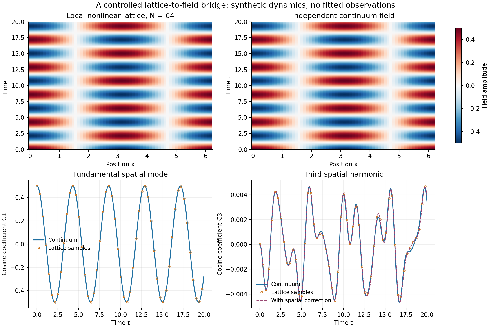

# 微观格点到连续场：首轮受控检验结果

## Material Passport

- Origin Skill / Mode：academic-research-suite / experiment-agent，run。
- Origin Date：2026-09-22；Version Label：micro_macro_v01。
- Verification Status：已执行并完成独立方程实现的数值对照；附一项未通过的额外精度诊断。
- 数据：固定参数的确定性合成轨迹，没有观测数据或拟合参数，没有统计显著性检验。

**主要结果：** 在指定平滑初值与$0\le t\le20$内，局部非线性Hamilton格点的集体运动趋近推导出的连续场方程。基础空间误差呈二阶；加入首个格距修正后呈接近四阶。时间积分误差单独呈二阶，避免将其与空间模型差异混淆。

## 1. 实际比较了什么

周期长度$L=2\pi$，$v=\omega_0=g=1$，$\phi(x,0)=0.5\cos x$，$\dot\phi(x,0)=0$。从最近邻耦合与四次势的Hamilton量得到

$$
\ddot q_j=\frac{q_{j+1}-2q_j+q_{j-1}}{a^2}-q_j-q_j^3.
$$

基础连续方程为$\phi_{tt}=\phi_{xx}-\phi-\phi^3$，首修正是在右端加入$a^2\phi_{xxxx}/12$。系数及初态始终相同，未对结果另拟合相位、频率或幅度。完整定义与限制见[协议](../protocol.md)及[独立推导](derivation_and_limits.md)。

主格点采用Störmer–Verlet；连续场采用独立编写的Fourier–Galerkin＋DOP853，另用DOP853独立求解各个原始格点。**下表的空间误差来自高精度格点ODE与连续场的比较**，避免让Verlet的二阶时间误差遮住四阶空间差异。

## 2. 从微观到连续场的收敛

主误差指标是在相同1001个输出时刻与相同空间采样点上，取场差的全局均方根并除以所比较连续场的全局均方根。对修正场使用修正场作分母；不是逐时计算相对误差再平均。机器结果见[比较JSON](../results/comparison_summary.json)和[空间CSV](../results/comparison_spatial.csv)。

| 格点数$N$ | 基础连续场相对误差 | 加首修正后相对误差 | 基础误差阶 | 修正后误差阶 |
| ---: | ---: | ---: | ---: | ---: |
| 64 | $3.13696\times10^{-3}$ | $1.76749\times10^{-6}$ | — | — |
| 128 | $7.84337\times10^{-4}$ | $1.09753\times10^{-7}$ | 1.99982 | 4.00936 |
| 256 | $1.96090\times10^{-4}$ | $6.84921\times10^{-9}$ | 1.99996 | 4.00219 |
| 512 | $4.90228\times10^{-5}$ | $4.27948\times10^{-10}$ | 1.99999 | 4.00043 |

格点数翻倍，相当于在固定区间内把格距减半：基础误差约除以4，修正后的误差约除以16。最粗$N=64$例子的基础误差约0.314%，加入由格点展开直接得到的修正后降至$1.77\times10^{-6}$，空间模型差异缩小约1775倍。它是已定义数学模型之间的吻合，不是对真实数据的拟合改善。

## 3. 非线性确实参与了这项检验

从单一$\cos x$初值出发，三次力项产生第三空间谐波$C_3(t)$；解析初期行为为$C_3=-t^2/64+O(t^4)$。连续参考在本时间窗的最大$|C_3|=0.00467102$，约为初始幅度0.5的**0.9342%**，这个比例是幅度比，不是能量或功率比例。线性$g=0$对照没有产生可分辨的第三谐波。

Verlet格点的第三谐波轨迹相对连续参考的全时误差从$N=64$的6.575%依次降至1.643%、0.4107%、0.1027%。它比主模态更容易看出格距影响，因此两张整体图相似本身不足以完成检验。

连续参考基本空间模态在本时间窗的平均过零角频率为1.46270859；$N=512$格点为1.46270424。这里按同向过零间隔读出频率，未拟合振荡模板，也未把有限窗口平均值称作无限时间的本征频率。

## 4. 时间误差与能量误差分别检查

固定$N=128$，与同格点高精度ODE参考比较：

| 时间步长 | 全时相对场误差 | 经验误差阶 | 采样最大相对能量偏离 |
| ---: | ---: | ---: | ---: |
| 0.01 | $1.45981\times10^{-4}$ | — | $5.24328\times10^{-5}$ |
| 0.005 | $3.64945\times10^{-5}$ | 2.00003 | $1.31082\times10^{-5}$ |
| 0.0025 | $9.12358\times10^{-6}$ | 2.00001 | $3.27704\times10^{-6}$ |
| 0.00125 | $2.28089\times10^{-6}$ | 2.00000 | $8.19261\times10^{-7}$ |

本轮精确连续时间Hamilton量恒定，而Verlet的原始能量有小幅数值振荡。时间步长减半后误差约除以4，符合二阶方法；不能从辛性推出精确守能。

空间组采用$\Delta t\sim a^2$，最粗$N=64$的Verlet时间误差仍有$2.33\times10^{-5}$，大于表中$1.77\times10^{-6}$的修正后空间误差。因此不能宣称这条Verlet轨迹本身已经获得四阶精度。空间表使用另一算法的准确格点参考，正是为了分开这两件事。

## 5. 有效范围与精度边界

**长波限制。** 修正PDE采用数值截止$K_{\rm num}=24$、97点无混叠三次项求积。保留模式的线性频率平方都为正，但最粗格点的$K_{\rm num}a=2.356$并不远小于1。这一截止用于容纳极弱尾谱，并不保证所有保留模式都满足长波精度。

本初值在最粗格点参考中，$|ka|>0.5$的二次谱范数占比不超过$1.78\times10^{-11}$；在修正场中不超过$1.80\times10^{-11}$。这里范数为$\sum_k[(1+k^2)|\hat\phi_k|^2+|\hat\pi_k|^2]$，排除了四次相互作用能，不应称为完整能量占比。有限时间内低频占有、谱截断收敛和格距收敛共同支持当前例子。

解析线性色散展示了失败范围：$N=64,k=24$时基础连续频率偏高约27.45%，首修正仍偏低约6.51%；在Nyquist模式$k=32$，误差分别约56.97%和−33.71%。这些是连续时间模型的解析频率差，不是图形噪声。因此不能把低频结果推广到接近格距的波长，更不能无限延伸有高频失稳的四阶截断PDE。

**参考解精度。** 连续参考从$K=16$提高到24，以及收紧积分容差，最大场RMS差均约$1.5\times10^{-12}$。独立最细格点的[额外精度审计](../results/reference_precision_audit.json)保留了一项未通过的诊断：收紧容差后，格点场最大RMS变化为$2.66\times10^{-12}$，占最细修正误差的1.092%，略超过所设1%门限。没有放宽门限，JSON仍保留`all_checks_passed=false`。

与此同时，主表中最细全时相对修正误差仅从$4.27948\times10^{-10}$变为$4.27981\times10^{-10}$，相对变化0.00781%；“接近四阶”的经验结论保持稳定。此处应区分“主要比较量稳定”与“全场参考误差严格低于目标差异的1%”，后者未通过。

## 6. 完成记录与结论范围

| 部分 | 核查情况 |
| --- | --- |
| 11个Verlet格点案例 | 86项实现与解析检查通过。 |
| 独立连续场、修正场与格点参考 | 22项参考检查通过。 |
| 空间／时间比较与非线性对照 | 20项比较诊断通过。 |
| 最细格点额外精度审计 | 4项通过、1项保守精度门限未通过，见上节。 |

线性Verlet轨迹还与其精确离散相位解析解比较，场的最大绝对差小于$3.1\times10^{-14}$。这些是方程与实现的检查数量，不能当作独立物理证据或统计样本数。

本轮已完成一个带非线性、辛演化、连续极限和有限格距修正的可复现实例。它补足原稿第4章中“如何从局部规则得到连续场”的一段具体计算，但没有由黎曼零点推导该Hamilton量，没有验证物理常数漂移，也没有完成统计热化、量子化或引力的推导。下一步可在同一个Hamilton体系中引入自主驱动场及反作用，再检验缓慢演化如何进入宏观系数。

本轮没有计算Lyapunov指数或证明混沌；观察到非线性谐波不能替代混沌判据。

全部运行命令、原始轨迹与文件说明见[实验入口](../README.md)。
