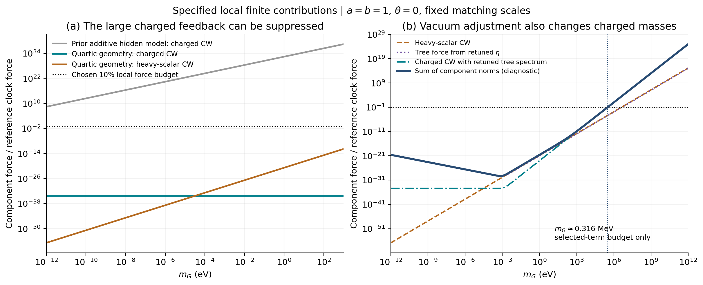
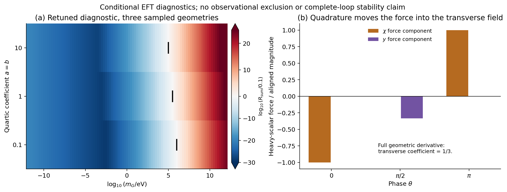

# 从 no-scale 抵消到稳定慢时钟：几何保护、模量圈图与真空调节

**这次找到了一条比简单加性隐藏部门更有希望的具体实现：四次 Kähler 几何能稳定新增模量，并在局部保留对危险带电分裂的抑制。** 将稳定模量自己的有限圈图、以及真空能调节带回的树力和带电谱一起计算后，仍有小反馈示例。但这个结果只支持指定匹配条件下的局部兼容性；完整量子保护、技术自然性和现实物质对应还没有建立。

## 1. 材料与本轮贡献

**Material Passport — 2026-09-25。** 用户授权深入下一阶段理论和数值研究。输入为 [移位型超引力实验](../../sugra_shift_v01/README.md) 的固定参数和1025个shift轴背景点；原 [隐藏传递实验](../../hidden_transfer_v01/README.md) 作为失败实现的对照。本轮无新观测、无拟合或统计显著性检验，86页正文保持原样。协议、代码、日志、来源、输入及输出哈希见 [材料清单](../materials_manifest.json)。

原来的物理动机继续保留：用 $\chi$ 控制 $M^2(\chi)\propto1+\xi/\chi^2$，并在相应动力学条件下联系 $\chi\sim\ln(t/t_*)$。本轮研究这一慢结构接入其他部门后能否存在。质量函数、超势及几何仍是明确的候选输入，未从黎曼动力学唯一导出，也未选择出平方指数或证明真实电磁常数变化。

本轮将已有 no-scale／几何稳定思想用于这个时钟模型，联合检查模量稳定、带电谱、两个时钟方向的量子力，以及真空调节的配套影响。四次几何及其稳定机制已有文献基础，不能称为本项目首先提出。[Ellis 等，2013，§4、式(63)](https://arxiv.org/pdf/1307.3537)，[Ellis 等，2019，式(2)及模量质量讨论](https://arxiv.org/html/1903.05267v2)

协议在解析探索之后、主扫描之前确定，主生产前补充了真空调节对照，不称盲态预注册。多个同模型家族代理进行了独立推导与代码实现；属于内部核验，没有外部同行评审。

## 2. 理想抵消成立，但稳定方式决定它能否保留

设 $Z=F_\chi(\chi+iy)/\sqrt2$、$P=M_p^2$，并取

$$
K=-3P\ln Y,\qquad
Y=T+\bar T-\frac{k+|Q_+|^2+|Q_-|^2}{3P},\qquad
k=-\frac12(Z-\bar Z)^2,
$$
$$
W=W_c+w(Z)+M(Z)Q_+Q_-,\quad W_T=0,\quad
W_c=m_GP e^{i\theta}.
$$

这里 $m_G$ 是常数超势参数，物理 $m_{3/2}=e^{K/(2P)}|W|/P$ 依赖背景。保留非零 $F^T$，完整势可精确化为

$$
V_F=Y^{-2}\left[|w_Z+M_ZQ_+Q_-|^2+
|M|^2(|Q_+|^2+|Q_-|^2)\right].
\tag{1}
$$

$W_c$ 从这个势中取消。实轴局部正则化后

$$
s=\frac{|M|^2}{t},\quad d=\frac{2U}{3Pt^2},\quad
B=\frac{\bar w_ZM_Z}{t},\qquad
m_\pm^2=s+d\pm|B|,\quad m_\psi^2=s,
\tag{2}
$$

其中 $t=T+\bar T$、$U=|w_Z|^2$。上一轮的 $m_G^2$ 共同软项和 $m_GM$ 分裂都没有自动出现；时钟自身的分裂依然存在。[独立完整推导](../../../reports/noscale_exact_20260925.md)

但自由模量的势为 $V=U/t^2$，没有有限t的静态极小。固定t要求时钟动能恰好满足 $K_\chi=2V$，存在特定辐射跟踪支；原来的晚期尘埃＋Λ轨迹一般不满足它。因此不能只把t设为1就宣布模型已稳定。

加入超势 $\kappa(T-1/2)^2/2$ 是另一个明确对照。它保留共同软项 $d=2V/(3P)$ 的改善，但重模量消去后 $W_T$ 保持有限，双线性项通常回到 $|B|\sim m_GM$。严格强稳定极限的正交相位仍有树级谷底，系数变成 $0.49985U$；有限κ又产生 $m_G^2/m_T$ 量级的相位泄漏。不能沿用上一轮的谷底系数，也不能把两个极限随意交换。[超势稳定的70项核查及适用域](../../../reports/noscale_stabilization_20260925.md)

| 构造 | 常数超势的大反馈 | 新模量稳定 | 本轮判断 |
|---|---|---|---|
| 理想 no-scale，$W_T=0$ | 势和危险分裂精确取消 | 无静态极小 | 提供抵消机制，尚不能固定模量 |
| 加二次稳定超势 | 共同软项改善，B通常恢复 | 局部可稳定 | 稳定本身不足以保护时钟 |
| 四次 Kähler 几何 | 中心保留抵消，位移修正可算 | 两个实模量方向均可稳定 | 进入下面的量子反馈检验 |

## 3. 主候选：在几何中稳定模量，保留完整超多重态

主模型取

$$
K=-3P\ln\Omega,
$$
$$
\Omega=T+\bar T+\eta(T+\bar T-1)^2
+a(T+\bar T-1)^4+b(T-\bar T)^4
-\frac{k+|Q_+|^2+|Q_-|^2}{3P},
\tag{3}
$$
$$
W=W_c+w(Z)+M(Z)Q_+Q_-,\quad
w=-\frac{F_\chi\sqrt{U_i}}{\sqrt2}
e^{-\sqrt2(Z-Z_i)/F_\chi},
$$
$$
M(Z)=m_\infty\sqrt{1+\frac{\xi}{(\sqrt2Z/F_\chi)^2}}.
$$

全纯质量分支局限在所用实轴附近。沿用 $F_\chi^2/P=10^{-4}$ 和初始质量100GeV。此处保留完整T超多重态，没有引入上一轮的nilpotent X，不能直接复用它的VA截止标志。

令 $t=1+\delta$、$v=2\operatorname{Im}T$，记

$$
g=1+\delta+\eta\delta^2+a\delta^4+bv^4,\quad
p=g_T=1+2\eta\delta+4a\delta^3-4ibv^3,
$$
$$
q=g_{T\bar T}=2\eta+12a\delta^2+12bv^2,\qquad
D=|p|^2-gq.
$$

在时钟实轴上，完整势及带电二阶谱为

$$
V_{\rm tree}=\frac{U}{g^2}+\frac{3q|W_c+w|^2}{Pg^2D},
\tag{4}
$$
$$
s=\frac{|M|^2}{g},\qquad d=\frac{2V_{\rm tree}}{3P},\qquad
B=\frac{\bar w_ZM_Z}{g}+\frac{qM\bar W}{PgD}.
\tag{5}
$$

正定度规要求所用局部支上 $g>0,D>0$。在 $\eta=0$、clock-off中心，四次项保留原先前三阶几何导数，却给出

$$
m_t^2=48a m_G^2,\qquad m_v^2=48b m_G^2.
\tag{6}
$$

$a,b>0$ 时两个模量方向都稳定。这里的中心条件只说明局部构造，不是整个作用量具备严格no-scale对称性。实际clock-on模量位置、度规及圈图还须分别核对。[四次几何的直接K/W核查](../../../reports/noscale_kahler_20260925.md)

为了避免再外挂一份Λ，先在clock-off真空一次选择小正η，使局部极小势等于原 $\rho_\Lambda=2.51814\times10^{-11}$ eV⁴。领先阶为

$$
\eta_{\rm tree}\simeq\frac{\rho_\Lambda}{6m_G^2P},\qquad
\delta_*\simeq\frac{\eta}{6a}
+\frac{UP}{36a|W_c+w|^2}.
\tag{7}
$$

η沿χ保持固定。这是明确的极小几何参数／真空能调节，尚无自然性解释。额外时钟方向y仍只有宇宙膨胀率量级的曲率；稳定T不能冒充把所有方向都变成重场。

## 4. 新模量也会产生圈图，必须检查两个时钟方向

重带电部门使用固定 $\mu_Q=100$ GeV 的有限核

$$
V_{1,Q}=\frac{F(s+d+|B|)+F(s+d-|B|)-2F(s)}{32\pi^2},\quad
F(x)=x^2[\ln(x/\mu_Q^2)-3/2].
\tag{8}
$$

生产程序保留d、B的两个方向导数，独立实现从原始超迹高精度复算。主方案在整段旧χ截面上的带电力比约 $3.73\times10^{-35}$；引入树级Λ的η后，它不必与完全无Λ的理想no-scale值相同。

同时新增两个重模量实标量的有限势分量

$$
V_{1,T}=\sum_{j=t,v}\frac{m_j^4}{64\pi^2}
\left[\ln\frac{m_j^2}{\mu_T^2}-\frac32\right].
\tag{9}
$$

主选择为 $\mu_T^2=48a m_G^2$，在对χ/y求导时固定。它是两个实标量的局部有限贡献，没有包括完整引力微子、ghost及全部超引力一圈有效作用量。在clock-off的理想no-scale中心，clock Weyl费米子质量为零，T费米子被引力微子吸收；clock-on时仍须保留宇宙尺度质量及混合，不能凭空添加一个 $m_G$ 阶clock费米子来抵消式(9)。

一个必须由完整几何核对的细节是：轴上 $m_j^2\simeq48a_j|W|^2/P^2$，但其y导数不能直接沿用这个轴上表达。正确的局部重质量主项涉及

$$
\mathcal X(\chi,y)=\frac{|S|^2}{9P^2},\qquad
S=3W_c+w_r(3+2iy)e^{-iy},\quad w_r=-F_\chi\sqrt U/\sqrt2,
$$
$$
m_j^2\simeq48a_j\mathcal X,
\quad \mathcal X_{,\chi}|_0=\frac{2\operatorname{Re}(\bar Ww_\chi)}{P^2},
\quad \mathcal X_{,y}|_0=-\frac{2m_Gw_r\sin\theta}{3P}.
\tag{10}
$$

横向系数是直接延拓 $|W|^2$ 所得结果的三分之一，已由完整势的混合三阶导数独立核对。相位 $\pi/2$ 只消掉χ的线性交叉，y方向仍有力。重质量近似省略 $U/P$ 级修正；正交相位的极小χ次阶分量可由这些修正主导，因此核验以完整二维力的量级为依据，不声称每个近零分量都有相同相对精度。

## 5. 深一层：用同一η调节圈图真空能会产生什么

只保持式(7)，再绘制式(9)，没有完成量子真空能的配套调节。因此另计算一次领先阶选择

$$
\eta_{\rm retuned}=
\frac{\rho_\Lambda-V_{1,T}(w=0)}{6m_G^2P}.
\tag{11}
$$

这个η仍沿χ固定，并同时代回树势、带电d/B及其导数。对于与 $\mathcal X$ 成正比的几何项，真空调节后其与模量圈图合并的斜率含

$$
\left[V_{1,T,\mathcal X}-\frac{V_{1,T}(\mathcal X_0)}{\mathcal X_0}\right]
\partial_A\mathcal X,
\qquad \mathcal X_0=m_G^2,
\tag{12}
$$

其中 $A=\chi,y$。所以“一次调好真空能”不会自动消掉全部场依赖反馈。

更关键的是，带电树谱中的共同软项仍为 $d=2V_{\rm tree}/(3P)$。调节后的树真空能可以与模量圈图相互抵消，但不能因此把式(5)的 $V_{\rm tree}$ 偷换成极小的 $V_{\rm total}$。这项重调后的树谱再送入带电圈图，会给出明显不同的预算。

式(11)是选定两个标量有限圈图的领先阶调节诊断。模量圈图对 $Q^\dagger Q$、$Q_+Q_-$、物质动能及规范项的配套修正尚未匹配；将环阶质量改变再代入另一圈势还涉及部分两圈阶内容。因此下面的“重调预算”不是完整一圈真空解，也不是完整两圈约束。完整常数反项及局部Wilson系数需要在同一重整化条件下处理，不能分别选择有利部分。

## 6. 数值结果：存在条件小反馈示例，仍有清楚的上升趋势

固定 $a=b=0.1,1,10$、三相位及97个 $m_G=10^{-12}$—$10^{12}$ eV对数点，得到873组主扫描，每组覆盖1025个旧χ点。另比较固定匹配能标倍数0.5、1、2及两种η方案，共5238组诊断；15375行代表曲线保留两方案。没有删除大反馈组。

以 $2U$ 为参考时钟树力，分别保存两个方向的向量和，以及

$$
R_{\rm sum}=\max_{\rm old\ grid}
\frac{\|\Delta\nabla V_{\rm tree}\|+\|\nabla V_{1,T}\|+\|\nabla V_{1,Q}\|}{2U}.
\tag{13}
$$

这避免用几个已算项的偶然抵消来定义窗口，但只上界本轮选出的贡献，不上界未知完整有效作用量。10%是内部小扰动标准，不是观测限值。

以下为 $a=b=1,\theta=0,\mu_T^2=48m_G^2$，并采用式(11)的结果：

| $m_G$ | 模量标量圈图力比 | 重调树谱的带电圈图力比 | $R_{\rm sum}$ |
|---:|---:|---:|---:|
| $10^{-6}$ eV | $1.47\times10^{-39}$ | $3.73\times10^{-35}$ | $2.53\times10^{-27}$ |
| 1 eV | $1.47\times10^{-21}$ | $9.99\times10^{-24}$ | $2.58\times10^{-21}$ |
| 100 keV | $1.47\times10^{-6}$ | $9.99\times10^{-4}$ | $1.00\times10^{-3}$ |
| 10 MeV | 1.47 | $9.99\times10^4$ | $9.99\times10^4$ |

1eV示例的模量质量约6.93eV，$\eta_{\rm retuned}\simeq3.08\times10^{-55}$，静态模量位移约 $5.13\times10^{-56}$。这个数值很小不等于η在UV理论中自然；它只是给定几何和有限边界下的局部一致性示例。

| $a=b=1$，相位0 | $R_{\rm sum}=0.1$ 对应参数 | 含义 |
|---|---:|---|
| 保持树级η，添加模量有限圈图 | 4.084 MeV | 没有配套调节圈图真空能 |
| η重调后重新计算树谱及已选圈图 | 0.3163 MeV | 含新的共同软项渠道，仍非完整高阶匹配 |
| 重调方案，匹配能标取主值0.5倍 | 0.6027 MeV | 固定有限方案敏感性诊断 |
| 重调方案，匹配能标取主值2倍 | 0.2685 MeV | 固定有限方案敏感性诊断 |

这些数字不能当作引力微子或任何现实粒子的质量上限。高能匹配系数若已确定，完整结果应适当处理重整化群及能标依赖；此处的变化揭示了尚未完成的匹配，不能挑一个最有利能标当作证据。

**图1。** 左图对比旧加性模型与新几何的选定局部贡献；旧曲线只画已有扫描覆盖范围。右图把η重调后的树力、模量标量圈图和带电圈图分别保存，深色线为其模之和。条件改善来自明确作用量，不来自观测拟合；完整引力／混合圈图尚未计入。

**图2。** 左图只含三个实际扫描的几何系数，颜色为 $\log_{10}(R_{\rm sum}/0.1)$，不是概率、置信度或实验排除区。右图显示特殊相位将主要模量圈图力转向y方向；完整几何使横向线性系数为1/3。

所有预定点的局部度规和带电谱为正，小分裂、模量绝热及几何尺度诊断通过。几何能标采用 $\Lambda_T=M_p/\sqrt{\max(a,b)}$ 的阶一约定，检查 $M_Q,m_T\ll\Lambda_T$。$a=b=0.1$ 时该算符标志高于普朗克质量；引力有效理论的使用标志应进一步取 $\min(M_p,\Lambda_T)$，这不会改变本轮任何通过结论，也不保证未知UV阈值没有更低。这些标志不是UV完成；正的局部势曲率也不等于完整多场解或全局吸引性。旧动能对准静态模量位移的修正已单列，未把静态谷底伪装成数值积分的宇宙轨迹。

## 7. 异常传递、阈值顺序与真正尚缺的保护

对统一物质度规 $Z_Q=e^{K/(3P)}$，理想no-scale点的完整补偿辅助量 $F_{\rm comp}=0$，不能仅用 $m_{3/2}$ 单项宣判异常传递很大。四次几何实际谷底上

$$
F_{\rm comp}=-\frac{q\bar W}{P\sqrt gD},
$$

一般不再严格为零。只有把超Weyl、Kähler和Konishi贡献按同一规范合并后，候选U(1)在重带电阈值以上的结果才可写成 $M_\lambda=2g_U^2F_{\rm comp}/(16\pi^2)$。重带电场全部积掉后IR系数改变，仍需超场阈值匹配；本轮没有据此预测现实光子超伙伴。[D’Eramo、Thaler与Thomas的no-scale取消条件及本轮代入](../../../reports/noscale_quantum_sources_20260925.md)

还有两个会影响下一步的实质问题。

第一，1eV示例的模量只有约6.9eV，而带电场是100GeV。应在含T的理论中先处理重带电阈值及混合图，再向低能处理T；也可以明确计算统一1PI常背景的二阶系数。不能将先完全积掉轻T的低能局部理论当作100GeV带电粒子的在壳匹配。

第二，四次几何只在一个中心保留no-scale导数关系，没有提供禁止量子生成二次／三次几何项和部门间接触项的精确对称性。已算有限IR项很小，不能保证未知UV Wilson系数也小。不同几何模型中环诱导接触项有明确例子，但其具体系数不能移植到本模型。[Luty与Okada，式(13)—(14)，及本轮技术自然性审计](../../../reports/noscale_quantum_sources_20260925.md)

目前支持的最强结论是：**存在一个明确的局部几何，使此前的大反馈在树级受到抑制，并在给定重整化边界和已算有限部门下保留小反馈示例。** 尚不能称为完整辐射稳定模型、现实常数预测或黎曼微观物理完成。

## 8. 核验与下一步

主生产66项检查、理想no-scale独立52项、超势稳定70项、四次几何35项及量子接口24项均通过；范围分别是实现、代数、局部谱和匹配条件，不是物理证据计数。[独立高精度数值报告](independent_results_cn.md)的最终汇总527/527通过。它不读取或调用主生产代码，另外完成108个完整K/W谷底在160/220位的重复、54点原始带电超迹在180/240位的重复，以及全部5238组摘要和54个预算根的重建。

完整势精确点与主结果按同组二维量级归一的最大差为 $1.33\times10^{-14}$，全扫描摘要最大相对差 $5.64\times10^{-15}$，预算根差 $2.82\times10^{-12}$。220位精确点自身540/540项通过，160位重复也通过；这些重复核查不应加总成物理样本数。高位精度用于处理极小位移和简并谱消减，不代表输入具有同等物理精度。

已记录的推导纠正包括一般辅助量的共轭／矩阵索引，以及不能从实轴质量直接外推的横向1/3系数；没有把这些早期错误隐藏成物理排除。独立数值还修正了高精度初始质量归一，并保留最初低阶CW展开523/526的未通过记录：在最低阶导数接近零的点，补足 $d^3,|B|^4$ 后达到原定严格精度，没有放宽门槛。一次审计启动语法错误及来源传输异常也已保留。主生产首次运行66/66通过。

下一阶段应完成一套**同阶、同方案的带电二阶项和规范匹配**：在明确阈值顺序下求时钟势、$Z_Q$、d、B及规范动能的完整配套项，区分已算非解析项与未知局部反项，再检查几何关系是否有对称性保护。只有这些条件站稳后，才值得生成新宇宙背景、重新计算 $\alpha_U(t)$ 并接入真实探针。继续增加同一种参数扫描不能替代这一步。
