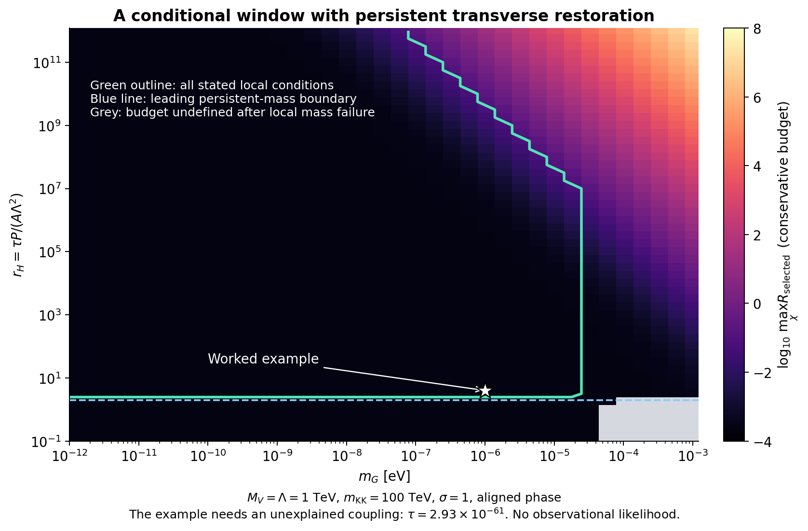
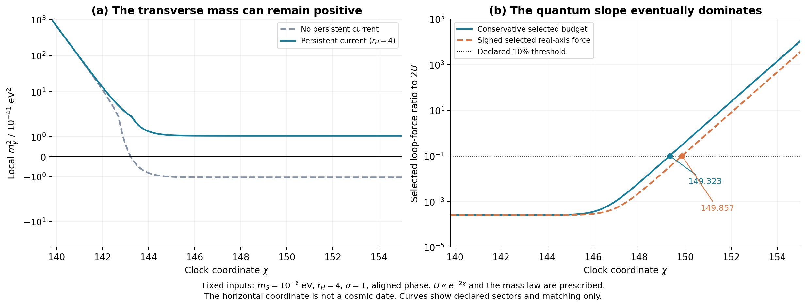

# 持续恢复力能否与慢时钟共存？

2026-09-26，`persistent_restoration_v01`。这是一个明确四维局部候选的理论计算，承接上一轮随时钟势消失的恢复机制；不含新增观测数据，也没有改写86页正文。实施假设和材料范围见[protocol](../protocol.md)。

**结果：可以构造出在时钟势关闭后仍有正横向质量的局部例子，已计算的带电圈修正也没有翻转它；但通过的例子需要尚无来源解释的极小耦合，持续的物质软项又留下最终会超过给定慢驱动的量子斜率。** 因此这是有条件的局部机制，不是完整、永久稳定的宇宙时钟。

## 1. 从前一步推进了什么

前轮共享流平方只提供 $12U/\Lambda^2$ 的正横向质量。由于规定的 $U\propto e^{-2\chi}$ 不断减小，这项最终无法抵消原来源给出的约 $-24Am_G^2$。本轮在同一流中加入原有模量的规范位移 $X_c$：

\[
\Delta B=-\frac{(k_c+\sigma S_c+\tau|X_c|^2)^2}{\Lambda^2}.
\]

$k_c$ 是时钟横向流，$S_c$ 是带电物质流。$X_c$ 是已有体模量的位移，不是另外假定可以放到隐蔽边界上的新场。此处提出的是一个明确的四维局部作用量，尚未证明来自完整五维模型。完整 $K,W$、一次参考归一化与所有交叉项都写在实施说明中。

这轮选用**在参考点冻结规范系数的径向延拓**。它与上一轮乘 $h_Z(t)$ 的延拓不同，导致一个 $O(AU)$ 横向软项导数在 $\tau=0$ 时相差因子2；我们重新推导并独立检查，没有把两种延拓混合使用。

## 2. 稳定作用和物质反馈必须一起保留

在参考轴上，新增流前三阶局部导数为零，轴势及轴上的辅助场值不变，但四阶几何改变质量。完整局部推导给出

\[
\Delta m_y^2=\frac{12U+4\tau|F_X|^2}{\Lambda^2},\qquad
\Delta d_Q=\frac{2\sigma(U+\tau|F_X|^2)}{\Lambda^2}.
\]

其中 $d_Q$ 是物质标量软质量平方，$F_X$ 是规范模量辅助场。于是持续部分满足

\[
\boxed{\Delta d_{Q,\mathrm{persist}}=
\frac{\sigma}{2}\,\Delta m_{y,\mathrm{persist}}^2.}
\]

这个关系是本轮的关键：正恢复力有一项相关的物质修正。除两个对角质量外，计算也包含模量新增质量以及模量与时钟的混合项；代表点的完整局部Hessian和大网格的声明近似Schur条件均已检查。参考轴上的局部正定不等于完整滚动轨迹或全局稳定。

令 $P=M_p^2$、$A=C_5m_{\rm KK}^2/P$，并定义

\[
r_H=\frac{\tau P}{A\Lambda^2},\quad
|F_X|^2\simeq3P|F_T|^2,\quad
D=6\sigma r_HA.
\]

则持续恢复力约为 $12r_HA|F_T|^2$，新物质软项为 $D|F_T|^2$。关闭 $U$ 后，主阶稳定界约为 $r_H>2$。旧有限五维项已经计入，其符号对应失稳方向，不能再当作新的正恢复力重复使用。

## 3. 一个通过声明条件的例子，及其代价

使用 $M_i=100$ GeV、$M_V=\Lambda=1$ TeV、$m_{\rm KK}=100$ TeV、$m_G=10^{-6}$ eV、$\sigma=1$、$r_H=4$。对应

\[
A=4.33597\times10^{-31},\qquad
\boxed{\tau=2.92515\times10^{-61}.}
\]

**极小的 $\tau$ 是输入，当前作用量、普通对称性和已引用来源均没有导出或保护这一数值。** 图中的参数范围只回答“给定这些参数时是否通过局部检查”，不回答“这些参数是否自然出现”。

| 检查量 | 代表结果 | 解释 |
|---|---:|---|
| 旧1025点区间最小 $m_y^2$ | $1.00042\times10^{-38}$ eV² | 参考轴主阶局部曲率为正 |
| $U=0$ 时 $m_y^2$ | $1.04063\times10^{-41}$ eV² | 恢复力没有随 $U$ 消失 |
| 所选反馈的保守预算最大值 | $2.53305\times10^{-4}$ | 约为树级力的 **0.0253%**，低于预设10%门限 |
| 完整所选带电圈的 $U=0$ 质量修正 | $-2.71556\times10^{-45}$ eV² | 为树级正曲率的约 $-0.0261\%$，未翻转符号 |
| 旧区间末端同一圈质量修正比例 | 约 $-0.0767\%$ | 仍小于树级正曲率 |
| 规范模量辅助场 / $M_V^2$ | $0.00422$ | 通过声明的0.1分离门限 |

保守预算在每个 $\chi$ 对所列来源、接触及谷底力取模求和后，再取区间最大值；不依赖相反符号的相消。实相位与正交相位代表点都通过。所选圈计算固定 $\mu=M_i$ 及已声明的有限匹配，尚不含全部重中介、超引力和未知有限局部项。

| 对照输入（$\sigma=1$，实相位） | $U=0$ 横向质量平方 | 所选有限区间反馈预算 | 判断 |
|---|---:|---:|---|
| $\tau=0$ | $-1.04\times10^{-41}$ eV² | 约 $2.53\times10^{-4}$ | 恢复不能持续 |
| $r_H=-4$ | $-3.12\times10^{-41}$ eV² | 约 $2.53\times10^{-4}$ | 负号对照失稳 |
| $r_H=4$ | $+1.04\times10^{-41}$ eV² | 约 $2.53\times10^{-4}$ | 通过所列局部条件 |
| $\tau=\Lambda^2/P\simeq1.69\times10^{-31}$ | $1.20\times10^{-11}$ eV² | $4.87\times10^{19}$ | 物质反馈严重超限 |
| $\tau=1$ | $7.12\times10^{19}$ eV² | $2.89\times10^{50}$ | 反馈严重超限，亦有层次问题 |

更大的耦合使正质量更容易得到，但不能据此判断整个机制更可行。过大的反馈是这个候选已经算出的真实限制。

图1：固定质量层次与 $\sigma=1$、实相位，对37个 $m_G$ 和53个 $r_H$ 网格扫描。颜色是所选保守反馈预算，绿线包围同时通过声明条件的网格，蓝虚线为主阶持续质量边界。星号是上述例子。两相位共3922配置，各有1300个通过；这些计数随网格选择而变，不是成功概率或观测证据。

## 4. 能持续的正质量，不等于能永久维持的慢变化

当前质量律仍是输入：

\[
M^2(\chi)=M_i^2\frac{1+\xi/\chi^2}{1+\xi/\chi_i^2},
\qquad U(\chi)\propto e^{-2\chi}.
\]

若净常数软项不为零，在本轮固定匹配下，所选Coleman–Weinberg实轴力的大 $\chi$ 尾部约为 $\chi^{-3}$；树级力 $2U$ 指数衰减。因此即使局部横向质量保持正值，量子力与原慢驱动之比最终仍会增大。这一问题在旧来源项中已经存在，本轮持续恢复机制没有消除它。

在 $r_H=4$ 的实相位例子中，保守预算于 $\chi\simeq149.323$ 达到10%；所选实轴有符号圈力于 $\chi\simeq149.857$ 达到10%。后一个值由未展开的所选带电Gaussian谱在160/220位精度下独立复算一致。正交相位的保守界约为149.268。**这些数值是固定公式的场坐标外推，不是宇宙年龄、实验日期或完整宇宙演化预言。**

图2：左图显示加入持续流后，横向质量可保持正值；右图显示同一例子的量子反馈仍会越过声明门限。未加持续流的局部曲率约在 $\chi=143.228$ 失效；反馈根只在正曲率域中寻找，零点极近邻不能分辨的先后保留为区间限制。初次未限制搜索域的结果留作诊断，没有充当最终结论。

## 5. 不把精细相消当作保护机制

$r_H=2,\sigma=1$ 同时抵消主阶负曲率和主阶常数软项。这是树参数对圈系数的选择，没有已知对称性强制。主计算的 $t\simeq1$ 表达式形式上给出 $c-D=-21A^2+\cdots$，但精确参考归一化下来源系数是 $12A-57A^2+\cdots$；因此该残项本身没有受控的二阶物理精度。

此外，该分支的形式有符号尾还没有包含已知基线软项 $2\rho/(3P)\simeq2.83\times10^{-66}$ eV²，它已大于约 $A^2m_G^2$ 的形式残项。数据表保留的该分支远期有符号根只能用于实现诊断，不能作为物理预测；未知匹配及其他场的圈项也未被取消。保守预算与 $r_H=4$ 的主要结论不依赖这个相消。令 $\sigma=0$ 也不会删除旧来源项。

## 6. 核验与下一步

主程序检查91项；[独立数值路径](independent_results_cn.md)使用160/220位精度并与主CSV分开比较；[完整局部几何](../../../reports/persistent_current_geometry_20260926.md)检查559项，[所选完整带电谱](../../../reports/persistent_charged_loop_20260926.md)检查377项，[来源及普通对称审计](../../../reports/persistent_current_sources_20260926.md)检查47项。[实现审阅](../../../reports/persistent_current_geometry_20260926_review.md)特别记录了精细相消分支的适用范围。最终计数、文件哈希、实际数值失败和更正均保留在本目录中；它们检验推导、代码一致性和归档，不是理论被自然界证实的次数。这些是AI辅助项目内部复核，不是外部同行评议。

下一步的实质任务是：**解释或保护所需的极小模量流耦合，并在具体重场谱中计算完整匹配，检查持续质量与净量子斜率能否同时受控。** 仅继续扩大同一参数网格不能解决这个问题。若具体机制做不到，就应保留有限适用区间或更换机制；目前没有证明所有可能构造都失败。

用户提出的 $1/\ln^2t$ 慢变化依然是模型基础设想。本轮没有从黎曼结构导出真实相互作用、这个指数或物理宇宙时间，也没有新增支持常数变化的观测证据。
