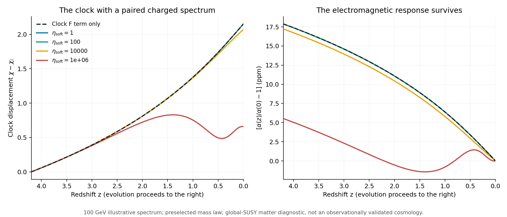
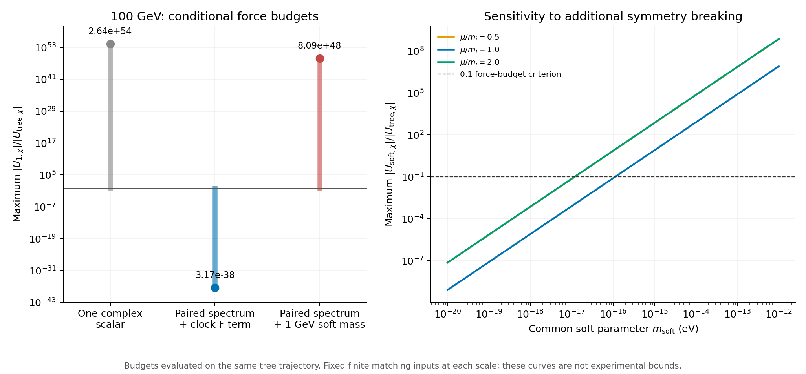

# 配对带电谱能否保护逆对数时钟？

2026-09-25。本轮已完成明确的物质模型、五条背景轨迹、270点高精度势核验及30点完整的一圈质量阈值复算。**在指定的全局超对称物质模型中，最大的m⁴势能反馈可以抵消，电磁阈值响应仍然存在；但保护能否延续到现实可见物质和引力，尚未解决。** 没有新增观测或参数拟合。

## 1. 新增假设与可推导结果

上一轮的单带电复标量把χ⁻²质量律传递给α，却产生过大的量子势。本轮新增中性手征场Z、电荷±1的Q±及完整U(1)矢量超场，取canonical Kähler度规与

$$
W=W_0(Z)+M(Z)Q_+Q_-,\quad Z=F_\chi(\chi+iy)/\sqrt2,
$$
$$
W_0=-\frac{F_\chi\sqrt{U_i}}{\sqrt2}
e^{-\sqrt2(Z-Z_i)/F_\chi},\qquad
M(Z)=m_\infty\sqrt{1+\frac{\xi}{(\sqrt2Z/F_\chi)^2}}.
\tag{1}
$$

沿正实分支y=Q±=0，树势U=Ui exp[−2(χ−χi)]，s=|M|²=m∞²(1+ξ/χ²)。平方根仅在无极点和支点的局域邻域定义；这是非多项式EFT输入，未给出紫外完成。超对称、带电谱及质量律不是黎曼零点数值同构的已证推论。本次选常χ动能完成，没有把上一轮常R动能改名后混用。

时钟的势使FZ=−W0,Z*非零，强制产生标量混合。另加共同正软质量平方d=msoft²后，粒子谱为

$$
m_\pm^2=s+d\pm h,\quad m_\psi^2=s,\quad
h=|F_ZM_Z|=\sqrt{U\mathcal Y},\quad
\mathcal Y=|M_Z|^2.
\tag{2}
$$

这里有两个复标量和一个Dirac费米子。h与d都是质量平方量纲，但h以相反符号进入两只标量，d同号进入；它们对残余势的作用不同。完整规范超多重态还包含光子的超伙伴，不能删掉后继续声称全理论受同样保护。[质量与超迹的作者资料：Martin，式7.3.5—7.3.6、7.7.8—7.7.11](https://arxiv.org/html/hep-ph/9709356v7)

## 2. 为什么能抵消势，却保留α变化

采用配套的一圈有限方案，固定μ，定义f(x)=x²[ln(x/μ²)−3/2]：

$$
U_1=\frac{f(s+d+h)+f(s+d-h)-2f(s)}{32\pi^2}.
\tag{3}
$$

d=h=0时势完全抵消。这个极限用于代数核验，不能与非零W0树势同时宣称未破缺超对称宇宙。实际保留h、仅令d=0时，

$$
U_1=\frac{h^2}{16\pi^2}\ln\frac{s}{\mu^2}
-\frac{h^4}{192\pi^2s^2}+\cdots
=\frac{U\mathcal Y}{16\pi^2}\ln\frac{s}{\mu^2}+\cdots.
\tag{4}
$$

剩余量由很小的质量—时钟耦合𝒴控制，原先独立的m⁴大项已经相消。共同软质量则恢复

$$
U_{\rm soft}=\frac{s d}{8\pi^2}\left(\ln\frac{s}{\mu^2}-1\right)+\cdots,
\qquad U_{{\rm soft},\chi}=\frac{d s_{,\chi}}{8\pi^2}\ln\frac{s}{\mu^2}+\cdots.
\tag{5}
$$

只扣初始真空能常数不会消去这个力。μ²=si时其主阶初始力恰好为零，因此所有预算检查整个红移区间。

规范极化的权重则同号相加：两复标量各1/3，Dirac费米子4/3，总b=2。所以

$$
\Delta(1/\alpha)=-\frac1{4\pi}\left[
\frac13\ln\frac{m_+^2}{m_{+,0}^2}
+\frac13\ln\frac{m_-^2}{m_{-,0}^2}
+\frac43\ln\frac{s}{s_0}\right].
\tag{6}
$$

固定同一case内的UV边界和探针条件时，简并主阶给

$$
\frac{\Delta\alpha}{\alpha_0}\simeq
\frac{\alpha_0\xi}{2\pi(1+\xi/\chi_0^2)}
(\chi^{-2}-\chi_0^{-2}).
\tag{7}
$$

系数比上一轮单复标量主阶大六倍，是新增粒子内容造成的；不是拟合改善，也不是额外的观测证据。平方指数仍由质量律输入，宇宙时间关系仍须积分背景。

同一匹配还给ΔK=−s[ln(s/μ²)−2]/(16π²)，所以度规G=1−𝒴 ln(s/μ²)/(16π²)。用U+U1及G计算背景，不能再加一次U/G的同阶势修正。有限项与辅助场关系核对了[Kuzenko–Tyler，式3.6及5.2a](https://arxiv.org/pdf/1407.5270v1)；更完整的归一、符号和来源见[理论审计](../../../reports/protected_threshold_theory_20260925.md)。这些保护机制本身属于已有量子场论，不能作为本项目新发现。

## 3. 预定的五条实际轨迹

沿用旧实验z=4.2初态、ε=Fχ²/Mpl²=10⁻⁴、同一流体和Λ，只研究常χ动能。固定mi=100 GeV、ξ=χi²、μ=mi，定义

$$
\eta_{\rm soft}=\frac{d m_i^2}{8\pi^2 F_\chi^2H_{\rm ref}^2}.
$$

全部case含时钟F项；只扣U1(χi)常数，不调整斜率/曲率或Λ。按[预定协议](../protocol.md)计算ηsoft=0、1、100、10⁴、10⁶：

| ηsoft | msoft（eV） | Δχ | α(4.2)/α(0)−1（ppm） | 是否反转 |
|---:|---:|---:|---:|---|
| 0 | 0 | 2.15204 | 17.87873 | 否 |
| 1 | 3.11×10⁻¹⁸ | 2.15203 | 17.87866 | 否 |
| 100 | 3.11×10⁻¹⁷ | 2.15122 | 17.87203 | 否 |
| 10⁴ | 3.11×10⁻¹⁶ | 2.07171 | 17.22133 | 否 |
| 10⁶ | 3.11×10⁻¹⁵ | 0.65829 | 5.52814 | 是 |

msoft是额外共同质量平方项的平方根，不是两个重粒子的直接质量差。100 GeV例满足低探针动量这一必要条件，但本轮没有检查粒子实验、丰度、衰变或真实光谱/原子钟约束；表中18 ppm级读数不能称为获数据支持的预测。

**图1。** 仅有时钟F破缺及很小共同soft项时，慢轨迹保留；预定的最大soft项使时钟反转。曲线是模型输出，图中没有观测点。按各case今天α₀归一，不代表各case数值UV边界完全相同。

ηsoft=0时，计算的平直重场F项力/树力最大3.17×10⁻³⁸，|ΔK|最大4.02×10⁻³⁸。这些修正远低于双精度ODE的可分辨轨迹差异，所以轨迹在数值上与树级重合；微小残余本身由独立高精度supertrace核验，不能说ODE测出了10⁻³⁸级轨迹偏移。

该例χ⁻²与ln⁻²(t/t*)的端点归一形状差异约2.00%，来自原来的宇宙动力学。五例阈值的一阶χ⁻²近似相对完整阈值的峰值误差均小于0.78%。ηsoft=10⁶发生反转，因而不能把质量律仍成立理解成宇宙时间律必然单调。

## 4. 保护的代价可以定量表达

在同一树级轨迹上，以max|U1,χ|/|Utree,χ|≤0.1作为预选的慢时钟诊断，得到：

| mi | μ=mi时共同msoft尺度上限 |
|---|---:|
| 1 eV | 1.11×10⁻⁵ eV |
| 1 MeV | 1.11×10⁻¹¹ eV |
| 100 GeV | 1.11×10⁻¹⁶ eV |

这是指定质量律、背景和有限匹配条件下的理论预算，**不是实验上限**。改变μ/mi为1/2或2，同时保持其余有限输入不变，100 GeV预算约为1.17×10⁻¹⁷ eV；这是不同匹配选择的敏感性诊断，不是声称物理结果应随任意RG能标改变。真正RG改进须同时运行匹配参数。

同样的100 GeV质量例，若额外取msoft=1 GeV，量子力/树力预算约8.09×10⁴⁸，保护并不会自动延续。这只作势/力预算，没有硬套旧初态求其宇宙轨迹。

**图2。** 左图比较同一树轨迹、同一初始质量下不同粒子谱的平直一圈力预算；其电磁系数不同，不是相同观测模型的优劣比较。右图展示共同soft项的允许理论预算及有限匹配选择敏感性，不是实验排除图。

## 5. 仍然缺少哪些物理连接

**可见区破缺传递。** 完整保护需要规范超伙伴和相容的相互作用。真实可见区如果产生额外soft项，电磁耦合可以把破缺传过来。把d设为零只是本次受控条件，没有构造出实际隔离机制，也没有计算所有高阶圈图。上述很小的预算正是后续机制必须解释的对象。

**横向自由度。** ImZ方向树级平坦；y=0是对称不变轨道，尚未证明稳定。计入一圈度规后，d=0、μ=mi的齐次横向坐标扰动质量系数/H²最低约−6.62×10⁻⁴⁰。负号与极小尺度都应保留；本次没有演化其放大率，也没有计算全部有限波数及引力扰动。更一般的soft分支横向稳定未完成。

**引力完成。** 直接将同一canonical K和W0放入最小超引力，沿实轴会得到

$$
\frac{V_{\rm SUGRA}}U=e^{\varepsilon\chi^2/2}
\left[(1-\varepsilon\chi/2)^2-3\varepsilon/2\right].
\tag{8}
$$

本次参考区间该比值约2.54—2.62，不能忽略。因此当前是全局超对称物质匹配加现象学Einstein背景的诊断，并非已经闭合的超引力宇宙。另一种Kähler几何可能改善此处，但需要与超势一起明确构造和重算。

**曲时空与热环境。** H/m很小支持局部平直重场计算，但m⁴项相消后，未算的曲率阈值项仍可能大于极小的F项残余，不能将3.17×10⁻³⁸叫作全部量子反馈。实际热占据、真实带电物质源、第五力和当地场响应也尚未加入。原逆对数平方假设继续保留，未从黎曼结构导出真实相互作用。

## 6. 核验、文件和下一步

- 主背景39/39项检查通过：收紧容差、积分能量及旧树级复现；五例都到今天，最大能量残差约1.59×10⁻¹⁴。
- 独立程序用320位和400位算术直接相减完整supertrace，270点对稳定展开的最大相对差1.56×10⁻¹²；完整质量阈值另复算新轨迹30点，最大相对差3.35×10⁻¹³。高精度用于处理大数相消，不表示物理输入具有如此精度，也不是独立背景ODE解。[独立报告](independent_precision_cn.md)
- 理论审计20/20符号恒等式通过，来源/输入/实现哈希均归档。只修正理论草稿中的公式笔误，不以修参数方式改变不利轨迹。全部预定生产case成功，没有因反转而删除或重选。
- 物质模型、阈值机制及超对称保护属于条件构造；内部AI协助和协作代理核验不是外部同行评审。正式86页正文未修改。

本轮可以新增的论文命题是：**指定配对谱能在一圈层面压低原先的m⁴障碍，并保留逆对数质量项的电磁响应；其物理可行性取决于破缺传递与多场/引力完成。** 下一步优先明确一种Kähler—超势引力完成，检验实部轨迹和虚部稳定，再单独核算可见区传来的soft下限与本轮上限是否兼容。不能把新曲线更平滑写成已有观测更支持模型。
