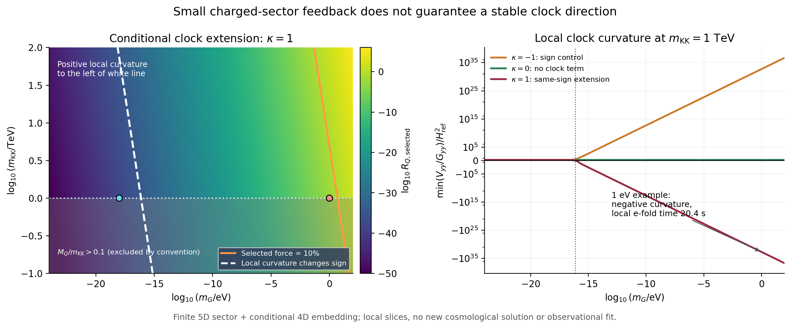

# 空间隔离能保护慢时钟吗：有限阈值、相关系数与横向曲率

2026-09-25。承接 [未知系数匹配](../../eft_matching_v01/reports/results_cn.md)。本轮找到一个可以从明确有限引力部门计算小系数的候选，同时发现新的限制：**让带电阈值反馈小，并不足以保持时钟的横向稳定。** 在一个声明清楚的时钟耦合扩展下，同一修正给横向负曲率；原1 eV示例未通过该检验，但低得多的隐藏质量分支仍有条件窗口。

这不是新增观测支持或完整UV完成。数值检验针对四维局部有效作用量：导入五维规范边界模型的已知有限圈系数，再把它有条件地接入本项目的移位时钟和四次稳定几何。κ=1的时钟耦合、额外稳定部门及未定局部算符都需要继续解释。

## 1. 先检验已有对称是否足够

独立[对称性核查](../../../reports/protection_symmetry_20260925.md)显示，普通相位、R荷、CP及中心反射都不能禁止

\[
\ell_Q=c|T-1/2|^2.
\]

范数平方接触是中性的；其混合曲率也不能经物质场全纯重定义移除。理想no-scale几何有更大的等距变换，但现有四次稳定项、带电质量超势和普通规范耦合已经破坏了相关生成元。核查直接比较了变换前后的Kähler度规，避免把仅仅改变Kähler表示误当作物理破缺。原始几何文献也明确将完整陪集对称限定于相应稳定项为零的部分，见 [Ellis等，1903.05267v2，注[19]](https://arxiv.org/html/1903.05267v2)。

因此，现有作用量没有已展示的精确选择规则保证c=0。但允许某算符不意味着其系数已知或必然很大。下一步必须计算具体传递机制；这正是本轮转向有限额外维度阈值的原因。

## 2. 一个可计算的小系数来源

Rattazzi、Scrucca与Strumia研究五维引力在两个边界之间的有限传递。对其最小规范边界设定，将式(2.8)与(6.3)的约定转换为本项目记号，得到

\[
P=M_p^2=M_5^3L_0/2,\quad L_0=2\pi R,\quad m_{\rm KK}=1/R,
\]
\[
\boxed{A=C_5\frac{m_{\rm KK}^2}{P}>0,
\qquad C_5=\frac{\zeta(3)}{48\pi^4}=2.57089476\times10^{-4}.}
\]

规范带电边界场接收到的有限部门同时包括

\[
\Delta g=-A/t^2,\qquad h_Q=1+A/t^3,
\quad t=T+\bar T.
\]

不能只取径向几何修正而删除物质度规修正。这里的有限项来自该文所算五维引力多重态及其抵消，不是人为挑一个标量或gravitino圈。原始来源为 [RSS，hep-th/0305184](https://arxiv.org/html/hep-th/0305184)；长度、Planck归一化、原文约定差异与实际读取范围见 [来源核查](../../../reports/protection_5d_20260925.md)。

对规范化物质，额外度规为 $\ell_Q=\ln h_Q$。在t=1附近，

\[
c_Q=\partial_t^2\ln h_Q
=\frac{12A+3A^2}{(1+A)^2}\simeq12A,
\qquad
\beta_Q=2\partial_t\ln h_Q=-\frac{6A}{1+A}\simeq-6A.
\]

所以此前两个独立匹配系数在这一有限部门中已有相关来源。若 $m_{\rm KK}=1$ TeV，则

\[
A=4.33597\times10^{-35},\quad
c_Q=5.20317\times10^{-34},\quad
\beta_Q=-2.60158\times10^{-34}.
\]

这些数值说明，小系数可以来自质量层次和引力抑制。它们不保证其他局部系数同样小；尤其此前有限势系数ν尚未被完整两环匹配固定。

## 3. 几何重调与物质修正必须分开

本轮的局部候选为

\[
\Omega=g(t,v)-\frac{h_Z(t)k(Z,\bar Z)+h_Q(t)(|Q_+|^2+|Q_-|^2)}{3P},
\]
\[
g=t+\eta(t-1)^2+(t-1)^4+v^4-A/t^2,
\quad h_Z=1+\kappa A/t^3,
\quad k=-\tfrac12(Z-\bar Z)^2,
\]
\[
W=W_c+w(Z)+M(Z)Q_+Q_-,\qquad W_T=0.
\]

κ=1是假设时钟接收同号度规修正；κ=0和−1分别为无此修正及反号控制。**来源对规范边界场的计算，不能直接证明我们的移位型k必须采用κ=1；−1同样不是其最小模型的预测。** 此处用三种明确输入检查机制后果。

若只有统一g修正而物质继续满足原no-scale关系，零真空能下，一个固定η和真空位置的自行移动可满足 $g''=g'''=0$。例如本轮负幂项给

\[
\delta t^5=-A,\quad
\eta=-6\delta^2+3A/t^4,\qquad \delta=t-1.
\]

这说明径向有限修正不必直接等同于危险的物质c。它可通过一次真空条件及径向位移在局部重新满足取消关系；不需要逐χ调节η，也没有解决宇宙学常数自然性问题。

有限正ρ下，令 $p=g',q=g''$，驻点条件改为

\[
q=\frac{r_\rho p^2}{g(1+r_\rho)},\qquad
q'=2pq/g-q^2/p,\qquad r_\rho=\frac{\rho}{3Pm_G^2}.
\]

本次mG定义为clock-off参考驻点的物理gravitino质量；W、Fχ和带电质量均在这个点重新规范化。完整推导及有限ρ高精度核查见 [独立几何报告](../../../reports/protection_power_correction_20260925.md)。源模型的物质hQ仍然存在，不能用对g的重调把它删除。

## 4. 新限制来自时钟横向，而非带电重粒子

在q=0、关闭时钟超势的参考点，直接对完整 $(T,Z)$ Kähler矩阵求逆和求导，得到正则横向曲率

\[
\boxed{m_y^2=2m_G^2(g/p)^2
\left[2(h_Z'/h_Z)^2-h_Z''/h_Z\right].}
\]

因此在小A下，

\[
\Delta m_y^2=-24\kappa A m_G^2
\simeq-2\kappa c_Qm_G^2.
\]

这是本轮最有辨识力的相关关系：**同一个有限阈值同时控制物质接触与时钟横向曲率。** 对重带电粒子极小的修正，仍可能远大于原本只有Hubble量级的时钟恢复力。

加入小正ρ和时钟势U，最直观的首阶式是

\[
m_y^2\simeq\frac{4(U+\rho)}{3P}-24\kappa A m_G^2.
\]

最终扫描还保留有限ρ与w的交叉项，避免最低mG处的 $1/\epsilon$ 增强误差；公式在[实施说明](../protocol.md)。剩余的Aρ、A²及径向位移修正由完整K/W选点比较。正交相位另有新增中心横向力

\[
(\Delta V)_y\simeq-6\sqrt2\,\kappa A F_\chi\sqrt U\,m_G\sin\theta.
\]

选择实相位可以取消这个线性项，不能消除负曲率。开时钟时此处并非已解的全场量子谷底，$V_{yy}/G_{yy}$只是指定局部切片曲率。正曲率不等于滚动宇宙背景稳定或强吸引子；完整协变Hessian、速度诱导项及低能模量圈仍待计算。若负曲率比H²大很多，则已足以暴露该局部实现的严重问题。

## 5. 两个代表例与条件范围

取 $m_{\rm KK}=1$ TeV、带电初始质量100 GeV、κ=1、实相位，并在所选两环部门固定ν0=0：

| 指标 | $m_G=1$ eV | $m_G=10^{-18}$ eV |
|---|---:|---:|
| 已选带电力 / $2U$，全旧χ区间最大 | $4.22335\times10^{-3}$（0.422%） | $4.22335\times10^{-39}$ |
| 最小 $V_{yy}/G_{yy}$ | $-1.04063\times10^{-33}$ eV² | $+5.66180\times10^{-66}$ eV² |
| 最小曲率 / $H_{\rm ref}^2$ | $-5.03440\times10^{32}$ | $+2.73908$ |
| $M_Q/m_{\rm KK}$ | 0.1 | 0.1 |
| 所列必要条件的交集 | 未通过：横向负曲率 | 通过；仍非完整模型验证 |

1 eV示例的负曲率给出局部无阻尼线性增长时间约 **20.4秒**。它比Hubble时间短很多，冻结Href后加膨胀阻尼也不改变显示精度。这里描述的是该条件场模型中小扰动的增长，不是观测到的宇宙过程。靠近Hubble量级临界曲率时，$\hbar/\sqrt{|m_y^2|}$不能冒充实际宇宙增长时间；输出另给冻结Href的线性方程对照，仍未求真实背景。

低质量示例只说明当前必要条件存在交集。它的正曲率仍为H尺度，尚未显示强恢复、吸引轨迹或现实粒子谱的兼容性。

在本轮主阶关系下，单独的带电力10%条件约为

\[
m_Gm_{\rm KK}\lesssim4.86599\times10^{12}\ {\rm eV}^2.
\]

κ=1的局部正曲率条件严格得多：

\[
\boxed{m_Gm_{\rm KK}\lesssim7.37681\times10^{-5}\ {\rm eV}^2.}
\]

后一数值含旧坐标区间的最小U；只取ρ主导标志为 $7.37669\times10^{-5}$ eV²。故在1 TeV例中需 $m_G\lesssim7.38\times10^{-17}$ eV，才通过这项局部曲率检验。这是指定耦合扩展下的条件边界，不是观测粒子质量上限。

图1：左图为κ=1、ν0=0时选定带电反馈的热力图，橙线为10%预算，白虚线为主阶局部曲率变号标志；灰色区未满足所定 $M_Q/m_{\rm KK}\le0.1$ 层次门限。蓝、红点分别为上述低质量和1 eV示例。右图比较三种时钟耦合输入，横向曲率用有符号对数轴显示。正曲率区仍不是完整观测允许区。

## 6. 这一窗口还有哪些匹配条件

**有限反项仍然重要。** 将相同c的有限边界改为ν0=−c，1 eV／1 TeV的所选带电力预算变为约0.270，即27.0%。这是改变匹配输入；同一模型仅换重整化尺度时，必须按上一轮的RG关系同步运行反项。因此0.422%不能被写成已经完成全部物理预测。低质量例在这两个固定边界下都很小，但任意未知函数仍不受本次检验控制。

**环阶分别记录。** A由一个有限引力圈产生，其c插入带电CW是原理论的两环子集；β²插入则通常为三环。β与已有树B的干涉、以及hZ改变B横向导数产生的干涉也单列计算，它们在代表例很小，不能据此省略所有其他同阶图。完整两环势、全部局部反项及低能模量圈未完成。

**五维嵌入尚有实质缺口。** 最小平直五维的扰动graviphoton移位结构不直接允许我们使用的 $v^4$ 稳定项。局域 $M(Z)Q_+Q_-$又要求时钟和物质同边界，或者另加明确的体中介；同边界时钟—物质接触不会自动被空间隔离禁止。RSS对一般边界函数的扩展也不能替代本项目移位时钟的边界作用量推导。故这里获得的是有限系数来源和可检验的条件后果，而非现成UV完成。

物理质量层次在扫描中单独检查：$M_Q,m_T,m_G\le0.1m_{\rm KK}$，$m_{\rm KK}\le0.1M_5$。等质量100 GeV／100 GeV点不通过门限。对1 TeV例，$M_5\simeq1.236\times10^{22}$ eV，$m_{\rm KK}/M_5\simeq8.09\times10^{-11}$。这些是计算适用域约定，不替代现实额外维度或超对称搜索约束。

固定全纯规范边界及正确阈值匹配后，参考点的常数质量归一化不改变 $\ln[M(\chi)/M(\chi_0)]$ 的形状。因此指定的质量响应仍可传给最小U(1)读数；实际χ(t)、现实α与原子跃迁还未确定。平方指数继续来自输入的质量函数，不是由五维隔离或本轮稳定性计算选出来的。

## 7. 核验与研究下一步

主扫描覆盖105个mG、61个mKK和三个κ，共19215个局部配置；另保存144个质量、相位与κ代表例。主实现177项检查通过。每个χ预算仍使用旧1025个坐标，没有重新求宇宙背景。扫描数量不代表观测样本或独立物理证据。

独立[高精度报告](independent_results_cn.md)直接使用完整K/W与Kähler逆矩阵，分别核对真空、物理归一化、有限时钟曲率、响应核及输出分类。72个完整K/W点采用140位与220位精度，153项推导检查通过；对19359个主输出配置和条件边界的22项比较全部通过，最大归一化差异为1.63×10⁻¹⁴，分类差异为零。专题材料另含[44项对称检查](../../../reports/protection_symmetry_20260925_checks.json)、[30项五维系数与约定检查](../../../reports/protection_5d_20260925_checks.json)、[404项几何／辅助场检查](../../../reports/protection_power_correction_20260925_checks.json)，以及[24项额外B导数检查](../../../reports/protection_power_correction_20260925_review.json)。这些检查互有重叠，不能累加成理论成立的置信度。

首次仅保留 $4(U+\rho)/(3P)$ 的主摘要、独立真空求根精度问题及比较器的近似失配均保留在结果和日志中，未放宽阈值或删除不利物理结果。最终材料与哈希见 [materials_manifest.json](../materials_manifest.json)。本轮由AI辅助推导和项目内不同代码路径复核，没有外部同行评议。

下一步应从明确的边界作用量确定时钟hZ及局域时钟—物质接触，再检验实际允许的稳定部门。可以比较来源中具有边界引力动能的具体扩展，但必须重新算其相关系数与谱；κ=−1控制不能直接充当该机制已经实现的证据。对低质量分支，也应先补匹配与背景稳定检查，再决定是否进入新的多场宇宙积分。

本轮没有从黎曼结构导出真实物理相互作用，也没有推导唯一的 $1/\ln^2t$。它把保护假设推进为一组有来源、有相关关系、且能被稳定性检验否定或保留的具体条件。
