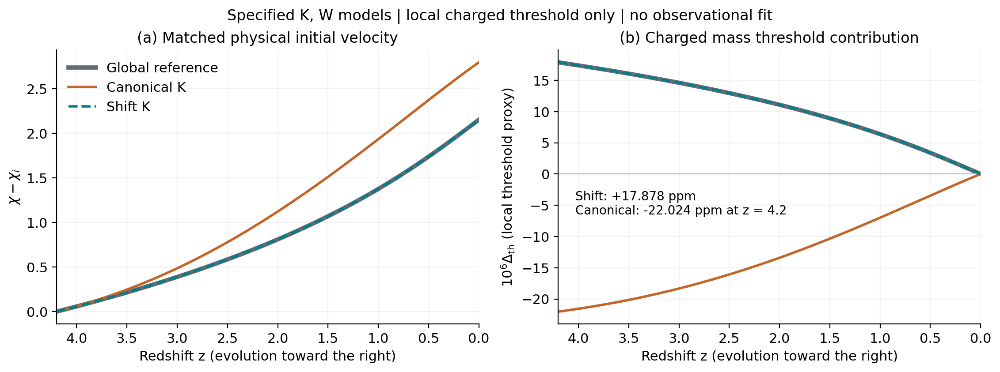
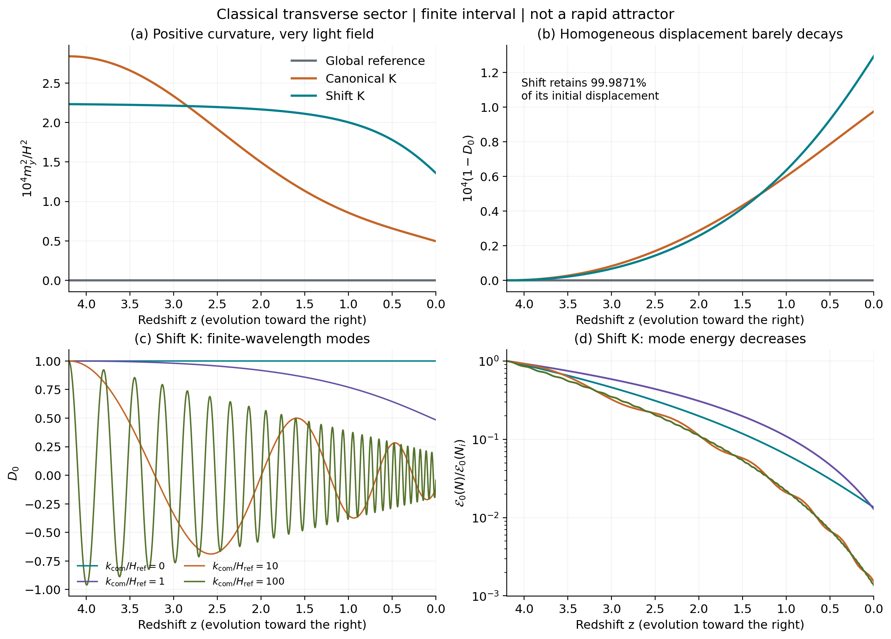

# 引力完成、横向扰动与物理质量阈值：条件数值结果

日期：2026-09-25。本轮接续[配对带电谱实验](../../protected_threshold_v01/README.md)，完成一个指定 Kähler 势与超势的引力部门检验。**移位型候选保留了慢时钟背景，横向树级质量为正；但横向初始偏移几乎不衰减，尚未得到快速吸引子。物理粒子质量的引力修正还会改变另一候选的局部电磁质量阈值贡献方向。** 这是固定模型的推导和数值结果，没有新增观测、调参拟合或实验发现。完整超引力电磁耦合的同圈阶匹配尚未完成。

本轮把9条双场背景、12组横向线性模及带电阈值完整存档；正式86页正文保持原样。复算入口见[README](../README.md)，完整推导见[理论核查](../../../reports/sugra_shift_theory_20260925.md)。

## 1. 模型选择与逆对数设想的关系

采用自然单位与约化普朗克质量 $M_p$。中性复场及超势为

$$
Z=\frac{F_\chi}{\sqrt2}(\chi+iy),\qquad
W=W_0(Z)+M(Z)Q_+Q_-,
$$
$$
W_0=-\frac{F_\chi\sqrt{U_i}}{\sqrt2}
e^{-\sqrt2(Z-Z_i)/F_\chi},\qquad
M(Z)=m_\infty\sqrt{1+\frac{\xi}{(\sqrt2Z/F_\chi)^2}}.
$$

这里 $Z_i=F_\chi\chi_i/\sqrt2$，$U_i$ 为有量纲势能密度。全纯平方根在正实轴邻域的指定分支上使用。$Q_\pm$ 是单位相反电荷的一对手征场，规范部门的树级耦合取常数；背景 $Q_\pm=0$。本轮计算常 $\chi$ 动能分支，不能直接套用到此前常 $R$ 动能候选。

比较三个固定模型：全局参考 $V=U(\chi)=U_i e^{-2(\chi-\chi_i)}$；标准型 $K_{\rm can}=|Z|^2+|Q_+|^2+|Q_-|^2$；移位型 $K_{\rm sh}=-(Z-\bar Z)^2/2+|Q_+|^2+|Q_-|^2$。两种 $K$ 的动能度规都为1，场空间仍平直。**保持同一 $W$ 而改变 $K$ 是改变物理模型**；真正的 Kähler 规范变换还要同步变换 $W$。这里的超势破坏实方向移位对称性，因此不能称全作用量具有精确移位保护。

标准超引力公式是

$$
V_F=e^{K/M_p^2}\left(K^{i\bar j}D_iW D_{\bar j}\bar W-
\frac{3|W|^2}{M_p^2}\right),\qquad D_iW=W_i+K_iW/M_p^2.
$$

定义与约定采用 [Martin 的超对称综述第7.6节](https://arxiv.org/html/hep-ph/9709356v7)。移位型 $K$ 构造有既有研究背景，例如 [Chiang 与 Murayama 的超引力 quintessence 模型](https://arxiv.org/html/1808.02279v1)；本轮没有引入该文的隐藏区，也没有借用其具体稳定性或自然性结论。

**与核心 idea 的联系是条件性的。** 全局指数势在单流体标度极限可产生 $\chi\simeq\ln(t/t_*)$，而指定质量律含 $\chi^{-2}$。但晚期Λ背景下实际轨迹不严格等于该对数律，且电磁阈值依赖 $\ln M^2$。只有再满足适当小响应展开时，$\alpha$ 的主阶响应才可约化为逆对数平方。例如移位型质量对数差是 $\ln(1+X)$，其中 $X=\xi(\chi^{-2}-\chi_0^{-2})/(1+\xi/\chi_0^2)$；$|X|\ll1$ 时可取主阶 $X$，并不要求 $\xi/\chi^2$ 本身很小。此次取 $\xi=\chi_i^2$，图中保留完整阈值，不能标成已经严格导出的纯 $1/\ln^2t$ 定律。质量律、超势、引力完成仍是受研究动机启发的 EFT 输入，尚未从真实黎曼结构导出。

## 2. 引力势与固定的背景试验

记 $\varepsilon=F_\chi^2/M_p^2$，直接计算得到

$$
V_{\rm sh}=Ue^{\varepsilon y^2}
\left(1-\frac32\varepsilon+\varepsilon^2y^2\right),
$$
$$
V_{\rm can}=Ue^{\varepsilon(\chi^2+y^2)/2}
\left[\left(1-\frac{\varepsilon\chi}{2}\right)^2
+\frac{\varepsilon^2y^2}{4}-\frac32\varepsilon\right].
$$

移位型沿 $y=0$ 仅把 $U$ 乘以 $1-3\varepsilon/2$；本轮为0.99985。横向正则质量为

$$
m_{y,\rm sh}^2=\frac{2U}{M_p^2}(1-\varepsilon/2),\qquad
m_{y,\rm can}^2=\frac{Ue^{\varepsilon\chi^2/2}}{M_p^2}
\left[(1-\varepsilon\chi/2)^2-\varepsilon\right].
$$

背景使用标准 Einstein–FLRW 方程、无直接耦合的辐射与尘埃，以及外部Λ：

$$
3M_p^2H^2=\rho_r+\rho_m+\rho_\Lambda+
\frac{F_\chi^2}{2}(\dot\chi^2+\dot y^2)+V,
\qquad
F_\chi^2(\ddot\phi+3H\dot\phi)+V_{,\phi}=0,
\quad \phi\in\{\chi,y\}.
$$

积分区间为 $z=4.2\to0$。匹配相同的 $\chi_i$、物理初速 $\dot\chi_i$、初始年龄、流体系数与Λ，改变势后按各自初始 $H$ 转换 $d\chi/dN$，而不是强行固定后者。三个模型分别使用 $y_i=0,10^{-3},0.1$，均取 $\dot y_i=0$。冻结数值与停止条件见[协议](../protocol.md)。主要输入为：

| 输入 | 固定值或含义 |
|---|---|
| $\varepsilon$ | $10^{-4}$ |
| $M_p$ | $2.435\times10^{27}$ eV |
| $H_{\rm ref}$ | 67.4 km s$^{-1}$ Mpc$^{-1}$，固定的单位标尺 |
| $\chi_i$，$\dot\chi_i/H_{\rm ref}$ | 137.6422999547，9.99492244787 |
| $t_i$ | 1.4463276481 Gyr，匹配的初始切片 |
| $\Omega_m^{\rm ref},\Omega_r^{\rm ref},\Omega_\Lambda^{\rm ref}$ | 0.315，$9.2\times10^{-5}$，0.684873046955 |
| $M(\chi_i)$ | 100 GeV，全纯质量参数；不一定是物理质量 |
| $t_*$ | $5.391247\times10^{-44}$ s，沿用的势锚定参数，不是推导出的普朗克时间 |

上述 $\Omega^{\rm ref}$ 是以固定 $H_{\rm ref}$ 归一的密度系数，各模型今天的实际 $H$ 略有不同。相同早期年龄是边界条件，并不表示已经分别求解三种模型从大爆炸到此切片的历史。

外部流体与Λ属于现象学宇宙背景。它们尚未写成同一局域超对称物质／隐藏部门的作用量，因此本轮只能称为**超引力导出的指定标量部门在 FLRW 中的条件试验**，不能称完整超引力宇宙完成。也不能自行把这些外部能量密度加入下文带电谱的 $d$ 项。

## 3. 背景与电磁响应结果

所有9条背景到达今天，无停止域触发。轴向结果如下，ppm定义为 $10^6\Delta_{\rm th}(4.2)$，其中 $\Delta_{\rm th}$ 是仅保留局部带电质量阈值的 $\alpha(z)/\alpha(0)-1$ 代理读数，具体定义与不完整性见第4节。

| 轴向模型 | $\chi_0-\chi_i$ | $H_0/H_{\rm ref}$ | $\max\Omega_\chi$ | 初始物理质量 (GeV) | 局部阈值读数 (ppm) |
|---|---:|---:|---:|---:|---:|
| 全局参考 | 2.15204008 | 1.0000000000 | $7.4163\times10^{-5}$ | 100.000 | +17.878729 |
| 标准型 $K$ | 2.79533901 | 0.9999961496 | $1.5310\times10^{-4}$ | 160.582 | −22.023599 |
| 移位型 $K$ | 2.15194671 | 1.0000000004 | $7.4158\times10^{-5}$ | 100.000 | +17.877965 |

移位型与全局参考几乎重合，这是其轴向势只改整体幅度的数值后果；标准型则有明显的场轨迹差异。共同背景仍以外部物质和Λ为主，所以 $H$ 的相对差异很小，不应把这一表当作新的 Hubble 数据拟合。所示精度用于代码复现，不是物理参数的测量精度。

**图1。** 左：共同物理初速下的场位移。右：用各自物理粒子谱计算的局部电磁质量阈值代理读数，各轨迹分别归一到今天相同的 $\alpha_0$；未合并完整超引力规范耦合的异常匹配项。虚线移位型与灰色全局参考基本重合。各模型采用相同全纯质量函数，但物理质量及此阈值贡献不同；这不是共享同一个数值 UV 边界后作出的观测比较。

## 4. 为何物理质量会使方向翻转

在实轴上定义 $k=K_0/M_p^2$，带电 Dirac 质量平方与两只复标量质量平方为

$$
s=e^kM^2,\qquad m_\pm^2=s+d\pm|\mathcal B|,
\qquad d=m_{3/2}^2+V/M_p^2.
$$

其中的 $V$ 只含指定超引力部门。一般物理质量与软项的归一约定可对照 [Brignole、Ibáñez 与 Muñoz 第2.1节](https://arxiv.org/html/hep-ph/9707209v3)；本轮滚动背景的具体系数由完整势在 $Q_\pm=0$ 展开重算，见[理论报告第3节](../../../reports/sugra_shift_theory_20260925.md)。

写 $r=M_\chi/M=-\xi/[\chi(\chi^2+\xi)]$ 与 $a_c=1-\varepsilon\chi/2$，则

$$
d_{\rm sh}=\frac{U}{M_p^2}(1-\varepsilon),\quad
\mathcal B_{\rm sh}=\frac{\sqrt{2U}M}{F_\chi}(r+\varepsilon/2),
$$
$$
d_{\rm can}=\frac{e^kU}{M_p^2}(a_c^2-\varepsilon),\quad
\mathcal B_{\rm can}=\frac{e^k\sqrt{2U}M}{F_\chi}
[a_c(r+\varepsilon\chi/2)+\varepsilon/2].
$$

全局参考取 $d=0$ 与 $\mathcal B=\sqrt{2U}M_\chi/F_\chi$。两个复标量和一个 Dirac 费米子的电磁质量平方对数权重分别为 $1/3,1/3,4/3$。令

$$
\mathcal L(\chi)=\sum_j b_j\ln[m_j^2(\chi)/\mu^2],\quad
A(z)=\frac{\alpha_0}{4\pi}[\mathcal L(\chi(z))-\mathcal L(\chi_0)],
\qquad \Delta_{\rm th}(z)=\frac{A(z)}{1-A(z)}.
$$

固定同一条轨迹的低能匹配条件后，参考尺度在差分中消去。最后一个分式是对一圈 $\alpha^{-1}$ 匹配式的代数求逆，并不包含完整高阶圈图。

**此处只计算局部带电质量阈值贡献。** 完整局域超对称规范耦合还需合并 super-Weyl／Kähler／Konishi 异常匹配及隐藏区边界，本轮未计算。一般 Wilsonian 全纯耦合与物理耦合的区别、异常和阈值匹配见 [Kaplunovsky 与 Louis, *Field Dependent Gauge Couplings in Locally Supersymmetric Effective Quantum Field Theories*, §3](https://arxiv.org/abs/hep-th/9402005)。这些同圈阶项不能凭 $H/m$ 很小自动忽略；因此所示标准型符号翻转是所算阈值贡献的翻转，**不是完整量子超引力 $\alpha$ 的预测**。图与CSV保留这一固定匹配约定下的代理读数。

标准型的 $k=\varepsilon\chi^2/2$ 使

$$
\partial_\chi\ln s=\varepsilon\chi+2r>0,
$$

而移位型和全局参考为 $2r<0$。这就是本例局部阈值符号差异的来源，不能推广成所有标准型引力完成都必然给出反向漂移。100 GeV为预定演示参数，没有检验这组带电粒子的现有实验允许性，也没有证明所示ppm信号符合原子钟、光谱或第五力约束。

## 5. 横向扰动：有界，但非常轻

实轴是不转弯的树级轨道，$V_y=\dot y=0$。此时横向线性模满足

$$
D_{NN}+(3+H_N/H)D_N+
\left[\frac{k_{\rm com}^2}{a^2H^2}+\frac{m_y^2}{H^2}\right]D=0.
$$

每个模型计算 $k_{\rm com}/H_{\rm ref}=0,1,10,100$，各自保留 $(D,D_N)_i=(1,0),(0,1)$ 两个基解。正频率模能量 $\mathcal E=(\dot D^2+\omega^2D^2)/2$ 满足

$$
\dot{\mathcal E}=-3H\dot D^2+\frac12\dot{\omega^2}D^2,\qquad
\omega^2=k_{\rm com}^2/a^2+m_y^2.
$$

本次曲线上 $\omega^2>0$ 且递减，能量随时间降低。全局参考的 $k=0$ 位移基解为精确常数，零频率的零能量情况单独处理。位移与初速单位不同，不能用任意坐标传递矩阵范数大于1判定物理失稳。

| 模型 | 区间内 $m_y^2/H^2$ | 零初速 $k=0$ 的 $D_0$ 终值 | 完整双场 $y_i=0.1$ 的 $y_0/y_i$ |
|---|---:|---:|---:|
| 全局参考 | 0 | 1 | 1 |
| 标准型 | $4.960\times10^{-5}$ 至 $2.838\times10^{-4}$ | 0.999902461763 | 0.999902461744 |
| 移位型 | $1.359\times10^{-4}$ 至 $2.232\times10^{-4}$ | 0.999870603305 | 0.999870603243 |

移位型的均匀初始位移仅衰减 **0.01294%**，保留99.98706%。因此获得的是该方向的正树级曲率与指定区间的有界演化，**不是重场、快速吸引子或对任意初态的稳定性证明**。有初速度的另一基解也已计算；例如移位型 $k=0$ 的 $D_1(0)=0.5761552582$，不能把“位移初值衰减”改写为任意初值组合均逐点单调。

**图2。** 左上：横向质量相对Hubble尺度很小。右上：放大显示均匀位移的微弱衰减。左下：移位型的四种位移基解。右下：对应归一模能量。12组模的两个基解与全部非线性背景均有原始CSV；图只展示指定面板，没有丢弃增长或失败样本。该计算限于树级横向玻色部门，没有覆盖全部纵向、引力、流体、费米或量子扰动。

## 6. 量子预算很小，但还没有解决全部保护问题

在固定局部有限减法方案下重新计算重带电谱的势核

$$
V_1=\frac{f(s+d+h)+f(s+d-h)-2f(s)}{32\pi^2},\quad
h=|\mathcal B|,\qquad f(x)=x^2[\ln(x/\mu^2)-3/2].
$$

每个模型的 $\mu$ 固定为该模型初始物理 Dirac 质量。$s,d,h$ 全部随 $\chi$ 变化，力包含完整导数，尤其没有沿用上一轮常数soft项的处理。主程序以小分裂展开避免灾难性相消，独立程序在320位、400位直接计算CW超迹中的三个质量函数项及导数。

| 模型 | $\max|V_1'/V_{\rm tree}'|$ | 曲率量纲标记 $\max[H^2s/(16\pi^2U)]$ |
|---|---:|---:|
| 全局参考 | $3.168\times10^{-38}$ | $1.548\times10^{-31}$ |
| 标准型 | $5.510\times10^{-35}$ | $1.496\times10^{-30}$ |
| 移位型 | $2.139\times10^{-35}$ | $1.548\times10^{-31}$ |

该有限局部势核对树级力的预算远低于协议门限 $10^{-7}$，因此本轮使用树级背景再评估它。**没有把这个极小反馈重新积分，也没有声称双精度分辨出了相应轨迹位移。** 曲率列只是一项含未知实际系数的量纲估计，不是已求出的曲率有效作用量。重场的 $H/m$、质量绝热指标分别小于约 $10^{-43}$、$6\times10^{-46}$，支持本例的局部重阈值近似。

质量分裂比小于 $6\times10^{-46}$，高精度抽样证实标量谱为正。主CSV中最小标量质量比因双精度舍入显示为1，不能解释成分裂精确为零。两种超引力支的谱仍有 $\mathrm{Str}\,M^2=4d\ne0$（全局参考为 $d=0$），所以有限局部势核很小并不等于完成 UV 自然性证明。以下仍未算完：可见区向时钟传递的实际破缺、一般 Kähler 修正、完整引力和曲率圈图，以及滚动背景的 Goldstino／引力微子系统。中性时钟费米子参与破缺，不能简单追加为一只独立重 Dirac 场来宣称抵消。

## 7. 数值证据与复现边界

| 核验 | 结果 | 说明 |
|---|---:|---|
| 主背景、收紧容差、线性模与能量检查 | 149/149 | DOP853，$N=\ln a$，1025输出点 |
| 独立符号核查 | 23/23 | 从超引力表达式和带电二阶展开核验 |
| 独立宇宙时间与直接复 $K,W$ 核查 | 435/435 | 9背景、12组双基模、27点×6势导数 |
| 独立粒子高精度核查 | 43/43 | 18个势／力点与18个阈值点，320/400位 |

独立背景变量的最大归一差异 $2.14\times10^{-14}$，独立线性模为 $1.18\times10^{-11}$；从复 $K,W$ 直接求势／梯度／Hessian与主解析式的差异不超过 $3.33\times10^{-16}$。高精度直接势和导数对主稳定展开的相对差异分别不超过 $2.27\times10^{-13}$、$9.54\times10^{-14}$。详细归一方式、采样和全部通过／失败记录见[独立背景报告](independent_results_cn.md)及[粒子复核](particle_precision_cn.md)。检查项数不代表独立物理实验数，也不能转换为观测显著性。

主生产运行约36.00秒，独立背景核查约28.14秒；只记录本机本次耗时，未作方法速度排名。主科学生产无失败或参数调整。粒子首次运行在计算完成后因报告目录缺失写文件失败，修正输出目录后重跑，原日志保留。绘图首次读入非轴向行空白阈值列时报错，改为缺失值后成功，没有改CSV或科学结果。文献检索曾尝试不存在的1808.02279v2，实际使用并缓存的是v1。

协议与科学代码哈希、输入、来源范围、命令和输出见[材料清单](../materials_manifest.json)。`inputs.json`继承的 `b_em=1/3` 和旧 `reference_code_sha256` 是父实验元数据；本轮并不使用单标量系数，实际电磁权重固定为本报告所列三项，当前主代码哈希以 `summary.json` 为准。科研图仅读取已归档CSV。AI辅助计算及内部独立实现不等于外部同行评审。

## 8. 这一轮可以写进论文的结论

在指定超势、移位型 Kähler 势、初态和外部FLRW物质背景下，指数慢时钟与所算带电质量阈值可以共同存在；重带电谱的有限局部一圈力预算很小。横向正质量避免了此方向的树级负质量平方，但不足以使初始偏移迅速消失。重新匹配物理质量是必需的，它甚至能使另一个固定引力完成给出相反的局部阈值贡献；完整电磁耦合预测仍需合并同圈阶异常匹配等项。

下一项实质问题是把隐藏／可见区的真实破缺传递、外部Λ与物质来源纳入明确作用量，并检查它们是否破坏这个慢尺度；若需要快速回到实轴，还须提出并检验更强的横向稳定机制。当前结果不要求、也不允许提前认定这些步骤一定成功。观测约束与从黎曼动力学导出质量律仍是独立未完成任务。
