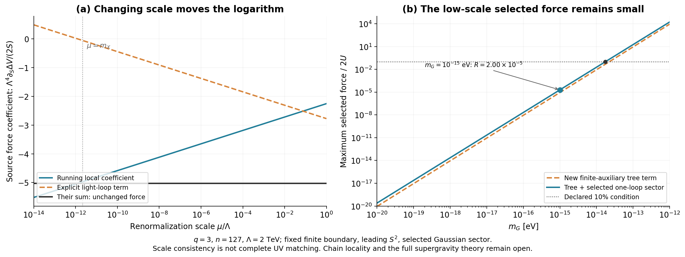

# 大对数、阈值与链结构保护：低尺度例子能否继续成立？

2026-09-26，`threshold_rg_v01`。**指定低能部门的量子展开比上一轮已经明确：大对数不能靠改计算尺度删除，但一圈超过新增树修正也不等于后续圈失控。** 在原低尺度例子中，树加所选一圈反馈仍约为原驱动力的0.002%；真正未解决的关键条件包括链连接规则的保护、未知高尺度有限匹配及完整超引力背景。

## Material Passport

本轮基于[中介链阶段](../../mediator_chain_v01/README.md)的作用量、分裂谱和旧时钟坐标，计算领先外源平方阶的一圈重/轻阈值匹配，并推导具体低能相互作用的圈参数。另对两种外加旁路作精确敏感性计算。没有新增观测数据、显著性结论或宇宙积分。实施边界见[protocol](../protocol.md)；所有复核为AI辅助内部推导和不同实现路径，不是外部同行评议。历史实验和86页正文保持原版。

## 1. 明确比较的是哪一个理论量

记$S=|F_X|^2$，质量维数为4。本轮RG方程将S视作给定外源。上一轮精确静态消元的领先修正为$-aS^2$，其中

\[
a=\frac{2h_2}{M^4},\qquad m_X^2=bS,\qquad b=\frac4{\Lambda^2},
\qquad k=\frac{b^2}{32\pi^2}.
\]

$a$和$k$的质量维数均为−4。我们计算的$c_LS^2$是外源背景势中的高维局部项，不能把$c_L\Lambda^4$误认成轻标量的普通四次耦合。

主例仍取$q=3,n=127,\Lambda=2$ TeV、$m_G=10^{-15}$ eV。固定高尺度$\Lambda$处**额外**有限$S^2$反项为零，含树项的系数为$c_{UV}(\Lambda)=-a$。这是继承的模型边界，不是从微观理论唯一导出的值；更换减除尺度时没有重新设定它。

## 2. 大对数移动到哪里

由完整刚性重谱的非对易二阶差商得到重阈值$h(\mu)S^2$。两实标量轻部门给

\[
V_{1,X}=kS^2[\ln(bS/\mu^2)-3/2].
\]

在本轮固定外源、领先$S^2$及一圈范围内，独立推导给

\[
\beta_{c_{UV}}=5k,\qquad
\frac{dh}{d\ln\mu}=-3k,\qquad
\beta_{c_L}=2k.
\]

因此在重匹配尺度$\mu_H$消去整个重部门后，

\[
c_L(\mu_H)=c_{UV}(\mu_H)+h(\mu_H),\qquad
c_L(\mu)=-a+h(\Lambda)+2k\ln\frac\mu\Lambda.
\]

中间选用的$\mu_H$消去。把运行系数与显式轻圈相加，势及其源导数都不依赖任意计算尺度：

\[
\Delta V=c_L(\mu)S^2+kS^2[\ln(bS/\mu^2)-3/2],
\quad
\partial_S\Delta V=2S\{c_L(\mu)+k[\ln(bS/\mu^2)-1]\}.
\]

特别取$\mu=m_X(S)$时，必须保留$dc_L/dS=k/S$，最终仍有

\[
\partial_S\Delta V=2S[c_L(m_X)-k].
\]

若将$c_L$在每个新尺度重置为旧高尺度值，或漏掉场依赖尺度的链式导数，就改变了匹配或算错了力。程序保留了这两个错误对照，未把它们当作改善模型的方案。具体推导及读源范围见[阈值与RG报告](../../../reports/threshold_rg_derivation_20260926.md)。

主例的无量纲系数为

| 量 | 数值 |
|---|---:|
| $a\Lambda^4$ | 2.25 |
| $h(\Lambda)\Lambda^4$ | −0.00289634 |
| $c_L(\Lambda)\Lambda^4$ | −2.25289634 |
| $c_L(m_X)\Lambda^4$ | −4.97690779 |
| $\Lambda^4\partial_S\Delta V/(2S)$ | −5.02756838，在两种尺度一致 |

所以$\ln(m_X^2/\Lambda^2)\simeq-53.77$的影响仍在。这里建立的是**所列一圈项的尺度一致性**，没有冒充所有相互作用beta函数的推导或完整多圈重求和。

## 3. 为什么1.23倍不代表每增加一圈都再乘1.23

此前所选一圈／新增树修正之比为1.23447。现在可以区分两个问题：这个比值描述$S^2$背景系数的变化；后续低能圈是否被抑制，要看轻粒子的实际顶点。

从$K=|X|^2-|X|^4/\Lambda^2$和$W=fX$出发，规范原点坐标下的标量四次耦合、导数顶点和Goldstino耦合满足

\[
\lambda_X=24\frac{m_X^2}{\Lambda^2},\qquad
|y_G|^2=4\frac{m_X^2}{\Lambda^2}.
\]

主例$m_X\simeq4.21754$ eV，而$\Lambda=2$ TeV，因此

\[
\frac{m_X^2}{\Lambda^2}=4.44692\times10^{-24},\qquad
\frac{\lambda_X|\ln(m_X^2/\Lambda^2)|}{16\pi^2}
=3.63404\times10^{-23}.
\]

相应Goldstino参数约$6.05673\times10^{-24}$。这些量表明：**所列轻场相互作用的后续圈仍受极小参数抑制；不能仅凭1.23这个比值判定低能微扰展开失败。**

另显式计算了标量势与导数顶点的两圈图组，得到其源导数／轻标量一圈源导数约$-5.48\times10^{-23}$，与这个计数一致。该图组尚未包含Goldstino sunset和全部反项，不称为完整两圈答案。完整推导、坐标变换及静态接触/交换相消见[低能圈计数报告](../../../reports/threshold_power_counting_20260926.md)。

这项判断也不控制未知重场有限匹配。重部门的局部耦合、非可重整化截止和完整超引力仍须另算；127个站点不能机械变成127倍增强，也不能凭端点权重完备性豁免真实计算。

## 4. 加上所选一圈后，慢驱动的数值预算

主例在旧1025个时钟坐标上的最大实相位反馈为

| 部门 | 相对原驱动力$2U$ |
|---|---:|
| 新增有限辅助场树修正 | $8.95450\times10^{-6}$ |
| 本轮所选Gaussian一圈修正 | $1.10541\times10^{-5}$ |
| 二者有符号和的模 | $2.00086\times10^{-5}$，即 **0.00200086%** |

阈值匹配前后的读数一致。这个预算只包含表列的新增部门，尚未合并全部带电、引力及未知有限局部项，不能写成整个物理理论的总误差。

固定其余输入，所选总力达到10%门限的$m_G$约为$1.74388\times10^{-14}$ eV；它是条件模型边界，没有观测置信度。旧1 TeV、$m_G=10^{-6}$ eV对照仍然失败。新程序采用领先$S^2$展开，不能覆盖旧有限源完整谱的精度；其圈／树比与旧精确结果相差约0.0471%，旧例正式值仍以历史完整谱为准。

左图显示运行系数与显式圈项各自变化，但总力保持不变；右图给出固定匹配边界下的所选受力预算。低尺度点的绝对反馈小，未由改尺度“消掉”任何物理贡献。

## 5. 链的保护条件现在可以量化

这轮量子核验没有解释最近邻连接为什么保持，也没有解释已有体模量为何只接在远端。我们因此检验两种**人为指定的变形**，没有把它们称为已生成的圈修正：

| 变形 | 归一化后的交叉系数 | 保持原目标因子二范围的条件 |
|---|---|---|
| 端点流泄漏$\epsilon J_0S_X$ | $\tau_{\rm eff}=\tau+\epsilon$ | $-\tau/2\le\epsilon\le\tau$ |
| 质量矩阵旁路$\delta(e_0e_e^T+e_ee_0^T)$ | $\tau_\delta=\tau-\delta G_{00}(1-\tau^2)$ | $-\tau/[G_{00}(1-\tau^2)]\le\delta\le\tau/[2G_{00}(1-\tau^2)]$ |

主低尺度链的$\tau=6.78531\times10^{-61}$、$G_{00}\simeq1/9$。因此保持所选交叉量级需要$\epsilon$在约$10^{-61}$、$\delta$在约$10^{-60}$的范围内，而质量矩阵的正定性单独允许$\delta$在约−9到9之间。**保持正谱远不足以保护极小端点传输。**

因子二范围还不是原恢复力条件：主例$r_H=2.31964$，要保持主阶$r_H>2$，允许的向下变化只有约13.78%。对流泄漏需$\epsilon>-9.35001\times10^{-62}$；对重新归一化的质量旁路需$\delta<8.41501\times10^{-61}$。固定原M时自作用系数还有精确归一化因子，相关区别在[旁路与保护报告](../../../reports/chain_locality_breaking_20260926.md)中保留。

这些数值只量化给定候选对旁路的敏感性，**没有证明相应大小的旁路实际存在，也没有推导不可避免的圈下限。**

## 6. 一个具体质量来源，以及尚未完成的部分

旁路报告进一步构造了矢量型$U(1)^n$ Higgs链：相邻链接具有$(1,-q)$及其相反电荷，配合两端Higgs对，可用电荷Gram矩阵生成本轮H。这比只指定矩阵更具体。

但最小超势构造有$n+1$个相位手征组合，仅n个被矢量吃掉，仍留下一个未稳定的手征平坦方向。因此它尚未成为全重谱完成。已有中性体模量与各链接的耦合也没有被普通规范不变性唯一限制到远端；允许的算符、场重定义和真正生成的有效旁路必须分开计算。

下一步应在这个明确场内容中处理剩余轻模、模量接入和允许反项，再决定能否保护所需连接结构；完整真空重匹配和新多场背景也仍待完成。当前可成立的阶段结论是：**低尺度候选的所列量子受力与轻场圈计数没有出现新的否定结果，而其微观保护来源仍未建立。**

主程序376项检查通过；[独立复算](independent_results_cn.md)的20个分组检查覆盖全部2616行结果，未读取或导入主实现。专题推导105项、低能计数67项、旁路及质量来源249项通过。独立复算初次18/20、专题推导初次93/105的精度失败均保留；改进数值微分的精度或无量纲化后，使用原容差通过。检查次数不作物理证据累加。

程序、图、失败记录及来源读取范围均归档在本目录和专题报告。$1/\ln^2t$继续作为基础设想，本轮没有从黎曼结构导出其指数或真实相互作用。
