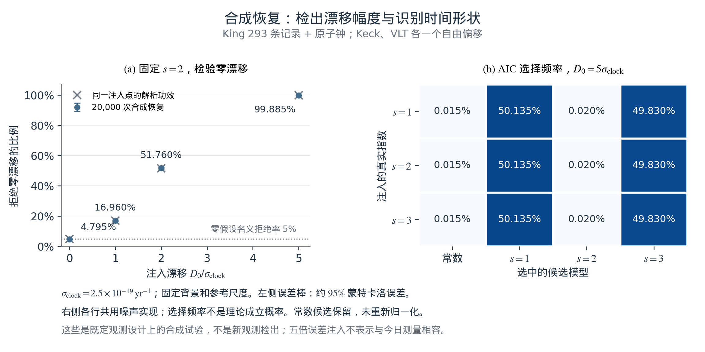
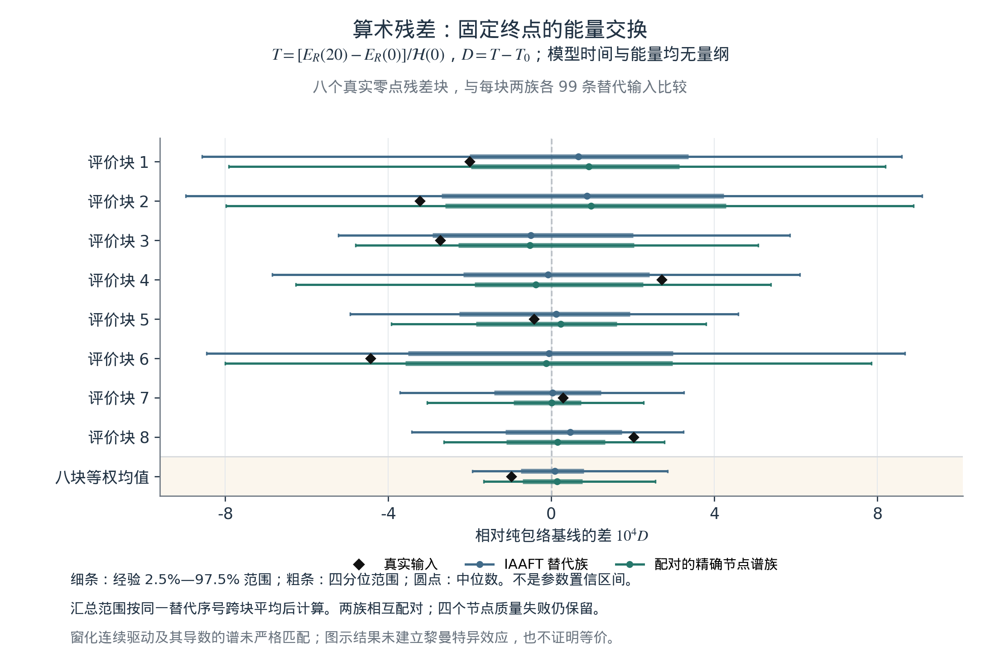

# 第8章 模拟案例与系统验证

**本章提要。** 本章按原稿的三个案例，分别检验精细结构常数响应、宇宙背景接口和精度预算。检验顺序是：先确认程序能准确求解指定模型，再比较真实输入与控制输入，最后讨论观测能否识别所设机制。已有计算支持内部时钟的反作用、指定漂移的统计恢复，以及不同背景候选间可计算的响应差异；它们尚未确认真实常数演化、平方指数的独特性或哈勃张力的解决。以下数字均来自已归档实验，本次写作没有新增模拟或观测拟合。

## 8.1 实验A：精细结构常数时间响应的恢复检验

### 8.1.1 环境与参数：从假设曲线到可检验数据

本案例保留逆对数平方这一核心设想，并把两个问题分开：假如确有变化，分析能否检出；假如检出，又能否认出它来自平方指数？前作中的算术映射提供研究动机，但尚未给出映射参数到真实电磁耦合的唯一转换。[7](../references.md#r7), [8](../references.md#r8) 因此本实验从第5章已定义的条件响应开始，不把约12.73的计数归一化直接指定为$\alpha$的漂移幅度。

沿用平直物质加$\Lambda$背景，固定$H_0=67.4$ km s$^{-1}$ Mpc$^{-1}$、$\Omega_m=0.315$，取$t_*=5.391247\times10^{-44}$ s，对应$t_0=13.7962$ Gyr、$L_0=\ln(t_0/t_*)=140.244$。在共同时间单位下，对$s>0$定义

$$
\begin{aligned}
A_s(t)-1&=\Gamma_s\left[L(t)^{-s}-L_0^{-s}\right]
=D_0\mathcal T_s(t),\\
D_0&=\left.\frac{\dot\alpha}{\alpha}\right|_{t_0}
=-\frac{s\Gamma_s}{t_0L_0^{s+1}},\\
\mathcal T_s(t)&=-\frac{t_0L_0^{s+1}}{s}
\left[L(t)^{-s}-L_0^{-s}\right].
\end{aligned}
\tag{8.1}
$$

这里$A_s=\alpha/\alpha_0$、$L(t)=\ln(t/t_*)$；$D_0$以年$^{-1}$计时，$\mathcal T_s$以年计。常数零假设直接取$D_0=0$，无需把$s=0$代入含$1/s$的表达式。主候选为$s=2$，$s=1,3$用于检查相近形状；背景和参考尺度均为条件输入。

合成设计保留King等人的293条测量记录、红移、误差和望远镜标签，覆盖131个具名类星体、$0.2223\le z\le4.1798$；293行不等于293个独立吸收体。[36](../references.md#r36) 原有测量均值被指定模型加噪声替换，误差沿用统计误差与已采用的额外散布。实验室信息仅使用漂移标准误$\sigma_{D_0}=2.5\times10^{-19}$ 年$^{-1}$，不使用实测中心值作为注入信号。[37](../references.md#r37) 单个ESPRESSO吸收体另成一个设计分支，不与King表合并，也不把共享同一钟约束的分支视为独立证据。[38](../references.md#r38)

### 8.1.2 执行方法：零信号、注入与误差失配

七种设计分别改变是否加入原子钟、是否拟合Keck/VLT两个偏移，以及是否假设同一类星体内相关系数$\rho=0.25$。最后一种是误差敏感性情景，并非从原始观测估得的协方差。各设计均保留一组零信号，以及$s=1,2,3$各自的六个有符号幅度$D_0=\pm(2.5,5,12.5)\times10^{-19}$ 年$^{-1}$，合计133个条件。最大幅度为所用钟误差的五倍，只用于强信号恢复测试，不表示它符合现有观测。

每种设计用30,000次独立零模拟校准指数扫描阈值，再用20,000次评估重复测量误报率、功效和区间覆盖率。不同注入复用评估噪声以便配对比较，不能把133个条件累加成独立验证。实现使用线性高斯充分统计量，并与完整观测向量的广义最小二乘交叉核对；没有逐个光学周期推进一个宇宙年龄。协议在执行前本地记录，但不是公开预注册或盲分析。[11](../references.md#r11)

主比较采用“King加原子钟、两个自由望远镜偏移”。零假设与非零候选具有相同的偏移参数。固定$s=2$的双侧5%检验，与在三个指数间搜索后重新校准的检验分别统计；AIC选择只描述相对拟合表现，不代替5%发现门限。区间覆盖率则针对事先固定且正确的指数，不是选模之后的覆盖率。

### 8.1.3 实际结果：能恢复幅度，尚不能识别平方形状

图8.1左侧显示，当真实指数与拟合指数均为2时，零信号误报率为4.795%；正向注入一、二、五倍钟误差后，检出率分别为16.960%、51.760%和99.885%，与解析高斯功效相符。对应95%幅度区间的覆盖率均为95.205%；相同覆盖率来自线性模型和共享噪声。三个指数扫描经另行校准后的零信号误报率为4.630%，不能直接沿用单指数的阈值或误差条。

**图8.1　检出变化与识别时间形式是两个任务。** 左：主设计在固定$s=2$时的模拟拒绝率与解析功效，零幅度点表示误报；误差条为20,000次评估下约95%的蒙特卡洛误差范围。右：五倍钟误差的正幅度注入下，常数与三个指数候选的AIC选择频率；三行对应三个真实指数，保留常数列而不重新归一化。各行频率近乎相同，且没有一次最佳与次佳指数的$\Delta\mathrm{AIC}\ge2$。选择频率不是理论正确的概率；中间指数的低胜率不能解释为平方律被排除。两侧都是合成数据结果，非新观测。

这一恢复成功主要来自当前漂移信息：在主设计中，原子钟贡献99.9998159%的幅度信息。移除原子钟后，$\sigma_{D_0}$变为约$1.84\times10^{-16}$ 年$^{-1}$，即使注入五倍钟误差，天文表自身的检出率也只有4.85%。因此，联合恢复不能表述为已经从高红移数据重建了整条历史曲线。

形状检验给出更直接的限制。令$\boldsymbol\mu_2$为指定$s=2$注入的无噪声均值，$\boldsymbol\mu_s(d,\boldsymbol\eta)$为另一个指数在重拟合幅度及相同偏移后的均值，可定义

$$
\lambda_{2\to s}=
\min_{d,\boldsymbol\eta}
\left[\boldsymbol\mu_2-\boldsymbol\mu_s(d,\boldsymbol\eta)\right]^{\mathsf T}
C^{-1}
\left[\boldsymbol\mu_2-\boldsymbol\mu_s(d,\boldsymbol\eta)\right].
\tag{8.2}
$$

这里$d=D_0/(10^{-19}\,\mathrm{yr}^{-1})$，$C$为指定误差协方差。主设计在一倍钟误差注入时，对$s=1,3$分别得到$1.36\times10^{-10}$和$1.39\times10^{-10}$；即使放大到五倍，也只有约$3.4\times10^{-9}$。这些数衡量均值曲线在干扰参数投影后的距离，不是已校准的发现显著性。图中$s=1$与$s=3$频繁胜出，反映近乎共线的模型对噪声的响应，不能据此评价指数2的物理优劣。

误差模型也会改变结论。若实际采用同视线$\rho=0.25$的合成噪声，却按独立误差拟合无钟King设计，误报率升至7.38%，95%区间覆盖率降至92.62%。原子钟主导的联合结果不能修复天文误差模型本身。对于单个ESPRESSO点，完全自由的偏移会精确吸收历史响应，只剩钟约束。已有理想预算还显示：固定当前几何、尺度与钟误差，一倍钟误差注入要使最近替代形状的式(8.2)达到1，需要把全部天文标准误共同缩小约$5.15\times10^5$倍。这是假定连系统误差也同比缩小的信息预算，不能作为十年内仪器能力的预测。[11](../references.md#r11)

本案例由此建立了可检验的统计流程，也明确了当前瓶颈。真实数据对漂移仍与零相容，具体拟合见第5章；合成恢复率不能转换成真实数据的拟合优度或常数漂移的观测证明。下一轮应先改善历史响应和系统误差的区分能力，再比较平方律与相邻时间形式。

## 8.2 实验B：内部时钟与宇宙背景的一致性

### 8.2.1 环境与参数：分开模型时间和膨胀时间

本案例保留“演化中的内部结构能否影响宏观膨胀”这一问题。哈勃参数仍定义为$H=\dot a/a$；模型更新步、内部坐标$R$及其速度，都需要额外物理映射才能与$H$比较。Planck与SH0ES给出的数值是不同推断途径下的今天$H_0$，不能分别当作复合时代与今天的两个$H(t)$端点。两点插值也不足以检验完整距离关系。[2](../references.md#r2), [3](../references.md#r3)

已有材料提供两个不同的动力学候选。主RSM候选在固定周期盒中采用正则$R$动能和场反馈，用于检验微观演化及连续近似。另一个自主背景候选采用正则$\chi$动能$F^2(\partial\chi)^2/2$、指数势$V_s e^{-2\chi}$，在尘埃、$\Lambda$与标量共同决定的背景中演化；取$\epsilon=(F/M_{\rm Pl})^2$及$V_s=F^2/(2t_*^2)$。后者是已归档的v0.2候选，不是把主模型换一个变量后得到的同一作用量：$\chi=\ln(R/R_*)$会使正则$R$的动能系数依赖$\chi$。[11](../references.md#r11)

v0.2在纯物质标度支上具有$\chi=\ln(t/t_*)$、$Ht=2/3$、$\Omega_\chi=3\epsilon/4$和$w_\chi=0$。这使对数时间具有一个明确的动力学实现，但电磁响应$A(\chi)=1+\beta(\chi^{-2}-\chi_0^{-2})$仍为额外假设，指数2并非由指数势唯一导出。进入含$\Lambda$的背景后，应联立求解场和膨胀，不能每步再强行设$\chi=\ln(t/t_*)$。

### 8.2.2 执行方法：独立求解、收敛与背景恢复

主RSM的基础数值检查先关闭时钟驱动（$b=0$），在固定系数基准中取$L=2\pi$、$v=m_0=g=1$、$q(x,0)=0.5\cos x$及零场速度，在$0\le\tau\le20$的共同输出时刻比较原始格点ODE和连续Fourier–Galerkin参考。空间误差使用独立高精度积分，以免时间步误差掩盖格距修正；没有重新拟合相位、频率或幅度。基础长波方程的相对场RMS差由$N=64$时的$3.137\times10^{-3}$降至$N=512$时的$4.902\times10^{-5}$，约为二阶；加入首个$a^2$修正后分别为$1.767\times10^{-6}$和$4.279\times10^{-10}$，约为四阶。主Verlet时间积分仍是二阶。[11](../references.md#r11)

继而启用$R_i=1$、$\dot R_i=0.1$、$R_*=e^{-2}$及$M^2=1+2(\chi^{-2}-1/4)$，以明确规定的外部时钟$R_{\rm ext}=1+0.1\tau$作对照。它不是完整反馈轨迹的回放。三种惯量的结果见表8.1；RMS对所有共同时间及格点求和，以外部驱动场为归一化分母。

**表8.1　完整时钟反馈相对外部驱动近似的差异。**

| 时钟惯量$I$ | $R(20)$，外部对照为3 | 场的相对RMS差 |
| --- | --- | --- |
| 10 | 3.74334 | 7.4096% |
| 100 | 3.08073 | 0.863395% |
| 1000 | 3.00815 | 0.0878651% |

对应的主积分与独立ODE场差约$2.12\times10^{-6}$，低于表中最弱反馈差异$8.79\times10^{-4}$。在$I=100$时，场能减少0.0596712，时钟动能增加相同数值；独立参考的能量与功残差约为$10^{-12}$量级。$b=0$或零初始场的控制恢复直线时钟与零交换。改变$I$时初始钟能也改变，因此该表不是等总能量比较；有限区间结果也不替代第4章的条件晚时证明。

自主背景候选沿用$H_{\rm ref}=67.4$ km s$^{-1}$ Mpc$^{-1}$、$\Omega_{m0}=0.315$，三组$\epsilon$为示例输入而非观测允许区间。它另用DOP853积分，并由独立变量组织和Radau求解器复核。每例调整$\Omega_\Lambda$使今天$H_0/H_{\rm ref}=1$，所以这一步没有预测$H_0$。积分忽略辐射和电磁／物质标量源；$a_i=10^{-3}$及提前起点的$10^{-4}$只是理想尘埃模型中的数值设置，不能称为已验证的早期宇宙演化。主29项检查和独立24项比较通过，最大全分量相对差约$3.21\times10^{-12}$；独立实现沿用主结果的闭合根，没有独立重求该根。[11](../references.md#r11) 这是前期尘埃背景实验的记录；第4章式(4.16h—k)及新增实验另将辐射、物理年龄和后期PM聚类接入正则时钟候选，输入、核验及适用范围独立保存。[57](../references.md#r57)

### 8.2.3 实际结果：可计算的机制差异与未解决的张力

背景候选最有用的输出，是从当前漂移到过去响应的转换：

$$
A(\chi)-1=D_0\mathcal T_\chi,\qquad
\mathcal T_\chi=-\frac{\chi_0^3}{2\dot\chi_0}
\left(\chi^{-2}-\chi_0^{-2}\right).
\tag{8.3}
$$

$\dot\chi_0$与$D_0$使用相同时间单位。将它与式(8.1)的$s=2$比较时，两者采用同一数值$t(z)$、$t_0$和物理尺度$t_*$，且具有相同今天漂移；因此差异不来自任意幅度重标定。

**表8.2　自主背景与精确对数时间的历史响应比较。**

| $\epsilon$ | $\mathcal T_\chi(4.2)$／$\mathcal T_{\log}(4.2)$（Gyr） | 比值 |
| --- | --- | --- |
| $10^{-6}$ | −37.18390／−31.85074 | 1.167442 |
| $10^{-4}$ | −37.18302／−31.85030 | 1.167431 |
| $10^{-2}$ | −37.09490／−31.80589 | 1.166290 |

这组约16.7%的变化说明，让慢变量自主运动可以产生区别于强制时间函数的结果。传递量并非宇宙年龄，绝对值大于$t_0$没有矛盾；今天两者均为零，不计算$0/0$。以$\epsilon=10^{-4}$为例，只更换膨胀时间历史而保留精确对数律，变化仅约$1.40\times10^{-5}$；主要差别来自$\chi$轨迹及其当前漂移归一化。若示意地取$D_0=2.5\times10^{-19}$ 年$^{-1}$，在$z=4.2$的两种$\alpha$响应只相差约0.00133 ppm。16.7%因而不是已测出的物理变化，也不等于现有观测能分辨的程度。

Hubble项目还对四条已校准背景进行了48次势重建后的正向恢复，在$0\le z\le2.33$内得到最大相对$H(z)$误差$1.38\times10^{-10}$。[19](../references.md#r19) 这检验给定背景与所构造标量势的一致性，没有把算术格点变成宇宙学预测。完整校准扩展的代码、输入及全部恢复记录尚未全部进入所引用的公开版本，当前RSM小型快照只保证结果追溯和图件重绘，不能补足完整拟合复现。

观测判据也应与上述数值精度分开。第5章的校准距离比较中，逆对数平方候选相对常数基线仅改善$\Delta\chi^2=0.842$，多一个参数后$\Delta\mathrm{AIC}=+1.158$；当前数据没有选出它，也没有给出“张力消失”的结果。本案例成立的成果是：反馈大小可以与数值误差比较，自主背景会改变响应，指定背景可以正向恢复。将这些不同候选连接为同一物理模型，仍需要共同作用量、物质响应和扰动检验。

## 8.3 实验C：精度预算、算术对照与未来测量

### 8.3.1 环境与参数：三种精度问题分别定义

实验室频率比的测量精度、数值积分的相位误差，以及不同算术输入造成的模型读数差异，具有不同定义。相对频率精度$10^{-18}$或$10^{-20}$是无量纲量；漂移$D_0$以年$^{-1}$计，还依赖时间基线、原子灵敏度和噪声相关。已有恢复实验使用一个压缩的钟漂移约束，尚未模拟十年的真实钟观测序列，也没有建立必然在某一精度出现的宇宙噪声底。

数值相位预算使用一个有效振子作为独立检查。对冻结频率$\omega$的辛Euler离散，设$x=\omega\Delta t$，稳定区间内每步相位及相对频率偏差为

$$
\theta=2\arcsin(x/2),\qquad
b_\nu=\frac{\theta}{x}-1
=\frac{x^2}{24}+O(x^4),\qquad 0<x<2.
\tag{8.4}
$$

步长减半时相位频率偏差趋于缩小四倍，但完整辛Euler状态精度仍是一阶。固定频率、固定步长产生恒定频率偏差，不会自动产生时间漂移。已有预算取示意载频$\nu_0=5\times10^{14}$ Hz、$\omega(t)=2\pi\nu_0 A_s(t)^\kappa$及$\kappa=\pm7$，在$s=1,2,3$和五档有符号漂移组成的30个情景中检查$\epsilon_{\rm ad}=\lvert\dot\omega\rvert/\omega^2$。导数统一秒制，在$0\le z\le4.2$的4,201点网格上最大约$8.96\times10^{-40}$；这仅说明设定载频与慢变响应的局部时间尺度分离，不是完整原子系统或任意长时稳定性的证明。[11](../references.md#r11)

### 8.3.2 执行方法：先区分可分辨响应与算术特异性

主格点模型中的算术案例另问：实际零点残差是否产生区别于匹配替代输入的宏观响应？实验以固定归一化处理零点间距，保留索引4097—5120的八个不重叠块，每块128个间距。真实块和替代块经相同自然三次样条及紧支撑窗进入$M^2(R)$，完整导数同时进入时钟反作用。模型取$N=64$、$I=100$、$\varepsilon_{\rm ar}=0.02$，演化至无量纲$\tau=20$；数学零点索引与宇宙年龄无对应。[11](../references.md#r11)

每块配置99个IAAFT替代序列，以及99个沿用其相位的精确节点幅度谱配对序列，加上八个真实块和一个纯包络，共1,593例。[12](../references.md#r12) 本地方案在主动力学运行前固定，唯一主指标和汇总为

$$
\begin{aligned}
T_b&=\frac{E_R(20)-E_R(0)}{\mathcal H(0)},\qquad D_b=T_b-T_0,\\
\overline D&=\frac18\sum_{b=1}^{8}D_b,\qquad T_0=0.045139422.
\end{aligned}
\tag{8.5}
$$

$T_0$来自纯包络对照。由于残差窗在初点为零，真实、替代及纯包络在本设置中具有共同初始总能量$\mathcal H(0)=1.32189839$，差异不来自逐例改变分母。替代汇总按共同序号跨八块平均，得到99个条件比较值；块不重叠不代表统计独立，两种配对替代族也不是独立复现。图8.2展示这项预定读数的全部八块及汇总。

**图8.2　真实输入改变模型读数，但尚未显示特殊响应。** 黑菱形为真实块的$D$，细横线为各99条替代输入的经验中心95%范围，粗横线为四分位范围，圆点为中位数；最下行单独给出预定等权汇总。横轴为$10^4D$，零线对应纯包络。横线不是观测误差条或参数置信区间，两族使用配对相位。节点谱匹配不保证插值、窗化后的连续驱动谱相同，因此本比较尚未单独隔离高阶算术排列的效应。

真实汇总为$\overline D=-9.7631\times10^{-5}$，所有八块及汇总均落在两族中心95%范围内；汇总条件双侧秩为0.40与0.36。这些秩不是已校准的$p$值，未检出异常也没有证明真实序列与替代序列等效。结果的正面含义是：所设耦合确实能把输入差异传到宏观读数，并且该差异可与数值误差及替代输入的散布分别比较。

**表8.3　算术案例的数值核验与输入控制。**

| 核验对象 | 已存档结果 | 解释范围 |
| --- | --- | --- |
| 全部1,593例的采样能量偏离 | 最大相对值$4.96\times10^{-7}$ | 低于该实验$10^{-4}$门限，不是全连续轨迹上界。 |
| 25个固定例的步长减半 | 最大$\lvert\Delta D\rvert/\mathrm{IQR}=3.97\times10^{-6}$ | 低于事前5%门限；IQR取对应IAAFT分布。 |
| 主积分与独立DOP853 | 最大$\lvert\Delta T\rvert=1.17\times10^{-9}$ | 指定参考案例的实现核对。 |
| $N=64\to128$空间检查 | 最大$\lvert\Delta D\rvert/\mathrm{IQR}=0.2606\%$ | 两个网格的敏感性，尚非全体案例的收敛阶或误差界。 |
| IAAFT节点幅度谱 | 792例中788例通过5%门限 | 四个失败输入均保留，未筛除后重写主结论。 |

输入控制仍有实质限制。插值和窗化后，两族实际驱动功率谱相对差的中位数约为62.25%和61.86%；驱动导数的对应值约为73.31%和73.06%。这些是谱差，不是场RMS或积分误差；该层没有预定合格门限，却足以说明节点匹配不能替代实际驱动匹配。下一轮应先改进此项控制并检验检出能力，再判断是否存在特殊算术效应。

失败记录同样属于验证结果：算术独立参考的首轮能量／功精度与后续严格指标曾未达门限，进一步提高精度后最终五类参考检查通过，历史文件仍保留。更早的固定系数基准中，最细网格参考变化占修正误差1.0919%，超过预设1%，该额外审计仍未通过；近四阶趋势没有因此被抹去，也没有将失败改记为成功。有限浮点、有限零点表和可收敛的积分误差，均不能推出宇宙本身只有相同位数的计算精度。

### 8.3.3 未来结果的判据：把灵敏度变成可拒绝关系

若设计真正的长期钟实验，应先指定频率比$r_\nu=\nu_A/\nu_B$及对$\alpha$的差分灵敏度$\Delta\kappa$。在其他常数和环境响应已控制、漂移近似线性的条件下，可写

$$
\begin{aligned}
y_i&=\ln\!\left[\frac{r_\nu(t_i)}{r_{\nu,\rm ref}}\right]
\simeq a_0+\Delta\kappa D_0(t_i-t_{\rm ref})+\epsilon_i,\\
\operatorname{Var}(\widehat D_0)
&=\frac{\left[(X^{\mathsf T}C_{\rm clk}^{-1}X)^{-1}\right]_{22}}
{(\Delta\kappa)^2},\qquad
X_i=(1,t_i-t_{\rm ref}).
\end{aligned}
\tag{8.6}
$$

这里时间以年计，$C_{\rm clk}$包含测量时间相关及已建模的环境、校准误差，$\Delta\kappa\ne0$且设计矩阵满秩。公式是给定协方差下的线性估计预算；若还需拟合环境趋势，应增加相应列，并检查其与时间项的退化。它不是本章已经执行的十年实验，也不能由一个单次频率精度数字直接得到。

该设计与高红移方案承担互补任务：原子钟测当前斜率，天文光谱在已控制仪器和气体偏差后检验过去响应。第5章的同跃迁级次负对照、跨年龄共同读数和预设中点关系应先于时间形式比较；一个条件谱线差异并不自动等于宇宙时间造成的能级分布变化。随后才比较固定尺度的$s=2$与其他指数，并对模型搜索和共享误差作相应处理。[22](../references.md#r22), [23](../references.md#r23)

允许幅度为零的整个候选族，不能因未来继续未检出漂移而被一次排除；能承担明确失败风险的是独立固定的非零幅度、共同读数关系或明确的参数区域。同样，检出非零漂移首先要求超出常规误差和环境解释，再检验其时间形式，不能直接确认宇宙的计算本体。三个案例共同给出了有定义、有对照、有精度记录的研究任务。下一章据此汇总当前框架建立了哪些结果，以及哪些物理连接仍须完成。
