# 黎曼标准模型：连续与离散世界观的对话

*基于离散同步演化的计算宇宙假说*

中文完整初稿 · 2026-09-24

## 摘要

本文提出“黎曼标准模型”（RSM）这一假设性研究框架，探索微观离散动力学如何形成宏观连续描述。受黎曼零点的谱统计联系及作者已发表的非自治映射数值研究启发，框架假设部分结构参数随内部演化缓慢变化，并以$1/\ln^2(R/R_*)$为主要候选响应，其中$R$为内部演化坐标，$R_*$为同量纲参考尺度。框架以离散状态、同步更新和辛结构组织动力学，将状态关联、局部传播与有效参数演化纳入同一研究构想，并在工程层面提出以实体—组件—系统（ECS）组织模拟实现的方案。作为在连续模型时间下演化的可计算基准，我们构造内部时钟与非线性格点共享的哈密顿量，得到双向反馈和一致的能量收支。在纯包络、固定有限格点及指定正能量分支下，时钟速度趋于正极限，回复系数相对常数极限保留预设的逆对数平方晚时形式；长波展开与数值比较建立了指定条件下的格点—连续场连接，并给出区域能量收支、连续场动量守恒及三维各向同性无质量波的有效压力关系；线性CMB迭代则明确连接传播、协方差与投影角谱。接入真实零点间距残差后，八个评价块的能量交换指标均位于替代集合的中心95%范围内，尚无特殊算术响应证据；实际驱动匹配与检出能力仍待完善。精细结构常数与原子钟、宇宙膨胀、光谱读数及CMB的条件分析已接入具体数据与对照；现有结果尚未确认共同的非零时间响应或识别平方指数，CMB声学峰仍未完整匹配。一个另行声明的正则时钟候选进一步接入辐射、物质及标准引力，用共同初态计算具有物理年龄的后期无碰撞聚类；初始物质传递仍由外部标准模型提供。受控球形塌缩与原初气体冷却接口量化了条件形成历史；三维粒子主配置未通过连续球精度门限，气体与星系形成尚未实际演化。真实物质相互作用和引力—量子统一尚未从算术结构导出。本文据此提出一条由结构假设、条件推导通向数值与观测检验的研究路线。

**关键词：** 黎曼零点；非自治动力学；逆对数平方响应；离散同步演化；辛结构；微观—宏观连接

## 图 A：RSM 总体构架

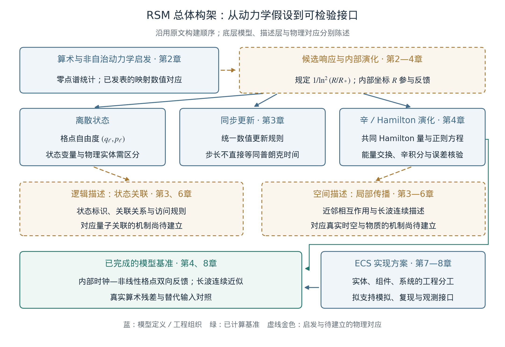

*图A：RSM 总体构架。算术及非自治动力学研究提供启发；逆对数平方响应作为输入假设进入内部时钟与离散格点的候选模型。状态关联的逻辑描述与局部传播的空间描述分列，二者和量子关联、真实时空的物理对应仍待建立。下方列出目前已完成的时钟—格点双向反馈、长波连续近似和算术残差对照；ECS 表示拟议的工程组织方案，当前基准程序尚不等于完整ECS引擎。章号指向沿用原文顺序的中文稿。*

## 图 B：RSM 想法的来源与检验路径

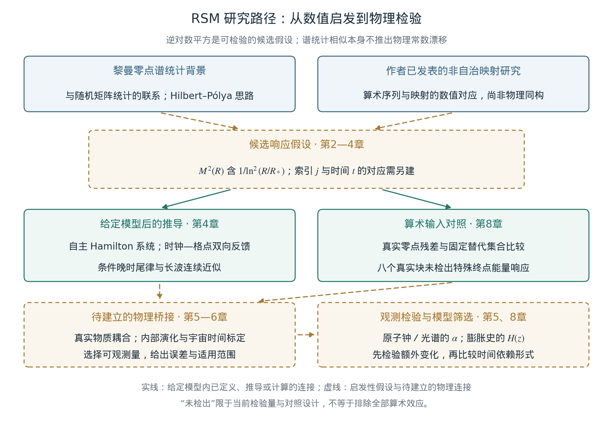

*图B：RSM 想法的来源与检验路径。黎曼零点谱统计背景和作者已发表的非自治映射数值研究，启发但不唯一推出 $1/\ln^2(R/R_*)$ 候选响应。实线仅连接给定模型内已定义、推导或计算的环节；虚线表示启发、额外假设及尚待建立的物理桥接。现有八个真实零点块的终点能量交换未相对于预定替代集合显示特殊响应；此结论受检验量、对照匹配和检出能力限制。真实物质耦合及内部坐标与宇宙时间的标定完成后，才能进一步以原子钟、光谱和宇宙膨胀史检验特定物理模型。*

# 第0章 介绍：从算术动力学到物理框架

## I. 研究背景：离散演化、连续描述与参数变化

微观相互作用如何形成宏观规律，是连接不同物理尺度的基本问题。本文沿着这一问题提出“黎曼标准模型”（Riemann Standard Model，RSM）：以非线性动力学描述底层状态，以辛结构约束演化，再研究连续场、集体行为和有效参数如何从这些状态中形成。这里的“标准模型”沿用本研究的框架名称；当前目标是建立可以逐步推导和检验的候选体系。

这一设想的特别之处，是把微观结构参数的缓慢演化纳入起点。若有效相互作用受到内部自由度调制，那么只观察物质子系统时，原本固定的系数可能表现出时间依赖。赋予这种变化明确的动力学和物质耦合，已有可变精细结构常数理论提供了建模先例。[1](#r1) 本文进一步追问：作者此前算术动力学研究中的逆对数平方形式，能否启发一个兼具反馈、连续描述和可检验后果的物理候选？

常数与宇宙学参数的观测研究为这一问题提供检验入口。精细结构常数$\alpha$的可能变化涉及无量纲耦合；宇宙膨胀则需区分本就随时间演化的$H(t)$与当前值$H_0=H(t_0)$。例如，Planck在给定宇宙学模型下由早期信号推断今日参数，距离阶梯在另一测量链上估计今日膨胀率；两者不是对两个时代的$H(t)$直接采样。[2](#r2), [3](#r3) 本框架因此把观测分歧视为待解释的问题，要求候选动力学同时面对校准、系统误差和背景模型的检验。

本文的研究顺序是：定义离散状态及演化规则，建立微观到宏观的条件联系，再指定实际读数并检验数据。前置图A给出总体构架，图B给出从数学启发到物理检验的路径。本章沿此顺序介绍全篇，并说明哪些环节已有推导和计算，哪些仍属于框架的研究目标。

## II. 动力学来源：黎曼结构与非自治响应

### II.1 零点、谱统计与已发表前作

黎曼零点与量子谱研究之间的联系，是本框架的思想起点。Montgomery研究了零点的成对关联，Dyson指出其与随机矩阵统计的联系；Odlyzko的数值工作进一步检验了零点间距统计。[4](#r4), [5](#r5) Hilbert–Pólya思路及Berry–Keating研究则把问题引向算符谱和经典动力学。[6](#r6) 这些结果提示可以研究算术结构的动力学表示；谱统计相似所确定的信息，仍少于一个真实物质系统所需的哈密顿量和测量规则。

作者已发表的素数研究考察了筛序列与低维二次映射符号动力学之间的对应，并报告相关统计的数值复现。[7](#r7) 随后的零点研究采用非自治二次映射

$$
x_{n+1}=1-u_nx_n^2,
\tag{0.1}
$$

通过含逆对数平方主项的参数演化和经验谱校准，建立了与黎曼零点的探索性数值对应。[8](#r8) 这里$n$是映射迭代索引。前作报告的对应具有校准依赖，模型自身的局部间距统计尚未复现高斯酉系综（GUE），也未构造Hilbert–Pólya型物理自伴算符。因此，本文继承的是非自治结构和候选函数形式，并在此基础上另行提出物理建模假设。

### II.2 从符号编码到物理自由度

原构想以0、1编码算术序列，并将其作为生成复杂结构的起点。新框架保留这一研究方向，同时明确编码、状态和相互作用的分工：比特串可以表示符号轨道，物理候选还需要说明状态空间、邻接关系、能量及观测映射。当前可计算基准采用经典正则格点自由度；它为研究集体动力学提供载体，但这些自由度尚未由素数编码唯一导出。

式(0.1)的一维二次映射本身也不等于后文的辛动力学。引入正则坐标、动量和共同哈密顿量，是连接算术启发与物理候选所增加的一步。由此可以分别检验“某种序列能够被动力学表示”和“某种相互作用能够产生真实物理读数”，而不把两个问题的结论相互替代。

### II.3 算术输入与可观测响应

黎曼零点在本研究中是固定的数学对象。模型使用的是有限精度零点表及其展开后的间距残差，变化的是驱动状态或对输入的响应。原文关于算术复杂性充当随机性来源的设想，在这里转化为一个可计算问题：保留若干低阶统计后，真实残差的排列是否还会产生不同的宏观读数？

为回答这一问题，真实残差需要与统计匹配的替代输入比较，并预先固定读数和评价区间。这样得到的结果首先约束所选输入—响应关系；进一步连接量子概率，还需要状态制备、测量及相关函数的定义。

### II.4 逆对数平方作为明确假设

当前选取的平滑响应为

$$
M_{\rm env}^2(R)=m_0^2+b\left[
\frac{1}{\ln^2(R/R_*)}-\frac{1}{\ln^2(R_i/R_*)}
\right],\qquad R>R_*>0.
\tag{0.2}
$$

$R$为内部演化坐标，$R_i>R_*$为其初值，$R_*$为同量纲参考尺度；$M^2$表示格点方程中的线性回复系数，$b$控制响应幅度。在当前无量纲基准中，$R$与$R_*$均为无量纲量；恢复单位时，对数自变量仍须为无量纲比值。平方指数、耦合位置和参数幅度均属于所选候选，不能直接由谱统计联系确定。

这一选择明确了原稿中不同对数形式的分工：素数密度的逆对数行为、映射参数的逆对数平方演化以及真实物理读数，是三个不同对象。本文以式(0.2)为核心响应，后续再研究何种观测量继承它。零点序号$j$、映射步数$n$、数值步号$k$、内部坐标$R$、模型时间$\tau$和宇宙时间$t$分别定义，主格点内部坐标的时间标定本身也是待建立的联系。第4章另以正则时钟候选接入FLRW物理时间和标准引力，形成一个可计算的条件实例；这不等于所有内部变量已经具有同一宇宙时间解释。

## III. 形式化：宇宙同步架构

### III.1 同步思想与当前基准

RSM保留原文的离散状态和同步更新构想：在一次更新中明确哪些状态被读取、哪些变量被演化，以及更新顺序如何体现相互作用。确定性离散模型与量子描述之间的关系已有独立研究，例如’t Hooft的元胞自动机解释。[9](#r9) 本文借鉴这种从状态演化提出问题的方式，采用的具体动力学仍须自行定义和检验。

目前完成的基准在连续模型时间$\tau$下演化，并通过离散积分计算轨迹。同步数值更新保证了算法的定义；把更新节拍赋予基本物理时间、尤其普朗克时间的意义，是更强的假设。后者需要检验可观测后果及其与相对论的相容性，不能从一个运行稳定的程序直接确定。

### III.2 内部时钟与双向作用

驱动被赋予正则坐标$R$及其动量，因而能够与格点交换能量。整个系统可以具有不显含$\tau$的哈密顿量；沿着内部轨迹考察格点时，$M^2(R(\tau))$却呈现时间依赖。这样，完整系统的自主性与子系统的有效非自治响应能够同时存在。子系统的轨迹仍依赖共同演化的时钟，自身并非独立闭合。

当前$R$是全体格点共享的均匀模式。它使反作用可以直接计算，但也带来全局耦合。建立具有局域传播的驱动场，并说明何时可约化为这一均匀模式，是从当前基准推进到物理架构的重要步骤。

### III.3 逻辑描述与空间描述

原文区分状态关联的逻辑层与局部传播的空间层。新框架保留这一区分：前者描述状态标识、联合变量和读取规则，后者描述空间邻接与传播。对一个物理候选，还必须说明两层如何共同决定可观测量。共享状态或同时更新可以是程序结构，但量子关联需要实际概率分布，因果性需要可操作的信号定义。相应问题在第3章与第6章分别展开。

## IV. 数学框架：辛结构、反馈与连续描述

### IV.1 从共同哈密顿量出发

在长度为$L$的周期区间上取$N$个格点，格距为$a=L/N$，并取$p_\ell=a\dot q_\ell$、$P_R=I\dot R$；点号表示$d/d\tau$。当前基准的共同哈密顿量为

$$
\begin{aligned}
H&=\frac{P_R^2}{2I}+H_{\rm field},\\
H_{\rm field}&=\sum_{\ell=0}^{N-1}\left[
\frac{p_\ell^2}{2a}
+\frac{v^2(q_{\ell+1}-q_\ell)^2}{2a}
+\frac a2M^2(R)q_\ell^2+\frac{ag}{4}q_\ell^4
\right],
\qquad q_N=q_0.
\end{aligned}
\tag{0.3}
$$

其中$I>0$为时钟惯量，$v>0$控制近邻传播，$g\ge0$控制局部非线性。纯包络取$M^2=M_{\rm env}^2$；算术检验另外加入固定窗化残差，具体定义留待第4章和第8章。正则方程同时给出系数调制与时钟反作用，连续精确演化满足

$$
\frac{dH_{\rm field}}{d\tau}
=-\frac{d}{d\tau}\left(\frac{P_R^2}{2I}\right),
\qquad \frac{dH}{d\tau}=0.
\tag{0.4}
$$

式(0.4)说明能量在场与内部时钟之间交换。数值实现采用辛方法并检查能量误差；辛性与逐步精确保存原哈密顿量是不同性质，长期可靠性仍须结合步长、稳定域和误差控制判断。[10](#r10)

### IV.2 反馈下的晚时响应

对纯包络、固定有限格点、有限初始能量，另要求初速度$u_i=\dot R(0)>0$及$0<b<m_0^2\ln^2(R_i/R_*)$。在这一分支上，轨迹保持$R(\tau)\ge R_i$，已有推导得到

$$
\begin{aligned}
\dot R(\tau)&\longrightarrow u_\infty>0,\\
M_{\rm env}^2(R(\tau))-M_\infty^2
&\sim\frac{b}{\ln^2(\tau/\tau_{\rm eff})},
\end{aligned}
\tag{0.5}
$$

其中$M_\infty^2=m_0^2-b/\ln^2(R_i/R_*)>0$，$\tau_{\rm eff}=R_*/u_\infty$。反馈改变有限时间轨迹和参考时间尺度，同时保留预设响应的晚时主导形式。该结果回答的是平方律在特定反馈下能否保持；它没有从辛结构中唯一选出平方指数。含算术残差的轨迹需要另行判断，不能直接套用纯包络分支的单调性结论。完整推导和计算记录已有保存。[11](#r11)

### IV.3 从格点到长波场

对足够光滑且在所考察时段内导数受控的场，在长波范围对近邻空间差分作形式展开，可以得到

$$
\phi_{\tau\tau}
=v^2\phi_{xx}-M^2(R)\phi-g\phi^3
+\frac{v^2a^2}{12}\phi_{xxxx}+O(a^4).
\tag{0.6}
$$

这一表达式给出连续主阶和首个格距修正。已有独立求解在指定平滑初态与有限时段比较了格点和连续方程：固定系数基准的主阶空间误差接近二阶，加入首修正后接近四阶；时间积分误差另行测量。[11](#r11) 高频模式和更长演化时间仍需分别检验。

这使原文“微观离散过程形成宏观连续描述”的设想获得了一个具体实例。当前连续场来自所选经典格点；通向热力学需要统计态和约化规则，通向真实引力或电磁相互作用还需要相应的自由度、对称性与物质耦合。第4章将把这些层次及其成立条件分别列出。

## V. 数值依据与观测接口

### V.1 算术结构是否带来额外响应

在同一平滑包络上接入真实零点间距残差后，已有计算比较了八个固定评价块。每块包含一条真实输入、99条迭代振幅调整傅里叶变换（IAAFT）替代输入及99条配对精确节点谱输入，再加一条纯包络基线，共1593例。IAAFT用来构造保持指定输入统计的对照。[12](#r12)

八个真实块的预设终点能量交换指标均位于两族替代集合的中心95%范围内，当前没有检出特殊算术响应。这里的范围描述所构造的替代集合，并非物理参数置信区间。窗化插值后的实际驱动及其导数尚未严格匹配，检出能力也未量化；因此，这一结果不能解释为各种输入物理等效。它直接确定了下一轮应改进的对照层次。[11](#r11)

### V.2 四类物理方向的不同作用

此前围绕常数、膨胀、测量精度与宇宙微波背景开展的项目，为整体框架提供了不同的检验工具。下表概括已保存分析的状态；这些分支尚未构成同一物理机制的联合验证。[11](#r11)

| 方向 | 已有分析提供的基础 | 对当前框架的约束 |
| --- | --- | --- |
| 精细结构常数与原子钟 | 以同一耦合连接当前漂移和高红移变化，比较不同时间形式。 | 已有联合拟合与零演化相容，平方指数尚未被独立识别。 |
| 宇宙膨胀 | 使用距离数据、协方差与校准，求解时间—红移—距离关系。 | 不同候选仍有退化；不能把不同方法的$H_0$摘要值直接串成演化曲线。 |
| 零点测量与高红移光谱 | 区分额外测量不确定度、谱线均值及仪器／气体模型的影响。 | 已见条件位移尚不足以确定宇宙时间效应；精度假说与均值漂移是不同命题。 |
| 宇宙微波背景 | 格点传递、固定初始谱比较与自由初始场反演。 | 天图重建可能吸收初值自由度；现有模型尚未匹配整串声学峰。 |

原稿的统一愿景因而可以保留为共同问题：这些方向是否可能由同一内部动力学联系起来？要使答案具有物理意义，需要先定义各自的响应算子、量纲、背景和共享参数，再处理数据重叠及协方差。函数形式相似提供研究线索，联合约束则要求更具体的机制。

### V.3 连接当前漂移与过去变化

以$\alpha$为例，若额外假定内部响应可以映射为同一宇宙时间律，则候选观测接口可写为

$$
\begin{aligned}
\frac{\alpha(t)-\alpha(t_0)}{\alpha(t_0)}
&=\Gamma\left[\mathcal L(t)^{-2}-\mathcal L(t_0)^{-2}\right],\\
\mathcal L(t)&=\ln(t/t_*),\qquad t>t_*>0,\\
D_0\equiv\left.\frac{d\ln\alpha}{dt}\right|_{t_0}
&=-\frac{2\Gamma}{t_0\mathcal L(t_0)^3}.
\end{aligned}
\tag{0.7}
$$

$\Gamma$为无量纲响应幅度，$t_*$为物理参考时间，$t_0$为当前时间；适用域还要求$\alpha(t)>0$。该接口采用同一低能定义并固定其他相关无量纲常数，真实钟频率比与谱线读数还需通过独立确定的跃迁敏感度转换为$\alpha$约束。在共同、无屏蔽的时间演化假设下，同一幅度必须同时符合原子钟与过去光谱。它不能由“变化很慢”这一描述任意规避当前漂移约束。式(0.7)是额外的物理接口，不是式(0.2)自动产生的宇宙学结论；一般背景应使用实际动力学轨迹和导数。

已有合成恢复实验沿用观测设计检验了幅度估计，但现有设计不能有效区分逆对数的一次、二次和三次形式。[11](#r11) 因而后续实验既要问是否能检出变化，也要问是否能区分变化形式；原子钟未检出、天文数据相容以及检出能力不足，各自具有不同含义。

## VI. 预测与解释：把整体设想转成具体问题

本框架的物理价值取决于可区分的后果。最接近当前计算的检验，是在实际驱动匹配和检出能力明确后，判断新零点块是否产生额外响应；最接近观测的检验，是检查同一组物理参数能否同时解释当前漂移、过去变化和环境依赖。两类检验都应预先确定评价量，保留常数模型及其他时间形式作为对照。

原稿关于量子、真空和引力的解释，在全篇中继续保留为机制问题：

| 原构想 | 进一步需要建立的内容 |
| --- | --- |
| 有限分辨率与不确定性 | 从状态及测量规则计算概率分布和不确定度，区分物理涨落与估计误差。 |
| 状态关联与纠缠 | 指定可制备态、可选择测量和联合概率，并检验Bell相关及无信号条件。 |
| 截断结构与真空效应 | 定义物理能量、参考态及其引力耦合，区分物理截断与数值舍入。 |
| 局部演化与引力时间效应 | 从局域动力学建立钟读数、有效几何及其对称性和守恒关系。 |
| 多尺度表示与波粒行为 | 建立传播、干涉和探测的同一概率模型；自适应数值分辨率仅是实现工具。 |

例如，Bell研究表明，解释量子关联必须认真处理所采用的局域性等假设。[13](#r13) 程序中的共享地址本身没有给出这些条件下的测量统计。同样，控制数值截断误差并未得到可提取的真空能量。将这些机制明确化，才能判断原构想的哪些部分可以成为物理命题。

## VII. 黎曼引擎：用于检验框架的计算平台

黎曼引擎的作用是把假设落实为可复核的计算。设计上采用实体—组件—系统（ECS）划分状态标识、属性数据和演化规则，使算术输入、内部驱动、格点相互作用及观测读数可以分别替换。这样的工程分工有助于比较模型，但不决定宇宙实际采用何种计算组织。

当前已有程序完成了固定系数基准、完整反馈、独立连续参考、零点残差与替代输入比较，以及合成信号恢复。后续整合应保留四项能力：显式记录初值与假设；分别控制时间、空间和参考求解误差；在相同数据与规则下比较候选；保存未检出、匹配不足和精度失败。[11](#r11) ECS统一调度、跨硬件逐位一致及自动参数探索仍按设计目标推进，现有基准程序不等于完整引擎已经建成。

计算速度可以帮助扩大对照规模，却不能增加某个模型的物理证据。已有线性传播问题可利用Fourier结构计算末态，其效率优势有特定任务条件；含非线性和反作用的演化需要另外计时与验证。第7章讨论实现组织，第8章用具体案例说明它能检验哪些命题。

## VIII. 本文的研究路线与章节安排

本文保留从算术与计算视角研究物理的整体愿景，并以已经建立的时钟—格点模型作为数学与数值起点。目前可以明确陈述的成果是：逆对数平方响应已接入具有双向反馈的共同哈密顿体系；在指定分支下得到晚时保持结果；长波描述已有条件数值比较；真实零点残差已经进入受控计算，其特殊响应尚未检出。真实物理相互作用仍待从算术结构导出。

后续第1章提出物理问题与观测动机，第2章梳理算术及非自治动力学来源，第3章定义同步架构，第4章展开数学模型与微观—宏观联系；第5章处理观测证据与约束，第6章讨论预测及物理解释，第7章给出引擎设计，第8章组织模拟与验证，第9章总结框架及尚待解决的问题。各章共同遵循从输入假设到条件结果、再到独立检验的顺序。

这一安排把原文“从几何到计算”的设想具体化为一项逐步推进的研究：首先让动力学、能量收支和可观测量定义清楚，然后检验算术结构是否具有额外预测能力，最后再判断哪些候选能够连接真实物质和宇宙演化。

# 第1章 系统异常：物理问题与研究动机

**本章提要。** 本章沿用原稿的“两朵乌云”：哈勃张力与真空能问题。前者涉及不同测量链在给定模型下的参数一致性，后者涉及微观能量对宏观引力的贡献及其稳定性。两者促使我们重新考察时间标定、结构参数和跨尺度描述。RSM据此提出一个工作假设：部分宏观系数可能是内部动力学的有效响应，并在适当条件下继承逆对数平方的缓慢演化。已有膨胀史、精细结构常数、光谱与CMB研究，使这一设想开始具有具体的检验对象；它们也限定了当前框架能够提出的解释范围。

## 1.1 引言：观测分歧提出了什么问题

基础框架需要同时解释成功的测量和持续存在的困难。对于宇宙学，这意味着既要面对距离阶梯与早期宇宙推断之间的张力，也要保留标准宇宙学对多种数据的解释能力。观测分歧提供寻找新机制的理由，判断机制是否成立则需要可区分的预测。

JWST提高了部分距离阶梯环节的分辨能力。2025年的一项JWST与HST造父变星联合分析报告$H_0=73.49\pm0.93\,\mathrm{km\,s^{-1}\,Mpc^{-1}}$，支持较高的本地膨胀率。[14](#r14) 不同恒星指标和校准路径仍须分别比较。例如，CCHP的HST与JWST红巨星分支尖端（TRGB）路径报告$70.39\pm1.22\,({\rm stat})\pm1.33\,({\rm sys})\pm0.70\,({\rm SN})$，单位相同，后三项分别为该文列出的误差贡献。[15](#r15) 因而，“JWST的测量”并非一个脱离样本、恒星模型和距离阶梯构造的唯一数值。

2026年发表的本地距离网络联合分析进一步给出$H_0=73.50\pm0.81\,\mathrm{km\,s^{-1}\,Mpc^{-1}}$。[16](#r16) 这是处理共享数据和协方差的网络结果，不能再与其组成部分当作完全独立的测量累加显著性。上述进展使若干具体的系统误差解释受到更强约束，但一次分辨率提升不能排除整个测量链的所有误差，也不能单独决定应修改哪一项物理假设。

本章使用“系统异常”描述这种需要进一步定位的问题。我们关心的是：跨时代推断中，哪些变化来自已知宇宙演化，哪些来自标定或模型选择，哪些才需要新的动力学自由度？后续模型应回答这些问题，并接受同一测量链上的检验。

## 1.2 第一朵乌云：膨胀率推断与物理时钟

### 1.2.1 当前值与膨胀历史

以宇宙共动观测者的固有时间$t$定义膨胀率，令$a_{\rm cos}(t)$为宇宙尺度因子，则

$$
H(t)=\frac{1}{a_{\rm cos}(t)}\frac{d a_{\rm cos}}{dt},
\qquad H_0=H(t_0).
\tag{1.1}
$$

这里$a_{\rm cos}$与第0章的格距$a$不同。标准宇宙学中的$H(t)$本就随时间变化；$H_0$是在选定当前时刻定义的参数。Planck基于平直六参数$\Lambda$CDM模型推断$H_0=67.4\pm0.5\,\mathrm{km\,s^{-1}\,Mpc^{-1}}$，而SH0ES在2022年报告的距离阶梯值为$73.04\pm1.04\,\mathrm{km\,s^{-1}\,Mpc^{-1}}$。[2](#r2), [3](#r3) 两者都以今日膨胀率为目标。因此，不能把67.4与73.04直接排列成早期与晚期的两次$H(t)$观测，再据此确定一条时间演化曲线。

红移分箱中出现的“有效$H_0(z)$”也需要明确其定义：它通常表示在指定背景函数、校准或拟合方法下，从不同子样本推断的归一化。其趋势可以用于检查模型与数据的一致性，但只有回到红移、距离、声学尺度及其协方差，才能判断趋势要求何种物理变化。

DESI提供了更细致的距离历史检验。2025年的DR2宇宙学分析在特定$w_0w_a$暗能量模型中，得到随超新星组合变化的演化暗能量偏好。[17](#r17) 2026年7月发布、8月修订的DR2 Ly$\alpha$森林分析又结合Alcock–Paczyński信息更新了高红移距离约束；其中所列组合的偏好为DESI+CMB下约$2.7\sigma$，加入该文超新星组合后约$3.2\sigma$。[18](#r18) 这些显著性对应指定模型和数据组合；它们既不直接测量微观常数漂移，也没有选出$1/\ln^2 t$这一函数。

### 1.2.2 将“时钟漂移”变为物理假设

原稿以运行中的计算系统作类比，提出时间基准可能受到内部状态影响。要使这一想法进入物理模型，必须定义实际钟读数。例如，设某类原子钟在共同时间$t$上的累计读数为$\tau_{\rm at}$，其响应函数为$C(R)>0$，且今天校准为$C(R_0)=1$，则

$$
d\tau_{\rm at}=C(R(t))\,dt,
\qquad
H_{\rm at}=\frac{1}{a_{\rm cos}}\frac{d a_{\rm cos}}{d\tau_{\rm at}}
=\frac{H}{C(R(t))}.
\tag{1.2}
$$

式(1.2)只是给定读数映射后的链式法则。若所有钟尺及物理过程都随之作同一个时间重参数化，无量纲观测结果不因此改变。可检验的新效应需要不同物理过程之间存在相对响应，例如两个跃迁频率之比改变，或物质时钟与由具体动力学定义的几何关系改变。这样的响应还会进入光子频率、距离标定和可能的声学标尺，不能仅在最终$H_0$上乘一个因子。

RSM现有的内部时钟提供了一种动力学起点：$R$与物质子系统共同演化，结构系数随$R$改变，并通过反作用交换能量。第0章所述条件结果表明，预设的逆对数平方响应在特定晚时分支上能够保留。[11](#r11) 从这里到式(1.2)仍需要真实原子响应、几何和传播机制。“运行时间长”本身不决定漂移方向，熵增长也未被推导成计算负载或钟速下降。

### 1.2.3 膨胀史小论文提供的进展

在已有膨胀史项目中，我们使用DESI距离产品、Pantheon+完整协方差及造父变星校准，自洽计算时间、红移和距离关系，并比较对数、指数与幂律时间族。[19](#r19) 在固定时钟参数及未来归一化为正的分支中，相对于常归一化模型，三者的$\Delta\chi^2$改善约为0.84、4.94和0.84。这里定义$\Delta\chi^2=\chi^2_{\rm baseline}-\chi^2_{\rm model}$，正值表示拟合改善；它本身不等于发现显著性。指数模型较好的分支对应负斜率；改为要求归一化随时间不减时，其改善降至约1.17。

这些结果说明时间响应能够被放入实际距离似然并与其他形式比较，但当前拟合没有独有地选中平方对数形式。较高的拟合$H_0$主要继承距离阶梯锚点，尚不能据此声称消除了早晚期张力。已有标量背景重建还通过48次独立正向求解恢复拟合的$H(z)$；这检查了指定引力、物质和初值下的背景一致性，完整扰动、早期历史及独立数据检验仍需补齐。[19](#r19)

## 1.3 第二朵乌云：真空能与跨尺度引力描述

### 1.3.1 困难在于小值及其稳定性

真空能问题与哈勃张力的性质不同。它首先是量子场论与引力相接时的理论问题。以自然单位$\hbar=c=1$为例，一个自由玻色自由度的零点模态和，在硬动量截止$K_{\rm UV}\gg m$下给出示意估计

$$
\rho_{\rm zp}(K_{\rm UV})
=\frac12\int_{|\boldsymbol\kappa|<K_{\rm UV}}
\frac{d^3\boldsymbol\kappa}{(2\pi)^3}
\sqrt{\boldsymbol\kappa^2+m^2}
\sim\frac{K_{\rm UV}^4}{16\pi^2}.
\tag{1.3}
$$

这展示了对高能尺度的敏感性。常说的约$10^{120}$量级差异，依赖普朗克尺度等截止估计；它不是量子场论在完成重整化后给出的无参数精确预言。硬三动量截止也不自动给出协变的真空应力张量。[20](#r20)

在包含引力的有效描述中，可示意写成

$$
\rho_{\Lambda,{\rm eff}}
=\rho_\Lambda(\mu)+\rho_{\rm vac}^{\rm ren}(\mu),
\tag{1.4}
$$

其中$\mu$为重整化尺度，右边两项分别表示引力作用量中的常数项与重整化物质真空贡献；一致计算中的可观测总量不应依赖任意$\mu$。核心困难是：为何总量很小，以及纳入粒子阈值、相变和量子修正后，这一小值如何保持稳定。只在某一阶调整能量零点，尚未给出这种稳定机制。[21](#r21)

### 1.3.2 从分层类比到有效作用量

原稿提出微观层与宏观层可能采用不同的能量描述。这一思想可以保留为粗粒化问题：消去哪些自由度，保留哪些可观测量，由此生成怎样的有效作用量和应力张量？物理上需要计算高频自由度对低频系数的贡献，并检验相应的守恒关系。简单删除高频模态或把能量数值归零，并不能完成这一步。

这里也需要区分物理截止与计算精度。物理格距若是理论的一部分，应具有明确单位和可检验后果；积分步长、机器字长和舍入误差则属于求解器。暗能量的候选预测必须在求解精度提高后保持稳定，不能随换用一种浮点格式而改变。因此，本框架把“有限分辨结构能否形成很小且稳定的宏观引力项”保留为研究问题，不把浮点舍入残差直接认定为暗能量。

### 1.3.3 现有动力学桥接可以承担什么

当前辛格点模型已经给出内部时钟与场的共同哈密顿量、相反的能流，以及长波条件下的连续方程。这说明时间依赖的子系统系数可以来自完整系统中的动力学自由度，因而能够明确追踪能量去向。[11](#r11) 这一构造有助于建立跨尺度理论，但它目前是经典模型，尚未计算量子真空态，也未导出使能量产生时空曲率的引力作用量。

真空方向下一步需要回答的是：候选宏观项的量纲、符号和状态方程是什么，它是否对任意数值截止稳定，又如何与局域引力及其他物质能量一致耦合？这些要求同时约束可能的解释。若宏观项随时间变化，它也不能只以一个外加$\Lambda(t)$插入守恒方程，而必须说明所需动力学及能量交换。

## 1.4 从工程诊断到共同响应的检验

### 1.4.1 逆对数平方假设的具体位置

前述两类问题使我们关注结构参数随内部演化变化的可能性。作者已发表的算术动力学前作提供了数值模型与函数形式的动机。[7](#r7), [8](#r8) 在RSM中，可以把共同响应的候选写成

$$
Y_A(t)-Y_A(t_0)=g_A\left[
\frac{1}{\ln^2(R(t)/R_*)}
-\frac{1}{\ln^2(R(t_0)/R_*)}
\right],\qquad R(t)>R_*>0.
\tag{1.5}
$$

$Y_A$是事先定义并无量纲化的第$A$类系数或读数，$g_A$为其响应幅度。式(1.5)是一种待检验的共同慢变量假设；观测量也可能依赖其导数、积分或传播后的结果。仅在指定了$R(t)$与物理时间的联系后，才能讨论相应的$1/\ln^2(t/t_*)$形式。参考尺度、有效时间范围和读数映射都属于模型定义。

统一框架的价值在于约束不同响应之间的关系。例如，若微观耦合能够给出$g_A/g_B$或共同的时间标定，就可能产生跨观测预测。当前各小论文的耦合尚未由一个共同作用量确定；若每个幅度、每个初始条件和每条时间映射都自由调整，函数同形本身提供的解释力有限。因此，第4—6章需要逐步把这些接口连接起来。

### 1.4.2 已有小论文如何约束这一假设

精细结构常数研究已用同一个幅度连接过去的吸收光谱与今天的原子钟漂移。293条类星体测量单独给出$\Delta\chi^2\simeq3.08$，加入长期光钟后为0.53；在该项目的时间与参考尺度约定下，联合幅度$\Gamma=-0.00347\pm0.00476$，与零相容。[22](#r22) 这是共同、同质且无屏蔽演化版本受到的约束。固定当前漂移后，不同对数指数的曲线还十分接近，因此相似的拟合质量也没有确认平方指数。

光谱项目进一步检查了观测读数本身。对17次ESPRESSO原生曝光和32份UVES光谱的分析中，同一Fe II 2600跃迁在相邻级次仍出现约$-59\,\mathrm{m\,s^{-1}}$的条件相对位移。[23](#r23) 同一跃迁的真实频率不能依赖探测器级次，这个负对照表明仪器、提取和模板处理必须先受到约束。六个候选中，四个可报告依赖模型的条件位移，两个仍属于拟合失配诊断；它们尚未构成六个已标定的宇宙年龄演化点。原来的零点可测精度假说涉及额外不确定度，将其延伸为原子频率均值变化还需增加响应假设。数学零点、两条谱线的相对频率和完整能级间距分布也属于不同对象。

CMB项目则把检验推进到空间统计与传播。固定初始谱下的2048个格点实现，可用于区分传播响应与初始统计的作用。在高多极薄壳扩展中，逆对数平方模型使第一声学峰附近的训练谱形偏差从0.473降至0.294，但后续保留频段的偏差从0.679增至1.244。[24](#r24) 这些是项目定义的谱形指标，不是官方宇宙学似然；完整声学峰序列仍未匹配。自由初始场可以重建出相似的天图，却会吸收传播规律的变化，所以图像拟合不能单独确定底层动力学。

表1.1归纳这些工作对统一框架的作用。四个方向目前均为探索性工作稿或分析记录；两篇已发表的算术前作提供其研究起点，发表状态与物理证据分别判断。

**表1.1　已有分析对共同时间响应提出的要求。**

| 检验接口 | 已建立的基础 | 框架需要继续解释的内容 |
| --- | --- | --- |
| 宇宙膨胀 | 含校准与协方差的距离拟合；条件背景重建 | 与早期约束、扰动及物质时钟相容的同一历史 |
| 精细结构常数 | 同一幅度连接当前漂移与高红移响应 | 真实电磁耦合；非零幅度与函数形状的可识别性 |
| 相对光谱与零点测量 | 原生曝光、重复测量及同线负对照 | 独立标定后的年龄项；均值与不确定度机制的区别 |
| CMB传播 | 固定初始统计、成对实现和保留频段检验 | 完整声学峰、偏振与透镜的共同预测 |

### 1.4.3 统一解释应接受怎样的检验

检验从常规解释开始：在明确的误差模型下，先判断残差是否仍需要额外响应，再与逆对数平方及其他候选比较。给候选增加参数通常可以降低训练误差；更有辨别力的是预先保留的数据、独立标定的读数，以及由同一组参数连接的不同观测量。未来光谱方案据此优先安排同线重复、不同灵敏度跃迁和跨年龄目标，先约束仪器与气体模型，再检验共同年龄响应。[23](#r23)

当前各项目采用的背景、参数和数据并不完全相同，不能直接相加拟合改善来形成统一理论的显著性。真正的联合检验需要一致的$t(z)$、物质响应与共享数据协方差。即使最终未检出变化，这些检验也能限制相应耦合；若某个指定分支只能靠不断放开初始条件或逐目标偏移才能保留，它的预测能力便需要重新评估。

## 1.5 小结：从异常线索走向动力学构造

本章保留原稿从膨胀率与真空能问题出发的构想，并把“系统诊断”落实为时间读数、能量收支和跨尺度响应三个问题。膨胀史工作展示了含时间响应的距离模型如何被拟合，精细结构常数与光谱研究提供了跨时代约束和负对照，CMB工作给出了完整谱形必须通过的检验。它们共同帮助我们定义模型应解释什么，而尚未共同确认一种宇宙时间机制。

RSM由此提出的方向是：把逆对数平方作为明确的结构假设，让内部自由度与微观系统共同演化，再推导可观测的宏观后果。下一章回到这一假设的算术来源，讨论已发表前作中的符号序列、非自治映射及零点数值对应，并说明从数学索引进入物理动力学还需要哪些联系。

# 第2章 源代码：算术结构与非自治动力学

**本章提要。** 本章沿着“素数筛—符号动力学—零点谱—物理响应”的顺序，说明RSM的算术来源。素数与黎曼零点提供确定的数学对象，非线性映射提供研究其结构的一种表示，逆对数平方则是从已有数值研究中选取的候选响应。作者已发表的两篇前作分别研究素数统计与非自治谱对应；它们采用的编码、观测规则和参数演化并不相同。本章据此区分算术事实、统计匹配与新增物理假设，并说明怎样把这一研究动机接入已有的内部时钟与辛格点模型。

## 2.1 启动规则：从素数筛到离散编码

如果要从简单规则研究复杂结构，素数筛是一个自然的数学起点。给定整数上界，埃拉托斯特尼筛通过依次排除素数的适当倍数，确定哪些整数为素数。对整数$m\ge1$，可定义二值编码

$$
b_m=\begin{cases}
1,&m\text{为素数},\\
0,&m\text{不为素数}.
\end{cases}
\tag{2.1}
$$

例如，$m=1,\ldots,10$对应$0,1,1,0,1,0,1,0,0,0$。这里1既不是素数也不是合数，因此0表示“非素数”，不能全部解释成“合数”。筛法是产生这一编码的确定性算法；二值表示本身尚未规定空间位置、相互作用或物理时间。

素数定理给出

$$
\pi(X)=\sum_{m\le X}b_m\sim\frac{X}{\ln X},
\qquad X\longrightarrow\infty.
\tag{2.2}
$$

其中$X$为无量纲整数尺度，$\pi(X)$是素数计数函数。[25](#r25) 它描述平均稀疏程度的渐近变化，不规定每个素数的位置，也不把整数大小解释成宇宙年龄。局部间距、短区间波动及素数对关联还包含平均密度之外的信息。

RSM保留原构想中“从简单离散规则出发”的方向。其具体问题是：哪些算术结构能够由低维动力学表示，这种表示保留了哪些信息，又能否启发产生可检验宏观规律的状态系统？将比特作为物理本体，是比编码更强的假设。即使选择这一假设，仍须给出状态的读取、组合与演化规则；素数定义并不直接指定引力、电磁作用或粒子种类。

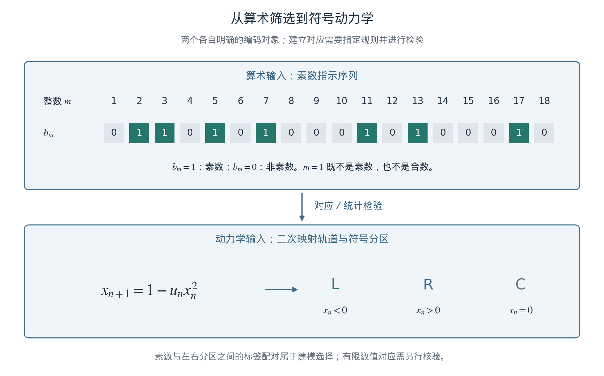

**图2.1　算术编码与动力学编码的分工。** 上支由筛法产生素数指示序列，下支由映射轨道及指定分区产生符号序列。两者之间需要说明比较对象、尺度及保留的统计量。相同的0/1字母表不意味着两种生成规则相同，也不直接赋予比特物理含义。本图为定义示意，没有新增拟合。

## 2.2 动力学逆向研究：带合并点及其适用范围

### 2.2.1 映射、轨道与符号

作者的素数研究采用二次映射及其符号动力学，考察筛序列与轨道模式之间的对应。[7](#r7) 本文统一写为

$$
x_{n+1}=f_u(x_n)=1-u x_n^2.
\tag{2.3}
$$

在指定分区后，可将$x_n<0$记为$L$、$x_n>0$记为$R$，临界点$x_n=0$另记为$C$。映射参数$u$、初态和分区共同决定符号轨道；$LRL$等有限词则定义待统计的轨道事件。这里$n$是映射迭代索引，与式(2.1)的整数标签$m$先分别定义。二次映射展示简单规则产生复杂行为的能力，是研究这种表示的合适基准。[26](#r26)

素数前作提出了启发式的对应、猜想及统计匹配方案，并报告相关数值结果。[7](#r7) 对应关系的强弱取决于实际建立的映射：有限符号词的出现频率相近，弱于逐项序列相同；逐项编码相同，也仍需额外条件才能构成整个动力系统的拓扑共轭。本文沿用前作提供的研究线索，不把这些层次合并为已经建立的物理同构。

### 2.2.2 两种参数约定与两个不同事件

通常称为logistic映射的另一形式是$g_r(y)=r y(1-y)$。对固定$r>2$，取

$$
y=A_r(x)=\frac12+\frac{r-2}{4}x,
\qquad u=\frac{r(r-2)}4,
\qquad A_r\circ f_u=g_r\circ A_r.
\tag{2.4}
$$

这个固定参数坐标关系说明，比较数值之前必须说明使用的是$u$还是$r$。它也帮助区分两个经常被“混沌边缘”一词混用的事件：主倍周期级联的积聚点为$u_F\simeq1.401155$，对应$r_F\simeq3.569946$；两个混沌带合为一个的带合并点为$u_M\simeq1.543689$，对应$r_M\simeq3.678574$。[27](#r27), [28](#r28) 两篇算术前作使用的主要基准是后者。

带合并点提供了具体可研究的轨道结构；它并不意味着一侧全为周期运动、另一侧全为无结构的混沌。二次族还包含更细的周期窗口和分岔结构。“临界”这一标签也不单独给出Lyapunov指数、遍历性或物理稳定性，更不能据此推导泡利原理等量子约束。

若参数改为$u_n$，式(2.4)还须谨慎使用。令$u_n=r_n(r_n-2)/4$及$y_n=A_{r_n}(x_n)$，则实际变换为$y_{n+1}=A_{r_{n+1}}\circ f_{u_n}\circ A_{r_n}^{-1}(y_n)$，一般不等于$g_{r_n}(y_n)$。因此，非自治轨道不能只换一个参数名称便视为同一系统。

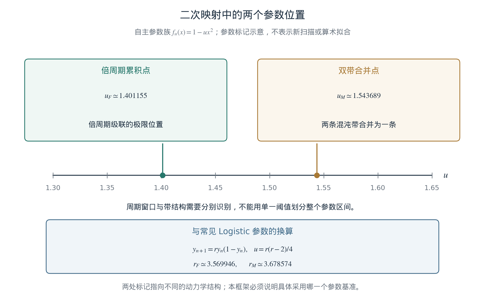

**图2.2　固定参数二次族的两个不同事件。** 图中区分倍周期积聚点与双带合并点，并列出logistic坐标下的对应参数。横向位置是参数示意，不是本轮计算的分岔图；未将整段参数区间划为单一动力学状态。数值与坐标约定见式(2.4)及文献27、28。

## 2.3 对数尺度与系数：怎样理解约12.73

### 2.3.1 平均稀疏、符号事件与条件匹配

素数平均密度中的$1/\ln X$，与素数对统计中的平方对数具有不同来源。对相距2的素数对，令$\pi_2(X)$计数满足$p\le X$且$p,p+2$均为素数的$p$。Hardy–Littlewood猜想的相应形式为

$$
\pi_2(X)\sim 2C_2\int_2^X\frac{ds}{\ln^2s},
\qquad
C_2=\prod_{p>2}\left(1-\frac{1}{(p-1)^2}\right)
\simeq0.6601618,
\tag{2.5}
$$

乘积遍历大于2的素数。[29](#r29) 此处将该猜想系数作为匹配目标；它与式(2.2)的素数定理具有不同的数学地位。

设固定二次映射中的$LRL$事件具有正的长期频率$\mu_{LRL}$。若构造一个加权计数，并假设相应加权渐近关系成立，则

$$
\widehat\pi_2(N)=\kappa\sum_{n=n_0}^{N}
\frac{\mathbf1_{LRL}(n)}{\ln^2 n}
\sim\kappa\mu_{LRL}\int_{n_0}^{N}\frac{ds}{\ln^2s},
\qquad n_0>1.
\tag{2.6}
$$

于是，为使首项系数与式(2.5)一致，需要选择

$$
\kappa\mu_{LRL}=2C_2,
\qquad \kappa=\frac{2C_2}{\mu_{LRL}}.
\tag{2.7}
$$

这给出了前作约12.73这一系数的含义：在指定映射、符号事件和归一化下的条件匹配。线性响应或窗口规则中的比例系数若被吸收进$\kappa$，也成为这一约定的一部分。由于右端已经使用$C_2$，式(2.7)本身不构成从混沌独立预测双素数常数；它也没有能量或时间单位，不能直接解释为宇宙耗散率。[7](#r7)

### 2.3.2 观测规则变化与映射参数变化

前作配套实现使这一分工更具体：双素数常数示例固定$u=1.543689$，对$LRL$事件按$\kappa/\ln^2n$累加权重；另一间距比较示例在固定映射上，对选定事件再施加随索引变化的随机稀疏化。[30](#r30) 后者的输出还包含随机选择。它们展示如何在动力学骨架上构造变化的统计读数，与每一步直接改变映射参数$u_n$是两种实现。

这种区别并不削弱研究非自治模型的动机，而是明确非平稳性位于哪里。若一条轨道对固定事件具有正的长期频率，那么这个频率不能同时渐近为零；为了描述素数稀疏性，可以改变观测窗口、权重、参数，或扩展状态系统。素数定理只约束输出计数，并不唯一决定采用其中哪一种机制。概率模型也可以研究确定性整数序列的统计，不必将其理解为素数本身由随机过程产生。

RSM的选择是在后续物理候选中显式引入内部演化自由度，使响应系数随之变化。平方对数因此具有可追溯的算术与数值动机，但其在动力学中的位置、幅度及与物质的耦合，仍由候选模型另行规定。

## 2.4 黎曼零点、谱统计与非自治响应

### 2.4.1 谱的索引与物理时间

黎曼零点与量子谱的联系，是把算术问题引向物理思考的重要线索。Montgomery的成对关联研究、Dyson指出的随机矩阵联系，以及Odlyzko的零点数值分析，为这种联系提供了不同层面的依据。[4](#r4), [5](#r5) Hilbert–Pólya思路则提出寻找适当自伴算符的可能性；构造其谱与全部非平凡零点的严格对应，比匹配有限谱统计要求更强。[6](#r6)

随机矩阵描述中的系综还取决于系统对称性。时间反演等条件影响应比较正交、酉还是辛类型的统计，不能把所有重原子核能谱一概写成GUE。[31](#r31) 同样，核能级、原子电子跃迁和数学零点也不因某种间距统计相似而逐项相同。

零点序号$j$和零点高度$\gamma_j$描述同一个数学谱的不同位置。用更多迭代去计算更高的零点，改变的是计算过程及采样范围；数学零点本身不会随宇宙时间老化。物理上，固定哈密顿量的定态能级保持不变；若耦合或环境随时间变化，瞬时谱也可能变化。因此真正需要建立的联系是“哪个物理自由度改变了哪个算符”，而不是把谱索引的变化直接认作时间变化。

### 2.4.2 已发表零点模型的具体推进

作者的零点前作进一步让二次映射参数显式依赖迭代步数。沿用其式(3)的结构、把映射参数统一记作$u_n$，可写为

$$
x_{n+1}=1-u_nx_n^2,
\qquad
u_n=u_M+\frac{k_1}{\ln^2n}+\frac{k_2}{\ln^3n},
\qquad n>1.
\tag{2.8}
$$

其中$k_1,k_2$为该模型的参数，不等于式(2.7)的匹配系数$\kappa$。前作选取的参数从上方趋向$u_M$；一般而言，趋近方向取决于系数符号，逆对数项趋零只意味着与极限的偏离消失。[8](#r8) 例如，单独取$u_n=u_M-\kappa/\ln^2n$且$\kappa>0$时，参数随$n$增大而上升。本文因而将“衰减”用于明确的偏离量或响应项。

平方指数还有一条更直接的谱尺度动机：高度$T$附近的零点平均间距渐近具有$2\pi/\ln(T/2\pi)$的尺度；若再假定所用谱代理的相位间距与参数扰动幅度的平方根成比例，就会得到逆对数平方的候选扰动。[5](#r5), [8](#r8) 这条推理中，平均谱密度、假定的平方根响应及把谱尺度关联到迭代索引，是分别需要说明的环节。前作尚未为其经验转移矩阵证明该响应定律；它给出了选取平方指数的现象学理由，而未排除其他响应指数。

该研究利用经验耗散转移矩阵的特征相位及低阶零点校准，报告了探索性的数值谱对应。其时间平均矩阵是非自治传播的启发式替代，不等同于逐步有序乘积的谱；留出误差高于训练误差，模型自身展开后的局部间距统计尚未复现GUE。[8](#r8) 这些结果使非自治谱构造成为可继续研究的对象，也明确了改进谱预测与解释算符含义的任务。

### 2.4.3 从候选结构参数到可计算的集体频率

RSM在上述动机上增加物理建模的一步：以内部坐标$R$及共轭动量参与共同哈密顿量，并让格点回复系数采用第0章式(0.2)的逆对数平方响应。标量二次映射本身是非可逆的一维映射，不直接携带后续正则体系所需的非退化辛结构；引入格点坐标、动量及共同能量，是需要明确说明的构造。

这一步已经能够产生可计算的频率响应。对第0章格点模型，冻结$R=\bar R$，并在线性极限$g=0$取周期模态，则

$$
\omega_a^2(\kappa_m;\bar R)
=M^2(\bar R)+\frac{4v^2}{a^2}
\sin^2\!\left(\frac{\kappa_m a}{2}\right),
\qquad \kappa_m=\frac{2\pi m}{L}.
\tag{2.9}
$$

$m$在这里为模态整数，$a$为格距，$L$为区间长度；$\kappa_m$为空间波数，与匹配系数$\kappa$不同。式(2.9)沿用已有格点—连续场推导，表明回复系数变化如何进入集体模的频率平方。[11](#r11) 它是冻结算子的诊断；沿真实时变轨道使用瞬时频率，还需要慢变等条件。当前模型的经典集体模尚未被识别为真实原子能级。

这也说明物理读数不必原样复制输入函数。即使$M^2$含有逆对数平方，频率仍取平方根，频率比还依赖两个模态的响应，天文信号又可能包含传播和投影。精细结构常数、Hubble归一化、测量不确定度和CMB谱因此分别需要自己的读数映射；第1章汇总的四个小项目正是这些接口的初步检验。[19](#r19), [22](#r22), [23](#r23), [24](#r24)

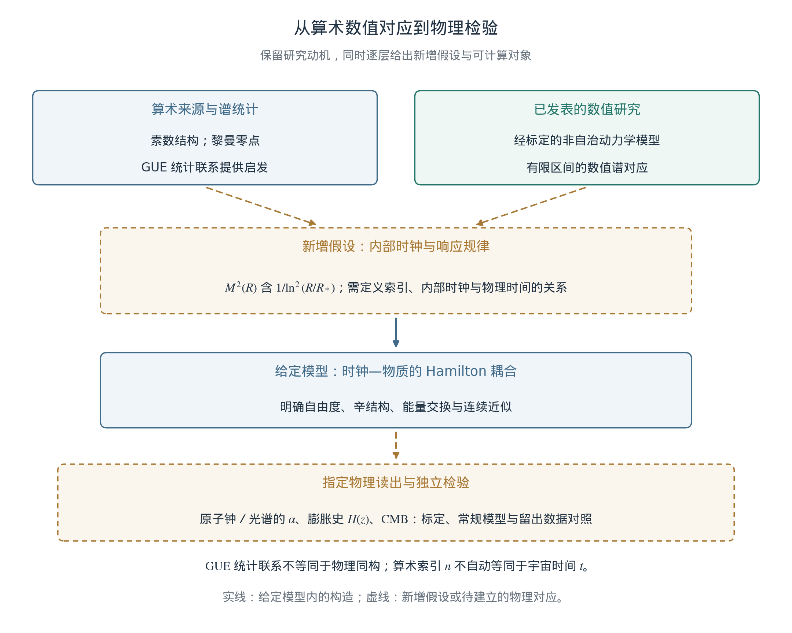

**图2.3　从数值对应到物理假设。** 已发表算术研究提供模型与启发，虚线连接标示需要额外建立的时间、相互作用和读数关系。辛动力学与连续描述使其中一部分可以计算；独立数据及替代输入用于检验具体候选。谱统计联系、参数随迭代变化和物理常数随宇宙时间变化，分别属于链条中的不同命题。

### 2.4.4 真实算术输入是否带来特殊响应

除平滑包络外，我们已经把真实零点间距残差接入共同哈密顿量，检查算术排列能否带来额外的宏观特征。[11](#r11) 使用有限精度零点表展开间距后，固定归一化区间及八个评价块，并与每块99个IAAFT替代输入及其节点谱配对版本比较；加上基线，共完成1593例主计算。[12](#r12)

真实输入能够改变所选场与时钟轨迹，但八块的主能量交换指标均位于两类替代集合的中心95%范围内。当前尚未检出该桥接中特殊的算术响应。同时，节点统计匹配并未保证插值、窗化后的实际驱动及其导数具有相同功率谱，检出能力也未完成量化。因此这一结果约束的是已实施的候选与对照范围，既不能当作算术物理联系的确认，也不能排除所有可能联系。

该计算使“黎曼结构进入动力学”成为一个具体、可追踪的问题：算术数据如何归一化，通过哪个项作用于系统，是否保留反作用，又用什么读数判断差异。后续最有价值的推进，是从微观机制约束这些选择，并在改进对照后检验新的固定评价区间。

## 2.5 小结：从离散规则进入物理架构

本章建立了RSM的算术来路：素数筛给出确定的编码，符号动力学提供比较结构的方法，双素数的对数尺度启发条件匹配，已发表零点模型进一步研究显式非自治的谱构造。平方对数由此成为有明确来源的候选形式；现有证据尚未把它唯一确定为真实物理相互作用的规律。

我们进一步提出，让内部演化与物质自由度共享动力学，使缓慢变化的结构参数能够产生可计算的集体响应。已有辛格点、连续近似和算术残差检验，为这一步提供了具体基准。下一章将据此展开宇宙同步架构：定义完整状态、局部关联、更新规则及时间含义，使“源代码”的比喻转化为可以逐项检验的模型。

# 第3章 形式化：宇宙同步架构

**本章提要。** 前两章给出了物理问题与算术动机，本章进一步定义承载这些设想的状态系统。RSM保留原稿的同步演化及逻辑—空间双层构想，以完整状态、共同动力学和明确读数组织模型。现有基准已经把逆对数平方响应、内部时钟反作用与格点演化放入同一个计算过程；将其解释为基本时间节拍、量子关联或真实时空，则需要另外建立物理对应。本章据此说明架构怎样支持可复现计算，以及局域传播、守恒和测量应分别接受什么检验。

## 3.1 架构综合：从元胞自动机到同步演化

### 3.1.1 同步规则的研究用途

元胞自动机以状态及局部更新规则研究集体行为，为从离散过程构造宏观描述提供了一种思路。’t Hooft的元胞自动机解释进一步探索确定性结构与量子描述之间的关系。[9](#r9) 量子元胞自动机也有以离散时间、局部状态代数和有限传播为起点的明确构造。[32](#r32) 这些研究说明可以把“离散演化”转成数学问题；各自的状态、可逆性和测量含义仍须具体定义。

RSM采用同步演化作为当前模型的组织原则：在约定的阶段边界记录完整状态，明确每个更新读取哪些变量，再按同一动力学产生下一状态。同步并不要求程序的所有指令在硬件上同时执行，而要求执行顺序不悄悄改变模型中的依赖关系。它使相同初态、相同输入和相同规则具有明确的比较对象，适合检查非自治响应与反馈。

这里的统一序号首先是模型的时间标签。把它提升为宇宙基本时间的假设，需要进一步解释不同观测者的钟读数及相对论关系。守恒定律、纠缠或计算规模本身尚不能唯一选定某种同步架构。

### 3.1.2 状态组织与物理内容

原稿提出实体—组件—系统（ECS）来组织模拟。这一设计可以保留：实体标识负责区分对象，组件记录状态数据，系统实现相互作用和更新。对现有格点基准，位置索引、场坐标与动量便是可操作的对象；粒子质量、自旋及其他物理属性则需要由具体模型定义，不能仅靠组件名称获得物理含义。

ECS是可替换的实现方式，物理内容由状态、动力学及读数决定。当前代码使用数组、力评估与分阶段积分，尚未实现完整ECS调度器。并行实现可以使用缓冲区或其他方法维持相同读取语义；这些软件选择将在第7章展开。

按观察范围改变计算分辨率，也可以作为数值近似，但须控制其对预测的误差。若进一步假设观测行为改变物理状态，就必须定义观测者、测量作用及概率规则。单纯的细节层次管理不能承担波粒二象性的推导。

## 3.2 离散状态系统与已有更新基准

### 3.2.1 完整状态、空间与时间

当前计算采用一维周期格点及一个空间均匀的内部时钟。对固定$N$、$L$和$a=L/N$，完整状态写为

$$
Z_k=\bigl(q_0^k,\ldots,q_{N-1}^k,R^k;
p_0^k,\ldots,p_{N-1}^k,P_R^k\bigr),
\qquad \tau_k=kh.
\tag{3.1}
$$

其中$p_\ell=a\,dq_\ell/d\tau$，$P_R=I\,dR/d\tau$，$I>0$；$k$为数值步号，$h$为固定积分步长，$\tau$为模型演化时间。第2章的映射索引$n$、零点序号$j$及物理宇宙时间$t$另行定义。内部坐标$R$通过动力学变化，并不是每一步手动增加的帧计数器。

式(3.1)定义的是有限维经典相空间。空间采样离散，而坐标和动量仍为实变量；数学状态并不是有限比特集合。若以后改用量子态空间，还需指定局部自由度、算符代数、演化与测量。本文不以态矢符号代替这些尚待完成的定义。

目前的一维周期盒用于建立可计算基准。三维邻接、边界、动态几何或基本物理格距，都是需要明确构造的扩展。将$a$直接命名为普朗克长度，并不能使当前模型自动获得这些性质。

### 3.2.2 逆对数响应进入共同动力学

将配置和动量分别记为$Q=(q_0,\ldots,q_{N-1},R)$、$P=(p_0,\ldots,p_{N-1},P_R)$。第0章的共同哈密顿量可以分为

$$
H(Q,P)=T(P)+V(Q),\qquad
T(P)=\frac12P^{\mathsf T}\mathsf M^{-1}P,
\qquad \mathsf M=\operatorname{diag}(a,\ldots,a,I).
\tag{3.2}
$$

$V$包含最近邻差分能、$M^2(R)q_\ell^2$回复项及局部四次势。纯包络的$M^2(R)$取式(0.2)；算术检验另加$\varepsilon_{\rm ar}w(R)S(R)$。响应在$R>R_*$的有效域内定义，窗口、样条和参考尺度在一次计算中保持固定。[11](#r11)

这让非自治思想有了明确位置：整体$H$不显含$\tau$，而物质子系统沿共同轨迹感受到随$R(\tau)$变化的系数。内部时钟既调制场，也承担反作用；算术残差的完整导数同样进入时钟方程。因此，增加时间响应不再只是每隔若干步改一个外部参数，而成为完整状态中的相互作用。

### 3.2.3 同一配置评估与分阶段提交

现有实现采用Störmer–Verlet的半步动量—整步位置—半步动量更新。[10](#r10), [11](#r11) 用式(3.2)的向量记号，可写为

$$
\begin{aligned}
P_{k+1/2}&=P_k-\frac h2\nabla_QV(Q_k),\\
Q_{k+1}&=Q_k+h\mathsf M^{-1}P_{k+1/2},\\
P_{k+1}&=P_{k+1/2}-\frac h2\nabla_QV(Q_{k+1}).
\end{aligned}
\tag{3.3}
$$

第一次力评估同时读取旧的场与时钟配置，第二次读取已完成位置更新后的共同配置。每一次评估中，所有分量来自同一个$Q$。代码以速度存储动量等价量，先形成完整加速度数组，再更新各变量；在固定$a,I$下与式(3.3)一致。逐格原地更新位置并立即让后续格点读取新邻点，则一般会改变这套演化规则。

固定步长、精确算术且各子步保持在势能定义域内时，该分裂具有二阶精度、辛性和时间可逆性。它通常不逐步精确保持原哈密顿量；连续自主系统的能量守恒来自共同$H$的正则方程。同步安排使实现符合这些方程，守恒仍需按能量收支与误差检查。对浮点程序，可复现性还涉及归约顺序、输入版本与随机种子；现有工作没有宣称跨硬件逐位一致。

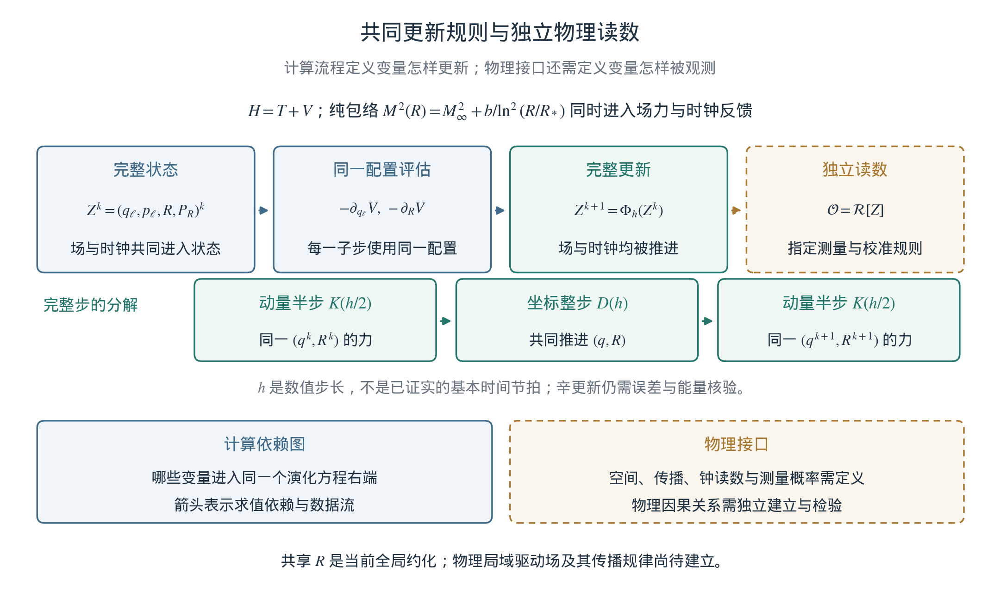

**图3.1　当前可计算的同步架构。** 完整状态同时包含场与时钟，每次动量更新从同一配置评估两者的力；位置更新后重新评估。下层分别列出计算依赖与物理接口。共享$R$的反馈属于当前全局约化，数值步长也尚未被识别为基本时间节拍。本图描述已有模型及待建立联系，没有新增模拟。

### 3.2.4 有限采样与物理信息的区别

离散空间可以为给定数值模型提供有限空间波数范围，但这尚未完成量子场论的重整化，也未解释真空能为何很小。有限格点数配合实变量仍允许连续取值；配合无限维局部量子空间也不自动产生有限信息容量。若要讨论基本信息界，还需给出可区分状态、能量约束及其与几何的关系。

第1章的真空能问题因而继续存在于物理接口中。格距、时间步长及机器字长具有各自作用，不能把它们造成的计算截断合并称为一种宇宙基本截止。

## 3.3 两层同步：状态关联与物理因果

### 3.3.1 逻辑层描述什么

原稿的逻辑层在这里具体化为状态依赖图$G_L$：一条有向边表示某变量参与另一变量的更新，图距离$d_L$计数相应依赖路径。它帮助检查更新次序、共享变量和可能的信息通路。物理距离$d_P$则须由格点的空间嵌入或将来的有效几何定义。二者承担不同任务，$d_L$并不是已经建立的第二套时空度规。

两个位置可以共同依赖一个参数，也可以在数据结构中共享标识。由此得到的是联合状态的表达方式。要判断物理关联，还必须定义如何制备状态、实施局部操作及读取结果；若共享变量允许一侧控制另一侧的可观测分布，还需检查相应物理传播机制。

### 3.3.2 量子关联必须满足的测量条件

共享经典数据为Bell检验提供了清楚的例子。设两侧测量选择为$x,y\in\{0,1\}$，结果$A,B=\pm1$，共享变量为$\lambda$。若满足测量选择独立性和局部分解，则

$$
\begin{gathered}
\rho(\lambda\mid x,y)=\rho(\lambda),\\
P(A,B\mid x,y,\lambda)=P(A\mid x,\lambda)P(B\mid y,\lambda),\\
\left|E_{00}+E_{01}+E_{10}-E_{11}\right|\le2,
\qquad E_{xy}=\langle AB\rangle_{x,y}.
\end{gathered}
\tag{3.4}
$$

这是CHSH约束所处理的统计结构。[13](#r13), [33](#r33) 同时读取一份数据或加入共同钟，不自动解除其前提。若候选采用不同的非局部依赖、测量选择关系或量子状态结构，应将改变写进模型，并计算同一组可比较概率。

量子关联还需与可控通信分开。在标准量子形式中，设$\rho_{AB}$为两侧联合密度算符，$\mathcal E_A$为A侧局部完全正保迹操作，且不按测量结果筛选样本，则

$$
\rho'_B=\operatorname{Tr}_A\left[
(\mathcal E_A\otimes\mathrm{id}_B)(\rho_{AB})
\right]
=\operatorname{Tr}_A\rho_{AB}=\rho_B.
\tag{3.5}
$$

B侧独立统计不因A侧选择这种操作而改变；条件样本的关联与这一无信号条件可以同时存在。[34](#r34) 式(3.4)—(3.5)在本章是未来量子扩展要面对的比较标准，当前经典格点尚未导出这些量子测量规则。

### 3.3.3 从算法依赖域到物理传播

同步与局部性可以共同定义一个有限步依赖域。以固定背景、无全局反馈的显式局部规则为例，令$s_i^k$为节点$i$的局部状态，$G$为固定空间邻接图，单步读取半径为整数$r$，则

$$
s_i^{k+1}=F_i\!\left(\{s_j^k:d_G(i,j)\le r\}\right)
\quad\Longrightarrow\quad
\mathrm{Dep}_{k}(s_i^{k+m})\subseteq B_G(i,mr).
\tag{3.6}
$$

$B_G(i,mr)$表示半径$mr$的图球，$\mathrm{Dep}_{k}$为对第$k$步状态的依赖集合。这个结论来自逐步合成更新规则。若每条邻接边对应长度$a$、每一步对应数值时间$h$，可形成$ra/h$的算法依赖域上界；由于$h$可以细化，它不能直接作为物理光速。

当前式(3.3)还需具体计数：即使固定$R$，完整一步会两次评估最近邻力，最终动量可以依赖旧配置中相隔两条邻接边的变量，不能直接套用“一步一格”的描述。连续时间的最近邻格点方程与有限步算法又是不同对象，局部耦合本身不保证严格截断的光锥；有效传播应结合色散、频带和连续描述检验。

若进一步假设真实基本长度与时间步长，必须在这个物理模型中建立操作性的传播界及观测者关系。常用普朗克单位满足

$$
\ell_P=\sqrt{\frac{\hbar G}{c^3}},\qquad
t_P=\sqrt{\frac{\hbar G}{c^5}},\qquad
\frac{\ell_P}{t_P}=c.
\tag{3.7}
$$

由于其定义已经包含$c$，这个比值是恒等关系，尚非从同步架构独立得到的光速预言。固定格点与共同时间标签还需要说明何种有效范围能够恢复相对论关系，以及是否产生可检验的方向或频率依赖。

### 3.3.4 当前共享时钟的范围

现有模型的场梯度项是最近邻的，但时钟通过

$$
I\frac{d^2R}{d\tau^2}
=-\frac12Q_2[M^2]'(R),
\qquad Q_2=a\sum_{\ell=0}^{N-1}q_\ell^2
\tag{3.8}
$$

接收整个周期盒的反馈，再共同调制所有格点。[11](#r11) 因而完整系统包含一个全局自由度，式(3.6)的局部前提不适用于它。当前基准应理解为均匀时钟模式与格点场的共同演化；它尚未构造所有自由度的局域传播或洛伦兹协变性。

这个约化已经可以回答内部反馈是否改变轨迹、能量如何交换以及预设晚时响应能否保留。若要进一步解释物理时空，可研究空间依赖的驱动场$R(x,\tau)$，指定其梯度能、传播或约束方程，再说明何时能够约化为均匀模式。那将是具有额外自由度的新模型，其算术来源与观测对应仍须检验。

## 3.4 架构小结：把状态、动力学与观测连接起来

RSM的同步架构目前已经有一个明确的计算落点：完整场—时钟状态、含逆对数平方的共同势能，以及与之匹配的分阶段更新。真实零点残差和替代输入可以在相同初态、响应位置与求解协议下比较；保持这一结构，使第2章的算术检验有可追踪的含义。同步规则本身不会增加该检验的证据强度。

原稿的工程—物理对照可以相应写成表3.1。表中既列出已经实施的内容，也指明赋予其物理含义所需的下一步。

**表3.1　同步架构中的定义、实现与物理接口。**

| 架构要素 | 当前明确的定义或实现 | 进一步物理化需要什么 |
| --- | --- | --- |
| 时间管理 | 数值步号$k$、步长$h$及动态坐标$R$分别定义 | 模型时间、物质钟及宇宙时间的对应 |
| 状态与组件 | 经典格点坐标、动量和共享时钟；数组实现 | 真实物质自由度；若引入量子态则需测量规则 |
| 算术响应 | 逆对数平方包络及有界残差进入同一势能 | 从算术结构确定相互作用与耦合的机制 |
| 同步更新 | 同一配置评估场与时钟的力，按式(3.3)推进 | 若赋予基本离散时间含义，需独立物理检验 |
| 守恒与验证 | 连续能量收支、辛积分、步长及独立求解核对 | 扩展模型中相同的守恒、稳定与误差条件 |
| 关联与传播 | 明确依赖图；当前含全局时钟反馈 | 局域驱动、相对论因果结构及量子关联统计 |

这些接口也联系已有的小论文：精细结构常数与光谱需要定义钟及跃迁读数；膨胀史需要给出共同背景与时间关系；CMB需要由状态和传播产生受约束的空间统计。[19](#r19), [22](#r22), [23](#r23), [24](#r24) 架构提供统一表述这些任务的方法，实际响应仍由具体物质耦合和观测模型决定。

下一章将从这里进入数学框架，展开共同哈密顿量、辛结构、反作用和能量收支，并给出格点到连续场及逆对数晚时行为的条件推导。

# 第4章 数学框架：辛演化与离散—连续映射

**本章提要。** 本章把前述架构写成可推导的数学模型：从共同哈密顿量得到场与内部时钟的双向作用，证明所用更新的辛性，并在固定有限格点的正能量分支上说明逆对数平方响应如何保留晚时主项。随后从最近邻作用导出区域能量收支、长波场方程与连续场动量守恒；在三维各向同性线性无质量波极限下，进一步得到$p_{\rm wave}=\rho_{\rm wave}/3$。CMB项目提供另一条可计算路径：从六邻域迭代导出传播速度、振荡传递函数、两点关联及球面投影谱。原稿关于算术结构、影子哈密顿量和有限精度的设想则分别落实为输入、误差工具及观测接口。这些结果建立了有条件的微观—宏观连接；真实物质耦合、量子化和引力仍需要进一步构造。

## 4.1 离散演化算符：从正则状态到辛更新

### 4.1.1 连续动力学与离散映射的分工

当前候选沿用式(0.3)的共同哈密顿量和第3章的状态。令$Q=(q_0,\ldots,q_{N-1},R)$、$P=(p_0,\ldots,p_{N-1},P_R)$，对应辛形式为

$$
\omega=\sum_{\ell=0}^{N-1}\mathrm dq_\ell\wedge\mathrm dp_\ell
+\mathrm dR\wedge\mathrm dP_R,
\qquad
\Omega=\begin{pmatrix}0&\mathbf1\\-\mathbf1&0\end{pmatrix}.
\tag{4.1}
$$

这里$\mathbf1$为$(N+1)$维单位矩阵，$p_\ell=a\dot q_\ell$、$P_R=I\dot R$，点号表示对$\tau$求导。连续正则方程定义待研究的轨迹；固定步长$h$的离散映射负责求解它。原稿进一步把离散映射视为基本物理定律的设想可以保留，但应另行规定基本步长和可观测后果。数值离散本身并不使连续方程失去数学意义。

具体响应写为

$$
\begin{aligned}
\chi&=\ln(R/R_*),\qquad \chi_i=\ln(R_i/R_*),\\
M^2(R)&=\underbrace{m_0^2+b(\chi^{-2}-\chi_i^{-2})}_{M_{\rm env}^2(R)}
+\varepsilon_{\rm ar}w(R)S(R),\qquad R>R_*.
\end{aligned}
\tag{4.2}
$$

$wS$为固定窗化算术残差，纯包络取$\varepsilon_{\rm ar}=0$；初值参数$\chi_i$在求导时保持固定。[11](#r11) 在现有无量纲基准中$R,R_*$及残差均无量纲；恢复单位时，$M^2,b,\varepsilon_{\rm ar}$具有频率平方量纲，场归一化另由能量约定确定。

完整$H(Q,P)$不显含$\tau$，因此自主；场沿$R(\tau)$感受到时间依赖，体现子系统的有效非自治响应。辛结构约束演化的几何性质，具体势能及平方指数仍须给定。第2章的一维非可逆二次映射也不能直接充当式(4.1)上的正则变换：一维实空间没有非退化辛二形式，建立高维扩展或投影关系是另一个数学任务。

### 4.1.2 算符推导：辛性与相空间体积

共同$H=T(P)+V(Q)$的动能采用常矩阵$\mathsf M=\operatorname{diag}(a,\ldots,a,I)$。定义动量子步$K_\delta:(Q,P)\mapsto(Q,P-\delta\nabla V)$和位置子步$D_\delta:(Q,P)\mapsto(Q+\delta\mathsf M^{-1}P,P)$，其雅可比为

$$
\begin{aligned}
DK_\delta&=\begin{pmatrix}\mathbf1&0\\-\delta V''(Q)&\mathbf1\end{pmatrix},
&DD_\delta&=\begin{pmatrix}\mathbf1&\delta\mathsf M^{-1}\\0&\mathbf1\end{pmatrix},\\
J^{\mathsf T}\Omega J&=\Omega,
&\det J&=1.
\end{aligned}
\tag{4.3}
$$

只要势能二阶可微，$V''$及$\mathsf M^{-1}$均为对称矩阵，代入即可验证后一行分别对两个子步成立。相应复合$\Phi_h=K_{h/2}\circ D_h\circ K_{h/2}$亦保持$\omega$；每个子步的导数须在该子步实际配置上评估。这给出第3章更新式的辛性依据。[10](#r10)

对精确算术，$\Phi_{-h}=\Phi_h^{-1}$；在足够光滑的区域，方法为二阶。保相空间体积不意味着所有轨迹有界，也不等于原$H$逐步恒定。浮点舍入、步长稳定域与连续系统的能量收支仍须分别检查。

### 4.1.3 稳定性与能量：内部时钟的反作用

记$Q_2=a\sum_\ell q_\ell^2$及$\Delta_aq_\ell=(q_{\ell+1}-2q_\ell+q_{\ell-1})/a^2$。对同一$H$求导得到

$$
\begin{aligned}
\ddot q_\ell&=v^2\Delta_aq_\ell-M^2(R)q_\ell-gq_\ell^3,\\
I\ddot R&=-\tfrac12Q_2[M^2]'(R),\\
[M^2]'(R)&=-\frac{2b}{R\chi^3}
+\varepsilon_{\rm ar}\bigl(w'S+wS'\bigr).
\end{aligned}
\tag{4.4}
$$

上撇号表示对$R$求导，窗函数和残差的导数均保留。场—时钟耦合能已计入$H_{\rm field}$，不在时钟端重复计算。于是

$$
\dot H_{\rm field}=\tfrac12Q_2[M^2]'(R)\dot R
=-\dot E_R,
\qquad E_R=\frac{I\dot R^2}{2},
\qquad \dot H=0.
\tag{4.5}
$$

纯包络且$b>0,\dot R>0$时，回复项变软，场向时钟释放能量，时钟加速。加入残差后，能流可以局部反向。这里总能量守恒来自自主正则方程；单向能流则依赖响应导数的符号。

**纯包络的条件命题。** 固定有限$N,L$与有限初始能量，取$I>0,g\ge0,v^2\ge0$、$R_i>R_*>0$、$u_i=\dot R(0)>0$，并要求$0<b<m_0^2\chi_i^2$。定义$M_\infty^2=m_0^2-b/\chi_i^2>0$及$E_0=H_{\rm field}(0)$。式(4.4)—(4.5)给出

$$
\begin{aligned}
R(\tau)&\ge R_i+u_i\tau,
&0\le Q_2&\le Q_{\max}:=\frac{2E_0}{M_\infty^2},\\
u_i&\le\dot R(\tau)\le U,
&U&=\sqrt{u_i^2+\frac{2E_0}{I}}.
\end{aligned}
\tag{4.6}
$$

证明的关键是$\ddot R\ge0$且场能单调下降、各能量项非负。固定$a>0$时，能量控制每个场坐标与动量；任意有限时间内还有$R\le R_i+U\tau$。轨迹远离对数奇点，有限维常微分方程因此能够前向全局延拓。单调有界的时钟速度趋于正极限$u_\infty$，对速度积分便有

$$
\frac{R(\tau)}{\tau}\longrightarrow u_\infty\ge u_i>0,
\qquad
M_{\rm env}^2(R(\tau))-M_\infty^2
\sim\frac{b}{\ln^2(\tau/\tau_{\rm eff})},
\qquad \tau_{\rm eff}=\frac{R_*}{u_\infty}.
\tag{4.7}
$$

最后一步使用$\ln(R/R_*)=\ln(\tau/\tau_{\rm eff})+o(1)$。这段推导回答了核心问题：**已指定的逆对数平方响应能够在反作用存在时保留晚时主项。** 它不选择出指数2，也不把$\tau$标定为宇宙年龄。更细余项及证明保存在已有技术稿中。[11](#r11)

在有限时间上，忽略反作用会得到$R_{\rm ext}=R_i+u_i\tau$，因此$\ln(R_{\rm ext}/R_*)=\ln[(\tau+R_i/u_i)/(R_*/u_i)]$。完整时钟与该规定历史的偏离满足

$$
\begin{aligned}
0\le\dot R-u_i&\le A_{\rm fb}\tau,
&0\le R-R_{\rm ext}&\le\tfrac12A_{\rm fb}\tau^2,\\
A_{\rm fb}&=\frac{bQ_{\max}}{IR_i\chi_i^3}.
\end{aligned}
\tag{4.8}
$$

这是由式(4.4)的加速度上界两次积分所得。对$0\le\tau\le T$，$A_{\rm fb}T/u_i\ll1$是充分弱反馈条件；场的相位误差仍须另查。固定初速度而增大$I$同时增加初始时钟能量，不能称为同总能量的比较。外部历史模型应核对场能变化与外功，不能附加一份恒定自由时钟能量来要求总量守恒。

上述存在性与尾律限定于纯包络、固定有限格点及正向分支。残差可能改变反馈符号；只有另外证明轨迹以正速度离开残差支撑并进入正的纯包络区域，才能恢复晚时论证。有限窗口的数值稳定也不能替代连续场或所有参数下的存在性证明。

## 4.2 从场方程到状态更新：格点与连续描述

### 4.2.1 离散化的对象与极限

原稿希望从局部状态规则产生宏观场。当前可计算版本先固定周期长度$L$、时钟惯量$I$及相互作用系数，再令$a=L/N$减小。对平滑周期场，正则归一化为

$$
q_\ell\simeq\phi(x_\ell,\tau),\qquad
\frac{p_\ell}{a}\simeq\pi(x_\ell,\tau)=\partial_\tau\phi,
\qquad
\sum_\ell p_\ell\,\mathrm dq_\ell
\longrightarrow\int_0^L\pi\,\delta\phi\,\mathrm dx.
\tag{4.9}
$$

其中$x_\ell=\ell a$，$\delta\phi$表示场空间中的变分。$p_\ell$与动量密度$\pi$相差积分权重$a$；在网格加密时丢失这个因子，会同时改变惯性与时钟源。求和的形式极限给出

$$
H_{\rm cont}=\frac{P_R^2}{2I}
+\int_0^L\left[
\frac{\pi^2}{2}+\frac{v^2\phi_x^2}{2}
+\frac{M^2(R)\phi^2}{2}+\frac{g\phi^4}{4}
\right]\mathrm dx.
\tag{4.10}
$$

连续Poisson括号为$\{\phi(x),\pi(y)\}=\delta_L(x-y)$及$\{R,P_R\}=1$，$\delta_L$为周期Dirac分布。相互作用和时钟惯量均来自同一格点模型，没有另拟合宏观势能。若保持$a$而增加$N$，改变的是体积；这需要另行规定$I$的体积标度。

### 4.2.2 差分算子与长波方程

在共同有限时段内，若足够高阶空间导数受控，中心差分展开为

$$
\frac{\phi(x+a)-2\phi(x)+\phi(x-a)}{a^2}
=\phi_{xx}+\frac{a^2}{12}\phi_{xxxx}+O(a^4).
\tag{4.11}
$$

由此得到主阶连续方程及同一耦合能产生的时钟反馈：

$$
\begin{aligned}
\phi_{\tau\tau}&=v^2\phi_{xx}-M^2(R)\phi-g\phi^3,\\
I\ddot R&=-\frac12[M^2]'(R)\int_0^L\phi^2\,\mathrm dx.
\end{aligned}
\tag{4.12}
$$

首个空间修正是在场方程右端加上$+v^2a^2\phi_{xxxx}/12$。纯包络的时钟源为$b(R\chi^3)^{-1}\int\phi^2\mathrm dx$；算术残差加入后仍须使用完整$[M^2]'$。这使原稿“局部规则到宏观响应”的设想有了具体方程，其中逆对数项和反作用都被保留。

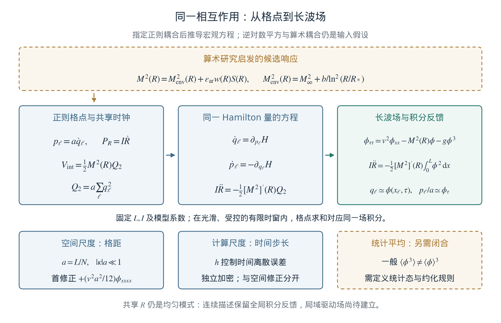

**图4.1　同一相互作用的离散—连续连接。** 规定的算术响应进入共同势能，由其得到格点力与时钟反作用，再在固定体积、受控长波条件下得到连续场及积分源。下排区分空间格距、数值步长与统计闭合。共享$R$的全局性质在连续描述中继续存在；图示没有增加新的观测或实验。

Taylor展开证明的是算子一致性。耦合解的收敛还需要初值逼近、稳定性、共同时间区间和一致的正则性控制。已有固定系数基准在指定初态与时段得到二阶空间差异及首修正后近四阶差异；逆对数完整反馈基准验证了主阶连续描述的二阶空间差异。[11](#r11) 前一基准最细参考解的一项额外精度门限未通过，记录仍保留；不能把固定系数的四阶比较直接写成完整反馈模型已获得四阶精度。详细数值在第8章展开。

**从逐点作用到区域能量收支。** 长波展开之外，有限格点上已经存在精确的收支关系。令$u_\ell=\dot q_\ell=p_\ell/a$，并记局部势$V(q,R)=M^2(R)q^2/2+gq^4/4$。把一条键的作用能均分给相邻两点，定义能量密度和向右的键能流：

$$
\begin{aligned}
e_\ell&=\frac{u_\ell^2}{2}+V(q_\ell,R)
+\frac{v^2}{4a^2}\bigl[(q_{\ell+1}-q_\ell)^2+(q_\ell-q_{\ell-1})^2\bigr],\\
J_{\ell+1/2}&=-\frac{v^2}{2a}(u_{\ell+1}+u_\ell)(q_{\ell+1}-q_\ell),
\qquad H_{\rm field}=a\sum_\ell e_\ell .
\end{aligned}
\tag{4.12a}
$$

对$e_\ell$求时间导数并代入式(4.4)，相邻作用力与键能变化相消，留下

$$
\begin{aligned}
\dot e_\ell+\frac{J_{\ell+1/2}-J_{\ell-1/2}}a
&=\frac12[M^2]'(R)\dot R\,q_\ell^2=:s_\ell,\\
\dot E_B&=J_{r-1/2}-J_{s+1/2}
+\frac a2[M^2]'(R)\dot R\sum_{\ell=r}^{s}q_\ell^2,
\qquad E_B=a\sum_{\ell=r}^{s}e_\ell .
\end{aligned}
\tag{4.12b}
$$

这里$B=\{r,\ldots,s\}$是任意连续区域。第二行由第一行直接求和，区域内部的键能流逐项抵消，只剩边界流入、流出及与时钟交换的能量。它给出明确的宏观收支律，无须先假定热平衡或随机性。该式对有限格点的连续时间正则方程精确成立；离散KDK求解的误差仍由步长控制，不能称为逐步精确守恒。对整个周期格点求和便恢复式(4.5)。

在与式(4.12)相同的平滑极限下，

$$
e=\frac{\phi_\tau^2}{2}+\frac{v^2\phi_x^2}{2}+V(\phi,R),
\qquad J=-v^2\phi_\tau\phi_x,
\qquad
\partial_\tau e+\partial_xJ=\frac12[M^2]'(R)\dot R\,\phi^2 .
\tag{4.12c}
$$

因此，能量连续性方程和微观能流使用同一系数，并非额外拟合的宏观规律。空间积分后加上$E_R$才得到总能量守恒；$R$仍是一个共享自由度，尚无具有独立局部能流的时钟场。

**连续平移与宏观动量。** 背景$R(\tau)$可以随时间变化，但没有空间依赖。将式(4.12)乘以$-\phi_x$，并用乘积法则整理，可得

$$
\begin{aligned}
\mathcal P&=-\phi_\tau\phi_x,\qquad
\Pi=\frac{\phi_\tau^2}{2}+\frac{v^2\phi_x^2}{2}-V(\phi,R),\\
\partial_\tau\mathcal P+\partial_x\Pi&=0,
\qquad J=v^2\mathcal P,\qquad
\frac{\mathrm d}{\mathrm d\tau}\int_0^L\mathcal P\,\mathrm dx=0 .
\end{aligned}
\tag{4.12d}
$$

最后一式使用周期边界，$\Pi$为动量流。时变系数可以交换场的能量，同时保留连续场的空间动量守恒，因为空间平移对称性依然存在。这一结论属于连续场方程；一般非线性有限格点只具有离散平移对称性，不能直接赋予同一连续Noether动量。

**三维线性波的有效压力。** 若把同一标量场推广至$d$维，并在冻结背景的线性无质量极限$M^2=g=0$下取行波集合，还能给出一个统计层面的宏观关系。空间动量流及平均关系为

$$
\begin{aligned}
\Pi_{ij}&=v^2\partial_i\phi\,\partial_j\phi
+\delta_{ij}\left(\frac{\phi_\tau^2}{2}
-\frac{v^2|\nabla\phi|^2}{2}-V\right),\\
\langle\phi_\tau^2\rangle&=v^2\langle|\nabla\phi|^2\rangle,
\qquad \rho_{\rm wave}=\langle e\rangle,\\
\langle\Pi_{ij}\rangle&=\frac{\rho_{\rm wave}}d\,\delta_{ij},
\qquad p_{\rm wave}=\frac{\rho_{\rm wave}}d
\ \xrightarrow{\,d=3\,}\ \frac{\rho_{\rm wave}}3 .
\end{aligned}
\tag{4.12e}
$$

推导用到两个条件：线性无质量行波经过相位平均具有动能与梯度能均分；各向同性使$\langle\partial_i\phi\,\partial_j\phi\rangle=\delta_{ij}\langle|\nabla\phi|^2\rangle/d$。此处$\rho_{\rm wave}$是能量密度，精确等号对应$V=0$的波动极限。若$|M^2|,\,g\langle\phi^2\rangle\ll v^2\kappa^2$且$|\dot\omega|/\omega^2\ll1$，背景和振幅在平均窗口内变化缓慢，则该关系可作为近无质量、弱非线性情形的近似。于是三维标量波集合具有与辐射同形的压力关系。它既不是任意非线性状态的状态方程，也没有导出光子、黑体谱或宇宙膨胀方程。原一维模型在相同无质量波动极限下给出的是$p_{\rm wave}=\rho_{\rm wave}$。

上述恒等式已另用符号代数和非均匀随机格点检查，并用人为构造的三维各向同性波集合核对压力系数；归档见本项目的微观—宏观验证记录。[53](#r53)

### 4.2.3 邻接、色散与时间步长

冻结$R=\bar R$并令$g=0$，取波数$\kappa=2\pi m/L$的周期模态，可以独立检查空间算子：

$$
\begin{aligned}
\omega_a^2(\kappa)&=M^2(\bar R)+\frac{4v^2}{a^2}
\sin^2\!\left(\frac{\kappa a}{2}\right),\\
\omega_0^2(\kappa)&=M^2(\bar R)+v^2\kappa^2,\\
\omega_{\rm corr}^2(\kappa)&=M^2(\bar R)+v^2\kappa^2
-\frac{v^2a^2}{12}\kappa^4.
\end{aligned}
\tag{4.13}
$$

场方程中的正四阶导数项对应频率平方的负四次修正，两者一致。近似要求$|\kappa|a\ll1$；若把修正方程无截止地推广到任意大波数，会产生正质量原格点没有的失稳。原格点与有限项有效展开各有适用范围。

对一个$\omega_a>0$的冻结线性模态，式(3.3)给出的离散相位满足

$$
\cos\theta=1-\frac{h^2\omega_a^2}{2},\qquad
\widetilde\omega=\frac{2}{h}\arcsin\!\left(\frac{h\omega_a}{2}\right),
\qquad 0<h\omega_a<2.
\tag{4.14}
$$

最后的不等式规定有界振荡分支；边界$h\omega_a=2$一般仍有线性增长。它检查的是冻结线性模式，不是完整非线性场—时钟的全局稳定性证明。加密空间时最高频率升高，数值时间步长也须相应控制。[10](#r10)

式(4.13)的空间色散与式(4.14)的时间积分色散因而能够分开比较。第3章已说明，完整KDK步也不是“一步只读取一格”。这里的$v$是模型参数，尚未识别为实测光速；全局时钟反馈与局域相对论传播仍是不同问题。

**CMB六邻域迭代给出的另一条长波路径。** CMB项目的线性核心使用三维周期格点及归一化算子

$$
\begin{aligned}
(L_{\rm C}q)_{\boldsymbol x}
&=\frac16\sum_{i=1}^3
(q_{\boldsymbol x+\boldsymbol e_i}+q_{\boldsymbol x-\boldsymbol e_i}-2q_{\boldsymbol x}),\\
q_n&=(2\mathbf1+c_n^2L_{\rm C})q_{n-1}-q_{n-2},
\qquad c_n^2=\frac{A_p}{[\ln(n+c_0)]^p},\\
\lambda(\boldsymbol k)&=1-\frac13\sum_{i=1}^3\cos k_i
=\frac{k^2}{6}-\frac1{72}\sum_i k_i^4+O(k^6),
\qquad 0\le\lambda\le2 .
\end{aligned}
\tag{4.14a}
$$

这里$A_p>0,c_0>1$，$\boldsymbol e_i$为一个格点的位移，$-\lambda$为$L_{\rm C}$的本征值。$\boldsymbol k$是无量纲格点相位，$k=|\boldsymbol k|$；$L_{\rm C}$本身不含格距平方的倒数。主比较取$p=2$，常系数对照取$p=0$。[24](#r24) 这一核心没有局部质量项与立方力，时间历史由外部给定，不能与式(4.4)直接等同。

恢复格距$a_{\rm C}$和迭代间隔$\delta$，令$\boldsymbol k=a_{\rm C}\boldsymbol\kappa$、模型时间$\tau_{\rm C}=(n-1)\delta$。对空间平滑、时间变化受控的场，中心差分给出

$$
\begin{aligned}
L_{\rm C}\phi&=\frac{a_{\rm C}^2}{6}\nabla^2\phi
+\frac{a_{\rm C}^4}{72}\sum_i\partial_i^4\phi+O(a_{\rm C}^6),\\
v_{\rm C}^2(\tau_{\rm C})&=\frac{a_{\rm C}^2c_n^2}{6\delta^2},
\qquad
\phi_{\tau_{\rm C}\tau_{\rm C}}
=v_{\rm C}^2(\tau_{\rm C})\nabla^2\phi+\text{高阶修正}.
\end{aligned}
\tag{4.14b}
$$

这就从微观迭代系数得到了长波传播速度。$1/6$来自三维六邻域的归一化，不能漏掉；四阶项保留了立方格点的方向性。式(4.14b)是受控尺度上的一致性关系；若进一步取连续极限，必须同步规定$a_{\rm C},\delta$及系数历史的缩放，使$v_{\rm C}$有有限平滑极限。固定所有离散参数而仅令$\delta\to0$不构成这一证明。$\tau_{\rm C}$尚未标定为宇宙时间，$v_{\rm C}$也尚未标定为光速。

振荡谱同样可以直接推出。对冻结$c_n^2=c^2$、初值$q_{-1}=q_0$及稳定模态$0<c^2\lambda<4$，有

$$
\cos\theta=1-\frac{c^2\lambda}{2},
\qquad
\widehat q_N=T_N(\lambda)\widehat q_0,
\qquad
T_N(\lambda)=\frac{\cos[(N+\tfrac12)\theta]}{\cos(\theta/2)} .
\tag{4.14c}
$$

这是二阶递推的闭式解，因而$|T_N|^2$天然出现振荡峰谷。零模态由连续延拓给出$T_N(0)=1$。初值$q_{-1}=q_0$表示后向差分速度为零；它使第一步为$q_1=(1-c^2\lambda)q_0$，不同于连续振子零速度的二阶起步$q_1=(1-c^2\lambda/2)q_0$。拟合和数值验证须保持同一初值约定。常系数已经产生峰谷，所以“存在声学样振荡”本身不能鉴别$p=2$。

对时变系数，每步模态矩阵在$(\widehat q_n,\widehat q_{n-1})$坐标中行列式为1；二维情形下它也是辛矩阵。但这只给出逐步几何结构，既不证明原能量恒定，也不使外部给定的系数历史自动变为自主时钟。长波、缓变近似下，传播相位的主要累计尺度为

$$
s_N=\frac1{\sqrt6}\sum_{n=1}^N\sqrt{c_n^2}
\sim \sqrt{\frac{A_p}{6}}\,
\frac{N}{(\ln N)^{p/2}},
\qquad
p=2:\quad s_N\sim\sqrt{\frac{A_2}{6}}\frac{N}{\ln N}.
\tag{4.14d}
$$

$s_N$以格点数为单位，乘以$a_{\rm C}$才是相应传播距离。渐近式来自慢变正函数的求和—积分比较：$x/(\ln x)^{p/2}$的导数与$(\ln x)^{-p/2}$之比趋于1，固定$c_0$不改变主项。逆对数平方使传播积累变慢，但$s_N$仍发散；它不是有限宇宙视界的证明，也不等于离散递推严格支撑范围的边界。

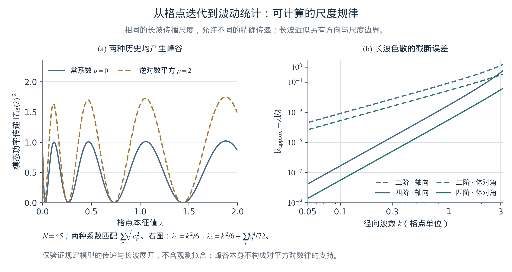

**图4.2　微观迭代的可计算宏观读数。** 左图比较$N=45,c_0=10,A_2=0.45$的逆对数平方历史与常系数历史；后者匹配相同$s_N$，两者均产生振荡传递。右图比较六邻域精确本征值与长波展开，分别沿坐标轴及空间对角方向显示二阶、含四阶修正的相对误差。曲线由独立验证脚本生成，不使用天空数据，也不比较观测拟合优劣。[53](#r53)

## 4.3 离散流形映射：算术输入与宏观描述

### 4.3.1 算术结构怎样进入相互作用

素数和零点前作提供低维动力学、索引演化与谱对应的研究动机。[7](#r7), [8](#r8) 在当前正则模型中，明确的接入位置是式(4.2)：平滑包络与窗化零点间距残差共同调制二次势，并通过导数产生反作用。尚未从双素数间距推导格点邻接、$v$或普朗克常数；原稿的“算术骨架”应沿这些具体问题继续研究。

现有真实残差与替代输入比较已经运行，但没有检出相对于所构造对照集合的特殊宏观响应。窗化、插值后真正进入动力学的驱动谱尚未严格匹配，检出能力也待量化。[11](#r11) 因此，算术输入已进入模型，其独有物理作用仍需要更强对照和明确读数。

变量变换也须保留正则结构。例如改用$\chi=\ln(R/R_*)$时，

$$
P_\chi=RP_R,\qquad
P_R\,\mathrm dR=P_\chi\,\mathrm d\chi,\qquad
E_R=\frac{P_\chi^2}{2IR^2}
=\frac12IR^2\dot\chi^2.
\tag{4.15}
$$

因而本章的自由$R$并不等同于具有恒定动能系数的正则对数字段。此前指数势驱动场、精细结构常数响应及膨胀史恢复可以作为其他候选接口，但不能只因出现相同对数就合并其方程或参数。[11](#r11), [19](#r19), [22](#r22)

**把变化的传播系数接入内部时钟。** 两条路径的作用位置不同：当前自主模型让$M^2$变化，CMB迭代让空间耦合变化。若希望用共同内部时钟连接二者，一个可明确求导的候选扩展是

$$
\begin{aligned}
H_G&=\frac{P_R^2}{2I}
+\int\left[\frac{\pi^2}{2}+\frac{G(R)}2|\nabla\phi|^2
+\frac{M^2(R)}2\phi^2+\frac g4\phi^4\right]\mathrm d^dx,\\
\phi_{\tau\tau}&=G(R)\nabla^2\phi-M^2(R)\phi-g\phi^3,\\
I\ddot R&=-\frac{G'(R)}2\int|\nabla\phi|^2\,\mathrm d^dx
-\frac{[M^2]'(R)}2\int\phi^2\,\mathrm d^dx .
\end{aligned}
\tag{4.15a}
$$

取光滑$G(R)>0$，局部长波速度为$\sqrt{G(R)}$；$G=v^2$恢复原场方程。可以假设$G(R)=G_\infty+b_G/\ln^2(R/R_*)$，但其形式和参数仍是输入。变化的空间耦合同时产生梯度能的时钟反作用，故不能只替换传播速度而删去最后一行的第一项。该扩展的正则导数与总能量交换已经代数核对；尚未用它重跑CMB拟合，也没有把式(4.7)的全部条件自动推广至此。[53](#r53) 它提供的是下一阶段能够实施的共同模型，而非已完成的跨项目统一。

### 4.3.2 平滑场、统计平均与几何

式(4.9)—(4.12)完成的是指定模型的长波描述。空间坐标和周期区间原已给定，因此尚未从无几何的比特系统导出流形。其成立依据是采样、差分一致性及动力学控制；仅增加格点数或援引大数定律，都不能替代这些条件。

统计约化是另一步。以已定义统计集合中的$\phi=\bar\phi+\eta$、$\langle\eta\rangle=0$为例，若相关矩存在，则

$$
\langle\phi^3\rangle
=\bar\phi^3+3\bar\phi\langle\eta^2\rangle
+\langle\eta^3\rangle,
\qquad \bar\phi=\langle\phi\rangle.
\tag{4.16}
$$

因此用平均场替换微观变量并不会自动闭合非线性方程；共同演化的$R$还可能与$\phi$相关。消去自由度通常需要指定统计态，并处理记忆和涨落；已有最优预测研究给出了这种问题的明确构造。[35](#r35) 本轮尚未执行这项约化，温度、耗散和有效引力也没有由长波展开自动得到。

**线性情形可以精确推进二点统计。** 对式(4.14a)的同一初值$q_{-1}=q_0$，不必预先取连续极限即可定义

$$
\begin{aligned}
T_{-1}(\lambda)&=T_0(\lambda)=1,\\
T_n(\lambda)&=(2-c_n^2\lambda)T_{n-1}(\lambda)-T_{n-2}(\lambda),\\
K_N&=F_NK_0F_N^{\mathsf T},\qquad
P_N(\boldsymbol k)=|T_N(\lambda(\boldsymbol k))|^2P_0(\boldsymbol k).
\end{aligned}
\tag{4.16a}
$$

$F_N$为傅里叶模态乘以$T_N$后变换回格点的实线性算子，$K$为减去均值后的协方差矩阵。协方差式及其逐模态方差关系对任何有限二阶矩初始集合成立。若初始空间统计平移不变，傅里叶协方差对角化，此时逐模态功率足以描述完整二阶统计。这是一条从局部迭代到宏观涨落统计的精确关系，不需要另设有效谱形。高斯初值经线性映射仍为高斯；这里高斯性来自初始集合，不是辛性使任意分布自动高斯化。若初速度独立随机，则还须保留位置、速度及其交叉协方差，单一$P_0$不足以描述输出。

以下关联与角谱均对减去集合均值的涨落场定义。为了连接空间尺度，进一步采用无限体积的连续近似，并约定$\phi(\boldsymbol x)=\int\widehat\phi(\boldsymbol\kappa)e^{i\boldsymbol\kappa\cdot\boldsymbol x}\mathrm d^3\kappa/(2\pi)^3$。若统计齐次、各向同性，两点关联和每对数波数区间的方差满足

$$
\begin{aligned}
\xi_N(r)&=\frac1{2\pi^2}\int_0^\infty
\kappa^2P_N(\kappa)\frac{\sin(\kappa r)}{\kappa r}\,\mathrm d\kappa,\\
\Delta_\phi^2(\kappa)&=\frac{\kappa^3P_N(\kappa)}{2\pi^2},
\qquad \langle(\phi-\langle\phi\rangle)^2\rangle
=\int_0^\infty\Delta_\phi^2(\kappa)\,\mathrm d\ln\kappa .
\end{aligned}
\tag{4.16b}
$$

两点关联中的角积分给出$\sin(\kappa r)/(\kappa r)$。于是传递函数改变的不只是图像外观，还改变给定距离上的相关性以及各尺度对总方差的贡献。所需积分应收敛，或者保留模型的红外、紫外截止；有限立方格点上的精确表达仍是傅里叶求和。

**从三维场到天空角谱。** 取半径$r_s$的薄球壳读数$s(\widehat{\boldsymbol n})=\phi_N(r_s\widehat{\boldsymbol n})$，并展开为球谐系数$a_{\ell m}$。在上述齐次、各向同性连续近似下，平面波的球谐展开给出

$$
\begin{aligned}
C_\ell&:=\langle|a_{\ell m}|^2\rangle
=\frac2\pi\int_0^\infty
\kappa^2P_0(\kappa)|T_N(\kappa)|^2
j_\ell^2(\kappa r_s)\,\mathrm d\kappa,\\
K_y&=\mathsf A F_NK_0F_N^{\mathsf T}\mathsf A^{\mathsf T}
+\mathsf N_{\rm noise}.
\end{aligned}
\tag{4.16c}
$$

第一行中$j_\ell$是球Bessel函数，$T_N(\kappa)$表示适用的各向同性传递近似；$r_s$是投影半径，不是内部时钟$R$。第二行是有限格点更一般的线性观测式：$\mathsf A$包含指定球面采样、像素响应、波束及掩膜，$\mathsf N_{\rm noise}$是与场独立的加性噪声协方差。它也适用于方向相关的$F_N$，无需先假设角协方差对角化。这样，微观规则、初始统计和仪器读数之间的连接可逐项检查。

对真实立方算子，$\lambda(\boldsymbol k)$在大波数下依赖方向。CMB项目的连续薄壳高多极扩展保留立方Nyquist截止及$|T_N|^2$的方向平均；不能将其替换成“先平均$\lambda$再计算$|T_N|^2$”。方向平均的角谱也不证明所有非对角球谐协方差消失。该扩展与有限格点的三线性球面插值是不同读数算子，应按各自实现比较。[24](#r24)

这里的$P_N,C_\ell$描述场幅度的空间方差，不是光子的能量分布、原子能级或黑体能谱。真实CMB的线视积分还包含光子、重子及度规扰动产生的时间依赖源项；仅有几何球壳投影不能替代这些物理传递。[52](#r52) 第5章因而仍以温度角谱、残差和对照模型评价本项目，而不以图像相似作为宇宙学机制的验证。

这一推导同时暴露出可辨识性限制。在$T_N\ne0$的模态上，若初始$P_0$可以逐模态任意调整，便可将任意非负目标谱写为$P_0=P_{\rm target}/|T_N|^2$；传递历史的变化因此可能被初始谱吸收。传递零点不能这样反演，接近零点时也会病态放大。限定共同的低维初谱族、独立约束初始条件，或加入具有共同参数的独立观测，可以减少该自由度，但其限制必须明确记录。对自由逐模态初始协方差的退化已有小格点数值验证。[53](#r53)

**局部非线性怎样引起结构增长。** CMB项目的时间线演示在锚定线性末态后，另加入阻尼和双阱局部势
$U(q)=-a_{\rm dw}q^2/2+b_{\rm dw}q^4/4$。其更新为式(4.14a)右端加上$-\eta(q_{n-1}-q_{n-2})+a_{\rm dw}q_{n-1}-b_{\rm dw}q_{n-1}^3$。在零背景附近冻结$c_n=c$，模态增长因子$r$满足

$$
\begin{aligned}
r^2-(2-\eta+\delta_{\boldsymbol k})r+1-\eta&=0,
\qquad \delta_{\boldsymbol k}=a_{\rm dw}-c^2\lambda(\boldsymbol k),\\
\delta_{\boldsymbol k}>0&\ \Longrightarrow\ r_+>1,
\qquad q_\pm=\pm\sqrt{a_{\rm dw}/b_{\rm dw}} .
\end{aligned}
\tag{4.16d}
$$

对$0<\eta<2$，失稳条件可由特征多项式在$r=1$处取值$-\delta_{\boldsymbol k}<0$直接判断；$a_{\rm dw}>0,b_{\rm dw}>0$给出两个有限振幅势阱，但不保证整个空间场都收敛到均匀$q_\pm$。这是一条“局部势曲率—模态失稳—非线性有限振幅”的明确机制。当前演示取$a_{\rm dw}=0.05,b_{\rm dw}=0.01,\eta=0.015$，延续$p=2$的系数至$n=46,\ldots,95$；冻结判据的截止$\lambda<a_{\rm dw}/c_n^2$随时间扩展，在$n=60$已超过最大本征值2。因此不能把这组参数描述为始终只选择长波结构。时变系统的实际增长仍需有序矩阵乘积或完整迭代确认。[24](#r24)

这一演示说明给定微观非线性如何产生可诊断的集体增长，但双阱势是新增输入。常系数对照也出现相近的晚期方差增长；该结果不选择逆对数平方，更没有产生Poisson引力、守恒物质密度或真实星系。其价值在于可以逐项关掉局部势、阻尼或系数演化，检验哪一部分真正控制宏观读数。

由此，本章的微观—宏观连接具有三个不同层次：局部能流恒等式及线性协方差传递直接来自所给方程；连续场、压力关系和薄壳角谱需要明确的尺度与统计条件；把这些读数识别为实际宇宙中的物质、辐射或引力还需独立物理耦合。光谱跃迁与CMB空间统计也须分别建立接口，不能仅凭共享对数响应就认定已经具有同一微观机制。[23](#r23), [24](#r24)

**从第0步到CMB，再到非线性结构。** 原论文Figure 16所提出的全过程设想，在后续CMB项目中已有一条可追踪的数值时间线。[24](#r24) 当前实现使用$96^3$格点：初态由同一SMICA约束下的正则化反演得到，从$q_{-1}=q_0$开始进行45步线性更新，形成CMB拟合锚点；随后保留$q_{44},q_{45}$两态和非零后向速度，按式(4.16d)对应的非线性模型继续至第95步。第70步为真实积分快照，没有用两端点插值代替。图4.3展示已保存状态及每一步的统计，未重新拟合天空。

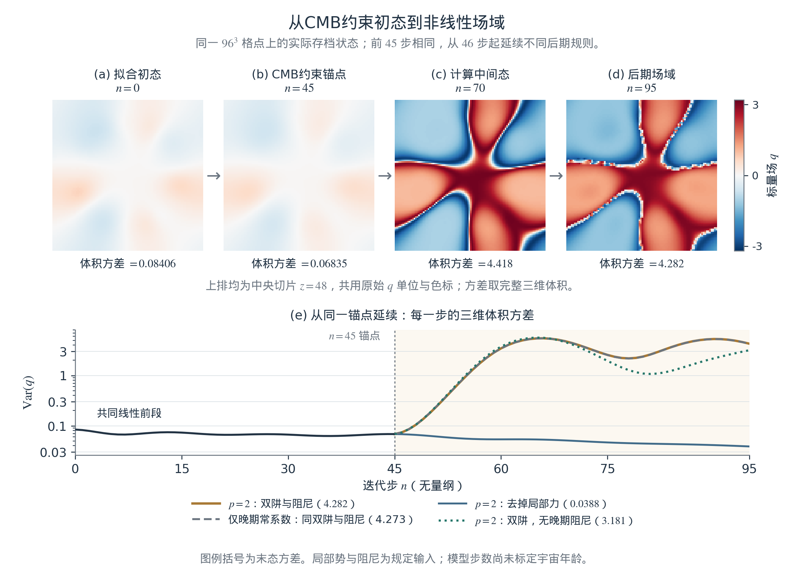

**图4.3　从数值初态到后期结构的演化时间线。** 上排为$n=0,45,70,95$的真实中央切片，使用相同的有符号场色标；下排为完整三维体积的逐步方差及对照。全部分支共享前45步的历史及两态锚点；“仅晚期常系数”只替换第46—95步的系数。第45步后的局部势和阻尼按已记录方案给定。初态受同一CMB拟合约束，末态为标量场域，两者尚未分别识别为真实大爆炸初态与星系。图由既有结果的小型[来源快照](../reports/chapter04_timeline_sources/README.md)重绘。[24](#r24)

这条轨迹允许从程序的第0步开始，但“数值起点”与“宇宙年龄为零”必须分别定义。主RSM在$\tau=0$取$R_i>R_*$，已有有限的对数响应；CMB中的$n+10$同样规定有限起步系数。它们都没有求出大爆炸奇点，也没有给出$n$、$R$到宇宙年龄的标定。图中的早期场还受到后来的CMB观测约束，因而属于条件重建，而不是独立预言的宇宙初态。初态与续演形态还依赖初谱先验和球壳采样，须对允许的初态集合检查稳健性。

在共同场单位下，存档方差从0.08406出发，于第36步达到线性阶段最低值0.06257，第45步为0.06835。主分支末态方差为4.282，仅晚期改为常系数的对照为4.273；去掉新增局部力后为0.03879。因此，早期轨迹并非单调“冷却”，晚期增长也不能归于平方对数律的独特性。把这条演示提升为物理宇宙史，需要在同一模型中补上膨胀背景、守恒物质变量和引力，并让CMB所允许的一组初态预测独立的晚期聚类统计。包含气体、恒星及反馈的星系形成，是物质聚类之后的进一步任务。

**暴涨的候选解释：集体负压与阶段转换。** 可以进一步提出如下假说：微观非线性动力学形成势能占优的集体态，内部时钟调制其有效相互作用；这一态在宏观引力下产生短暂加速膨胀，随后通过一致的能量交换进入波动占优阶段。式(4.12e)提供了后者具有辐射样压力的一个条件极限。此处每个阶段及其转换都是待建立的动力学命题。在完整物理时间线中，候选暴涨及其退出应先于CMB形成；现有CMB锚点后的双阱续演只演示后期场域增长，不能充当这一早期过程的实现。

为了给假说一个可检验的标准，先额外假定微观约化能得到最小耦合的正则标量有效理论，并采用广义相对论作为宏观引力接口。在可由FLRW背景描述、空间平均各向同性且额外引力反作用可忽略的范围内，以$\Phi_A$表示有效场，定义

$$
\begin{aligned}
K&=\frac12\sum_A\langle\dot\Phi_A^2\rangle,\qquad
D=\frac1{2a_{\rm cos}^2}\sum_A\langle|\nabla\Phi_A|^2\rangle,\qquad
\mathcal U=\langle U_{\rm eff}\rangle,\\
\rho&=K+D+\mathcal U,\qquad
p=K-\frac D3-\mathcal U,\qquad
\rho+3p=4K-2\mathcal U .
\end{aligned}
\tag{4.16e}
$$

此段采用$c=\hbar=1$，点号对物理宇宙时间$t$求导；$a_{\rm cos}(t)$为尺度因子，区别于格距$a$。$U_{\rm eff}$及该协变有效理论尚待从微观模型构造，不能仅由式(4.15a)中一个时变传播系数宣布已经得到。若把内部时钟也实现为正则局域场，其动能必须计入$K$；当前固定盒的全局$I\dot R^2/2$还不能直接充当一种具有已知压力的宇宙流体。

在暂不计其他引力源的这一候选中，标准加速方程给出条件判据

$$
\frac{\ddot a_{\rm cos}}{a_{\rm cos}}
=-\frac{\rho+3p}{6M_{\rm Pl}^2},
\qquad
\ddot a_{\rm cos}>0
\ \Longleftrightarrow\ \mathcal U>2K,
\qquad M_{\rm Pl}=(8\pi G_{\rm N})^{-1/2}.
\tag{4.16f}
$$

因此正的势能也可以产生负压，研究任务是说明这样的集体态能否形成并持续足够久。[54](#r54) 内部时钟的反作用可能改变能量分配，提供退出通道，也可能过早破坏势能占优；两种情况须由同一闭合系统决定。接入膨胀后还会出现相应的膨胀阻尼和体积因子，第4.1节固定盒的时钟速度极限不能直接搬入暴涨阶段。这里保留$1/\ln^2(R/R_*)$作为耦合响应候选，不将其直接等同于正则暴涨场的势能。

现有传播慢化本身也不足以给出暴涨中的模态冻出。将早期无阻尼、无局部势的线性规则单独延拓至大$n$，并对$p=2$系数作平滑插值，对固定非零长波$k$，以迭代单位计算的瞬时频率及绝热比为

$$
\omega(n)\simeq\frac{k\sqrt{A_2/6}}{\ln(n+c_0)},\qquad
\frac{|\mathrm d\omega/\mathrm dn|}{\omega^2}
\simeq\frac{\sqrt{6/A_2}}{k(n+c_0)}
\longrightarrow0 .
\tag{4.16g}
$$

结合式(4.14d)发散的累计相位，这一无阻尼线性延拓的固定非零长波模态在晚期越来越绝热，不能从“速度下降”推得“停止振荡”。该诊断不适用于图4.3另加局部势与阻尼的后期分支。要成为暴涨机制，需要另外计算膨胀和曲率扰动的耦合，而非把现有方差下降重命名为暴涨。可执行的下一步是：给定共同有效作用量，检查持续加速与动力学退出，核对总能量交换，再由同一背景求原初标量、张量扰动及其后续CMB传递。结果应与独立谱约束比较，不能重新自由选择每个终态模态的初始幅度。[2](#r2), [54](#r54) 当前可行性推导及未采用候选的排查另存为[技术备忘](../reports/chapter04_inflation_feasibility.md)。

**连接物理年龄和引力聚类的最小实现。** 在既有作用量候选上，可以先构造一条具有明确单位的物理连接，而不把图4.3的迭代序号直接换成年龄。这里采用与自由$R$不同的正则时钟$\chi$，动能系数$F_\chi^2$为常数，势为$V_s e^{-2\chi}$。额外输入平直FLRW度规与标准引力，让辐射、无压物质、常数真空能和均匀时钟共同决定膨胀。记$a_{\rm cos}(t_0)=1$，则

$$
\begin{aligned}
3M_{\rm Pl}^2H^2
&=\rho_{r0}a_{\rm cos}^{-4}+\rho_{m0}a_{\rm cos}^{-3}
+\rho_\Lambda+\frac{F_\chi^2}2\dot\chi^2+V_s e^{-2\chi},\\
\ddot\chi+3H\dot\chi-\frac{2V_s}{F_\chi^2}e^{-2\chi}&=0,
\qquad \epsilon=F_\chi^2/M_{\rm Pl}^2 .
\end{aligned}
\tag{4.16h}
$$

$H=\dot a_{\rm cos}/a_{\rm cos}$，点表示物理宇宙时间导数。此处$\epsilon$衡量时钟的背景能量规模，区别于此前数值误差及探针幅度。式(4.16h)从$a_{\rm cos}=10^{-7}$的辐射追踪支开始积分，包含时钟对膨胀的反作用；早期尾项只作理想背景的标度外推，没有模拟大爆炸奇点、热自由度变化或暴涨。物理时间由同一背景求出：

$$
\begin{aligned}
t(a_{\rm cos})&=t_i+\int_{a_i}^{a_{\rm cos}}
\frac{\mathrm da}{aH(a)},\\
\chi(t)&=\ln(t/t_{*,r}),\qquad
V_s t_{*,r}^2=F_\chi^2/4
\quad\text{（纯辐射追踪支）},\\
\mathcal R_\chi(t)&=\chi(t)^{-2} .
\end{aligned}
\tag{4.16i}
$$

这样，逆对数平方在单一标度阶段具有明确的动力学实现；跨越辐射、物质和真空能阶段后，$\chi$继续由场方程决定，不能逐步强制为同一精确对数。$\mathcal R_\chi$的平方指数仍是响应假设，势尺度与其物理耦合也未由黎曼结构唯一确定。本例指定$t_{*,r}=5.391247\times10^{-44}$ s作为势／响应锚点；改变起算点时保持$V_s/F_\chi^2$不变。这个输入不构成普朗克时间的推导。

在已进入视界、弱场且时钟扰动可忽略的尺度上，进一步加入守恒的无碰撞物质。令$\boldsymbol x$为以共动盒长$L$归一化的坐标，$\tau=H_0t$、$E=H/H_0$及$\boldsymbol p=a_{\rm cos}^2\mathrm d\boldsymbol x/\mathrm d\tau$，采用周期Poisson方程：

$$
\begin{aligned}
\nabla_x^2\psi&=\delta_m,\qquad
\boldsymbol g=-\nabla_x\psi,\qquad
\delta_m=(\rho_m-\bar\rho_m)/\bar\rho_m,\\
\frac{\mathrm d\boldsymbol x}{\mathrm da_{\rm cos}}
&=\frac{\boldsymbol p}{a_{\rm cos}^3E},\qquad
\frac{\mathrm d\boldsymbol p}{\mathrm da_{\rm cos}}
=\frac{3\Omega_{m0}}{2a_{\rm cos}^2E}\boldsymbol g .
\end{aligned}
\tag{4.16j}
$$

其物理势为$\Phi=H_0^2L^2(3\Omega_{m0}/2a_{\rm cos})\psi$。这些是采用的标准宇宙学引力接口。[56](#r56) 时钟在本次试验中通过$E(a_{\rm cos})$影响聚类；没有额外修改牛顿常数或粒子质量，也没有将$\chi^{-2}$直接乘入引力。亚视界的平滑时钟近似给出相应线性增长参照，令$N=\ln a_{\rm cos}$、$D$为密度增长因子（匹配解不必是每个背景的纯增长支）：

$$
\frac{\mathrm d^2D}{\mathrm dN^2}
+\left(2+\frac{\mathrm d\ln E}{\mathrm dN}\right)
\frac{\mathrm dD}{\mathrm dN}
-\frac{3\Omega_{m0}}{2a_{\rm cos}^3E^2}D=0 .
\tag{4.16k}
$$

该增长式不能代替早期光子、重子、暗物质与度规扰动的完整传递。为先检验后期连接，初始物质功率谱采用外部CAMB线性参考。[55](#r55) 固定$H_0=67.4$ km/s/Mpc、$\Omega_{m0}=0.315$、$\Omega_{r0}=9.2\times10^{-5}$，分别取删除时钟自由度的$\epsilon=0$对照与$\epsilon=10^{-4}$主例，调整各自$\rho_\Lambda$使$E(1)=1$；这是参考归一化，不是独立预测$H_0$。本例早期时钟追踪流体，晚期加速由输入的$\Lambda$主导；它还不是上文集体暴涨候选的数值实现。两背景在$z=49$共用同一带限随机初态和实际粒子动量。因此非参考背景的初始对数增长率须按$E_{\rm ref}/E$转换，不能将相同数值的增长率误当相同速度。随后在$L=50$ Mpc/$h$的周期盒中执行CIC粒子—网格引力和二阶KDK推进；这里$h=H_0/(100\ {\rm km\,s^{-1}Mpc^{-1}})$，区别于积分步长。

实际背景给出参考今日年龄13.7906925 Gyr，主例为13.7903991 Gyr；共同初动量的线性密度增长相对减少约0.01453%。粒子实验从$a_{\rm cos}=0.02$、约0.04783 Gyr开始，主例为$64^3$粒子／网格及256步，并以128、512步和$32^3$网格作配对检查。按频箱平均波数$\bar k\le0.3\ h/\mathrm{Mpc}$选取两个低波数频段，分别在平均波数0.1604及0.2803 $h/\mathrm{Mpc}$处，末态功率比分别为$P_\chi/P_0-1=-2.6516\times10^{-4}$及$-2.8669\times10^{-4}$。加密时间步的配对比变化不超过$1.36\times10^{-8}$，两网格的配对比变化不超过$4.72\times10^{-6}$；与此同时，参考绝对功率的网格差仍达2.22%和6.62%。这些检查支持此有限设置下配对响应的数值稳定性，绝对功率精度与连续极限尚需更细网格检验。它们没有观测显著性，也没有选择平方指数。[57](#r57)

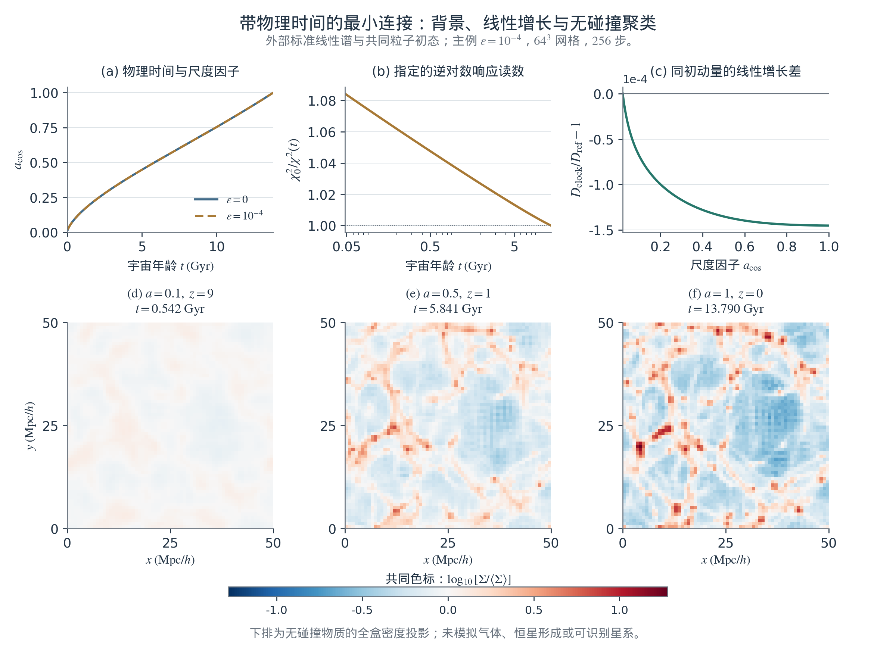

**图4.4　从物理背景到无碰撞物质聚类。** 上排为尺度因子与年龄、时钟归一化响应$\chi_0^2/\chi^2$及相同初动量下的线性增长差；下排为主例在$z=9,1,0$的实际存档密度投影，使用共同对数色标。标准引力及外部CAMB初谱是本轮的物理输入，两背景共享同一初态。主格距0.78125 Mpc/$h$、每粒子质量$4.17\times10^{10}M_\odot/h$；本图展示物质聚类，未分辨星系。功率图、各分辨率结果及核验见实验归档。[57](#r57)

该设计已经将有单位的年龄、背景膨胀和引力聚类接入同一个条件计算。它仍使用外部线性初谱，未重算时钟改变的早期物质传递，也没有把原SMICA重建场识别为物质密度。[57](#r57) 下面进一步检查一个质量与初态均已指定的塌缩对象，并给出气体冷却接口。

**受控塌缩与气体冷却的连接。** 设一个补偿球的拉格朗日核心半径为$q_L$，守恒质量$M=(4\pi/3)\bar\rho_{m0}q_L^3$，物理半径为$r=a_{\rm cos}q_Ly$。在球对称、壳层尚未交叉且时钟保持均匀的条件下，由标准引力与式(4.16h)的背景得到

$$
\begin{aligned}
y''+\left(2+\frac{\mathrm d\ln E}{\mathrm dN}\right)y'
+\frac{\Omega_m(a_{\rm cos})}{2}(y^{-3}-1)y&=0,\\
\Delta_m=\frac{\rho_{\rm core}}{\bar\rho_m}&=y^{-3},\\
\dot r=0&\ \Longleftrightarrow\ y+y'=0.
\end{aligned}
\tag{4.16l}
$$

这里$N=\ln a_{\rm cos}$，撇号表示$\mathrm d/\mathrm dN$，$\Omega_m(a_{\rm cos})=\Omega_{m0}a_{\rm cos}^{-3}/E^2$；$\Delta_m$是相对背景的密度比，区别于过密度$\delta_m=\Delta_m-1$。球形方程提供三维PM的独立半径参照；它使用既有引力，而非从黎曼结构重新推导引力。[58](#r58) 取$L=10$ Mpc/$h$、$q_L=2.5$ Mpc/$h$、补偿边界4 Mpc/$h$，核心质量约$5.72\times10^{12}M_\odot/h$。初态以包围平均过密度的平滑窗口指定，外边界位移为零；初始局部密度由映射Jacobian计算，不能把处处正的局部窗口称为补偿壳。只用参考球形方程选择一次初幅，使其在$a_{\rm cos}=0.5$首次达到$\Delta_m=200$，随后所有背景、分辨率共用同一初幅和实际初动量。这是预设的数值基准，不是拟合真实对象。[62](#r62)

沿用$\epsilon=0$与$10^{-4}$两背景，连续方程给出事件尺度因子0.500000与0.5000754，宇宙年龄分别为5.840747与5.841773 Gyr，即示例时钟使事件推迟约1.0264 Myr。以宇宙时间和物理半径重写的独立方程复现这一差值；两事件仍有向内速度，不是静止的维里化对象。本轮检验时钟能量改变背景后的塌缩响应，没有比较不同响应幂，不能用于选择平方对数律。

新PM试验分别改变力网格、粒子数、时间步和相对网格位置；这些误差来源需要分别检查。[59](#r59) 主例使用$64^3$粒子及$256^3$力网格，另有$128^3$粒子对照。固定核心粒子标签的中位径向缩放给出$y_{\rm PM}$，同时记录实际包围计数、同调散布及三轴形状，避免将$y_{\rm PM}^{-3}$无条件当成真实球内密度。步长同时受对数尺度因子、最大粒子位移和局部动力学时间限制；本次KDK推进和状态依赖步长不构成完整粒子映射严格辛性的证明，仍需按实际误差核验。首次高密度事件与维里化是不同的判断，本轮在前者停止。

本轮参考背景（$\epsilon=0$）的PM主配置中，同调密度代理在$a_{\rm cos}=0.532438$达到200，比连续参考的事件尺度因子晚6.49%；共同事件前采样的半径最大相对偏差为76.5%，固定标签径向散布最高34.1%，未满足预设的2%、3%和10%要求。此时实际包围密度比约281，进一步说明代理阈值不能等同于均匀球密度。将三项步长界限减半后，事件尺度因子相对主例仅改变$-0.00298\%$，通过0.5%的时间对照门限，但半径失配仍约76.4%。因此本例的时间步稳定性不能替代连续精度。

将粒子数从$64^3$增至$128^3$后，事件相对连续球的误差减至2.95%，共同事件前半径误差减至26.5%，显示粒子采样增加带来的改善；但相对主例的事件变化仍为$-3.32\%$，未通过1%的粒子数对照门限，径向散布最大值仍达28.6%。将整个初态及球心共同平移不到一个力网格胞后，事件尺度因子为0.511481，相对主例改变$-3.94\%$，未通过1%的相位对照门限；它虽更接近连续事件，却揭示了明显的网格位置依赖，不能择优作为成功配置。

独立离散力核、质量与净力检查通过，不能替代粒子表示对连续球的精度检验；细化力网格也没有增加粒子采样信息。规则立方初态的二阶矩轴比可以接近1，却不能排除高阶角向误差；本轮已直接测得明显的径向散布。这些失配已出现在无时钟的参考背景，首先限制当前粒子与网格离散方案，并非观测对时钟候选的检验。因此三维结果保留为误差诊断，未据此宣布得到经收敛验证的暗物质晕，微小clock配对差也不作为已分辨的预测。下面的冷却读数只接经过独立核验的连续球形事件。[62](#r62)

气体接口先采用明确的条件估计。给定物理质量$M$和红移$z$，假定原初氢氦气体的平均密度按宇宙重子比例追随$200\bar\rho_m$，并定义

$$
\begin{aligned}
R_{200m}&=\left[\frac{3M}{4\pi\,200\bar\rho_m(z)}\right]^{1/3},
\qquad \rho_g=\frac{\Omega_{b0}}{\Omega_{m0}}\,200\bar\rho_m(z),\\
\frac{T_{\rm char}}{\mu(T_{\rm char})}
&=\frac{m_pGM}{2k_BR_{200m}},
\qquad \mu=\frac{\rho_g}{m_p n_{\rm tot}},\\
t_{\rm cool}&=\frac{(3/2)n_{\rm tot}k_BT_{\rm char}}{\mathcal L_{\rm atom}},
\qquad t_{\rm dyn}=\sqrt{\frac{3}{4\pi G\,200\bar\rho_m(z)}}.
\end{aligned}
\tag{4.16m}
$$

$n_{\rm tot}$包括中性原子、离子与电子，$\mathcal L_{\rm atom}$是单位体积、单位时间的能量损失。$T_{\rm char}$由碰撞电离平衡下的$\mu(T)$自洽求得，是指定质量与半径的特征温度，不是PM已经求出的真实气体温度；内落物质也不因达到密度200就自动热化。冷却采用历史原初H/He低密度、光学薄速率，包含碰撞激发、电离、复合和自由—自由过程；没有加入外部紫外场、金属、分子或恒星反馈。[60](#r60), [61](#r61) 因而$t_{\rm cool}$只是该假设状态的瞬时散热时间，$t_{\rm cool}<t_{\rm dyn}$也不足以单独证明恒星形成。

这个接口有一个必须满足的零差异对照：两种背景的$H_0,\Omega_{m0},\Omega_{b0}$相同，原子速率与$G$固定，因此在同一$(M,z)$处

$$
\left.t_{\rm cool}\right|_{\chi,M,z}
=\left.t_{\rm cool}\right|_{0,M,z},\qquad
\left.t_{\rm dyn}\right|_{\chi,M,z}
=\left.t_{\rm dyn}\right|_{0,M,z}.
\tag{4.16n}
$$

背景可以改变同一红移对应的年龄，或者同一初态达到高密度的红移，从而改变沿形成历史取样的冷却条件；这里没有额外给原子冷却率乘上$\chi^{-2}$。在固定的175个质量—红移状态中，这一微观零差异对照严格成立。参考球形事件的物理质量约$8.49\times10^{12}M_\odot$，指定$T_{\rm char}\simeq4.10\times10^6$ K时的瞬时冷却时间约27.0 Gyr，是动力学时间的29.6倍。clock事件的冷却时间增加约0.0345%，来自事件红移略变，不能据此声称原子作用率改变。网格中处于$10^{4.5}$—$10^8$ K主解释温区的132个状态，有21个局部电离弛豫时间长于冷却时间，故其平衡冷却近似需要非平衡化学进一步检验；全部警示点均保留。[62](#r62)

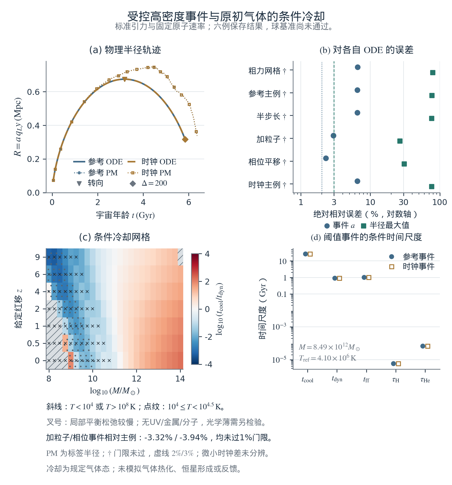

**图4.5　受控塌缩与气体冷却接口的结果及边界。** 左上比较连续球形方程与主PM的半径—年龄轨迹，PM使用固定标签的中位半径代理；右上保留全部六配置的事件和共同事件前半径误差，2%与3%虚线是协议中针对主配置的精度要求，其他配置按各自条款检查。左下为175个唯一质量—红移状态的瞬时冷却／动力学时间比，两背景在相同状态下共用读数；灰色斜线表示$T<10^4$ K或$T>10^8$ K，点纹标记$10^4$—$10^{4.5}$ K敏感区，叉号表示局部电离平衡警示。右下只使用两个经过独立核验的连续球形事件，未将失败的PM代理作为气体密度或温度输入。标准引力、原初气体速率和特征气体状态均为本轮规定的物理条件。[62](#r62)

要进一步计算真实星系，仍需从既有总物质预算中分出气体，演化其质量、动量和能量以及非平衡化学，再加入有依据的恒星形成与反馈；不能将重子质量重复加到已经代表全物质的粒子源上。这一层输入应与黎曼动机及逆对数响应的待推导物理来源分开。

## 4.4 影子哈密顿量与截断：误差怎样进入物理解释

### 4.4.1 后向误差分析及其条件

对足够光滑的自主哈密顿系统，固定步长的对称辛方法具有形式修正哈密顿量。对本章KDK分裂，可以写成

$$
\widetilde H=H+h^2H_2+h^4H_4+\cdots,
\tag{4.17}
$$

其中常质量矩阵下的首项为

$$
H_2=\frac1{12}P^{\mathsf T}\mathsf M^{-1}V''(Q)\mathsf M^{-1}P
-\frac1{24}(\nabla V)^{\mathsf T}\mathsf M^{-1}\nabla V.
\tag{4.18}
$$

这一展开解释了数值轨迹为何可以接近某个修正流；它不是一般非线性映射都精确对应一个收敛级数的保证。长时间能量控制还需要足够小步长、正则性及相应轨迹区域等条件，近可积系统的不变环面结论另有扰动前提。[10](#r10) 原稿用统一的“KAM稳定”覆盖所有非自治过程，超出了这些条件。

本模型纯包络在远离$R_*$的区域光滑。现有算术残差采用自然三次样条，跨节点通常只有$C^2$正则性；这仍支持式(4.3)的辛性，但不能无条件套用解析系统的任意高阶或指数长时误差结论。有限窗口的步长与独立求解器核对仍是实际依据。[11](#r11)

### 4.4.2 格距、步长与有限字长

式(4.11)的$a^2$项来自所选空间相互作用，式(4.18)的$h^2$项来自积分算法，机器字长则产生舍入误差。三者具有不同来源，表4.1列出对应检验。

**表4.1　离散尺度、误差与可检验含义。**

| 来源 | 当前数学含义 | 如何判断其作用 |
| --- | --- | --- |
| 空间格距$a$ | 最近邻算子的有限格距色散 | 固定体积加密；或在假设物理格距下检查长波偏离 |
| 数值步长$h$ | 积分相位与修正Hamilton项 | 固定空间模型减小步长，并更换独立求解器 |
| 机器字长 | 舍入、相消及归约误差 | 改变算术精度和求值顺序，记录误差传播 |
| 统计约化 | 省略自由度后的闭合问题 | 指定统计态，比较记忆、涨落与不同闭合方案 |

如果$a$最终被赋予物理长度，有限格距修正可以成为候选物理效应，但仍需独立定标。若把$h$也认定为基本节拍，就提出了不同于数值求解的新物理模型，须独立检验。由积分器选型改变、并随$h\to0$消失的偏离，不能直接称为广义相对论修正。

原稿把有限字长的截断余项解释为真空能。本章保留有限精度可能影响有效描述的问题，但目前没有由此推导应力—能量、真空态或引力耦合。经典模型的数值能量漂移也不能代替真空能的量子与引力定义。[20](#r20), [21](#r21) 因而尚不能从一个机器精度参数推出宇宙学常数。

### 4.4.3 观测边界：从固定阈值到协议定义

原稿的零点高度$T\approx4200$不再作为普适物理上限。后续Clock工作已经区分数学零点的高度与序号、物理装置的估计误差，以及新增的宇宙时间假设；有限资源下的可达范围须由具体协议定义。[23](#r23)

一个已整理的条件例子是假定装置用$e^{iyu}$编码无量纲高度$y$，而坐标扰动$\delta u$为零均值高斯变量、方差$\sigma_u^2>0$。则平均相干幅度为

$$
\mathcal C(y)=\left|\left\langle e^{iy\delta u}\right\rangle\right|
=e^{-y^2\sigma_u^2/2},
\qquad
y_{\rm det}=\frac{\sqrt{2\ln(1/\mathcal C_{\min})}}{\sigma_u},
\quad 0<\mathcal C_{\min}<1.
\tag{4.19}
$$

第一式来自高斯特征函数，第二式来自人为规定的最低可用相干幅度。它描述平滑衰减与协议阈值，没有给出零点在某个高度不再存在的结论。实际装置是否采用这种编码、噪声相关性及重复测量怎样改变$\sigma_u$，都需要测量。进一步让精度随宇宙时间变化，仍是要独立检验的响应假设。

本章得到以下条件结果：共同势能规定反馈与区域能量收支；正能量分支支持逆对数晚时尾律；正则格点产生长波方程和连续动量守恒；三维各向同性线性无质量波满足$p_{\rm wave}=\rho_{\rm wave}/3$。六邻域迭代连接传播速度、振荡传递、空间关联与观测协方差；梯度耦合指出接入内部时钟所需的反作用。这些结论来自指定模型，尚未由黎曼结构唯一决定。下一章检验它们与常数、光谱、膨胀史及CMB的连接和现有数据约束。

# 第5章 观测证据与约束：时间响应的检验

**本章提要。** 本章保留原稿以精细结构常数、膨胀史和实验室原子钟检验缓慢演化的主线，并融入已有光谱与CMB分析。重点从曲线外观转向共同参数、校准、误差和保留数据：同一时间响应能否同时解释今天的漂移与过去的变化，改善是否依赖仪器处理，以及空间统计能否限制传播模型。现有工作已经建立可复现的条件检验，但尚未确认非零的共同宇宙时间响应。以下数字来自各项目已保存的分析；本章重绘图件和核对来源，没有重新拟合观测。

## 5.1 精细结构常数：从非自治动机到观测约束

### 5.1.1 理论预测：先定义电磁响应与时间对应

第2章的算术前作提供非自治参数演化的动机，第4章则说明预设响应如何进入具有反作用的正则系统。[7](#r7), [8](#r8) 若进一步假定这种结构影响电磁过程，仍须定义真实耦合及物理时间。已有Constant项目采用的有效响应为

$$
\delta_\alpha(t):=\frac{\alpha(t)-\alpha_0}{\alpha_0}
=\Gamma\left[L(t)^{-s}-L_0^{-s}\right],
\qquad L(t)=\ln(t/t_*),\quad L_0=L(t_0),\quad s=2.
\tag{5.1}
$$

$\alpha_0=\alpha(t_0)$，使用域满足$t>t_*>0$及$1+\delta_\alpha>0$。主假设保留逆对数平方，$s=1,3$用于形状比较。无量纲$\Gamma$是独立电磁响应幅度，不能直接设为算术计数中的约12.73，也不能由辛性确定。把第4章的$R(\tau)$直接替换成宇宙年龄，则还需要物理标定；本节先检验式(5.1)这一明确的现象学接口。[22](#r22)

### 5.1.2 高红移吸收谱：数据、单位与拟合对象

主历史样本来自King等人的2012年公开目录。按作者异常旗标剔除两行后，保留293条测量，其中Keck 140条、VLT 153条。[36](#r36) 这是发表级测量行数，不能等同于293个独立天体。原目录包含空间变化研究，本章使用其中的压缩测量检验同质时间版本。

当前分析采用固定的平直物质+$\Lambda$背景，$H_0=67.4\,\mathrm{km\,s^{-1}\,Mpc^{-1}}$、$\Omega_m=0.315$，得到$t_0=13.7962\,\mathrm{Gyr}$；参考尺度选为$t_*=5.391247\times10^{-44}\,\mathrm s$，相应$L_0\simeq140.244$。本项晚期分析范围为$z\le4.2$。这些是本次时间转换条件，未计入辐射或常数变化对背景的反馈，也不把$t_*$视作观测推得的尺度。

天文读数统一记作$y_i=10^6\delta_{\alpha,i}$，单位为ppm。原目录的三种旗标分别采用0、17.43、9.05 ppm附加散布，与统计误差平方相加；这是沿用发表误差预算的条件分析，未重建完整仪器协方差。设$\eta_i$为可选的望远镜偏移，联合目标为

$$
\begin{aligned}
\chi^2&=\sum_i\frac{\left[y_i-10^6\delta_\alpha(t(z_i))-\eta_i\right]^2}{\sigma_i^2}
+\frac{(D_0-D_{\rm obs})^2}{\sigma_D^2},\\
D_0&:=\left.\frac{d\ln\alpha}{dt}\right|_{t_0}
=-\frac{s\Gamma}{t_0L_0^{s+1}}.
\end{aligned}
\tag{5.2}
$$

只用天文数据时去掉最后的时钟项。带偏移的零模型和演化模型保留相同偏移参数；相互重叠的历史样本不重复拼接。图5.1显示实际目录与已有条件曲线，原稿的$R^2\simeq0.974$不再作为检出变化的依据。[22](#r22)

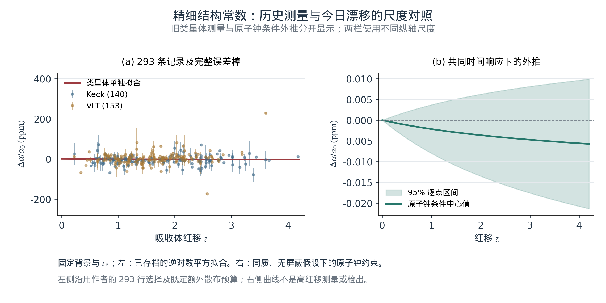

**图5.1　历史测量与原子钟外推的尺度。** 左图保留293条已选目录测量、完整误差棒及既有类星体单独拟合曲线；右图是在同一响应、背景和无屏蔽假设下，仅由原子钟转移得到的条件带。两图纵轴不同；右图不是新增高红移测量，也不是联合拟合的误差带。没有按图形外观删选数据或重新拟合。

独立的精密光学结果还包括ESPRESSO对$z=1.150793$吸收体的$\delta_\alpha=1.31\pm1.29\,({\rm stat})\pm0.43\,({\rm sys})$ ppm测量。[38](#r38) 它提供另一测量协议的检查，但同一吸收体的重分析不能反复作为独立样本；单个吸收体也不足以选择时间函数的指数。

### 5.1.3 光谱差异：先检查仪器与气体解释

已有Clock项目进一步分析了17次ESPRESSO原生曝光和32份UVES光谱。其Fe II主读数为两条跃迁的条件速度差$D=v_{2382}-v_{2374}$，对应表观频率比变化约$-D/c$。这涉及两个跃迁能量差之比，尚非完整原子能级分布或直接的$\alpha$测量。[23](#r23)

同一Fe II 2600跃迁在相邻级次间仍出现约$-58.6\pm18.6\,\mathrm{m\,s^{-1}}$的条件偏移。该误差来自固定气体模板、所选响应和提取误差假设；这个同线负对照说明读数对观测处理敏感，尚未确定具体偏差来源。后续六个候选中，四个能够报告依赖模型的条件位移，两个仍是失配诊断，不能把它们当成六个已标定的宇宙年龄变化点。

因此，“不同光谱存在差异”还需经过独立标定、多线气体模型、同线与跨仪器复验，才能转成新的物理响应。原零点可测精度设想主要涉及不确定度；从不确定度增加推到线心均值或能级本身变化，需要另加机制。

### 5.1.4 原子钟：同一幅度必须同时解释今天与过去

主时钟输入为Filzinger等人2016—2022年光学钟比较所得$D_{\rm obs}=(1.8\pm2.5)\times10^{-19}\,\mathrm{yr^{-1}}$。[37](#r37) 这是有符号的测量摘要，本分析以高斯近似使用；没有重拟合其时间序列，也没有再次加入已被它包含的早期测量。

由式(5.2)消去模型幅度可得

$$
\delta_\alpha(t)=D_0\mathcal T_s(t),\qquad
\mathcal T_s(t)=-\frac{t_0L_0^{s+1}}s
\left[L(t)^{-s}-L_0^{-s}\right].
\tag{5.3}
$$

这是当前漂移与过去变化之间的条件关系，计算时$D_0$与$\mathcal T_s$使用一致时间单位；它没有用与零相容的实测均值作除数。默认还要求地面与吸收体共享同质、无屏蔽演化，其他相关常数固定。

**表5.1　逆对数平方电磁响应的已有拟合。**

| 数据与处理 | $\Gamma\pm1\sigma$ | $\Delta\chi^2$ |
| --- | --- | --- |
| 历史293条测量 | $-1.69952\pm0.96874$ | 3.07780 |
| 同目录，加两个望远镜偏移 | $+4.13650\pm3.50607$ | 1.39196 |
| 目录与主光钟联合 | $-0.00346586\pm0.00475683$ | 0.53087 |
| 联合分析，加同样偏移 | $-0.00341734\pm0.00475688$ | 0.51610 |

这里$\Delta\chi^2=\chi^2_{\rm null}-\chi^2_{\rm model}$，零模型按同一偏移设置定义。主联合结果的$\Delta\mathrm{AIC}=+1.469$，幅度与零相容；约99.9976%的条件幅度信息来自时钟。[22](#r22) 因而，精度提高主要体现当前漂移的强约束，没有确认天文端的非零演化。

单独把主光钟转移到$z=4$，得到

$$
\delta_\alpha(z=4)=(-0.00558\pm0.00775)\ {\rm ppm},
\qquad 95\%\text{逐点区间约为 }[-0.02077,\,+0.00961]\ {\rm ppm}.
\tag{5.4}
$$

这是指定背景、尺度和共享响应下的条件响应区间，仅传播时钟摘要的不确定度，未包含未来测量噪声，尚非对所有变化常数理论成立的观测上限。未来充分标定的测量若持续偏离它，将约束这组假设；零相容也不构成对平方律的确认。

### 5.1.5 演化刻度：归一化响应不是完成百分比

原稿用约12.73除以当前对数尺度，解释为宇宙“已完成91%”。这一百分比缺少独立的起点、终点和物理归一化。本章改用明确定义的剩余响应比例：

$$
r_s(t)=\frac{L(t)^{-s}}{L_0^{-s}}
=\left[\frac{L_0}{L_0+\ln(t/t_0)}\right]^s,
\qquad
\frac{\alpha_\infty}{\alpha_0}=1-\frac{\Gamma}{L_0^s}.
\tag{5.5}
$$

$r_s(t_0)=1$，其未来曲线描述假设响应相对于今日的比例。它没有定义宇宙的完成度；第二式也仅在把同一函数延拓到未来时成立。若要求包括渐近极限在内的$\alpha$严格为正，需$\Gamma<L_0^s$；过去使用域仍要另查。

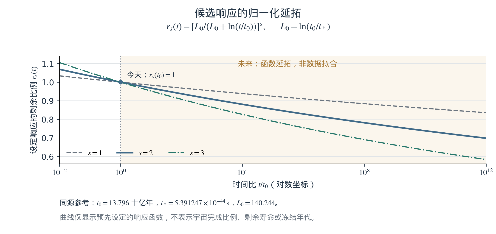

**图5.2　响应的条件延拓。** 在同一$L_0$下比较$s=1,2,3$的归一化剩余项，突出主假设$s=2$。远未来部分只是式(5.5)的函数性质，不是观测拟合，也未赋予宇宙年龄进度或寿命含义。

### 5.1.6 未来膨胀：极限需要完整背景

膨胀方向同样需要区分函数的极限和宇宙的演化终点。第5.2节拟合的$g(t)$是额外归一化；其极限$g_\infty$不直接给出真实$H_\infty$。还需确定背景物质、引力方程和允许的未来动力学。因此原稿的$130.9\,\mathrm{km\,s^{-1}\,Mpc^{-1}}$终值及$10^{70}$年停机日期不再作为本章结果。

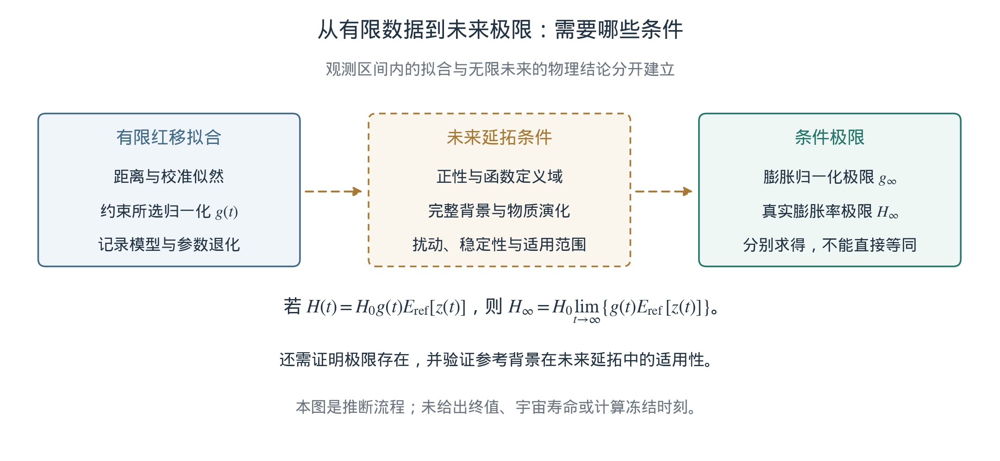

**图5.3　未来外推的物理接口。** 有限红移范围的拟合、响应正性、完整背景及扰动检验分别承担不同任务。函数极限可作为条件研究对象，确定的宇宙终局仍须由完整模型给出。

### 5.1.7 渐近松弛与时钟停止

参数变化率趋零不意味着演化停止。第4章的纯包络正能量分支反而满足$\dot R\to u_\infty>0$：系数逐渐接近常数，内部时钟仍继续推进。热化、熵增长和停机机制没有由这个结果导出。原稿的“计算冻结”可保留为另待建模的问题，当前证据支持讨论的对象是缓慢响应及其可测范围。

## 5.2 哈勃张力：检验时间响应的距离模型

### 5.2.1 问题的起点：今天的参数与整段历史

Planck的$67.4\pm0.5$和本地距离网络的$73.50\pm0.81\,\mathrm{km\,s^{-1}\,Mpc^{-1}}$都以今日$H_0$为目标，尽管其数据链和模型依赖不同。[2](#r2), [16](#r16) 不能把前者安排在重组时代、后者安排在今天，画成两次$H(t)$观测；TRGB也不能因示踪恒星较老就成为中间宇宙年龄的锚点。

现有Hubble项目使用14维DESI距离产品FS14及1657条Pantheon+—SH0ES压缩校准记录，后者含77条校准记录和1580条流场记录，共1509个不同CID，保留完整协方差与交叉项。[3](#r3), [19](#r19), [42](#r42) 1671维向量并不等于1671个独立天体，且没有再叠加SH0ES或H0DN汇总值作额外先验。

FS14的低红移部分承接DR2 BAO产品，高红移部分使用2026年Ly$\alpha$分析及作者分发的全形状组合；该2026年产品不是官方上游BAO目录的同义名称。[17](#r17), [18](#r18) 这是近期可用约束的进展，Pantheon+校准本身仍是2022年公开产品。

### 5.2.2 理论重构：自洽的红移—时间—距离关系

本节$H$表示膨胀率。条件背景写为

$$
\begin{aligned}
E_{\rm ref}(z)&=\sqrt{\Omega_{\rm ref}(1+z)^3+1-\Omega_{\rm ref}},\\
H(z)&=H_0E_{\rm ref}(z)g[t(z)],
\qquad H_{0,\rm eff}(z):=\frac{H(z)}{E_{\rm ref}(z)}.
\end{aligned}
\tag{5.6}
$$

$H_{0,\rm eff}$是给定参考形状下的有效归一化。为公平比较，令$u=t/t_0$、$s_H=t_0\dot g(t_0)$，采用同样的当前归一化和一个额外斜率：

$$
\begin{aligned}
g_{\log}(t)&=1-\frac{s_HL_0}{2}
\left[\left(\frac{L_0}{\ln(t/t_*)}\right)^2-1\right],\\
g_{\exp}(t)&=1-s_H\left(e^{1-u}-1\right),
\qquad g_{\rm pow}(t)=u^{s_H}.
\end{aligned}
\tag{5.7}
$$

这里$L_0=\ln(t_0/t_*)$依本节背景重算，$t_*$仍取固定普朗克时间参考尺度；不能沿用第5.1节的固定$t_0$。三族均有$g(t_0)=1$，$s_H=0$退回同一个常归一化模型。每组参数同时求解

$$
\frac{dt}{dz}=-\frac{1}{(1+z)H(z)},\qquad
\frac{d\mathcal D}{dz}=\frac{H_0}{H(z)},\qquad
t(0)=t_0,\quad\mathcal D(0)=0,
\quad D_M=\frac{c\mathcal D}{H_0}.
\tag{5.8}
$$

还由$D_H=c/H$计算相应BAO距离与Alcock–Paczyński量；超新星按产品约定分别使用背景红移和日心红移。不能先用固定年龄表转换观测，再把不同时间函数代入同一张表。

主比较固定无量纲$q=H_0t_0=0.9512450389523021$，乘积采用一致单位；$H_0$自由拟合，$t_0=q/H_0$随之变化。所得约12.6 Gyr是当前边界时间，尚非由完整早期演化确定的宇宙年龄。共同自由量为$\Omega_{\rm ref},H_0,r_d$及超新星绝对星等，演化模型再加$s_H$；声学尺度$r_d$尚未由早期物理预测。[19](#r19)

### 5.2.3 相同数据下的函数比较

主分支要求观测区间内$H>0$、所有有限未来时间有$g>0$。对数族的未来条件给出$s_H\ge-2/L_0$；这一条件只保证指定归一化的正性，不保证重建势的全未来演化。表5.2采用相同的$q$与数据。

**表5.2　校准距离似然的既有比较。**

| 模型 | $\Delta\chi^2$ | $\Delta\mathrm{AIC}$ |
| --- | --- | --- |
| 常归一化，4参数 | 0 | 0 |
| 逆对数平方，5参数 | 0.84186 | +1.15814 |
| 指数，5参数 | 4.94432 | −2.94432 |
| 幂律，5参数 | 0.84224 | +1.15776 |

零模型$\chi^2=1467.2859634$。采用

$$
\Delta\chi^2=\chi^2_0-\chi^2_1,\qquad
\Delta\mathrm{AIC}=-\Delta\chi^2+2(k_1-k_0),
\tag{5.9}
$$

其中$k$为拟合参数数。指数主分支$s_H\simeq-0.35023$，对数分支$s_H\simeq+0.02162$；若额外要求$s_H\ge0$，指数的改善降至1.17120。这里比较的是规定函数族及参数域，并非完整物理理论的排名。[19](#r19)

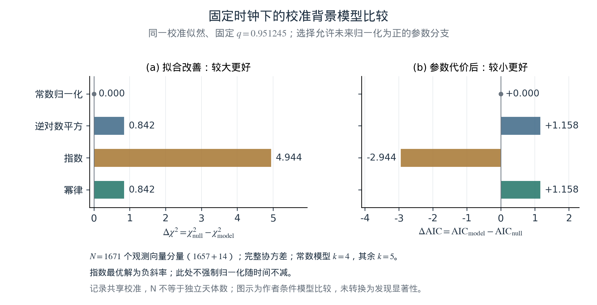

**图5.4　距离模型的条件比较。** 从已有校准结果读取$\Delta\chi^2$及$\Delta\mathrm{AIC}$，保持固定$q$、未来正性和相同数据。正的$\Delta\chi^2$表示残差下降，负的$\Delta\mathrm{AIC}$表示抵偿参数代价后的相对偏好；均未换算成发现显著性。

这些结果没有独有地选中平方对数形式。各模型较高的$H_0$主要继承造父变星校准，早期声学标尺和完整扰动尚未共同检验，因此尚不能宣布消除哈勃张力。若进一步放开$q$，它在$s_H=0$下又不能由距离数据识别，不能继续套用固定钟时的一参数检验解释。

## 5.3 实验室零结果：时间跨度、灵敏度与新数据

### 5.3.1 慢导数并不自动逃避精密测量

长时间积分与今天的局部斜率确实是不同读数，但式(5.3)把它们联系在一起。对于其他相关参数固定、变化足够慢的跃迁，独立原子计算给出的灵敏度$K_a$满足

$$
\frac{d\ln(\nu_a/\nu_b)}{dt}
=(K_a-K_b)\frac{d\ln\alpha}{dt},
\qquad K_a=\frac{\partial\ln\nu_a}{\partial\ln\alpha}.
\tag{5.10}
$$

不能只说宇宙很老、导数很小，就忽略实测误差。当前主联合结果恰恰说明光钟能够约束这个同质版本的幅度。若要引入屏蔽或环境差异，应重新定义物理模型，而非在拟合之后免除实验室约束。

形状识别是另一困难。令$\ell_t=\ln(t/t_0)$，当$|\ell_t|/L_0\ll1$时，

$$
\mathcal T_s(t)=t_0\ell_t
-\frac{s+1}{2L_0}t_0\ell_t^2
+O\!\left(\frac{t_0\ell_t^3}{L_0^2}\right).
\tag{5.11}
$$

固定当前漂移后，各逆对数指数共享主项。在既有背景的$z=4$处，$s=1,3$相对$s=2$的传递仅差约$-0.789\%$、$+0.797\%$；联合拟合的微小差异没有确认平方指数。[22](#r22)

截至Constant项目2026-09-20的定向核查，近期确有新实验。2026年6月的钍核钟工作报告约23小时的频率比斜率；固定核灵敏度$K=10^4$及其他耦合后，对应$\alpha$漂移误差约$1.461\times10^{-15}\,\mathrm{yr^{-1}}$，仍大于主长期光钟约5844倍。[39](#r39) 2026年7月发表的BACON频率比工作提高了比值精度，但2025年采集的这些测量并未直接提供一条可追加的长期$\alpha$漂移似然。[40](#r40)

天文方面，2026年发表的ALMA分析使用2012—2016年观测；沿用该文速度差约定，其读数同时响应$\alpha$与质子／电子质量比$\mu$：

$$
\frac{\delta v}{c}=1.6\frac{\Delta\alpha}{\alpha}
+0.8\frac{\Delta\mu}{\mu}.
\tag{5.12}
$$

它提供新的混合约束；只有指定$\mu$的处理和相关误差，才能转成条件$\alpha$结果。[41](#r41) 因而，新仪器、新分析、新光谱和可直接加入主似然的新独立点需要分别统计。本章没有把上述进展包装为新增的一组时间漂移发现。

## 5.4 辛框架与观测：物理对应和可区分预测

### 5.4.1 电磁响应：辛结构之后仍需物质耦合

原稿把$\alpha$漂移解释为维持相空间体积的补偿。但第4章的固定参数辛映射已经保持$\det J=1$，并不要求常数随时间改变。一个可研究的物理接口是另行选择电磁规范动能函数，例如在固定其余归一化的有效描述中规定

$$
\mathscr L_{\rm EM}=-\frac14B_F(R)F_{\mu\nu}F^{\mu\nu},
\qquad B_F(R)>0,
\qquad \frac{\alpha(R)}{\alpha_0}=\frac{B_F(R_0)}{B_F(R)}.
\tag{5.13}
$$

这里$F_{\mu\nu}$为电磁场强，$R_0$为当前背景。变化常数的作用量研究为此类构造提供了方法背景。[1](#r1) 但本框架仍须确定$B_F$的来源、驱动场的时空性质及物质反作用，再计算真实跃迁与环境响应。式(5.1)和式(5.13)是候选接口，尚未由黎曼结构唯一导出。

### 5.4.2 膨胀与空间统计：从背景恢复到CMB

哈勃膨胀描述配置空间几何的变化，不能等同于正则相空间体积随每步增加。已有Hubble分析在指定平直引力、守恒无压物质和正则标量条件下重建背景势，完成48次独立正向恢复，全部最大相对$H(z)$误差约$1.38\times10^{-10}$。[19](#r19) 这是$0\le z\le2.33$内的数值一致性；部分物质密度为构造选择，尚非唯一微观机制、早期演化或扰动稳定性的观测证据。

CMB进一步检验传播与初态。现有线性格点在固定初速度关系下满足

$$
P_N(\boldsymbol\kappa)=|T_N(\boldsymbol\kappa)|^2P_0(\boldsymbol\kappa),
\qquad
P_0^{(b)}=\frac{|T_N^{(a)}|^2}{|T_N^{(b)}|^2}P_0^{(a)}.
\tag{5.14}
$$

第二式只在相关传递非零且允许逐模式自由初始协方差时成立，表明不同传播可以产生相同的高斯末态统计；固定初始谱先验并不自动具有同样退化。CMB项目据此分别做固定统计集合和自由初态反演：2048张图来自256个配对随机种子、两种初始谱与四个指数，均为合成实现；自由初态得到$r=0.99720$的训练天图也不是平方律的独立证据。[24](#r24)

在另一个高多极薄壳扩展中，谱形误差定义为

$$
E_{\mathcal B}=\left[\frac1{|\mathcal B|}\sum_{b\in\mathcal B}
\ln^2\!\left(\frac{D_b^{\rm model}}{D_b^{\rm obs}}\right)\right]^{1/2},
\qquad D_\ell=\frac{\ell(\ell+1)C_\ell}{2\pi}.
\tag{5.15}
$$

这里$\mathcal B$为指定频段集合，误差等权，尚非官方宇宙学似然。平方指数模型的12个训练段误差由0.473降至0.294，而37个保留段由0.679增至1.244，整串声学峰仍未匹配。由于开发时已看过公开全谱，这是探索性保留区诊断，不能称为盲测。[24](#r24) 此处的谱是温度涨落功率谱，区别于原子能级谱和光子能量谱。

### 5.4.3 零结果与下一次检验：冻结预测而非事后解释

实验室零相容约束相应耦合，数值影子哈密顿量约束算法误差；二者不能互相替代。已有观测工作的价值，是把时间响应变成了可以失败的联合关系。下一轮应先约束常规误差，再检验额外变化，最后比较其形状与平方对数及其他候选。

Clock方案给出了一个具体例子：在其固定参考背景、尺度与平方对数速度响应下，若开发数据确定端点和协方差，可冻结中点预测

$$
D(z=1.5)_{\rm pred}
=0.457563556\,D(z=1)+0.542436444\,D(z=2).
\tag{5.16}
$$

这些系数是指定模型的插值权重，端点仍需测量，不是理论已经独立给出的幅度或方向。确认数据应包含新的独立端点和中间红移视线，同线负对照与跨仪器复验，并传播公共标定及开发／确认协方差。仅中点落在线上不能排除常数模型；现有$s=1,3$对照在这一窗口也十分相近。[23](#r23) 当前这是实验设计稿，尚未公开预注册、获配新观测或产生确认结果。

本章因此将四个方向接入同一研究顺序：物理读数与误差模型先明确，再检验共同响应，最后识别平方指数及算术来源。各项目的背景、耦合和数据共享关系尚未统一，拟合改善不能直接相加成框架显著性。下一章继续讨论预测与解释，优先选择能够用独立数据区分候选的关系，而不把未检出或可拟合本身当成机制确认。

# 第6章 预测与解释：从计算直觉到物理条件

**本章提要。** 有限分辨率、共同状态和局部更新可以为物理建模提供直觉；要形成物理解释，还须给出状态空间、相互作用和测量规则。本章沿不确定性、纠缠、真空、引力与波粒行为五条线索，区分现有辛格点模型的结果与新增候选的要求，并提出共同时间响应的交叉检验。逆对数平方仍是核心响应假设，已发表前作提供算术动机；黎曼结构与真实物质耦合的连接仍待推导。[7](#r7), [8](#r8)

## 6.1 不确定性原理：采样限制与辛几何

### 6.1.1 理论重构：从有限分辨率到采样边界

设空间采样间隔为$a$。在均匀采样、带限等条件下，无混叠重构要求所保留的波数满足

$$
|k|<k_{\rm N},\qquad k_{\rm N}=\frac{\pi}{a}.
\tag{6.1}
$$

这是Nyquist–Shannon采样问题的空间形式：超过边界的模式会与低频样本混淆。[43](#r43) 对当前数值格点，$a$是可加密的离散尺度；将其另行认定为基本物理长度，会定义一个新的物理候选，需要说明相应色散和方向依赖。即使有最小空间采样间隔，格点上的$q_\ell,p_\ell$仍可取连续实值，未自动成为有限字长状态或量子态。

采样限制与量子不确定关系因而承担不同任务。前者限制信号表示，后者涉及同一量子态中观测量的统计分布。若补入量子结构，在算符及状态满足相应定义域条件时，有

$$
\Delta A\,\Delta B\ge\frac12\left|\langle[\widehat A,\widehat B]\rangle\right|,
\qquad
[\widehat x,\widehat p]=i\hbar\mathbf1
\ \Longrightarrow\ \Delta x\,\Delta p\ge\frac{\hbar}{2}.
\tag{6.2}
$$

这里$\Delta A$表示标准差，而非仪器刻度。[45](#r45) 式(6.1)本身没有给出对易关系、$\hbar$或Born概率。有限分辨率假说的研究任务，是构造能连接这些对象的态与读出，而非把采样公式直接改写成量子定律。

### 6.1.2 辛几何推论：非挤压约束的范围

Gromov非挤压定理提供了比保体积更强的几何限制。在一致规范化的正则坐标中，若半径$r$的$2d$维球能够辛嵌入以一对共轭坐标为截面的半径$\rho$圆柱，则

$$
B^{2d}(r)\ \overset{\rm sympl}{\hookrightarrow}
B^2(\rho)\times\mathbb R^{2d-2}
\quad\Longrightarrow\quad r\le\rho.
\tag{6.3}
$$

关键是圆柱截面对应正则共轭平面；任意两个坐标方向并不等价。[44](#r44) 第4章的精确算术辛更新可以联系这一几何结构，但其相空间仍是连续的，不能据此另称已证明“离散量子非挤压定理”。

定理限制一个既定区域如何变形，没有指定最小允许区域，也未把其辛容量规定为普朗克常数。若提出最小可区分辛容量，便增加了一个具有作用量尺度的新假设；仍须解释这一尺度的值、允许态及测量概率。仅有$\det J=1$甚至不足以保证高维映射为辛，更不能规定所有经典初态的方差乘积下界。

### 6.1.3 物理解释：分辨率假说的检验边界

“安全边界”的直觉可以具体化为三个问题：哪些微观状态可以区分，什么相互作用形成一次测量，以及有限分辨率是否改变可重复统计。对辛格点而言，首步可以研究指定粗粒化下的相空间分布；若要与量子系统比较，则应在同一读出规则下恢复式(6.2)及干涉概率，而不能逐个实验重新设定分辨率。

Clock方向的零点可测高度是另一种协议问题：给定噪声、资源与识别阈值，可辨认的谱细节会受限。[23](#r23) 第4章已经给出相位噪声下的条件可测范围。它涉及对固定数学零点的估计，不要求零点随宇宙年龄移动，也不直接推出原子能级均值变化。有限精度若进入物理，必须指出它改变的是分布宽度、相位相干还是耦合系数；这些量对应不同实验。

## 6.2 量子纠缠：共同状态与测量规则

### 6.2.1 逻辑层与空间层的分工

共同状态的表示不必按空间距离复制，这使“逻辑层”成为可用的建模语言。但存储地址、计算耗时和物理可传递的信息是不同对象。第3章已经说明，共享经典变量若同时满足测量设置独立性和局域因子化，其CHSH关联受限；更换变量的存储方式不会改变该结论。[13](#r13), [33](#r33)

量子纠缠要求更具体的联合态及读出。以自旋单态为比较基准，按自旋结果归一化为$\pm1$，量子理论给出

$$
|\psi^-\rangle=\frac{|\uparrow\downarrow\rangle-|\downarrow\uparrow\rangle}{\sqrt2},
\qquad E(\mathbf a,\mathbf b)=-\mathbf a\!\cdot\!\mathbf b,
\qquad P(A=\pm1\mid\mathbf a,\mathbf b)=\frac12.
\tag{6.4}
$$

这里$\mathbf a,\mathbf b$是两端的单位测量方向。关联依赖相对方向，本地未筛选边缘分布却不依赖远端设置。这是量子扩展应恢复的目标；当前经典格点没有导出式(6.4)。Bell检验已有关闭主要探测与局域性漏洞的实验实现，因而仅复现同一方向下的反相关不足以成为纠缠解释。[46](#r46)

### 6.2.2 共同引用：从程序表示到联合概率

“两个对象指向同一状态”可以避免在程序中不一致地更新一个联合系统，却没有确定不同测量方向的联合概率。若共享的是预存经典自旋值，仍需面对上述Bell条件；若共享的是量子态，则量子结构已作为输入进入模型，需要另外解释其来源。

可推进的任务是为一个具体二分系统定义允许态、局部操作与测量映射，并同时检查方向关联和单端统计。借助量子态实现这些基准，可构成工程验证；只有进一步从提出的微观规则得到相同规律，才能成为本框架的物理推导。两项任务均有价值，但所回答的问题不同。

### 6.2.3 光速约束：关联更新与可控通信

量子理论允许纠缠关联，同时要求远端不读取测量结果时，本地统计不因另一端实施无条件、迹保持的局部操作而改变。[34](#r34) 条件选择后的子样本可以不同，获知该选择仍需普通通信。数值算法能够一次访问整个状态，不能据此认定存在超光速物理通道。

因此，任何新增逻辑更新都应检查：改变一端可控制的设置，能否改变另一端未经筛选的结果分布。若可以，该候选就产生了可检验的通信效应，需要给出传播机制并面对因果约束；若不可以，还须说明无信号性质如何由规则保证。算法复杂度$O(1)$本身不能替代这项检查。

## 6.3 真空问题：物理截断与数值残差

### 6.3.1 从零点能估计到有效引力源

有限分辨率可能改变短波自由度，但有截断并不自动解决真空能问题。作为量纲示例，对三维自由无质量标量，直接把零点模态求和截到波数$K$，有

$$
\varepsilon_{\rm zp}(K)
=\frac12\int_{|\mathbf k|<K}\frac{\mathrm d^3k}{(2\pi)^3}\,\hbar c|\mathbf k|
=\frac{\hbar cK^4}{16\pi^2}.
\tag{6.5}
$$

这只是指定调节方式下的裸估计；硬空间截断并非协变重整化，也没有同时给出真空压力。真正待解释的是加入引力、允许的反项与物质贡献后，为什么可观测的有效真空源很小，以及这一性质在改变尺度或相互作用后如何维持。[20](#r20), [21](#r21)

当前无引力经典模型还有一个直接检查：把哈密顿量改为$\mathcal H+C$，常数$C$不改变其梯度、轨迹或线性化。因此绝对能量常数巨大本身，不会通过该模型的正则方程使更新失稳；将有限字长溢出类比为真空引力效应缺少物理连接。这里$\mathcal H$专指第4章的共同哈密顿量，区别于膨胀率。

### 6.3.2 辛稳定性：残差何时具有物理含义

第4章影子哈密顿量的首修正为$\widetilde{\mathcal H}-\mathcal H=h^2\mathcal H_2+\cdots$，其中$h$是数值积分步长。[10](#r10) 它依赖算法与轨迹，既不是机器舍入单位，也没有固定正号或真空状态方程。缩小$h$能够压低的量，应先作为求解误差处理。若另设基本物理节拍，则它应与求解器步长分开，并在固定物理节拍下检验数值收敛。

一个真空候选至少要定义应力—能量。以能量密度$\varepsilon_{\rm vac}$表示具有局部真空形式的应力—能量，规定$\langle T_{\mu\nu}\rangle=-\varepsilon_{\rm vac}g_{\mu\nu}$，压力$P_{\rm vac}=-\varepsilon_{\rm vac}$。在均匀膨胀背景中，若还允许与其他自由度交换能量，则

$$
\frac{\mathrm d\varepsilon_{\rm vac}}{\mathrm dt}
+3H_{\rm cos}(\varepsilon_{\rm vac}+P_{\rm vac})=\mathcal Q,
\qquad
P_{\rm vac}=-\varepsilon_{\rm vac}
\quad\Longrightarrow
\frac{\mathrm d\varepsilon_{\rm vac}}{\mathrm dt}=\mathcal Q.
\tag{6.6}
$$

$H_{\rm cos}$为膨胀率，$t$为宇宙时间，$\mathcal Q$为单位体积、单位时间的能量输入。严格独立守恒的真空分量因此保持常数。若规定它含逆对数平方尾项，就必须给出相应交换源；另一选择是研究状态方程不恒为$-1$的动力学分量。第4章的场—时钟能量交换提供了构造双向耦合的例子，但尚未给出上述引力张量或暗能量密度。

## 6.4 引力与时间膨胀：局部钟速和空间响应

### 6.4.1 局部钟速：把延迟直觉写成有效度规

“高负载区域更新较慢”的直觉，若用于引力，首先应成为不同物理钟共同遵守的局部规律。为明确所需关系，可考察静态、各向同性弱场中的候选有效度规

$$
\begin{aligned}
\mathrm ds^2&=-\mathcal N(\mathbf x)^2c^2\mathrm dt_{\rm c}^{\,2}
+\mathcal A(\mathbf x)^2\mathrm d\mathbf x^2,\\
\mathcal N&=1+\frac{\Phi}{c^2}+O(\Phi^2/c^4),\qquad
\mathcal A=1-\gamma_{\rm PPN}\frac{\Phi}{c^2}+O(\Phi^2/c^4).
\end{aligned}
\tag{6.7}
$$

$t_{\rm c}$是此处静态坐标时间，$\Phi$为牛顿引力势；$\gamma_{\rm PPN}$表征空间响应，$\mathcal N,\mathcal A$均为无量纲。该度规是新增的条件描述，尚未由格点或全局坐标$R$推出。对两个静止、相同种类的理想钟，固有时$\tau_{\rm p}$与坐标时间的关系给出

$$
\mathrm d\tau_{\rm p}=\mathcal N\,\mathrm dt_{\rm c},\qquad
\frac{(\mathrm d\tau_{\rm p}/\mathrm dt_{\rm c})_2}
{(\mathrm d\tau_{\rm p}/\mathrm dt_{\rm c})_1}-1
\simeq\frac{\Phi_2-\Phi_1}{c^2}.
\tag{6.8}
$$

$\tau_{\rm p}$区别于第4章尚未物理标定的模型时间$\tau$。实际钟比较还须处理光信号传递及环境扰动；毫米尺度原子样品中的引力红移已经能够测量，表明钟速关系本身是精密实验对象。[47](#r47)

解释光传播还需要$\mathcal A$。式(6.7)的零间隔条件给出坐标光速$c\mathcal N/\mathcal A$；局部正交参考系中的光速仍为$c$。对弱点质量势$\Phi=-GM/r$，两端在远处、碰撞参数为$b_{\rm imp}$的光线，其有效折射率和一阶偏折为

$$
n_{\rm opt}=\frac{\mathcal A}{\mathcal N}
\simeq1-(1+\gamma_{\rm PPN})\frac{\Phi}{c^2},
\qquad
\Delta\theta=\frac{2(1+\gamma_{\rm PPN})GM}{b_{\rm imp}c^2}.
\tag{6.9}
$$

其中$b_{\rm imp}$是未偏折光路到中心的垂直距离；偏折由沿该路径积分横向折射率梯度得到。仅改变钟速、保持欧氏空间，对应$\gamma_{\rm PPN}=0$，所得偏折是$\gamma_{\rm PPN}=1$时的一半。故“延迟像折射率”尚不足以恢复广义相对论。Cassini无线电链路曾给出$\gamma_{\rm PPN}-1=(2.1\pm2.3)\times10^{-5}$，说明两种响应之间的关系已有严格检验；这里引用的是该项历史实验，而非当前所有实验的综合界限。[48](#r48)

### 6.4.2 物质接口：共同钟速与可观测的常数变化

构造引力机制需要确定$\Phi$的物质源、局部传播以及不同物质为何共享同一有效度规。“质量等于信息密度”只有在这些对象被定义后，才可能成为定量关系。当前共享$R$产生全局耦合，尚不能代替局域引力场；式(6.7)的弱场范围也不允许把视界解释为“100%负载停机”。

共同钟速还必须与精细结构常数变化区分。若同处的所有频率只获得相同时间因子，频率比不变。加入物质特有的响应后，在固定其他常数的小变化近似下才有

$$
\begin{aligned}
\nu_A^{\rm coord}&=\mathcal N\nu_A^{\rm loc},\qquad
\frac{\nu_A^{\rm coord}}{\nu_B^{\rm coord}}
=\frac{\nu_A^{\rm loc}}{\nu_B^{\rm loc}},\\
\delta\ln\frac{\nu_A^{\rm loc}}{\nu_B^{\rm loc}}
&\simeq(K_A-K_B)\delta_\alpha,
\quad K_A=\frac{\partial\ln\nu_A^{\rm loc}}{\partial\ln\alpha}.
\end{aligned}
\tag{6.10}
$$

所以，仅将整个宇宙的时间坐标重标定，不能生成第5章所检验的无量纲读数变化。逆对数驱动需要通过真实耦合进入不同物质的相对响应，例如式(5.13)的电磁候选；灵敏度差与其他常数的处理须事先明确。[1](#r1), [37](#r37)

这也给出一个可以独立检验的简化分支。设两个无量纲物理读数$\mathcal O_A,\mathcal O_B$的参考值非零，已扣除指定的常规效应，并**假定**它们在所研究时间窗内线性响应于同一函数：

$$
\begin{aligned}
F_2(t)&=\frac1{\ln^2(t/t_*)}-\frac1{\ln^2(t_0/t_*)},
\qquad t,t_0>t_*,\\
Y_A(t)&:=\frac{\mathcal O_A(t)-\mathcal O_A(t_0)}{\mathcal O_A(t_0)}
=C_AF_2(t),\qquad Y_B(t)=C_BF_2(t).
\end{aligned}
\tag{6.11}
$$

$C_A,C_B$为各自不随时间变化的响应系数。它们可以不同；共享的是经过同一背景标定的时间和尺度。消去幅度得到

$$
\mathcal R_{AB}(t_1,t_2)
:=Y_A(t_1)Y_B(t_2)-Y_A(t_2)Y_B(t_1)=0.
\tag{6.12}
$$

这是新增线性共同响应假设的代数推论，当前未对观测执行此项检验。它避免用接近零的漂移作除数，但需传播基准值、时刻及仪器之间的共同协方差。式(6.12)针对潜在真实响应；从带噪观测构造乘积统计量时，还需计入相关误差造成的均值偏置及其零假设分布。判别前应固定有效时间窗、允许的非线性修正和误差预算；持续偏离零将否定这组共享条件，而不能事后逐点调整$C_A,C_B$。

式(6.12)本身适用于任何共同时间函数，常数零响应也满足它。检验顺序因此仍是：先确认可重复的额外变化，再检查共享响应，最后比较$F_2$与其他形状。平方律特有的当前导数—过去变化关系已由式(5.3)给出。现有α、Hubble、Clock和CMB工作尚未共享一套物质耦合与背景，不能直接拼成式(6.12)的四组输入，也不能由它们反推主格点的$b,I$。内部时钟的条件尾律则说明，若这种耦合得以建立，预设的平方响应在反作用下仍可能保留其晚时形状。

## 6.5 波粒行为：干涉、测量与计算表示

### 6.5.1 计算经济性：保留相位的粗粒化

分层细节与延迟计算可以减少模拟开销，其物理标准是所关心的观测量是否保持。波动的关键不只在空间上分散，还在振幅之间具有相位关系；把波简单换成一组经典粒子位置概率，会丢掉干涉交叉项。当前经典格点能够研究波传播与非线性模态耦合；单次粒子计数和Born读出仍需额外模型。

因此，自适应细节首先属于算法设计：给定初态、相互作用和观测任务，检查粗细表示是否在指定误差内产生相同统计。由算法节省资源推断“未观察区域没有物理状态”，会增加一个尚未定义观测后果的本体假设。它不应被用于填补测量机制。

### 6.5.2 探测器耦合：从振幅到可记录的统计

一个具体比较基准是理想平衡双路系统。令两条正交路径与归一化探测器态发生关联，联合态为

$$
|\Psi\rangle=\frac{|1\rangle|D_1\rangle
+e^{i\varphi}|2\rangle|D_2\rangle}{\sqrt2},
\qquad \eta_D=\langle D_2|D_1\rangle.
\tag{6.13}
$$

若$\psi_j(x)$为路径$j$传播到屏幕的振幅，不读取探测器记录时，约化后的概率密度为

$$
p(x)=\frac{|\psi_1(x)|^2+|\psi_2(x)|^2}{2}
+\operatorname{Re}\!\left[e^{-i\varphi}\eta_D\psi_1(x)\psi_2(x)^*\right].
\tag{6.14}
$$

探测器态的重叠直接控制交叉项。在理想、等强度双路条件下，可见度$\mathcal V=|\eta_D|$；采用最优路径判别定义的可区分度$\mathcal D$满足$\mathcal D^2+\mathcal V^2\le1$，上述纯探测器模型达到等号。[49](#r49) 无路径记录时可以保留相干，完全正交的记录则消除未筛选样本中的干涉。

这里起作用的是物理耦合及对未读自由度的约化，而非人是否查看数据。式(6.13)—(6.14)借用了量子态与Born规则，作为候选必须恢复的标准；它没有从当前辛格点导出这些规则，也没有仅凭约化解释单次确定结果。若算术驱动进入这一接口，应具体说明它改变$\varphi$、$\eta_D$还是探测器响应，并对相应可见度或频率读数给出独立预测。

### 6.5.3 稀疏表示：可检验性的取舍

稀疏存储不要求物理状态稀疏存在。模拟可以省略对当前任务无影响的自由度，但其反馈、相干或记忆一旦影响读出，就必须保留相应有效信息。第4章已经指出一般约化可能带来记忆项；只按即时位置分配细节，未必能维持干涉与关联统计。

本章保留的五条直觉，由此各有明确的推进条件。表6.1区分恢复已知规律的基准和能够排除新增候选的检验；前者是必要的一致性要求，不能单独算作本框架的独有预测。

**表6.1　解释方向、必要机制与检验对象。**

| 方向 | 候选需要补入的机制 | 可检查的关系 |
| --- | --- | --- |
| 采样与不确定性 | 允许态、作用量尺度及测量概率 | 同一读出下的不确定关系与干涉；独立检查物理格距的色散。 |
| 共同状态与纠缠 | 联合态、局部操作和概率规则 | 不同设置的Bell关联及未筛选边缘分布。 |
| 有限分辨率与真空 | 引力耦合、应力—能量与尺度处理 | 数值加密下的物理量、压力及式(6.6)能量收支。 |
| 钟速与引力 | 局部源、时间与空间的共同响应 | 红移、传播偏折及物质种类依赖；共同慢变量另受式(6.12)约束。 |
| 分层表示与波粒行为 | 保相位的约化及探测器耦合 | 式(6.14)的交叉项、可见度与路径信息；算法误差另计。 |

本章的直接产出是这些接口及其条件关系。辛结构、有限分辨率和逆对数驱动可以在同一研究框架中组织，但不会自动合成量子引力。下一章据此进入黎曼引擎设计：明确状态、更新和读出如何实现，哪些模块已经有代码，以及怎样在不预先假定物理成功的条件下验证它们。

# 第7章 黎曼引擎设计：从动力学定义到研究实现

**本章提要。** 黎曼引擎的近期目标，是让同一组假设、初态和输入产生可核查的轨迹、读数与失败记录。现有程序已经实现逆对数平方响应、非线性格点与内部时钟的双向作用，也已接入真实零点间距残差。本章保留实体—组件—系统（ECS）、同步更新和研究接口的设计思路，对照实际代码说明哪些功能已经运行，哪些仍为工程或物理扩展。软件组织服务于候选模型的比较；它不会自行确定粒子种类、量子测量或引力规律。

## 7.1 设计思想：把宇宙模型写成可执行状态系统

### 7.1.1 核心范式：状态、组件与演化职责

连续场理论同样可以按初值问题数值演化。本框架选择显式状态更新，是为了把动力学、输入与观测之间的关系逐步检查。ECS在这里是一种可替换的软件组织：实体标识区分格点或案例，组件保存数据，系统实施力评估、积分与读出。将电子称为实体、将电荷称为组件，只规定了数据名称；这些量的物理定义仍来自模型。

当前一维基准使用分别存储的数组，尚没有完整ECS调度器。算术批处理分支中，对$B$个案例、每例$N$个周期格点，场坐标$q$与速度$u=\dot q$具有$(B,N)$布局，内部坐标$R$与速度$U=\dot R$具有$(B,)$布局；不同案例彼此独立。纯包络程序逐例运行，场为$(N,)$数组，时钟为标量。正则动量为$p=a u$、$P_R=IU$，其中$a$为格距，$I$为时钟惯量。数组实现与第3章的正则状态等价，不需要为每个格点创建一个粒子对象。[11](#r11)

组件职责据此可以明确划分：状态组件保存$q,u,R,U$；模型配置保存格距、边界、惯量与相互作用；驱动组件提供系数及其导数；读出组件只提取预定统计。对当前自主候选，一次运行中配置与算术输入保持固定，$R$通过方程变化。任意“热修改常数”会改变所求问题，不能当作同一自主系统的无代价操作。

### 7.1.2 架构迁移：确定性同步与实验记录

从控制系统借用同步演化，核心在于阶段边界和数据依赖明确，而非声称宇宙已经被证明是一台确定性计算机。给定同一数学状态与规则，确定性模型有确定的后续演化；浮点实现能复现到什么精度，则需要另外检查。零点表是当前算术实验的一种固定输入，替代输入用于比较其作用；它尚未被识别为宇宙唯一的随机种子。

统一研究接口可以按以下契约设计：

$$
\begin{aligned}
\mathcal J&=(\Theta,Z_0,\mathcal D,h,K_{\rm step},\mathcal S_{\rm out},\mathcal O),\\
\mathcal E(\mathcal J)&\longmapsto
\bigl(\text{预定读数},\ \text{数值诊断},\ \text{来源记录},\ \text{运行状态}\bigr).
\end{aligned}
\tag{7.1}
$$

$\Theta$包含模型和边界配置，$Z_0$为初态，$\mathcal D$为已固定的驱动输入，$h$和$K_{\rm step}$确定积分区间，$\mathcal S_{\rm out}$为输出时刻集合，$\mathcal O$为读出规则。该式是拟议的统一接口；现有功能分布在实验脚本中，尚没有名为$\mathcal E$的发布软件包。来源记录应使不同输入、算法和环境的比较可追踪，运行状态则应区分正常完成、数值失败和预算停止。

硬件在环的类比可以用来规划“被测求解器—独立参考—输入注入”的验证关系。当前实验实际运行在计算机中，既未接入物理宇宙的时钟源，也未把零点振荡直接当成基本时间。有效的工程迁移是复用验证方法，并为每个物理对应保留明确的检验位置。

### 7.1.3 范式桥接：离散更新与连续方程的一致性

引擎包含两个层次：连续模型规定所研究的轨迹，离散算法以有限步长近似求解。第4章已经给出共同哈密顿量、长波方程和固定条件下的误差阶；第7章负责保持这些定义在代码中的一致性。数值步号$k$、模型时间$\tau=kh$、内部坐标$R$与宇宙时间$t$应分别存储或标识，不能由一个全局计数器同时承担。

从旧DSC原型迁移时还需保留模型身份。早期三维例程含默认阻尼、非线性项和数值裁剪；当前CMB受控模型使用线性周期递推；本章的RSM主模型则是一维非线性场与内生时钟反馈。三者共享部分格点工具，但其守恒、初态、步数和输出任务不同。复用软件名称不构成物理等价，速度和拟合结果也应随实际模型一并记录。[24](#r24)

## 7.2 功能需求

### 7.2.1 非自治算子：同时提供响应与反作用

驱动接口的最小输出是同一函数的值和导数，而非分别更新几项“宇宙常数”。对第4章定义的$M^2(R)$，可写为

$$
\mathcal D(R)=\left(M^2(R),\frac{\mathrm dM^2}{\mathrm dR}\right),
\qquad
\frac{\mathrm dM^2}{\mathrm dR}
=-\frac{2b}{R\chi^3}
+\varepsilon_{\rm ar}(w'S+wS'),\qquad
\chi=\ln(R/R_*).
\tag{7.2}
$$

纯包络取$\varepsilon_{\rm ar}=0$；算术分支使用已准备的样条系数和窗函数。当前`mass_and_derivative`实际返回这两个量，驱动既进入场的回复力，也通过$-Q_2[M^2]'/(2I)$进入时钟加速度。只替换$M^2$而漏掉其导数，会破坏同一相互作用的能量收支；小幅残差的导数也未必小。[11](#r11)

真实零点、展开规则、分块及替代序列都在预处理阶段固定。每个积分步只查询当前$R$所在的样条区间，再计算多项式、窗及导数，不在演化循环内求新的黎曼零点。已发表前作提供算术与非自治动机，约12.73的计数归一化不会被自动写成电磁或引力耦合。[7](#r7), [8](#r8) 将$R$映射为宇宙年龄、再得到$\alpha$或膨胀率，仍需第5—6章的物质和背景接口。

### 7.2.2 辛离散演化：共同状态与有效域

当前积分核沿用第3章的半踢—漂移—半踢（KDK）更新。两种力在同一配置上评估；场和时钟完成位置更新后，再共同评估新的力。固定动能系数使速度存储与正则动量更新等价。端点力可供下一步复用，所以初始化以后，每步只需一次新的完整求力；这不意味着省略第二个动量半步。

现有代码在求力时检查$R$与$M^2$有限，并要求$R>R_*$、$M^2>0$。越界时抛出异常，不把$R$压回有效域或裁剪场幅来掩盖失败。正质量门限属于当前候选的选定范围，不是所有可能场模型的普遍定律；输出诊断另检查归档读数的有限性，纯包络程序还显式检查保存的场与速度。

空间格点索引可以用整数，场值与速度目前仍为`float64`。把正则坐标直接取整，一般会改变映射的可逆性与辛结构；八叉树也不会自行消除物理奇点。固定步长辛积分具有第4章所述结构性质和适用条件，但不保证任意步长、任意状态或任意长时间均保持小能量误差。[10](#r10)

### 7.2.3 观测感知协议：读出与分辨率的分工

当前读出包括场模态、时钟轨迹和能量交换。它们由已经演化的状态得到，读取动作不改变主动力学。改变绘图采样、记录间隔或保存哪些案例，可以节省输出成本；若改变实际演化的网格，则必须重新检查粗细网格之间的误差。

按观察视野切换“波”与“粒子”属于更强的物理设想。第6章给出的干涉基准要求保持相位和探测器关联，仅按位置概率抽样不能替代它。后续若实现量子读出，应单独定义测量作用、随机流及无信号检验；当前版本不包含观测者触发坍缩或共享指针纠缠模块。

保存策略也应与状态完整性区分。纯包络主案例保存1001个时刻的完整场与速度；算术主批次为1593例保存201个时刻的标量历史，仅为25例保存完整场和速度。其余案例仍进行了场演化，但不能从现有标量存档恢复任意中间状态。结果文件尚非通用检查点；可恢复运行需另存足够状态、配置、随机流与读出累计量。

### 7.2.4 研究接口：扫描、控制与失败状态

目前的可运行入口是各实验脚本和固定协议。统一接口应先满足式(7.1)，再考虑接入交互式环境。若采用Gymnasium，可按其现行接口让`reset`返回观测与附加信息，让`step`返回观测、奖励、任务终止、外部截断及附加信息五项。[50](#r50) 这只是待实现的适配设计，正文不预设已经存在`UniverseEnv`类。

对自主候选，参数扫描宜在不同运行之间进行；一次运行内的动作默认只请求推进或读取。若动作直接改变$M^2$、$I$或耦合，就新增了控制与外功，必须另写模型和收支。奖励函数是搜索目标，可以衡量指定任务的误差或成本；“复杂度高”“宇宙没有崩溃”不等于物理正确，未经定义的负熵也不宜充当通用验证分数。

适配器还应保留异常类别和失败案例，避免将达到预算、离开有效域或未通过精度门限都记为相同的`done`。用于选择参数的开发结果与用于确认关系的数据应分别标记，不能让自动搜索反复访问确认数据后仍称其为独立检验。

## 7.3 非功能需求

### 7.3.1 确定性与可复现精度

复现有三个不同目标：文件字节一致、同一环境下重新计算一致，以及不同实现得到容差内相符的结果。SHA-256用于确认文件身份；固定种子用于控制指定随机流；独立求解器用于检查数值解。三者不能互相替代。NumPy的随机兼容性说明也把随机流复现限定在生成器、种子、调用序列和环境等条件下，单个种子并非跨平台全部运算逐位相同的保证。[51](#r51)

当前档案已记录输入和代码哈希、主要版本、参数与部分运行设置；尚未完整锁定所有硬件、数值库、归约顺序和舍入行为。跨实现比较因此采用明示容差，而非宣称跨CPU逐位一致。对可能敏感的长时轨迹，还应先判断验证对象是逐点轨迹还是预定统计，不能在轨迹失配后临时改换评价量。

固定点或任意精度可以作为后续对照，但都需要误差、范围和性能评估。增加位宽不自动恢复已被舍弃的信息，也没有给出物理常数演化机制。若引入检查点，应另检验从同一存档继续运行与不中断运行是否符合约定精度；现有脚本尚未提供这一通用恢复功能。

### 7.3.2 抗漂移策略：收敛、能量和独立参考

数值可信度首先来自误差随分辨率改善的行为。对于初始总能量$\mathcal H_0>0$的当前自主基准，在保存时刻集合$\mathcal S_{\rm out}$上，可以用

$$
\begin{aligned}
e_H&=\max_{\tau\in\mathcal S_{\rm out}}
\frac{|\mathcal H(\tau)-\mathcal H_0|}{\mathcal H_0},\\
W(\tau)&\approx\int_0^\tau\frac12Q_2[M^2]'U\,\mathrm d\tau',\\
e_W&=\max_{\tau\in\mathcal S_{\rm out}}
\frac{|\mathcal H_{\rm field}(\tau)-\mathcal H_{\rm field}(0)-W(\tau)|}
{\mathcal H_0}.
\end{aligned}
\tag{7.3}
$$

$W$在现有代码中按每个内部步的梯形规则累计；式中的最大值仅覆盖输出时刻，不能声称为整个连续轨迹的严格上界。时钟端可用$E_R(\tau)-E_R(0)+W(\tau)$作相应检查。外部规定驱动的对照则计算场能与外功，不能附加一个恒定自由时钟能量来伪造守恒总量。

现有验证包括步长加密、同格点DOP853独立积分，以及纯包络分支的连续Fourier–Galerkin参考。算术参考从相同节点重建样条并分别实现右端，没有重复调用主求力函数。它们检查实现与误差；采用相同物理假设仍不构成观测验证。影子哈密顿量解释部分辛积分误差，也不能把浮点能量波动直接解释成量子涨落。[10](#r10), [11](#r11)

已保存的节点谱匹配失败、首轮参考精度失败及更早的最细格点精度提示，应随相应结果继续保留。数值门限与输入匹配门限承担不同职责，部分数值检查通过不表示所有对照条件已经满足。下一章再汇总具体案例及其结果。

### 7.3.3 吞吐与内存：可用的加速范围

当前CPU数组实现把多个独立案例放在同一批次，允许复用驱动处理和向量化运算。每例共享时钟的反馈却需要对所有格点归约$Q_2$，因而单个案例并非完全局部、无需同步的计算。设样条节点数为$J$、输出次数为$K_{\rm out}$、保存全场的案例数为$B_{\rm save}$，直接实现的规模为

$$
\begin{aligned}
\text{每步工作量}&=O(BN+B\log J),\\
\text{含存档缓存的内存}&=O(BN+BJ+BK_{\rm out}
+B_{\rm save}K_{\rm out}N).
\end{aligned}
\tag{7.4}
$$

其中场差分与归约为$O(BN)$，样条区间搜索为$O(B\log J)$；固定$J$时主步近似随案例数和格点数线性增长。当前程序预分配历史数组，不能只用工作状态的$O(BN)$报告总内存。稀疏八叉树、GPU及动态精度尚未实现；对延展场而言，局部场值暂时小也不足以证明该区域的相位、梯度或未来反馈可被删除。

已有CMB工作提供了一种更具体的加速：在固定线性周期算子、共同系数日程和规定初始速度关系下，各Fourier模独立传播，终场可写为

$$
\widehat\phi_{K_{\rm step}}(\boldsymbol\kappa)
=T_{K_{\rm step}}(\boldsymbol\kappa)\widehat\phi_0(\boldsymbol\kappa).
\tag{7.5}
$$

相同网格和传播日程的重复输入可以复用$T$，每次仍需处理新的初场及Fourier变换。当前单因子使用$\phi_{-1}=\phi_0$的初态关系；任意初始速度或继续积分须保留相应的两场信息。非线性项及依赖每例状态的时钟反馈使这一共享传递捷径不能直接套用到RSM主模型。[24](#r24)

**表7.1　已有线性终场基准的运行时间。**

| 实现 | 中位时间（秒） | 样本四分位区间（秒） | 相对直接法加速 |
| --- | --- | --- | --- |
| NumPy直接差分 | 0.92316 | 0.91172—0.92974 | 1 |
| Fourier，含传递构建 | 0.06934 | 0.06862—0.07195 | 13.31倍 |
| Fourier，复用传递 | 0.02340 | 0.02186—0.02867 | 39.44倍 |

表中数据来自2026-09-22归档的$96^3$格点、45次更新、`float64`同一终场计算，使用单FFT worker与单线程数值库设置。每法预热后作七组交错随机顺序计时；硬件为共享的Xeon Platinum 8352V CPU，未使用GPU。计时包括求解函数内的分配和FFT，排除输入生成、验证、天图投影、拟合及文件写入；最大终场相对$L^2$差约$4.03\times10^{-15}$。[24](#r24)

这是同一简化方程的实现比较，直接基线是所提供的NumPy差分程序。构建传递因子仍需推进所定步数，缓存条件改变后须重建；本次没有新的计时、批量吞吐测量或调优编译器比较。它支持固定线性终场任务的效率优势，尚不能推广为完整轨迹、非线性内钟反馈或相对CAMB、N体模拟的同物理精度优势。

## 7.4 RSM引擎架构

图7.1把现有脚本整理为输入、演化、验证和存档流程。独立参考与主积分共享问题定义，但分别实现演化方程；比较结果再与主诊断一起保存。待实现的软件适配层和待建立的物理读出放在独立位置，使更换运行环境与更换物理候选具有不同的记录。

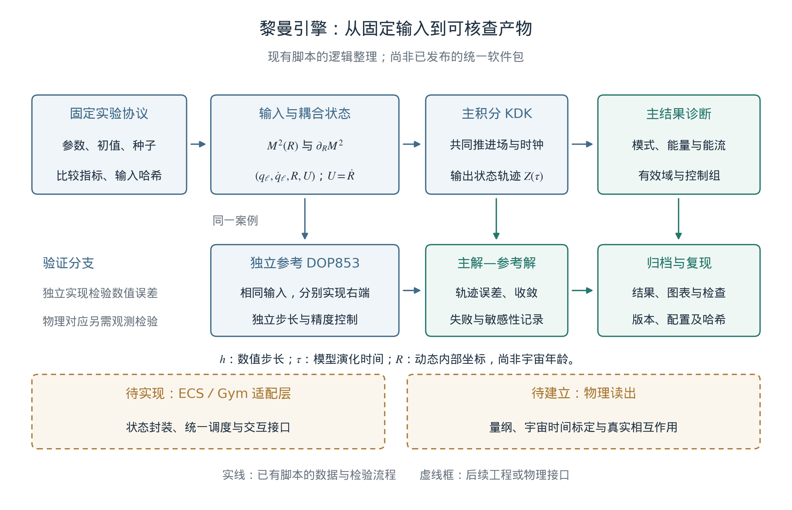

**图7.1　黎曼引擎的输入、演化与验证流程。** 实线概括已运行脚本的逻辑关系；主KDK与独立DOP853从同一案例取输入，通过轨迹误差及收敛比较检查实现。虚线框表示尚待实现的ECS／交互适配和待建立的物理读出。图中$h,\tau,R$分别为数值步长、模型时间和内部坐标；整图不是已发布统一软件包的功能声明。完整场按预定案例和时刻保存，部分案例仅归档标量读数。

**表7.2　模块职责与当前实现状态。**

| 模块 | 已有实现 | 后续接口 |
| --- | --- | --- |
| 输入与驱动 | 零点来源核对、固定分块与替代输入；样条值及完整导数。 | 统一输入格式及适用域声明。 |
| 场—时钟积分 | 纯包络与算术批处理KDK，周期格点、共同反馈。 | 统一状态封装、恢复运行与跨后端比较。 |
| 数值读出 | 模态、场能、钟能、功及预定主指标。 | 在明确耦合后增加真实物理读数。 |
| 独立参考 | 同格点DOP853；纯包络另有连续谱参考。 | 新模型必须提供匹配的参考或可验证极限。 |
| 档案与诊断 | JSON、CSV、选定NPZ轨迹、来源哈希及失败记录。 | 完整环境清单、结构化失败返回、原子化检查点。 |
| 交互与物理扩展 | 主引擎尚无统一ECS、Gym或量子接口；另有背景—PM引力实验。 | 保留候选身份，核验接口后再统一组织。 |

实际入口为[纯包络积分器](../experiments/log_clock_coupling_v01/code/run_coupled_lattice.py)、[算术批处理积分器](../experiments/arithmetic_residual_v01/code/run_lattice.py)及各自的独立参考和分析脚本。[11](#r11) 这些模块已经承载第4章的条件模型。第5章各观测项目则有自己的背景与似然，暂不属于该引擎已经实现的统一物理输出。

## 7.5 伪代码实现

以下伪代码概括现有两类主程序的共同结构；函数名称为说明性记号，并非新增的公开API。`force`从同一$q,R$返回场与钟的加速度及读出所需的系数信息，包含式(7.2)的导数和上述有效域检查。`power`计算场功率$Q_2[M^2]'U/2$，`sample`只在预定时刻保存所选读数。

```text
q, u, R, U = initial_state
F = force(q, R, model, drive)
W = 0
sample(0, q, u, R, U, F, W)
for k in range(n_steps):
    P_old = power(F, U)
    u = u + (h/2) * F.field_acceleration
    U = U + (h/2) * F.clock_acceleration
    q = q + h * u
    R = R + h * U
    F = force(q, R, model, drive)
    u = u + (h/2) * F.field_acceleration
    U = U + (h/2) * F.clock_acceleration
    P_new = power(F, U)
    W = W + (h/2) * (P_old + P_new)
    sample((k+1)*h, q, u, R, U, F, W)
write_results_and_checks(history, config, provenance)
```

力对象中的数组可以复用，但每次评估必须先完成全部加速度计算，再进行下一阶段更新；归约也按案例进行，不能让批次中的不同宇宙候选相互作用。功率使用完整时刻的速度，两次半踢之间不输出成完整状态。独立参考、加密运行与结果比较由外层实验流程执行，未被伪代码中的单次积分替代。

实现中也没有将截断误差清空为“真空噪声”的步骤。误差、域失败和不充分的输入匹配需要作为诊断保留，而真实噪声或开放系统效应必须由新增模型定义。当前引擎已经能研究明确假设下的动力学和数值边界；第8章将以已有模拟案例检验这些模块，并继续报告模型差异、未检出与失败范围。

第4章新增的[背景与粒子—网格模块](../experiments/cosmic_bridge_v01/README.md)是独立的物理接口试验，采用标准Poisson引力、共同初态及物理年龄。其粒子力和变量不同于主格点模型，不能直接继承线性终场的加速倍数；并行执行多个案例的耗时也不构成串行性能基准。

# 第8章 模拟案例与系统验证

**本章提要。** 本章按原稿的三个案例，分别检验精细结构常数响应、宇宙背景接口和精度预算。检验顺序是：先确认程序能准确求解指定模型，再比较真实输入与控制输入，最后讨论观测能否识别所设机制。已有计算支持内部时钟的反作用、指定漂移的统计恢复，以及不同背景候选间可计算的响应差异；它们尚未确认真实常数演化、平方指数的独特性或哈勃张力的解决。以下数字均来自已归档实验，本次写作没有新增模拟或观测拟合。

## 8.1 实验A：精细结构常数时间响应的恢复检验

### 8.1.1 环境与参数：从假设曲线到可检验数据

本案例保留逆对数平方这一核心设想，并把两个问题分开：假如确有变化，分析能否检出；假如检出，又能否认出它来自平方指数？前作中的算术映射提供研究动机，但尚未给出映射参数到真实电磁耦合的唯一转换。[7](#r7), [8](#r8) 因此本实验从第5章已定义的条件响应开始，不把约12.73的计数归一化直接指定为$\alpha$的漂移幅度。

沿用平直物质加$\Lambda$背景，固定$H_0=67.4$ km s$^{-1}$ Mpc$^{-1}$、$\Omega_m=0.315$，取$t_*=5.391247\times10^{-44}$ s，对应$t_0=13.7962$ Gyr、$L_0=\ln(t_0/t_*)=140.244$。在共同时间单位下，对$s>0$定义

$$
\begin{aligned}
A_s(t)-1&=\Gamma_s\left[L(t)^{-s}-L_0^{-s}\right]
=D_0\mathcal T_s(t),\\
D_0&=\left.\frac{\dot\alpha}{\alpha}\right|_{t_0}
=-\frac{s\Gamma_s}{t_0L_0^{s+1}},\\
\mathcal T_s(t)&=-\frac{t_0L_0^{s+1}}{s}
\left[L(t)^{-s}-L_0^{-s}\right].
\end{aligned}
\tag{8.1}
$$

这里$A_s=\alpha/\alpha_0$、$L(t)=\ln(t/t_*)$；$D_0$以年$^{-1}$计时，$\mathcal T_s$以年计。常数零假设直接取$D_0=0$，无需把$s=0$代入含$1/s$的表达式。主候选为$s=2$，$s=1,3$用于检查相近形状；背景和参考尺度均为条件输入。

合成设计保留King等人的293条测量记录、红移、误差和望远镜标签，覆盖131个具名类星体、$0.2223\le z\le4.1798$；293行不等于293个独立吸收体。[36](#r36) 原有测量均值被指定模型加噪声替换，误差沿用统计误差与已采用的额外散布。实验室信息仅使用漂移标准误$\sigma_{D_0}=2.5\times10^{-19}$ 年$^{-1}$，不使用实测中心值作为注入信号。[37](#r37) 单个ESPRESSO吸收体另成一个设计分支，不与King表合并，也不把共享同一钟约束的分支视为独立证据。[38](#r38)

### 8.1.2 执行方法：零信号、注入与误差失配

七种设计分别改变是否加入原子钟、是否拟合Keck/VLT两个偏移，以及是否假设同一类星体内相关系数$\rho=0.25$。最后一种是误差敏感性情景，并非从原始观测估得的协方差。各设计均保留一组零信号，以及$s=1,2,3$各自的六个有符号幅度$D_0=\pm(2.5,5,12.5)\times10^{-19}$ 年$^{-1}$，合计133个条件。最大幅度为所用钟误差的五倍，只用于强信号恢复测试，不表示它符合现有观测。

每种设计用30,000次独立零模拟校准指数扫描阈值，再用20,000次评估重复测量误报率、功效和区间覆盖率。不同注入复用评估噪声以便配对比较，不能把133个条件累加成独立验证。实现使用线性高斯充分统计量，并与完整观测向量的广义最小二乘交叉核对；没有逐个光学周期推进一个宇宙年龄。协议在执行前本地记录，但不是公开预注册或盲分析。[11](#r11)

主比较采用“King加原子钟、两个自由望远镜偏移”。零假设与非零候选具有相同的偏移参数。固定$s=2$的双侧5%检验，与在三个指数间搜索后重新校准的检验分别统计；AIC选择只描述相对拟合表现，不代替5%发现门限。区间覆盖率则针对事先固定且正确的指数，不是选模之后的覆盖率。

### 8.1.3 实际结果：能恢复幅度，尚不能识别平方形状

图8.1左侧显示，当真实指数与拟合指数均为2时，零信号误报率为4.795%；正向注入一、二、五倍钟误差后，检出率分别为16.960%、51.760%和99.885%，与解析高斯功效相符。对应95%幅度区间的覆盖率均为95.205%；相同覆盖率来自线性模型和共享噪声。三个指数扫描经另行校准后的零信号误报率为4.630%，不能直接沿用单指数的阈值或误差条。


**图8.1　检出变化与识别时间形式是两个任务。** 左：主设计在固定$s=2$时的模拟拒绝率与解析功效，零幅度点表示误报；误差条为20,000次评估下约95%的蒙特卡洛误差范围。右：五倍钟误差的正幅度注入下，常数与三个指数候选的AIC选择频率；三行对应三个真实指数，保留常数列而不重新归一化。各行频率近乎相同，且没有一次最佳与次佳指数的$\Delta\mathrm{AIC}\ge2$。选择频率不是理论正确的概率；中间指数的低胜率不能解释为平方律被排除。两侧都是合成数据结果，非新观测。

这一恢复成功主要来自当前漂移信息：在主设计中，原子钟贡献99.9998159%的幅度信息。移除原子钟后，$\sigma_{D_0}$变为约$1.84\times10^{-16}$ 年$^{-1}$，即使注入五倍钟误差，天文表自身的检出率也只有4.85%。因此，联合恢复不能表述为已经从高红移数据重建了整条历史曲线。

形状检验给出更直接的限制。令$\boldsymbol\mu_2$为指定$s=2$注入的无噪声均值，$\boldsymbol\mu_s(d,\boldsymbol\eta)$为另一个指数在重拟合幅度及相同偏移后的均值，可定义

$$
\lambda_{2\to s}=
\min_{d,\boldsymbol\eta}
\left[\boldsymbol\mu_2-\boldsymbol\mu_s(d,\boldsymbol\eta)\right]^{\mathsf T}
C^{-1}
\left[\boldsymbol\mu_2-\boldsymbol\mu_s(d,\boldsymbol\eta)\right].
\tag{8.2}
$$

这里$d=D_0/(10^{-19}\,\mathrm{yr}^{-1})$，$C$为指定误差协方差。主设计在一倍钟误差注入时，对$s=1,3$分别得到$1.36\times10^{-10}$和$1.39\times10^{-10}$；即使放大到五倍，也只有约$3.4\times10^{-9}$。这些数衡量均值曲线在干扰参数投影后的距离，不是已校准的发现显著性。图中$s=1$与$s=3$频繁胜出，反映近乎共线的模型对噪声的响应，不能据此评价指数2的物理优劣。

误差模型也会改变结论。若实际采用同视线$\rho=0.25$的合成噪声，却按独立误差拟合无钟King设计，误报率升至7.38%，95%区间覆盖率降至92.62%。原子钟主导的联合结果不能修复天文误差模型本身。对于单个ESPRESSO点，完全自由的偏移会精确吸收历史响应，只剩钟约束。已有理想预算还显示：固定当前几何、尺度与钟误差，一倍钟误差注入要使最近替代形状的式(8.2)达到1，需要把全部天文标准误共同缩小约$5.15\times10^5$倍。这是假定连系统误差也同比缩小的信息预算，不能作为十年内仪器能力的预测。[11](#r11)

本案例由此建立了可检验的统计流程，也明确了当前瓶颈。真实数据对漂移仍与零相容，具体拟合见第5章；合成恢复率不能转换成真实数据的拟合优度或常数漂移的观测证明。下一轮应先改善历史响应和系统误差的区分能力，再比较平方律与相邻时间形式。

## 8.2 实验B：内部时钟与宇宙背景的一致性

### 8.2.1 环境与参数：分开模型时间和膨胀时间

本案例保留“演化中的内部结构能否影响宏观膨胀”这一问题。哈勃参数仍定义为$H=\dot a/a$；模型更新步、内部坐标$R$及其速度，都需要额外物理映射才能与$H$比较。Planck与SH0ES给出的数值是不同推断途径下的今天$H_0$，不能分别当作复合时代与今天的两个$H(t)$端点。两点插值也不足以检验完整距离关系。[2](#r2), [3](#r3)

已有材料提供两个不同的动力学候选。主RSM候选在固定周期盒中采用正则$R$动能和场反馈，用于检验微观演化及连续近似。另一个自主背景候选采用正则$\chi$动能$F^2(\partial\chi)^2/2$、指数势$V_s e^{-2\chi}$，在尘埃、$\Lambda$与标量共同决定的背景中演化；取$\epsilon=(F/M_{\rm Pl})^2$及$V_s=F^2/(2t_*^2)$。后者是已归档的v0.2候选，不是把主模型换一个变量后得到的同一作用量：$\chi=\ln(R/R_*)$会使正则$R$的动能系数依赖$\chi$。[11](#r11)

v0.2在纯物质标度支上具有$\chi=\ln(t/t_*)$、$Ht=2/3$、$\Omega_\chi=3\epsilon/4$和$w_\chi=0$。这使对数时间具有一个明确的动力学实现，但电磁响应$A(\chi)=1+\beta(\chi^{-2}-\chi_0^{-2})$仍为额外假设，指数2并非由指数势唯一导出。进入含$\Lambda$的背景后，应联立求解场和膨胀，不能每步再强行设$\chi=\ln(t/t_*)$。

### 8.2.2 执行方法：独立求解、收敛与背景恢复

主RSM的基础数值检查先关闭时钟驱动（$b=0$），在固定系数基准中取$L=2\pi$、$v=m_0=g=1$、$q(x,0)=0.5\cos x$及零场速度，在$0\le\tau\le20$的共同输出时刻比较原始格点ODE和连续Fourier–Galerkin参考。空间误差使用独立高精度积分，以免时间步误差掩盖格距修正；没有重新拟合相位、频率或幅度。基础长波方程的相对场RMS差由$N=64$时的$3.137\times10^{-3}$降至$N=512$时的$4.902\times10^{-5}$，约为二阶；加入首个$a^2$修正后分别为$1.767\times10^{-6}$和$4.279\times10^{-10}$，约为四阶。主Verlet时间积分仍是二阶。[11](#r11)

继而启用$R_i=1$、$\dot R_i=0.1$、$R_*=e^{-2}$及$M^2=1+2(\chi^{-2}-1/4)$，以明确规定的外部时钟$R_{\rm ext}=1+0.1\tau$作对照。它不是完整反馈轨迹的回放。三种惯量的结果见表8.1；RMS对所有共同时间及格点求和，以外部驱动场为归一化分母。

**表8.1　完整时钟反馈相对外部驱动近似的差异。**

| 时钟惯量$I$ | $R(20)$，外部对照为3 | 场的相对RMS差 |
| --- | --- | --- |
| 10 | 3.74334 | 7.4096% |
| 100 | 3.08073 | 0.863395% |
| 1000 | 3.00815 | 0.0878651% |

对应的主积分与独立ODE场差约$2.12\times10^{-6}$，低于表中最弱反馈差异$8.79\times10^{-4}$。在$I=100$时，场能减少0.0596712，时钟动能增加相同数值；独立参考的能量与功残差约为$10^{-12}$量级。$b=0$或零初始场的控制恢复直线时钟与零交换。改变$I$时初始钟能也改变，因此该表不是等总能量比较；有限区间结果也不替代第4章的条件晚时证明。

自主背景候选沿用$H_{\rm ref}=67.4$ km s$^{-1}$ Mpc$^{-1}$、$\Omega_{m0}=0.315$，三组$\epsilon$为示例输入而非观测允许区间。它另用DOP853积分，并由独立变量组织和Radau求解器复核。每例调整$\Omega_\Lambda$使今天$H_0/H_{\rm ref}=1$，所以这一步没有预测$H_0$。积分忽略辐射和电磁／物质标量源；$a_i=10^{-3}$及提前起点的$10^{-4}$只是理想尘埃模型中的数值设置，不能称为已验证的早期宇宙演化。主29项检查和独立24项比较通过，最大全分量相对差约$3.21\times10^{-12}$；独立实现沿用主结果的闭合根，没有独立重求该根。[11](#r11) 这是前期尘埃背景实验的记录；第4章式(4.16h—k)及新增实验另将辐射、物理年龄和后期PM聚类接入正则时钟候选，输入、核验及适用范围独立保存。[57](#r57)

### 8.2.3 实际结果：可计算的机制差异与未解决的张力

背景候选最有用的输出，是从当前漂移到过去响应的转换：

$$
A(\chi)-1=D_0\mathcal T_\chi,\qquad
\mathcal T_\chi=-\frac{\chi_0^3}{2\dot\chi_0}
\left(\chi^{-2}-\chi_0^{-2}\right).
\tag{8.3}
$$

$\dot\chi_0$与$D_0$使用相同时间单位。将它与式(8.1)的$s=2$比较时，两者采用同一数值$t(z)$、$t_0$和物理尺度$t_*$，且具有相同今天漂移；因此差异不来自任意幅度重标定。

**表8.2　自主背景与精确对数时间的历史响应比较。**

| $\epsilon$ | $\mathcal T_\chi(4.2)$／$\mathcal T_{\log}(4.2)$（Gyr） | 比值 |
| --- | --- | --- |
| $10^{-6}$ | −37.18390／−31.85074 | 1.167442 |
| $10^{-4}$ | −37.18302／−31.85030 | 1.167431 |
| $10^{-2}$ | −37.09490／−31.80589 | 1.166290 |

这组约16.7%的变化说明，让慢变量自主运动可以产生区别于强制时间函数的结果。传递量并非宇宙年龄，绝对值大于$t_0$没有矛盾；今天两者均为零，不计算$0/0$。以$\epsilon=10^{-4}$为例，只更换膨胀时间历史而保留精确对数律，变化仅约$1.40\times10^{-5}$；主要差别来自$\chi$轨迹及其当前漂移归一化。若示意地取$D_0=2.5\times10^{-19}$ 年$^{-1}$，在$z=4.2$的两种$\alpha$响应只相差约0.00133 ppm。16.7%因而不是已测出的物理变化，也不等于现有观测能分辨的程度。

Hubble项目还对四条已校准背景进行了48次势重建后的正向恢复，在$0\le z\le2.33$内得到最大相对$H(z)$误差$1.38\times10^{-10}$。[19](#r19) 这检验给定背景与所构造标量势的一致性，没有把算术格点变成宇宙学预测。完整校准扩展的代码、输入及全部恢复记录尚未全部进入所引用的公开版本，当前RSM小型快照只保证结果追溯和图件重绘，不能补足完整拟合复现。

观测判据也应与上述数值精度分开。第5章的校准距离比较中，逆对数平方候选相对常数基线仅改善$\Delta\chi^2=0.842$，多一个参数后$\Delta\mathrm{AIC}=+1.158$；当前数据没有选出它，也没有给出“张力消失”的结果。本案例成立的成果是：反馈大小可以与数值误差比较，自主背景会改变响应，指定背景可以正向恢复。将这些不同候选连接为同一物理模型，仍需要共同作用量、物质响应和扰动检验。

## 8.3 实验C：精度预算、算术对照与未来测量

### 8.3.1 环境与参数：三种精度问题分别定义

实验室频率比的测量精度、数值积分的相位误差，以及不同算术输入造成的模型读数差异，具有不同定义。相对频率精度$10^{-18}$或$10^{-20}$是无量纲量；漂移$D_0$以年$^{-1}$计，还依赖时间基线、原子灵敏度和噪声相关。已有恢复实验使用一个压缩的钟漂移约束，尚未模拟十年的真实钟观测序列，也没有建立必然在某一精度出现的宇宙噪声底。

数值相位预算使用一个有效振子作为独立检查。对冻结频率$\omega$的辛Euler离散，设$x=\omega\Delta t$，稳定区间内每步相位及相对频率偏差为

$$
\theta=2\arcsin(x/2),\qquad
b_\nu=\frac{\theta}{x}-1
=\frac{x^2}{24}+O(x^4),\qquad 0<x<2.
\tag{8.4}
$$

步长减半时相位频率偏差趋于缩小四倍，但完整辛Euler状态精度仍是一阶。固定频率、固定步长产生恒定频率偏差，不会自动产生时间漂移。已有预算取示意载频$\nu_0=5\times10^{14}$ Hz、$\omega(t)=2\pi\nu_0 A_s(t)^\kappa$及$\kappa=\pm7$，在$s=1,2,3$和五档有符号漂移组成的30个情景中检查$\epsilon_{\rm ad}=\lvert\dot\omega\rvert/\omega^2$。导数统一秒制，在$0\le z\le4.2$的4,201点网格上最大约$8.96\times10^{-40}$；这仅说明设定载频与慢变响应的局部时间尺度分离，不是完整原子系统或任意长时稳定性的证明。[11](#r11)

### 8.3.2 执行方法：先区分可分辨响应与算术特异性

主格点模型中的算术案例另问：实际零点残差是否产生区别于匹配替代输入的宏观响应？实验以固定归一化处理零点间距，保留索引4097—5120的八个不重叠块，每块128个间距。真实块和替代块经相同自然三次样条及紧支撑窗进入$M^2(R)$，完整导数同时进入时钟反作用。模型取$N=64$、$I=100$、$\varepsilon_{\rm ar}=0.02$，演化至无量纲$\tau=20$；数学零点索引与宇宙年龄无对应。[11](#r11)

每块配置99个IAAFT替代序列，以及99个沿用其相位的精确节点幅度谱配对序列，加上八个真实块和一个纯包络，共1,593例。[12](#r12) 本地方案在主动力学运行前固定，唯一主指标和汇总为

$$
\begin{aligned}
T_b&=\frac{E_R(20)-E_R(0)}{\mathcal H(0)},\qquad D_b=T_b-T_0,\\
\overline D&=\frac18\sum_{b=1}^{8}D_b,\qquad T_0=0.045139422.
\end{aligned}
\tag{8.5}
$$

$T_0$来自纯包络对照。由于残差窗在初点为零，真实、替代及纯包络在本设置中具有共同初始总能量$\mathcal H(0)=1.32189839$，差异不来自逐例改变分母。替代汇总按共同序号跨八块平均，得到99个条件比较值；块不重叠不代表统计独立，两种配对替代族也不是独立复现。图8.2展示这项预定读数的全部八块及汇总。


**图8.2　真实输入改变模型读数，但尚未显示特殊响应。** 黑菱形为真实块的$D$，细横线为各99条替代输入的经验中心95%范围，粗横线为四分位范围，圆点为中位数；最下行单独给出预定等权汇总。横轴为$10^4D$，零线对应纯包络。横线不是观测误差条或参数置信区间，两族使用配对相位。节点谱匹配不保证插值、窗化后的连续驱动谱相同，因此本比较尚未单独隔离高阶算术排列的效应。

真实汇总为$\overline D=-9.7631\times10^{-5}$，所有八块及汇总均落在两族中心95%范围内；汇总条件双侧秩为0.40与0.36。这些秩不是已校准的$p$值，未检出异常也没有证明真实序列与替代序列等效。结果的正面含义是：所设耦合确实能把输入差异传到宏观读数，并且该差异可与数值误差及替代输入的散布分别比较。

**表8.3　算术案例的数值核验与输入控制。**

| 核验对象 | 已存档结果 | 解释范围 |
| --- | --- | --- |
| 全部1,593例的采样能量偏离 | 最大相对值$4.96\times10^{-7}$ | 低于该实验$10^{-4}$门限，不是全连续轨迹上界。 |
| 25个固定例的步长减半 | 最大$\lvert\Delta D\rvert/\mathrm{IQR}=3.97\times10^{-6}$ | 低于事前5%门限；IQR取对应IAAFT分布。 |
| 主积分与独立DOP853 | 最大$\lvert\Delta T\rvert=1.17\times10^{-9}$ | 指定参考案例的实现核对。 |
| $N=64\to128$空间检查 | 最大$\lvert\Delta D\rvert/\mathrm{IQR}=0.2606\%$ | 两个网格的敏感性，尚非全体案例的收敛阶或误差界。 |
| IAAFT节点幅度谱 | 792例中788例通过5%门限 | 四个失败输入均保留，未筛除后重写主结论。 |

输入控制仍有实质限制。插值和窗化后，两族实际驱动功率谱相对差的中位数约为62.25%和61.86%；驱动导数的对应值约为73.31%和73.06%。这些是谱差，不是场RMS或积分误差；该层没有预定合格门限，却足以说明节点匹配不能替代实际驱动匹配。下一轮应先改进此项控制并检验检出能力，再判断是否存在特殊算术效应。

失败记录同样属于验证结果：算术独立参考的首轮能量／功精度与后续严格指标曾未达门限，进一步提高精度后最终五类参考检查通过，历史文件仍保留。更早的固定系数基准中，最细网格参考变化占修正误差1.0919%，超过预设1%，该额外审计仍未通过；近四阶趋势没有因此被抹去，也没有将失败改记为成功。有限浮点、有限零点表和可收敛的积分误差，均不能推出宇宙本身只有相同位数的计算精度。

### 8.3.3 未来结果的判据：把灵敏度变成可拒绝关系

若设计真正的长期钟实验，应先指定频率比$r_\nu=\nu_A/\nu_B$及对$\alpha$的差分灵敏度$\Delta\kappa$。在其他常数和环境响应已控制、漂移近似线性的条件下，可写

$$
\begin{aligned}
y_i&=\ln\!\left[\frac{r_\nu(t_i)}{r_{\nu,\rm ref}}\right]
\simeq a_0+\Delta\kappa D_0(t_i-t_{\rm ref})+\epsilon_i,\\
\operatorname{Var}(\widehat D_0)
&=\frac{\left[(X^{\mathsf T}C_{\rm clk}^{-1}X)^{-1}\right]_{22}}
{(\Delta\kappa)^2},\qquad
X_i=(1,t_i-t_{\rm ref}).
\end{aligned}
\tag{8.6}
$$

这里时间以年计，$C_{\rm clk}$包含测量时间相关及已建模的环境、校准误差，$\Delta\kappa\ne0$且设计矩阵满秩。公式是给定协方差下的线性估计预算；若还需拟合环境趋势，应增加相应列，并检查其与时间项的退化。它不是本章已经执行的十年实验，也不能由一个单次频率精度数字直接得到。

该设计与高红移方案承担互补任务：原子钟测当前斜率，天文光谱在已控制仪器和气体偏差后检验过去响应。第5章的同跃迁级次负对照、跨年龄共同读数和预设中点关系应先于时间形式比较；一个条件谱线差异并不自动等于宇宙时间造成的能级分布变化。随后才比较固定尺度的$s=2$与其他指数，并对模型搜索和共享误差作相应处理。[22](#r22), [23](#r23)

允许幅度为零的整个候选族，不能因未来继续未检出漂移而被一次排除；能承担明确失败风险的是独立固定的非零幅度、共同读数关系或明确的参数区域。同样，检出非零漂移首先要求超出常规误差和环境解释，再检验其时间形式，不能直接确认宇宙的计算本体。三个案例共同给出了有定义、有对照、有精度记录的研究任务。下一章据此汇总当前框架建立了哪些结果，以及哪些物理连接仍须完成。

# 第9章 结论：从计算框架到可检验的物理候选

**本章提要。** 本文将算术结构启发的慢变设想落实为带内部时钟的动力学模型，并给出条件推导、数值对照和观测接口。本章汇总其已经建立的结果，沿可预测性、关联与通信、能量收支三个方向说明物理扩展应满足的条件，最后确定下一阶段的研究重点。

## 9.1 计算视角与本文的主要结果

RSM的核心设想是：部分有效参数的缓慢演化，可能来自更深层动力学自由度，而算术结构可以为这些自由度的组织提供候选形式。作者已发表的非自治映射研究使逆对数平方成为一个有来源的选择，但数值谱对应并未确定真实物质的哈密顿量，也未证明零点序号等于宇宙时间。[7](#r7), [8](#r8) 本文据此保留$1/\ln^2(R/R_*)$为明确假设，并使它承担可以检查的动力学后果。

最具体的进展，是把内部时钟与非线性格点写进同一个哈密顿量。结构参数由$R$调制，场又通过同一势能反作用于$R$；整体自主，子系统沿内部轨迹呈现有效非自治响应。由此得到一致的能量交换、辛分裂更新和独立数值参考。反馈效应在已测案例中高于积分误差，因而是否采用外部规定时钟可以根据任务容差判断。[10](#r10), [11](#r11)

在纯包络、固定有限格点、有限初始能量及第4章规定的正向分支中，时钟速度趋于正极限，预设回复系数保留逆对数平方的晚时主项。这个结果说明所选响应能够与反作用共存；它没有唯一选择指数2，也没有自动覆盖算术残差或连续极限。同一格点相互作用的长波展开进一步给出连续场和首个格距修正。固定系数基准与完整反馈基准分别检验了相应空间近似，数值时间误差另行控制。进一步，逐键作用给出区域能量收支，连续空间平移给出场动量守恒；在三维各向同性线性无质量波极限下，平均动量流满足$p_{\rm wave}=\rho_{\rm wave}/3$。另一条线性CMB路径从六邻域更新连接到传播速度、模态传递和观测协方差。这些关系完成了指定模型及明确条件下的微观规则到宏观场与统计读数的连接；其代数和小格点核验另有归档。[53](#r53)

观测与算术检验为这一构造补充了可识别性的边界。真实零点残差已接入动力学，但预定读数尚未显示区别于替代输入的特殊性；精细结构常数的合成试验可以恢复足够强的漂移，却还不能认出平方指数。另一个自主背景候选还表明，在相同当前漂移下，慢变量的动力学会改变历史响应。膨胀、光谱与CMB分析尚未形成同一参数模型的共同支持。它们分别提供接口约束、系统误差诊断和模型失配信息，而非四项可以相加的发现。第7章的线性终场加速则是一项限定任务下的工程成果，不改变这些物理判断。

因此，本文的贡献落在候选构造、条件连接和检验方法上。辛积分、长波展开与替代数据方法是所采用的既有工具；本文用它们组织算术动机、内部反作用和具体读数。当前数学模型仍是有限维实变量经典系统，空间与模型时间已预先给定。基本时空离散性、有限信息容量及量子测量规则，均未因采用格点或浮点实现而获得证明。

## 9.2 从确定性输入到可检验的预测

算术序列可以被确定计算，这使输入准备和结果比较具有可追踪性。要使这种结构产生物理预测，还必须说明它怎样进入相互作用、怎样被测量，以及测量之前哪些状态信息实际可获得。计算出下一个黎曼零点，尚不能决定下一次电子自旋测量的结果；本文没有建立零点到量子测量概率或单次结果的映射。

确定的演化规律也不等于任意长时间的精确预测。有限状态信息、参数误差、观测扰动和可能的初值敏感性，都应进入具体预测任务的误差预算。当前代码给定完整初态后的可复算性，不能替代实验中取得该初态的能力。因而，算术输入是否有价值，应由它在预先固定的读数上能否增加预测能力来衡量。

第8章的1,593例比较已经把这一问题转成可执行检验：真实输入、纯包络与两族条件替代输入使用同一动力学和终点。真实输入改变了读数，但八个块及汇总都在替代集合的中心95%范围内。下一步需要改善实际连续驱动及其导数的匹配，并量化检出能力，再用未参与设定的零点块评价相同关系。[11](#r11), [12](#r12) 只有在这些条件下仍出现稳定的额外预测能力，才能进一步讨论算术排列的特殊作用；当前未检出结果既不确认这种作用，也不排除所有可能的联系。

## 9.3 从共同状态到关联与通信约束

逻辑依赖与物理距离的区分仍有建模价值。它使共享自由度、同步阶段和观测读出可以被明确表示，并帮助定位哪些更新引入了全局影响。然而，变量共用一个存储地址，只规定计算机如何表示状态，没有规定实验者能够进行什么局域操作。

若希望把共同状态发展成量子接口，候选需要同时给出联合态、测量规则及可控制的局域操作。第3章讨论的标准量子无信号条件要求：对一侧施加局域、完全正且迹保持、不按结果筛选的操作，不改变另一侧的约化态。[34](#r34) 该条件不是本文经典格点已经导出的性质。未来构造应同时比较关联统计和本地未筛选概率，不能仅用相关性或计算程序中的即时赋值判断信息是否传播。

现有共享$R$接收整个周期盒的反馈，再调制各格点，因而包含全局耦合。将它推广为物理时钟，必须处理局域传播和不同观测者之间的一致性；统一更新序号尚不能承担这些任务。更具体的方向是研究具有明确动力学与传播性质的局域驱动场，并检查均匀模式在何种条件下回到当前基准。这是需要另建和验证的候选扩展，当前结果没有给出零延迟通信机制。

## 9.4 从数值残差到能量收支

能量问题中，本文已经建立的结果是可核查的交换关系。纯包络正向分支里，场的回复系数变软，场能减少并转移给时钟；自主整体的总能量由同一哈密顿量控制。算术扰动可以改变交换过程，但仍须通过完整系数导数计入反作用。把场单独看作一个系统时，其能量变化有明确来源，不是凭空增加或消失。

求解器误差承担另一种角色。辛分裂的修正哈密顿量、有限步长相位偏差和浮点舍入，都与算法和数值精度有关。能够随求解器加密而减小的残差，应先作为计算误差处理；若另假设基本物理节拍或有限物理信息容量，就需要独立定义这些量，再检查固定物理模型下的数值收敛。[10](#r10) 当前程序没有量子真空态、真空应力—能量及其引力耦合，不能将数值余项直接解释为可提取的真空能源。

第6章已将慢变真空候选的要求写成能量交换与状态方程问题。[20](#r20), [21](#r21) 任何后续取能或驱动装置，都应明确系统边界，将外场、边界运动及恢复初态所需的过程计入完整收支。一个局部读数增加，只有在这些来源得到核对后才能解释。内部时钟的能量交换为这种构造提供了可计算例子，但没有解决宇宙学常数问题，也没有给出无限能源方案。

## 9.5 研究展望：从可计算性到物理辨识

下一阶段最有价值的工作，是将一个物理接口进一步固定。以电磁读数为例，需要明确物质与内部变量的耦合、内部坐标到宇宙时间的关系，以及环境项的处理；随后让同一组参数同时承担当前钟漂移与历史光谱响应的检验。平方指数继续作为候选输入，但其幅度、尺度与响应规则不能在看到结果后任意替换。这样，一次符合或不符合预期的观测才能限制指定候选。[1](#r1), [22](#r22), [23](#r23)

算术方向应优先解决实际驱动匹配及检出能力，而不是只增加更多相似案例。观测方向则继续遵循“先控制常规误差，再比较时间形式”的顺序：谱线差异、非零时间幅度和平方指数具有不同的证据要求。允许幅度为零的模型族不能因一次未检出整体排除；独立固定的非零幅度、参数区域或共同响应关系，才可以承担明确的失败风险。改变物质耦合、初始谱或环境机制时，应登记为另一个候选，再接受相同的检验。

微观到宏观的目标仍然保留。第4章已接入从数值初态到CMB约束锚点、再到非线性续演的存档时间线，并把早期集体势能占优、负压和动力学退出列为暴涨机制的候选研究问题。这些存档阶段尚未构成统一的物理宇宙史。新的正则时钟分支已接入辐射、物质、Λ和标准引力，建立以物理年龄标定的背景与后期无碰撞聚类计算；它采用外部CAMB初谱和共同初态对照，仍未完成暴涨、早期传递或星系形成的共同模拟。[57](#r57) 续接的受控塌缩与条件冷却计算区分连续球形结果、有限粒子精度和气体平衡近似；参考背景的主粒子配置未通过连续球精度门限，不能据此识别微小时钟响应；同质量与红移下的冷却微物理保持相同，形成事件处的差异只来自背景历史。气体温度、密度及恒星过程仍须实际演化。[62](#r62) 当前长波连接可以作为下一步统计约化、局域驱动及物质读出的起点，但尚不能替代真实能级、量子测量或引力方程的推导。自主背景候选与固定盒主模型的动能结构不同，四个观测项目也尚未共享同一作用量和参数集合。工程上，代码接口、来源记录与独立参考需要继续完善；Hubble校准扩展的完整公开复现材料仍须补齐。已有计算速度优势适合服务于条件扫描与模型比较，不能代替同物理内容的准确度验证。

表9.1按原稿的九个主题汇总这种定位。相关基准分别来自量子理论、广义相对论、宇宙学模型及数值方法；它们不属于一个统一的“旧标准模型”。本表比较问题与完成状态，不作理论优劣排名。

**表9.1　RSM候选与相关既有理论、方法的关系。**

| 主题 | 相关基准 | 本文的当前状态 |
| --- | --- | --- |
| 基础架构 | 状态空间、场与几何按具体理论定义。 | 周期格点与内部时钟；基本离散性仍为假设。 |
| 动力学来源 | 相互作用由作用量或演化规律规定。 | 共同哈密顿量已给定；真实物质耦合尚未从算术导出。 |
| 随机性 | 量子概率依赖态及测量规则。 | 算术输入确定可算；量子概率与单次测量映射未建立。 |
| 时空描述 | 广义相对论用度规描述时空。 | 空间与模型时间已给定；长波场已构造，有效时空待建立。 |
| 光速与传播 | 相对论关系约束物理传播。 | 可计算格点色散；全局时钟的局域相对论扩展未完成。 |
| 量子关联 | 联合态、Bell关联与无信号条件共同受检验。 | 共享状态是表示方式，尚未给出完整量子测量接口。 |
| 常数响应 | 指定基准固定参数，也可另设动力学扩展。 | 逆对数平方响应为候选；当前数据未识别其独特性。 |
| 长时行为 | 结论依赖背景、物质及适用范围。 | 有指定分支的尾律结果，没有物理宇宙终局预言。 |
| 研究目标 | 用明确预测连接理论和实验。 | 从算术动机形成可计算候选，再检验其额外预测能力。 |

本文把“结构参数能否随内部演化而变化”推进成了一个具有反作用、连续近似和检验记录的具体问题。当前结果支持所选分支的数学与数值可行性，也显示了识别机制所需的额外条件。非自治思想与逆对数平方响应由此获得了继续研究的明确起点；能否从黎曼结构约束真实物质相互作用，并产生区别于替代模型的共同预测，将决定这一构想能够解释多大范围的物理现象。

# 参考文献

<a id="r1"></a>

**[1]** Bekenstein, J. D. Fine-structure constant: Is it really a constant? *Physical Review D* **25**, 1527 (1982). [DOI: 10.1103/PhysRevD.25.1527](https://doi.org/10.1103/PhysRevD.25.1527).

<a id="r2"></a>

**[2]** Planck Collaboration (Aghanim, N., et al.). Planck 2018 results. VI. Cosmological parameters. *Astronomy & Astrophysics* **641**, A6 (2020). [DOI: 10.1051/0004-6361/201833910](https://doi.org/10.1051/0004-6361/201833910). [作者预印本](https://arxiv.org/abs/1807.06209).

<a id="r3"></a>

**[3]** Riess, A. G., et al. A Comprehensive Measurement of the Local Value of the Hubble Constant with 1 km/s/Mpc Uncertainty from the Hubble Space Telescope and the SH0ES Team. *The Astrophysical Journal Letters* **934**, L7 (2022). [DOI: 10.3847/2041-8213/ac5c5b](https://doi.org/10.3847/2041-8213/ac5c5b). [作者预印本](https://arxiv.org/abs/2112.04510).

<a id="r4"></a>

**[4]** Montgomery, H. L. The pair correlation of zeros of the zeta function. In *Analytic Number Theory*, Proceedings of Symposia in Pure Mathematics **24**, 181–193 (1973). American Mathematical Society. [作者所在大学提供的全文](https://websites.umich.edu/~hlm/paircor1.pdf).

<a id="r5"></a>

**[5]** Odlyzko, A. M. On the distribution of spacings between zeros of the zeta function. *Mathematics of Computation* **48**(177), 273–308 (1987). [DOI: 10.1090/S0025-5718-1987-0866115-0](https://doi.org/10.1090/S0025-5718-1987-0866115-0). [作者文献页](https://www-users.cse.umn.edu/~odlyzko/doc/old/zeta.html).

<a id="r6"></a>

**[6]** Berry, M. V., and Keating, J. P. The Riemann Zeros and Eigenvalue Asymptotics. *SIAM Review* **41**(2), 236–266 (1999). [DOI: 10.1137/S0036144598347497](https://doi.org/10.1137/S0036144598347497). [作者提供的全文](https://michaelberryphysics.wordpress.com/wp-content/uploads/2013/06/berry307.pdf).

<a id="r7"></a>

**[7]** Wang, L. The emergence of prime distribution from low-dimensional deterministic chaos. *Research in Mathematics* **13**(1), 2684334 (2026). [DOI: 10.1080/27684830.2026.2684334](https://doi.org/10.1080/27684830.2026.2684334).

<a id="r8"></a>

**[8]** Wang, L. Numerical Spectral Correspondence Between a Non-Autonomous Quadratic Map and the Riemann Zeros: An Exploratory Study. *Mathematical and Computational Applications* **31**(5), 193 (2026). [DOI: 10.3390/mca31050193](https://doi.org/10.3390/mca31050193).

<a id="r9"></a>

**[9]** ’t Hooft, G. *The Cellular Automaton Interpretation of Quantum Mechanics*. Fundamental Theories of Physics, Vol. 185. Springer, Cham (2016). [DOI: 10.1007/978-3-319-41285-6](https://doi.org/10.1007/978-3-319-41285-6). [作者预印本](https://arxiv.org/abs/1405.1548).

<a id="r10"></a>

**[10]** Hairer, E., Lubich, C., and Wanner, G. Geometric numerical integration illustrated by the Störmer–Verlet method. *Acta Numerica* **12**, 399–450 (2003). [DOI: 10.1017/S0962492902000144](https://doi.org/10.1017/S0962492902000144). [作者原始摘要与方法说明](https://www.unige.ch/~hairer/preprints/gniverlet.html).

<a id="r11"></a>

**[11]** Wang, L. RSM：动力学基准与关联项目分析记录。研究代码与技术资料，版本 `e3569ba`（2026）。[固定仓库版本](https://github.com/maris205/rsm/tree/e3569ba6fa50845108dcb5c316dec23cf78aa530)；[格点—连续场报告](../experiments/micro_macro_v01/reports/results_cn.md)；[时钟反馈报告](../experiments/log_clock_coupling_v01/reports/results_cn.md)；[算术输入对照](../experiments/arithmetic_residual_v01/reports/results_cn.md)；[合成恢复报告](../experiments/alpha_recovery_v01/reports/recovery_results_cn.md)；[四个关联项目的证据与接口](../reports/prior_projects_evidence.md)。

<a id="r12"></a>

**[12]** Schreiber, T., and Schmitz, A. Improved surrogate data for nonlinearity tests. *Physical Review Letters* **77**, 635–638 (1996). [DOI: 10.1103/PhysRevLett.77.635](https://doi.org/10.1103/PhysRevLett.77.635). [作者存档](https://arxiv.org/abs/chao-dyn/9909041).

<a id="r13"></a>

**[13]** Bell, J. S. On the Einstein Podolsky Rosen paradox. *Physics Physique Fizika* **1**, 195 (1964). [DOI: 10.1103/PhysicsPhysiqueFizika.1.195](https://doi.org/10.1103/PhysicsPhysiqueFizika.1.195).

<a id="r14"></a>

**[14]** Riess, A. G., et al. The Perfect Host: JWST Cepheid Observations in a Background-Free SN Ia Host Confirm No Bias in Hubble-Constant Measurements. 作者预印本（2025）。[arXiv:2509.01667](https://arxiv.org/abs/2509.01667).

<a id="r15"></a>

**[15]** Freedman, W. L., et al. Status Report on the Chicago-Carnegie Hubble Program (CCHP): Measurement of the Hubble Constant Using the Hubble and James Webb Space Telescopes. *The Astrophysical Journal* **985**, 203 (2025). [DOI: 10.3847/1538-4357/adce78](https://doi.org/10.3847/1538-4357/adce78)；[作者预印本v3](https://arxiv.org/abs/2408.06153v3)。另见该文勘误，*The Astrophysical Journal* **993**, 252 (2025)，[DOI: 10.3847/1538-4357/ae146d](https://doi.org/10.3847/1538-4357/ae146d)。

<a id="r16"></a>

**[16]** H0DN Collaboration. The Local Distance Network: a community consensus report on the measurement of the Hubble constant at 1% precision. *Astronomy & Astrophysics* **708**, A166 (2026). [DOI: 10.1051/0004-6361/202557993](https://doi.org/10.1051/0004-6361/202557993)；[作者预印本](https://arxiv.org/abs/2510.23823)。

<a id="r17"></a>

**[17]** DESI Collaboration. DESI DR2 Results II: Measurements of Baryon Acoustic Oscillations and Cosmological Constraints. *Physical Review D* **112**, 083515 (2025). [DOI: 10.1103/tr6y-kpc6](https://doi.org/10.1103/tr6y-kpc6)；[作者预印本](https://arxiv.org/abs/2503.14738)。

<a id="r18"></a>

**[18]** DESI Collaboration. DESI DR2 Results IV: Alcock-Paczyński Measurements from the Lyman Alpha Forest and Cosmological Constraints. 作者预印本（2026），2026-07-29首稿，2026-08-04修订。[arXiv:2607.27410v3](https://arxiv.org/abs/2607.27410v3).

<a id="r19"></a>

**[19]** Wang, L. An Inverse-Squared-Logarithm Hubble Normalization: Conditional Distance Fits and Scalar-Field Reconstructions. 探索性工作稿及计算记录（2026）。本文使用2026-09-19的校准拟合与标量恢复报告；[原文快照及来源](../reports/chapter01_sources/README.md)，[项目主页](https://github.com/maris205/riemann_hubble)。

<a id="r20"></a>

**[20]** Weinberg, S. The cosmological constant problem. *Reviews of Modern Physics* **61**, 1–23 (1989). [DOI: 10.1103/RevModPhys.61.1](https://doi.org/10.1103/RevModPhys.61.1)；[出版商全文](https://harvest.aps.org/v2/journals/articles/10.1103/RevModPhys.61.1/fulltext)。

<a id="r21"></a>

**[21]** Padilla, A. Lectures on the Cosmological Constant Problem. 作者讲义（2015）。[arXiv:1502.05296](https://arxiv.org/abs/1502.05296)。

<a id="r22"></a>

**[22]** Wang, L. An Inverse-Squared-Logarithm Fine-Structure History: Conditional Tests with Atomic Clocks and Quasar Spectra. 工作稿与计算资料（2026），版本`3827e38`。[固定版本研究报告](https://github.com/maris205/riemann_fine_structure_constant/blob/3827e38f1d7e633cbd1956a8c34fa363b83b54aa/reports/research_report_zh.md)。

<a id="r23"></a>

**[23]** Wang, L. Finite-Resource Estimates of Riemann Zeros: Laboratory Diagnostics and a Conditional Cosmic-Time Hypothesis；Instrument and Gas-Model Sensitivity of Fe II Relative-Frequency Tests in Archival Quasar Spectra. 两份关联工作稿与计算资料（2026），版本`5b2b6b7`。[项目与稿件](https://github.com/maris205/riemann_clock/blob/5b2b6b77bd544a812fb9140a9586189448f0a40f/readme_cn.md)；[光谱诊断报告](https://github.com/maris205/riemann_clock/blob/5b2b6b77bd544a812fb9140a9586189448f0a40f/experiments/highz_feasibility_2026-09-20/reports/publication_followup_results_cn.md)；[前瞻检验设计](https://github.com/maris205/riemann_clock/blob/5b2b6b77bd544a812fb9140a9586189448f0a40f/experiments/prediction_test_2026-09-21/readme.md)。

<a id="r24"></a>

**[24]** Wang, L. Logarithmic lattice cooling and CMB identifiability. 工作稿与计算资料（2026），版本`f42db51`。[固定版本结果与范围](https://github.com/maris205/riemann_cmb/blob/f42db51748003fc83be064dade9bb52de5eb8319/readme_cn.md)；[线性终场原始计时](https://github.com/maris205/riemann_cmb/blob/f42db51748003fc83be064dade9bb52de5eb8319/results/linear_runtime.json)；[计时方法核对](https://github.com/maris205/riemann_cmb/blob/f42db51748003fc83be064dade9bb52de5eb8319/reports/runtime_method_review.md)。

<a id="r25"></a>

**[25]** Hadamard, J. Sur la distribution des zéros de la fonction $\zeta(s)$ et ses conséquences arithmétiques. *Bulletin de la Société Mathématique de France* **24**, 199–220 (1896). [DOI: 10.24033/bsmf.545](https://doi.org/10.24033/bsmf.545)；[期刊数字档案](https://numdam.org/articles/10.24033/bsmf.545/)。

<a id="r26"></a>

**[26]** May, R. M. Simple mathematical models with very complicated dynamics. *Nature* **261**, 459–467 (1976). [DOI: 10.1038/261459a0](https://doi.org/10.1038/261459a0)。

<a id="r27"></a>

**[27]** Feigenbaum, M. J. Quantitative universality for a class of nonlinear transformations. *Journal of Statistical Physics* **19**, 25–52 (1978). [DOI: 10.1007/BF01020332](https://doi.org/10.1007/BF01020332)；[大学提供的原文](https://sites.math.rutgers.edu/~zeilberg/Bio21/MF78.pdf)。

<a id="r28"></a>

**[28]** Sprott, J. C. Misiurewicz Point of the Logistic Map. University of Wisconsin–Madison技术说明（2005，2006修订）。[作者原始说明及参数计算](https://sprott.physics.wisc.edu/chaos/mispoint.htm)。

<a id="r29"></a>

**[29]** Hardy, G. H., and Littlewood, J. E. Some problems of ‘Partitio numerorum’; III: On the expression of a number as a sum of primes. *Acta Mathematica* **44**, 1–70 (1923). [DOI: 10.1007/BF02403921](https://doi.org/10.1007/BF02403921)。

<a id="r30"></a>

**[30]** Wang, L. `prime_logistic`：素数与二次映射配套代码。文献7的作者代码库，版本`0bdeaaa`（2026）。[固定映射的加权双素数示例](https://github.com/maris205/prime_logistic/blob/0bdeaaac9ac3f062e151d27a2d3c50bf241be5ef/fig9-twin_prime_constant.ipynb)；[间距比较与随机稀疏化](https://github.com/maris205/prime_logistic/blob/0bdeaaac9ac3f062e151d27a2d3c50bf241be5ef/fig10-cramer_test.ipynb)。

<a id="r31"></a>

**[31]** Dyson, F. J. Statistical Theory of the Energy Levels of Complex Systems. I. *Journal of Mathematical Physics* **3**, 140–156 (1962). [DOI: 10.1063/1.1703773](https://doi.org/10.1063/1.1703773)；[期刊原文的学术镜像](https://filippo-colomo.github.io/random_matrices/Dyson_62.pdf)。

<a id="r32"></a>

**[32]** Schumacher, B., and Werner, R. F. Reversible quantum cellular automata. 作者预印本（2004）。[arXiv:quant-ph/0405174](https://arxiv.org/abs/quant-ph/0405174)。

<a id="r33"></a>

**[33]** Clauser, J. F., Horne, M. A., Shimony, A., and Holt, R. A. Proposed Experiment to Test Local Hidden-Variable Theories. *Physical Review Letters* **23**, 880–884 (1969). [DOI: 10.1103/PhysRevLett.23.880](https://doi.org/10.1103/PhysRevLett.23.880)。

<a id="r34"></a>

**[34]** Beckman, D., Gottesman, D., Nielsen, M. A., and Preskill, J. Causal and localizable quantum operations. *Physical Review A* **64**, 052309 (2001). [DOI: 10.1103/PhysRevA.64.052309](https://doi.org/10.1103/PhysRevA.64.052309)；[作者提供的期刊全文](https://www.preskill.caltech.edu/pubs/preskill-2001-causal.pdf)。

<a id="r35"></a>

**[35]** Chorin, A. J., Hald, O. H., and Kupferman, R. Optimal prediction with memory. *Physica D: Nonlinear Phenomena* **166**(3–4), 239–257 (2002). [DOI: 10.1016/S0167-2789(02)00446-3](https://doi.org/10.1016/S0167-2789(02)00446-3)；[作者提供的期刊全文](https://math.berkeley.edu/~chorin/CHK02.pdf)。

<a id="r36"></a>

**[36]** King, J. A., et al. Spatial variation in the fine-structure constant — new results from VLT/UVES. *Monthly Notices of the Royal Astronomical Society* **422**(4), 3370–3414 (2012). [DOI: 10.1111/j.1365-2966.2012.20852.x](https://doi.org/10.1111/j.1365-2966.2012.20852.x)；[作者预印本](https://arxiv.org/abs/1202.4758)；[CDS测量目录](https://cdsarc.cds.unistra.fr/ftp/J/MNRAS/422/3370/)。

<a id="r37"></a>

**[37]** Filzinger, M., et al. Improved Limits on the Coupling of Ultralight Bosonic Dark Matter to Photons from Optical Atomic Clock Comparisons. *Physical Review Letters* **130**, 253001 (2023). [DOI: 10.1103/PhysRevLett.130.253001](https://doi.org/10.1103/PhysRevLett.130.253001)；[作者预印本](https://arxiv.org/abs/2301.03433)。

<a id="r38"></a>

**[38]** Murphy, M. T., et al. Fundamental physics with ESPRESSO: Precise limit on variations in the fine-structure constant towards the bright quasar HE 0515−4414. *Astronomy & Astrophysics* **658**, A123 (2022). [DOI: 10.1051/0004-6361/202142257](https://doi.org/10.1051/0004-6361/202142257)；[作者预印本](https://arxiv.org/abs/2112.05819)。

<a id="r39"></a>

**[39]** Toscani De Col, L., et al. A thorium-229 optical nuclear clock with feedback loop. 作者预印本（2026），2026-06-03首稿，2026-06-05修订。[arXiv:2606.04997v2](https://arxiv.org/abs/2606.04997v2)。

<a id="r40"></a>

**[40]** Aeppli, A., et al. (BACON Collaboration). Atomic Clock Frequency Ratios with Fractional Uncertainty $\leq3.2\times10^{-18}$. *Physical Review Letters* **137**, 033201 (2026)，2026-07-14发表。[DOI: 10.1103/g865-9mk1](https://doi.org/10.1103/g865-9mk1)；[作者预印本](https://arxiv.org/abs/2512.21428)。

<a id="r41"></a>

**[41]** Muller, S., et al. A sub-ppm upper limit on the cosmological variations of the fine structure constant $\alpha$. *Astronomy & Astrophysics* **706**, A365 (2026). [DOI: 10.1051/0004-6361/202557492](https://doi.org/10.1051/0004-6361/202557492)；[作者预印本](https://arxiv.org/abs/2512.14441)。

<a id="r42"></a>

**[42]** Scolnic, D., et al. The Pantheon+ Analysis: The Full Data Set and Light-curve Release. *The Astrophysical Journal* **938**(2), 113 (2022). [DOI: 10.3847/1538-4357/ac8b7a](https://doi.org/10.3847/1538-4357/ac8b7a)；[作者预印本](https://arxiv.org/abs/2112.03863)。

<a id="r43"></a>

**[43]** Shannon, C. E. Communication in the Presence of Noise. *Proceedings of the IRE* **37**(1), 10–21 (1949). [DOI: 10.1109/JRPROC.1949.232969](https://doi.org/10.1109/JRPROC.1949.232969)；[MIT保存的原文](https://fab.cba.mit.edu/classes/S62.12/docs/Shannon_noise.pdf)。

<a id="r44"></a>

**[44]** Gromov, M. Pseudo holomorphic curves in symplectic manifolds. *Inventiones Mathematicae* **82**, 307–347 (1985). [DOI: 10.1007/BF01388806](https://doi.org/10.1007/BF01388806)；[作者提供的原文](https://www.ihes.fr/~gromov/wp-content/uploads/2018/08/945.pdf)。

<a id="r45"></a>

**[45]** Robertson, H. P. The Uncertainty Principle. *Physical Review* **34**, 163–164 (1929). [DOI: 10.1103/PhysRev.34.163](https://doi.org/10.1103/PhysRev.34.163)。

<a id="r46"></a>

**[46]** Hensen, B., et al. Loophole-free Bell inequality violation using electron spins separated by 1.3 kilometres. *Nature* **526**, 682–686 (2015). [DOI: 10.1038/nature15759](https://doi.org/10.1038/nature15759)。

<a id="r47"></a>

**[47]** Bothwell, T., et al. Resolving the gravitational redshift across a millimetre-scale atomic sample. *Nature* **602**, 420–424 (2022). [DOI: 10.1038/s41586-021-04349-7](https://doi.org/10.1038/s41586-021-04349-7)。

<a id="r48"></a>

**[48]** Bertotti, B., Iess, L., and Tortora, P. A test of general relativity using radio links with the Cassini spacecraft. *Nature* **425**, 374–376 (2003). [DOI: 10.1038/nature01997](https://doi.org/10.1038/nature01997)。

<a id="r49"></a>

**[49]** Englert, B.-G. Fringe Visibility and Which-Way Information: An Inequality. *Physical Review Letters* **77**, 2154–2157 (1996). [DOI: 10.1103/PhysRevLett.77.2154](https://doi.org/10.1103/PhysRevLett.77.2154)；[期刊全文](https://harvest.aps.org/v2/journals/articles/10.1103/PhysRevLett.77.2154/fulltext)。

<a id="r50"></a>

**[50]** Farama Foundation. Env. *Gymnasium官方文档*，2026-09-24查阅。[环境接口、返回值及终止／截断定义](https://gymnasium.farama.org/api/env/)。

<a id="r51"></a>

**[51]** NumPy Developers. Compatibility policy. *NumPy随机数模块官方文档*，2026-09-24查阅。[随机流复现的条件与兼容性范围](https://numpy.org/doc/stable/reference/random/compatibility.html)。

<a id="r52"></a>

**[52]** Seljak, U., and Zaldarriaga, M. A Line-of-Sight Integration Approach to Cosmic Microwave Background Anisotropies. *The Astrophysical Journal* **469**, 437–444 (1996). [DOI: 10.1086/177793](https://doi.org/10.1086/177793)；[作者预印本](https://arxiv.org/abs/astro-ph/9603033)。

<a id="r53"></a>

**[53]** 本项目研究记录. 微观—宏观关系的代数与小格点验证：局部能流、条件波动压力、色散与协方差传递（2026-09-24）。未单独发表的代码、预先记录协议及完整结果；[归档说明](../experiments/macro_laws_v01/README.md)、[守恒核验](../experiments/macro_laws_v01/reports/conservation_checks_cn.md)、[波动与传递核验](../experiments/macro_laws_v01/reports/wave_transfer_checks_cn.md)。

<a id="r54"></a>

**[54]** Baumann, D. TASI Lectures on Inflation. 作者讲义（2009，2012修订），第5—6节及第12节。[arXiv:0907.5424v2](https://arxiv.org/abs/0907.5424v2)；[DOI: 10.48550/arXiv.0907.5424](https://doi.org/10.48550/arXiv.0907.5424)。

<a id="r55"></a>

**[55]** Lewis, A., Challinor, A., and Lasenby, A. Efficient Computation of CMB Anisotropies in Closed FRW Models. *The Astrophysical Journal* **538**, 473–476 (2000). [DOI: 10.1086/309179](https://doi.org/10.1086/309179)；[作者预印本](https://arxiv.org/abs/astro-ph/9911177)；[CAMB官方接口与单位文档](https://camb.readthedocs.io/en/latest/camb.html)，2026-09-24查阅。本轮使用CAMB 2.0.4生成声明参数下的外部标准线性物质谱，不将其归作RSM的原初谱预测。

<a id="r56"></a>

**[56]** Springel, V., Pakmor, R., Zier, O., and Reinecke, M. Simulating cosmic structure formation with the GADGET-4 code. *Monthly Notices of the Royal Astronomical Society* **506**, 2871–2949 (2021). [作者原文，第4—5节](https://arxiv.org/html/2010.03567v3)；[DOI: 10.1093/mnras/stab1855](https://doi.org/10.1093/mnras/stab1855)。本文借用标准共动引力与时间推进的物理接口，未执行GADGET-4，也不主张本次PM实现具有同等分辨率或完整物理内容。

<a id="r57"></a>

**[57]** 本项目研究记录. 宇宙年龄、正则时钟与无碰撞引力聚类的最小连接（2026-09-24）。未单独发表的数值实验；[协议与复现入口](../experiments/cosmic_bridge_v01/README.md)、[结果与适用范围](../experiments/cosmic_bridge_v01/reports/results_cn.md)。标准背景参数及CAMB初谱为输入，采用共同初态检验后期连接；没有重新拟合观测。

<a id="r58"></a>

**[58]** Pace, F., Meyer, S., and Bartelmann, M. On the implementation of the spherical collapse model for dark energy models. *Journal of Cosmology and Astroparticle Physics* **2017**(10), 040 (2017). [DOI: 10.1088/1475-7516/2017/10/040](https://doi.org/10.1088/1475-7516/2017/10/040)；[作者预印本](https://arxiv.org/abs/1708.02477)。

<a id="r59"></a>

**[59]** Power, C., et al. The inner structure of ΛCDM haloes — I. A numerical convergence study. *Monthly Notices of the Royal Astronomical Society* **338**, 14–34 (2003). [作者预印本](https://arxiv.org/abs/astro-ph/0201544)。用于说明质量、力尺度与步长须分别核验，不把已平衡晕的收敛判据直接等同于本次内落球的精度。

<a id="r60"></a>

**[60]** Katz, N., Weinberg, D. H., and Hernquist, L. Cosmological Simulations with TreeSPH. *The Astrophysical Journal Supplement Series* **105**, 19 (1996). [DOI: 10.1086/192305](https://doi.org/10.1086/192305)；[作者原文，第3.2节及表1—2](https://arxiv.org/pdf/astro-ph/9509107)。本轮采用其中历史原初H/He解析速率的无外部光电离情形，仅作瞬时冷却诊断。

<a id="r61"></a>

**[61]** Smith, B. D., et al. Grackle: a chemistry and cooling library for astrophysics. *Monthly Notices of the Royal Astronomical Society* **466**, 2217–2234 (2017). [DOI: 10.1093/mnras/stw3291](https://doi.org/10.1093/mnras/stw3291)；[作者预印本](https://arxiv.org/abs/1610.09591)。速率实现对照采用[官方3.4.1版解析平衡工具](https://github.com/grackle-project/grackle/blob/af7939494ce65007887ada7b98d1813df6843346/src/python/gracklepy/utilities/primordial_equilibrium.py)的`rates='cen'`；没有调用完整Grackle气体演化求解器。

<a id="r62"></a>

**[62]** 本项目研究记录. 受控球形塌缩、分辨率检查与原初气体冷却接口（2026-09-24）。未单独发表的条件数值实验；[协议与复现入口](../experiments/halo_cooling_v01/README.md)、[完整结果与限制](../experiments/halo_cooling_v01/reports/results_cn.md)。采用指定补偿初态和标准原子速率，不构成星系形成或观测验证。

# 致谢与研究材料说明

## AI辅助与责任说明

根据原始稿的披露，早期稿件使用Google Gemini 3 Pro辅助数值代码实现及结果分析。本轮中文修订使用OpenAI Codex辅助文稿整理、代码与结果核对、图件重绘和排版，并通过协作代理对选定推导、数字及表述进行检查。这些辅助核对属于作者侧研究过程，不等于独立外部同行评审；AI输出本身不作为数学证明或观测证据。最终稿的科学判断、来源核验与内容责任由作者承担。

## 代码与数据可用性

本稿、模型代码、协议、数值结果及构建程序保存于[RSM公开仓库](https://github.com/maris205/rsm)。正文引用的固定版本、原始文献、数据来源和文件哈希，分别见参考文献、实验协议与来源报告；模型输入、合成数据和真实观测产品按其来源区分。第5章关联项目的资料入口见文献19及22—24，外部数据的使用条件以各原始发布方及保存的许可记录为准。

当前仓库的[观测图件来源说明](../reports/chapter05_sources/README.md)列出用于重绘的小型结果快照。Hubble校准扩展的完整代码、输入及全部恢复记录尚未全部进入所引用的公开版本，因此这些快照不能被视为完整拟合的复现材料。其他实验也应按各自协议的参数、环境和精度范围复算，文件哈希只确认来源文件身份，不代替数值或物理验证。

第4章新增的[宇宙年龄与聚类实验](../experiments/cosmic_bridge_v01/README.md)保存完整代码、冻结协议、标准参数生成的CAMB输入谱及各项数值对照。其密度图是条件模拟，既非真实星系目录，也非从SMICA图像恢复的物质三维分布。已有输入随仓库保存，重新生成初谱才需要安装CAMB。

续接的[受控塌缩与冷却实验](../experiments/halo_cooling_v01/README.md)保存球形方程、六种PM配置及原初H/He条件网格；数值精度失败和物理近似警示与通过项一起归档。两个PM主例另存完整末态粒子坐标和动量，其余案例保存轨迹与统计。官方Grackle解析工具仅作独立速率参照，其原始许可和固定来源随材料保留；本轮没有运行完整气体或星系形成模拟。
