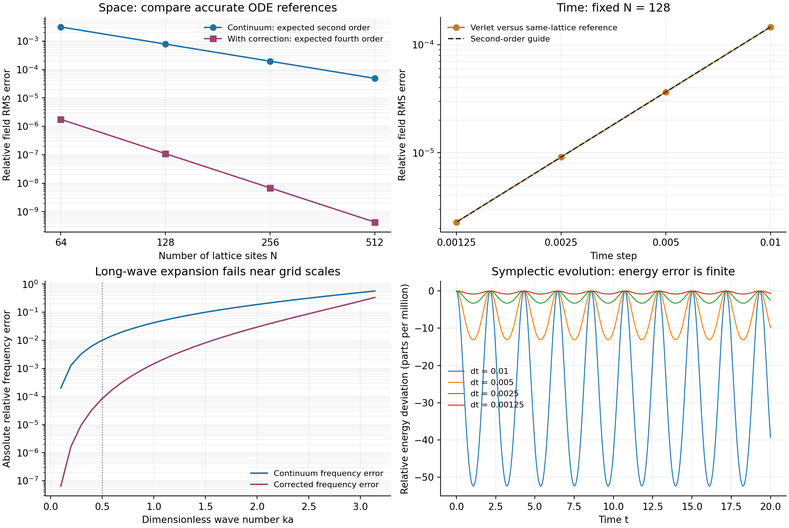
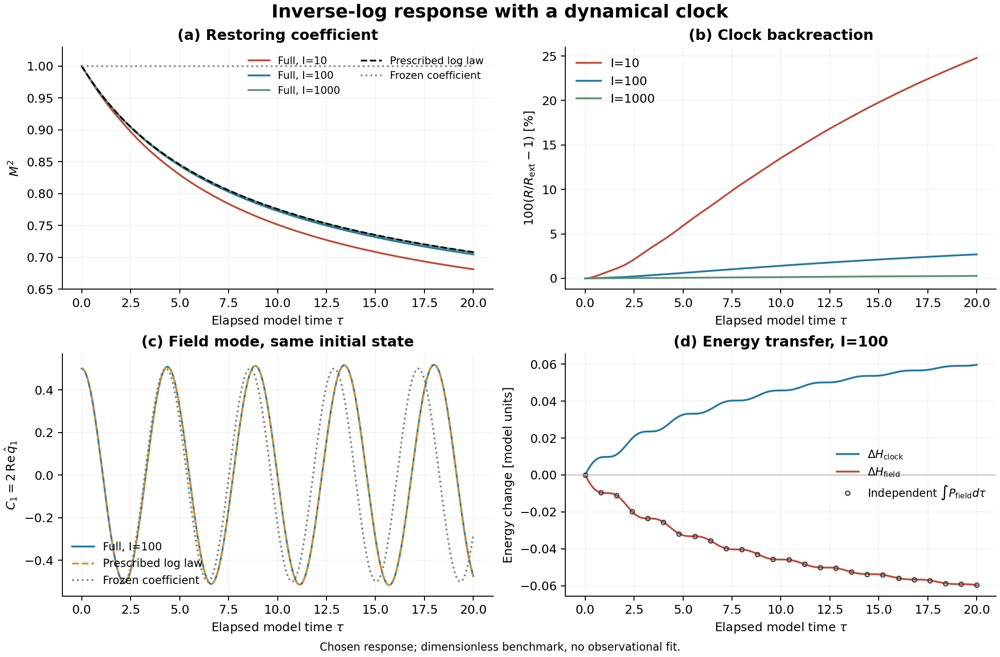
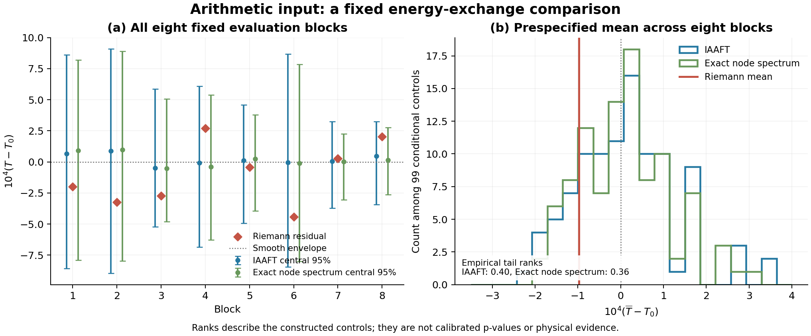

# 黎曼结构启发的逆对数平方动力学：内部时钟与微观—宏观连接

*Riemann-Inspired Inverse-Log-Square Dynamics: An Internal-Clock Framework and Micro–Macro Connections*

中文完整初稿 · 2026-09-23

## 摘要

作者此前关于非自治二次映射与黎曼零点的探索性数值研究，为逆对数平方响应提供了候选形式。本文据此构造一个内部时钟与非线性正则格点共享Hamilton量的假设框架，明确区分算术输入、时间标定和真实物理对应。完整反馈给出相互抵消的场—时钟能流；在纯包络、固定有限格点及指定正能量分支下，时钟速度趋于正极限，回复系数相对于常数极限保留逆对数平方的晚时尾律。长波展开给出连续场及首个格距修正，独立数值比较区分空间差异、时间误差和反馈效应。进一步将真实零点间距残差接入模型，并与两族条件替代输入比较：1593例计算中，八个真实块的预设能量交换指标均处于替代集合中心范围，未提供特殊算术响应的增量证据。实际连续驱动匹配不足及检出能力未量化限制了该结果的解释。本文提供可复核的模型构造、条件连接与后续检验路线；平方指数仍为输入假设，真实物理相互作用尚未从黎曼结构导出。

**关键词：** 黎曼零点；逆对数平方响应；内部时钟；Hamilton动力学；连续近似；替代输入检验

# 1 引言：从算术谱到时间依赖动力学

## 1.1 谱统计联系提供的动机

黎曼零点与量子谱之间的联系，为从动力学角度理解算术结构提供了研究动机。希尔伯特—波利亚思想尝试以适当自伴算符的谱刻画非平凡零点；Berry与Keating进一步研究了零点计数、谱涨落与经典混沌之间的对应。[1](#r1) Montgomery在黎曼假设下得到受限范围内的成对关联结果，并提出更广的成对关联猜想；Dyson指出该猜想与大型随机厄米矩阵的相应统计相同。[2](#r2) Odlyzko的数值计算则显示，零点间距的若干统计与随机矩阵预测相符，并随谱高度增加呈现更好的吻合。[3](#r3)

这些联系支持研究算术与动力学之间的结构关系，但涉及的是谱位置及其统计。统计相似本身并没有指定真实物质的Hamilton量，也没有给出宇宙时间。本文据此区分两个问题：数学序列能否获得有用的动力学表示，以及这种表示能否启发具有时间依赖的物理候选模型。后一个问题需要另外定义时间变量、耦合规则和可观测量，不能仅由谱统计类比得到。

## 1.2 从已有非自治模型到新的问题

作者此前研究了素数筛与低维二次映射符号动力学之间的对应，报告了若干算术统计的数值复现。[4](#r4) 后续工作采用参数随迭代变化的非自治二次映射，以逆对数平方项为主导、逆对数立方项为修正，通过校准经验转移矩阵的特征相位，建立了与黎曼零点的探索性数值谱对应。[5](#r5) 这一演化形式构成本文选择逆对数平方响应的直接动机。

前作中的逆对数驱动属于现象学构造，谱对应也具有校准依赖。零点论文报告的留出误差高于训练误差，模型局部间距统计尚未复现高斯酉系综（GUE），并未构造希尔伯特—波利亚型自伴算符。[5](#r5) 因此，这些工作为本文提供的是候选结构及可继续追问的问题。映射步数$n$或零点序号$j$都不能直接等同于物理时间；数学零点本身也不因引入时钟而成为随宇宙年龄改变的量。

本文提出一个进一步的假设：若某些有效相互作用由演化中的内部自由度调制，受算术动力学启发的逆对数平方形式是否能够产生明确的集体响应？为使这一设想可计算，需要同时说明响应系数如何进入方程、驱动如何演化，以及被驱动系统如何反作用于它。这也是从规定一条时间曲线走向完整动力学模型所需补充的内容。

## 1.3 内部时钟与候选响应

本文采用一个经典非线性正则格点，并引入与其交换能量的内部坐标$R$及其正则动量。内部坐标以模型演化时间$\tau$参数化；$R$尚不等同于宇宙尺度因子，$\tau$也尚未标定为宇宙年龄。首先考虑平滑回复系数

$$
M^2(R)=m_0^2+b\left[
\frac{1}{\ln^2(R/R_*)}
-\frac{1}{\ln^2(R_i/R_*)}
\right],
\qquad R>R_*>0.
\tag{1.1}
$$

这里$R_i>R_*$为初始内部坐标，$R_*$与$R$具有相同量纲；$m_0^2$是初始回复系数，$b$与$M^2$具有相同量纲，控制响应幅度。$M^2$表示格点方程中的线性回复系数，尚不赋予真实粒子质量的含义。平方指数、该系数的选择和耦合强度均作为输入假设；原映射的拟合常数不直接充当物理耦合常数。

将内部坐标和格点写入同一Hamilton量后，调制与反作用由同一组正则方程决定，能量收支也能够逐项计算。完整系统可以是自主的，而只考察格点自由度、沿内部时钟轨迹求值时，其方程呈现时间依赖。这使非自治响应有一个明确的动力学来源。辛结构和相应数值方法用于约束和核验演化；具体相互作用仍由所选Hamilton量决定。[6](#r6)

平滑包络与零点细节在本框架中分别检验。式(1.1)规定整体响应，展开后的真实零点间距残差则作为额外输入。将同一包络分别配以真实残差、统计匹配替代残差及零残差，可以检验被选中的宏观读数是否对零点排列具有额外敏感性。索引到内部坐标的映射同样属于需要固定和检验的模型组成部分。

## 1.4 本文的研究问题与贡献

本文围绕三个相互衔接的问题展开。首先，在计入双向反馈后，逆对数平方响应能否保持一致的能量交换，并在明确条件下保留晚时尺度？其次，给定局部非线性格点，能否推导和数值核验其长波连续方程，同时区分空间近似与时间积分误差？最后，在固定耦合及主指标后，真实零点残差能否产生超出替代输入范围的响应？

对于纯包络模型，本文给出共同Hamilton量及完整反馈方程，并在固定有限格点、有限初始能量和指定正能量分支下证明：内部时钟速度趋于正极限，回复系数相对于其常数极限保留逆对数平方的晚时主导行为。这是已假定响应在反馈下的条件保持性，不能反过来证明平方指数是唯一选择。对平滑初态和有限时间的独立数值比较，则检验了长波方程、格距修正及忽略反作用的误差。

真实残差实验进一步把算术输入接入这一模型。残差会改变轨迹，但八个固定评价块的预设能量交换指标均位于所构造替代集合的中心95%范围内。本轮因此没有给出该桥接下特殊算术响应的增量证据。连续驱动及其导数的谱匹配仍不充分，检出能力也尚未量化，故该结果不能推广为零点结构普遍无效或不同输入物理等效。本文的贡献在于把逆对数假设、完整反馈、连续近似和算术对照组成一条可复核的计算链，并明确各步骤能够支持的结论。

## 1.5 适用范围与文章安排

本文首先研究定义明确的经典候选模型。其“微观”指格点层的自由度，“宏观”主要指长波场及选定的集体读数；当前推导不包含真实原子谱、量子测量规则或引力场方程。内部时钟采用全系统共享的均匀模式，尚需进一步构造才能讨论所有自由度的局域传播与相对论相容性。由模型响应通向精细结构常数或宇宙学观测，还需要物质耦合、时间标定和独立数据约束。

后文依次给出变量与基本假设（第2章）、时钟—格点方程与条件晚时结果（第3章）、长波连续描述（第4章）、数值与算术对照（第5章），再讨论物理接口和可检验路线（第6章），最后总结条件结论（第7章）。逆对数平方演化及其黎曼结构动机贯穿全文；真实零点残差已经用于计算，而从黎曼结构导出真实物理相互作用仍是待完成的问题。

# 2 变量、尺度与基本假设

## 2.1 四类索引与两种时间

本文把算术输入、模型演化和数值离散分别定义。零点序号$j$与前作映射步数$n$标记数学构造；格点索引$\ell$标记模型空间；数值步号$k$标记求解器采样。改变积分步长只改变计算精度，不增加模型假设的物理演化次数。

| 符号 | 定义与约定 |
| --- | --- |
| $\gamma_j,j$ | 第$j$个所用正虚部零点及其序号；输入是有限精度数学参考表。 |
| $n$ | 前作非自治映射的迭代索引，不用于本文时间积分编号。 |
| $\ell,N,L,a$ | $\ell=0,\ldots,N-1$，周期格点数$N$、盒长$L$和格距$a=L/N$。 |
| $\tau,k,h$ | 模型经过时间、数值步号和固定积分步长，$\tau_k=kh$，初时刻为零。 |
| $R,R_i,R_*,u_i$ | 内部坐标、初值、对数参考坐标及初速度$u_i=\dot R(0)$；$R_i>R_*>0$。 |
| $\chi,\chi_i$ | $\chi=\ln(R/R_*)$，$\chi_i=\ln(R_i/R_*)>0$。 |
| $t,t_*$ | 讨论物理接口时使用的宇宙时间及参考时间；当前模型尚未提供它们与$\tau,R$的物理标定。 |

点号统一表示$d/d\tau$。本文采用无量纲基准；$R$和$R_*$均为无量纲内部坐标，$h$是数值步长而非基本时间尺度。恢复量纲时，回复系数$M^2$、$m_0^2$、幅度$b$及后文的$\varepsilon_{\rm ar}$具有频率平方量纲，$v$具有速度量纲，$gq^2$具有频率平方量纲，$I$具有能量乘时间平方量纲。场归一化还需与所选能量单位一起指定；这些单位转换不能代替真实物质的标定。

## 2.2 状态空间与正则结构

在周期边界$q_{\ell+N}=q_\ell$下，取状态

$$
\mathcal X=(R,P_R;q_0,p_0,\ldots,q_{N-1},p_{N-1}),
\qquad
\omega=dR\wedge dP_R+\sum_{\ell=0}^{N-1}dq_\ell\wedge dp_\ell.
\tag{2.1}
$$

这里$q_\ell$为经典场幅度，$p_\ell=a\dot q_\ell$，$P_R=I\dot R$，$I>0$为时钟惯量。由此取$\{q_\ell,p_m\}=\delta_{\ell m}$及$\{R,P_R\}=1$。格距因子$a$保证固定盒长下离散场的能量和正则结构具有相容的连续归一化；不能在网格加密时把$p_\ell$直接替换成速度而保留原括号。

本文选择最近邻二次空间耦合、二次回复项和四次局部势作为最小候选。它们定义了本模型的相互作用，尚未从黎曼零点导出。正则结构约束演化形式，但不唯一决定这些势函数。相应Hamilton量在第3章给出。

## 2.3 平滑响应与研究分支

记纯包络回复系数为

$$
M_{\rm env}^2(R)=m_0^2+b(\chi^{-2}-\chi_i^{-2})
=M_\infty^2+b\chi^{-2},
\qquad M_\infty^2=m_0^2-b\chi_i^{-2}.
\tag{2.2}
$$

为建立第3章的正能量分支，固定有限$N,L$，并要求

$$
I>0,\quad v>0,\quad g\ge0,\quad m_0^2>0,\quad
0<b<m_0^2\chi_i^2,\quad u_i>0,
\tag{2.3}
$$

以及有限初始能量。该选择使$M_\infty^2>0$。在随后证明的前向轨迹$R\ge R_i$上，回复系数保持正下界。本文不将这组充分条件推广到任意参数，也不延拓通过$R=R_*$的对数奇点。

式(2.2)中的平方指数是研究假设。求解反馈方程后，精确成立的是回复系数对$R$的函数关系；对$\tau$是否呈现同一时间规律，需要另行推导。若要与宇宙时间$t$比较，还须规定统一的标定及物理响应，不能通过逐个对象重设时钟来获得吻合。

## 2.4 算术残差作为可替换输入

算术检验在同一平滑包络上增加一个固定函数：

$$
M^2(R)=M_{\rm env}^2(R)+\varepsilon_{\rm ar}w(R)S(R).
\tag{2.4}
$$

$S(R)$由去除平均零点密度后的间距残差构造，归一化只使用指定开发段；$w$为有限支撑窗，$\varepsilon_{\rm ar}$为预先固定的幅度。实验中把每个128点块映到$R\in[1,3]$，作自然三次样条，并取

$$
w(R)=
\begin{cases}
\sin^4[\pi(R-1)/2],&1\le R\le3,\\
0,&\text{otherwise},
\end{cases}
\qquad \varepsilon_{\rm ar}=0.02.
\tag{2.5}
$$

残差与替代序列使用相同的插值、窗口和幅度。具体的展开、归一化和对照算法在第5章及附录B说明。它们定义了从算术索引到模型耦合的候选连接，并非从前作继承的物理定理。$S=0$恢复纯包络模型；加入脉冲后，反馈必须包含窗函数和样条的完整导数，不能自动继承纯包络分支的单调性证明。

这些假设允许分别检验三件事：所选Hamilton动力学是否实现一致的反馈，连续描述在什么范围内准确，以及指定宏观指标是否对真实算术排列有额外敏感性。后续章节据此报告条件推论与计算结果；真实物理对应保持为独立的待检验命题。

# 3 自主时钟—格点动力学

## 3.1 共同Hamilton量与回复系数

在长度为$L$的周期区间上取$N$个格点，$a=L/N$，格点索引为$\ell=0,\ldots,N-1$，并令$q_{\ell+N}=q_\ell$。点号表示对模型演化时间$\tau$求导。场与均匀内部坐标采用正则动量$p_\ell=a\dot q_\ell$、$P_R=I\dot R$，共同Hamilton量为

$$
H=\frac{P_R^2}{2I}+H_{\rm field},\qquad
H_{\rm field}=\sum_{\ell=0}^{N-1}\left[
\frac{p_\ell^2}{2a}
+\frac{v^2(q_{\ell+1}-q_\ell)^2}{2a}
+\frac a2M^2(R)q_\ell^2+\frac{ag}{4}q_\ell^4
\right].
\tag{3.1}
$$

这里$I>0$、$g\ge0$，$v$规定格点间的传播系数。场—时钟相互作用已计入$H_{\rm field}$，不再在时钟端重复加入。采用无量纲内部坐标，定义

$$
\begin{aligned}
\chi&=\ln(R/R_*),\qquad \chi_i=\ln(R_i/R_*),\\
M_{\rm env}^2(R)&=m_0^2+b(\chi^{-2}-\chi_i^{-2}),\\
M^2(R)&=M_{\rm env}^2(R)+\varepsilon_{\rm ar}w(R)S(R).
\end{aligned}
\tag{3.2}
$$

$wS$表示固定的可微算术残差响应，其具体输入与窗函数在第5章给出；纯包络取$\varepsilon_{\rm ar}=0$。响应只依赖系统坐标而不显含$\tau$，所以完整系统自主。平方指数、耦合位置和幅度依然是模型假设，正则结构本身并不指定这些函数。

式(3.2)中的$\chi_i$由初值确定，在对$R$求导时保持固定。$R$是独立的动力学坐标，不是预先规定的时钟读数，也没有被赋予宇宙尺度因子的含义。若改用$\chi$作为正则坐标，其动量为$P_\chi=RP_R$，动能的速度形式具有随坐标变化的系数$IR^2$。因此本模型不能直接替换为具有恒定动能系数的正则对数字段；两者需要不同的运动方程和背景条件。

## 3.2 双向反馈与能量交换

记$Q_2=a\sum_\ell q_\ell^2$，上撇号仅表示对$R$求导。由式(3.1)直接得到

$$
\begin{aligned}
\dot q_\ell&=p_\ell/a,&
\dot p_\ell&=\frac{v^2}{a}(q_{\ell+1}-2q_\ell+q_{\ell-1})
-a[M^2(R)q_\ell+gq_\ell^3],\\
\dot R&=P_R/I,&
\dot P_R&=-\frac12Q_2[M^2]'(R),\\
[M^2]'(R)&=-\frac{2b}{R\chi^3}
+\varepsilon_{\rm ar}[w'(R)S(R)+w(R)S'(R)].
\end{aligned}
\tag{3.3}
$$

因此完整二阶方程为

$$
\ddot q_\ell=v^2\frac{q_{\ell+1}-2q_\ell+q_{\ell-1}}{a^2}
-M^2(R)q_\ell-gq_\ell^3,
\qquad I\ddot R=-\frac12Q_2[M^2]'(R).
\tag{3.4}
$$

令$E_R=H_{\rm clock}=P_R^2/(2I)$。格点内部的正则项在能量求导时相消，留下

$$
\dot H_{\rm field}=\frac12Q_2[M^2]'(R)\dot R
=-\dot H_{\rm clock},\qquad \dot H=0.
\tag{3.5}
$$

纯包络且$b>0$、$\dot R>0$时，场能下降、时钟动能上升。“驱动”在此指系数调制，并不预先指定供能方向。加入残差后，导数项可能改变符号，能流可以局部反向；即使$\varepsilon_{\rm ar}$较小，也不能忽略较快残差的导数。总能量守恒与单向能流是不同命题。数值离散还会引入能量误差，辛积分并不严格保存原Hamilton量，因而仍须核验累计功和步长收敛。[6](#r6)

## 3.3 外部对数历史的有限时间近似

以下先限定纯包络、$R_i>R_*>0$、初速度$u_i>0$及$0<b<m_0^2\chi_i^2$。忽略反馈得到自由时钟

$$
R_{\rm ext}=R_i+u_i\tau,\qquad
\chi_{\rm ext}=\ln\frac{\tau+R_i/u_i}{R_*/u_i}.
\tag{3.6}
$$

将其代入式(3.2)，回复系数具有精确的逆对数平方时间形式；这并未把$\tau+R_i/u_i$标定为宇宙年龄。完整系统则必须求解式(3.4)，不能重设时钟以维持外部曲线。

在外部驱动近似中，场端仍满足式(3.5)的功率关系，但已不再演化一个承担反作用的时钟。场能变化应与外部累计功比较，不能再加上常数自由时钟动能并要求总量守恒。相应地，回放完整解中的$R(\tau)$只是实现核验，不能代替式(3.6)定义的独立外部对照。

记$M_\infty^2=m_0^2-b/\chi_i^2>0$、$Q_{\max}=2H_{\rm field}(0)/M_\infty^2$。正能量与纯包络的能流给出$Q_2\le Q_{\max}$。在$0\le\tau\le T$内，令$A_{\rm fb}=bQ_{\max}/(IR_i\chi_i^3)$，则

$$
0\le\dot R-u_i\le A_{\rm fb}\tau,\qquad
0\le R-R_{\rm ext}\le\frac12A_{\rm fb}\tau^2.
\tag{3.7}
$$

$A_{\rm fb}T/u_i\ll1$是充分的弱反馈判据。固定初值与有限$T$时，增大$I$抑制时钟偏离；但固定初速度也使初始时钟动能正比于$I$增加。这不是同总能量下的比较。场轨迹是否足够接近外部驱动解，还取决于该时间窗口内的相位积累与动力学稳定性。

## 3.4 纯包络的条件晚时行为

**命题1。** 对固定有限$N,L$、有限初始能量及第3.3节的条件，纯包络解对所有$\tau\ge0$存在，且$\dot R\to u_\infty\ge u_i>0$。令$\tau_{\rm eff}=R_*/u_\infty$，则

$$
\frac{R(\tau)}{\tau}\longrightarrow u_\infty,\qquad
M_{\rm env}^2(R(\tau))-M_\infty^2
\sim\frac{b}{\ln^2(\tau/\tau_{\rm eff})}.
\tag{3.8}
$$

附录A给出全局延拓、速度极限及更细的尾部误差证明。其关键是场能非负且有下界、时钟速度单调有界。反馈改变有限时间轨迹和有效参考尺度，同时保留已选响应的晚时主导形式；该命题不选择平方指数，也不保证有限计算窗口已进入渐近区。

命题1不直接适用于含残差的过程。若残差具有紧支撑，只有另行证明轨迹以正速度离开支撑、且此后保持在纯包络区域，才能对之后的演化使用同类论证。以上存在性和尾律均针对有限维候选模型，既不等于连续场正则性定理，也未从黎曼结构导出真实物理相互作用。

# 4 从局部格点到连续有效场

## 4.1 正则归一化与连续能量

连续近似保持物理区间长度$L$、内部时钟惯量$I$及模型系数固定，只减小格距$a=L/N$。令$x_\ell=\ell a$，将平滑周期场$\phi(x,\tau)$采样为$q_\ell$。正则归一化要求

$$
q_\ell\simeq\phi(x_\ell,\tau),\qquad
\frac{p_\ell}{a}\simeq\pi(x_\ell,\tau)=\partial_\tau\phi(x_\ell,\tau),\qquad
\sum_\ell p_\ell\,\mathrm dq_\ell
\longrightarrow\int_0^L\pi\,\mathrm d\phi\,\mathrm dx.
\tag{4.1}
$$

$p_\ell$是格点正则动量，$\pi$是动量密度；二者相差积分权重$a$。若在加密时直接令$p_\ell=\dot q_\ell$而不改Hamilton量，就会改变惯性归一化和反馈强度。由式(3.1)的求和极限得到形式连续Hamilton量

$$
H_{\rm cont}=\frac{P_R^2}{2I}
+\int_0^L\left[
\frac{\pi^2}{2}+\frac{v^2\phi_x^2}{2}
+\frac{M^2(R)\phi^2}{2}+\frac{g\phi^4}{4}
\right]\mathrm dx.
\tag{4.2}
$$

相应的连续Poisson括号为$\{\phi(x),\pi(y)\}=\delta_L(x-y)$，其中$\delta_L$是周期Dirac分布，且$\{R,P_R\}=1$。这一极限只重新表达同一候选相互作用，没有加入新的宏观拟合系数。改变系统体积则是另一个问题，需要额外规定$I$随$L$的标度。

## 4.2 长波方程与首个格距修正

在所考察时间区间内，若$\phi$具有受控的高阶空间导数，周期中心差分的Taylor展开为

$$
\frac{\phi(x+a)-2\phi(x)+\phi(x-a)}{a^2}
=\phi_{xx}+\frac{a^2}{12}\phi_{xxxx}+O(a^4).
\tag{4.3}
$$

因此连续主阶及其均匀时钟反馈为

$$
\begin{aligned}
\phi_{\tau\tau}&=v^2\phi_{xx}-M^2(R)\phi-g\phi^3,\\
I\ddot R&=-\frac12[M^2]'(R)\int_0^L\phi^2\,\mathrm dx.
\end{aligned}
\tag{4.4}
$$

对纯包络，第二式化为$b(R\chi^3)^{-1}\int\phi^2\mathrm dx$；含算术残差时必须保留完整导数。二次场积分是同一个耦合能对$R$的变分结果，而不是额外规定的宏观源。

保留首个有限格距效应，得到

$$
\phi_{\tau\tau}=v^2\phi_{xx}-M^2(R)\phi-g\phi^3
+\frac{v^2a^2}{12}\phi_{xxxx}+O(a^4).
\tag{4.5}
$$

该修正的系数由最近邻空间算子确定。它修正传播色散，不表示非线性时间积分器获得四阶精度。时钟源的积分近似也须同时受控；对充分光滑的周期场，周期求和提供相应一致近似，但仅给出场方程的Taylor展开不足以证明整个耦合系统的解收敛。

## 4.3 色散关系与高频适用边界

为单独检查空间算子，冻结$R=\bar R$，并在线性极限$g=0$取平面波。令$\kappa=2\pi m/L$为空间波数，$m$为整数，则精确格点色散及两级连续近似为

$$
\begin{aligned}
\omega_a^2(\kappa)&=M^2(\bar R)+\frac{4v^2}{a^2}
\sin^2\!\left(\frac{\kappa a}{2}\right),\\
\omega_0^2(\kappa)&=M^2(\bar R)+v^2\kappa^2,\\
\omega_{\rm corr}^2(\kappa)&=M^2(\bar R)+v^2\kappa^2
-\frac{v^2a^2}{12}\kappa^4.
\end{aligned}
\tag{4.6}
$$

这里的冻结是算子诊断，不把时变系统当成具有恒定本征频率的系统。当$|\kappa|a\ll1$时，式(4.6)说明基础与修正模型的空间截断阶；接近格点截止时，有限项展开不再准确。若把修正PDE无截止地延伸到任意大波数，负四次项会使$\omega_{\rm corr}^2$变负，而正质量下的原格点色散始终为正。这种失稳来自截断近似的越界使用，不能解释为原模型的新物理效应。修正方程因而只能配合受控频带及实际高频占有检查使用。

## 4.4 连续描述能够支持的结论

形式一致性描述算子在光滑函数上的误差，解的收敛则还需要稳定性、初值逼近和共同有限时间区间。本文分别以同格点独立积分测量时间误差，以连续场参考测量空间差异；相位漂移、非线性谐波生成及高频占有均可能限制可用时间。有限$N$的能量有界性不能直接替代连续极限所需的一致正则性估计。

式(4.4)的场空间算子是局部的，但所有空间位置共用$R(\tau)$，且$R$受全区间积分反馈。这是均匀时钟模式的约化，并未建立所有自由度的局域传播。若要讨论相对论相容性，需进一步引入空间依赖的驱动场及其传播或约束方程，并说明均匀模式约化何时成立；当前全局耦合不能据此解释为可用的超距信号。

这里的“微观—宏观连接”特指格点自由度到长波集体场的受控描述。它没有执行统计平均、积分消去快变量或量子化，因而不自动给出热力学、耗散、真实原子能级或引力方程。能够检验的是：指定正则相互作用所产生的集体运动，是否在其有效频带与时间范围内服从推导出的连续方程。

# 5 数值结果与算术输入对照

## 5.1 比较对象与误差定义

本章依次检验固定回复系数下的连续近似、逆对数平方包络的完整反馈，以及真实零点残差的增量响应。所有轨迹均由指定方程生成，不包含物理观测拟合。共同设置为周期长度$L=2\pi$、$v=g=m_0=1$、初态$q_\ell(0)=0.5\cos x_\ell$及$\dot q_\ell(0)=0$，演化终点$\tau_f=20$。纯包络反馈比较使用$N=128$，算术残差的主计算使用$N=64$；两者的离散初始能量和基线分别计算。

场误差在共同输出步与格点上定义为

$$
\varepsilon_q=
\left[
\frac{\sum_{k,\ell}|q_\ell(\tau_k)-q_\ell^{\rm ref}(\tau_k)|^2}
{\sum_{k,\ell}|q_\ell^{\rm ref}(\tau_k)|^2}
\right]^{1/2}.
\tag{5.1}
$$

各比较采用相应参考场作分母，不重新调整相位或振幅。主格点使用Störmer–Verlet；同格点的独立DOP853解分离时间误差，Fourier–Galerkin参考分离空间近似误差。这些是同一模型的独立实现或同一模型系列的连续代理，不能作为跨物理模型的验证。复现细节见[附录B](chapters/appendix_b_reproducibility.md)。

这种分层比较各有不同用途：固定系数组检查连续展开是否描述给定格点；纯包络组测量忽略反作用的代价；算术组比较相同桥接下不同输入的读数。前两项的一致性不能替代第三项的识别检验，三项也都不直接衡量对自然界的预测精度。

## 5.2 固定系数：长波近似与非线性响应

首先固定$M^2=1$，比较格点、连续主阶及含$a^2\phi_{xxxx}/12$修正的长波方程。高精度格点参考给出下表，避免二阶时间误差遮蔽空间差异。

| $N$ | 连续主阶的$\varepsilon_q$ | 含首个格距修正的$\varepsilon_q$ |
| ---: | ---: | ---: |
| 64 | $3.137\times10^{-3}$ | $1.767\times10^{-6}$ |
| 128 | $7.843\times10^{-4}$ | $1.098\times10^{-7}$ |
| 256 | $1.961\times10^{-4}$ | $6.849\times10^{-9}$ |
| 512 | $4.902\times10^{-5}$ | $4.279\times10^{-10}$ |

空间经验阶分别接近二阶和四阶；固定网格的时间积分仍为二阶。连续参考产生第三空间谐波，其峰值约$0.004671$，为初始幅度的$0.9342\%$；线性对照不产生可分辨的第三谐波。该结果说明非线性参与了集体演化，不构成量子能级、热化或混沌的证据。

*图5.1：固定系数基准。空间阶由高精度格点与连续参考比较得到，时间阶单独测量；色散对照展示了接近格距时的近似限制。*

该收敛仅覆盖指定平滑初态和有限时间。修正方程不能任意延伸到高波数；最细格点的额外精度检查也有一项未通过：收紧参考容差引起的场变化占目标修正误差的$1.092\%$，略高于$1\%$门限。主表相应误差只改变$0.00781\%$，但这不能替代未通过的诊断。

例如最粗格点的第24空间模式，连续主阶与格点的线性色散频率相差约$27.45\%$，首修正后仍相差约$6.51\%$。当前平滑初态在这些短波模式上的占有极弱，故整体场收敛与局部频带失效可以同时成立，不能仅凭热力图相似扩大有效范围。

## 5.3 纯包络：反馈改变有限时间轨迹

接入内部时钟后，固定$R_i=1$、$R_*=e^{-2}$、$\dot R_i=0.1$和$b=2$，分别取$I=10,100,1000$。外部对照规定$R_{\rm ext}=1+0.1\tau$，冻结对照取$M^2=1$。完整反馈相对于外部驱动的场差异依次为$7.4096\%$、$0.863395\%$和$0.0878651\%$；时钟终点依次为$3.74334$、$3.08073$和$3.00815$，而外部终点为$3$。

*图5.2：纯包络的完整反馈与外部、冻结对照。曲线采用$N=128$；场差异包括累积相位偏离，不是能量变化百分比。*

增加$I$时保持初速度，因此初始时钟能量分别为$0.05,0.5,5$；这不是相同总能量的比较。$I=100$时，场向时钟转移约$0.0596712$个模型能量单位，独立参考的总能及功平衡绝对残差约为$10^{-12}$量级。固定$I$进行网格和步长加密，分别得到约二阶空间与时间收敛。这些计算支持反馈的实现与有限时段近似，不用于声称$\tau_f=20$已进入第3章的晚时渐近区间。

## 5.4 真实零点残差：有响应，尚无特殊性证据

算术组保留同一平滑包络，以$\varepsilon_{\rm ar}=0.02$加入窗化残差。替代输入采用迭代振幅调整傅里叶变换（IAAFT）的约束构造方法。[7](#r7) 八个固定评价块各有一条真实输入、99条IAAFT输入及99条配对精确节点谱输入，加上一条纯包络，共1593例。

这里的真实输入来自10,000个数学零点的固定缓存，经平滑计数展开得到间距残差。归一化仅使用预先分开的开发段，评价段为间距索引4097至5120；索引到内部坐标的映射保持固定。两族替代序列使用评价块的完整统计量，因而检验的是条件结构响应，不是未知零点的未来预测。

唯一主指标及其基线差为

$$
T_{\rm clk}=\frac{E_R(\tau_f)-E_R(0)}{H(0)},
\qquad D=T_{\rm clk}-T_{{\rm clk},0}.
\tag{5.2}
$$

$N=64$主计算的纯包络值为$T_{{\rm clk},0}=0.045139422$，八个真实块的等权平均为$0.045041791$。真实残差使时钟能量增益相对基线改变$-0.982\%$至$+0.600\%$，第一余弦模轨迹的相对RMS变化为$0.0104\%$至$0.0479\%$。这些模型内变化不能直接解释为实测能级或基本常数变化。

*图5.3：主指标的逐块与等权汇总比较。区间表示所构造替代集合的中心95%范围，不是物理参数置信区间；两族配对，不能视为独立重复实验。*

八个真实块均位于两族的中心95%范围内，汇总双侧经验秩分别为$0.40$和$0.36$；这些数值不是经校准的$p$值。对基线差$D$进行步长减半与选定案例的空间加密，变化分别不超过对应IAAFT四分位距的$3.98\times10^{-6}$和$0.002607$。独立参考收紧设置后通过精度检查；其首轮两项失败仍保留。两个空间分辨率不足以确定收敛阶。

识别限制主要来自输入匹配与检出能力。792条IAAFT中有4条未达到节点幅度谱误差$5\%$的门限，全部保留。窗化插值后的实际驱动功率谱差中位数达到$62.25\%$，导数功率谱差为$73.31\%$；精确节点谱配对族仍有相近失配。因此尚未隔离纯粹的高阶排列作用，也未完成检出能力分析或预设等效界限。本轮支持“残差能够传到模型读数”，没有提供该桥接下特殊算术响应的增量证据；这一未检出结果不证明物理等效，也不排除其他桥接。真实零点残差已接入，而从黎曼结构导出真实物理相互作用仍待完成。

# 6 物理解释与可检验路线

## 6.1 从模型单位到物理读数

本模型首先定义格点自由度$q_\ell$及内部坐标$R$的动力学。恢复量纲需要指定长度、时间、能量及场归一化；把模型时间$\tau$接到宇宙固有时间$t$则还需要背景和初值。单位换算不能确定零点序号$j$到$R$的对应，也不能使数值步号$k$成为物理时间。系数$M^2$目前是回复项，不能直接认作精细结构常数$\alpha$或宇宙膨胀率$H$。

因此，物理候选必须同时规定时间标定、真实物质耦合和测量关系，并用同一组参数计算。内部能量记账成立，只说明所选模型没有遗漏这部分交换；是否适用于真实物质，需要新的检验。

## 6.2 优先完成算术结构的受控检验

下一轮先在实际连续函数$\delta M^2(R)$及其导数层面规定匹配要求，分别记录功率谱、相关函数、幅度分布与边界误差；若约束不能兼容，应明确保留哪些差异。不能以节点频谱一致代替这一步。

随后，在接触新评价块前固定最小有意义的响应差异、主指标和判定规则，以零控制及已知结构注入评估误报率与检出率，并要求积分误差小于目标效应。新零点块、耦合幅度及索引尺度一并冻结；当前八块只用于开发设计。若匹配合格且检出能力充足，真实块稳定偏离替代集合才支持指定桥接对额外排列结构敏感；仍需其他算术输入检验其是否独有。若没有偏离，只有通过预定的区间或等效性检验，才可限制该桥接下的效应范围，不能排除所有算术机制。

平方指数也应接受同等参数预算的形状比较。当前晚时命题证明的是预设响应在反馈下的保持性；它未从其他逆对数幂中独立选出平方。零幅度、参考尺度自由及时间覆盖不足都可能使指数不可辨识。

## 6.3 一个有条件的观测接口

作为已有接口的例子，若另外假定同一均匀、无屏蔽背景改变电磁响应，其他相关无量纲常数固定，可规定

$$
\delta_\alpha(t)\equiv\frac{\alpha(t)-\alpha_0}{\alpha_0}
=\Gamma\bigl[\mathcal L_\alpha(t)^{-s}-\mathcal L_{\alpha0}^{-s}\bigr],
\qquad \mathcal L_\alpha(t)=\ln(t/t_*),\quad t>t_*>0,
\tag{6.1}
$$

其中$t_0$为当前参考时刻，$\alpha_0=\alpha(t_0)$，$\mathcal L_{\alpha0}=\mathcal L_\alpha(t_0)$、$s>0$，主假设为$s=2$。这是新增响应假设，并非由$M^2$导出。在固定时间历史和参考尺度下，要求使用区间内$1+\delta_\alpha>0$。今天$D_0=\left.d\ln\alpha/dt\right|_{t_0}$满足

$$
\delta_\alpha(t)=D_0\mathcal T_s(t),\qquad
\mathcal T_s(t)=-\frac{t_0\mathcal L_{\alpha0}^{s+1}}s
\bigl[\mathcal L_\alpha(t)^{-s}-\mathcal L_{\alpha0}^{-s}\bigr].
\tag{6.2}
$$

对真实钟频率比，还需独立的跃迁敏感度$\Delta K$，在小变化及绝热条件下采用$d\ln(\nu_a/\nu_b)/dt=\Delta K\,d\ln\alpha/dt$。同一$D_0$必须解释当前漂移和过去变化；联合拟合不得用与零相容的测量值作除数。若预定误差模型下两者不相容，受限的是这一响应、时间历史及环境假设的组合；若相容，也需与常数和其他指数比较，不能单凭可拟合性确认平方律。

这里精确的对数时间历史不能直接套用到本稿有限时段的反馈轨迹。此前正则$\chi$配指数势的宇宙学候选，借助膨胀获得条件对数解[8](#r8)；本稿则采用自由$R$，令$\chi=\ln(R/R_*)$时动能系数随$\chi$变化。两者须分别求解，不能混用场方程或约束。若采用一般轨迹，应以实际响应及其导数替代式(6.2)，具体推导和条件见[附录C](chapters/appendix_c_physical_interface.md)。

## 6.4 局域驱动与真实物质

更进一步，可把共享均匀坐标扩展为有空间梯度能的局域驱动场，检验传播、稳定性及背景极限；这需要新增作用量，尚不是现有格点连续极限的直接结论。原子接口则须给出物质质量与跃迁对场的响应，并把相应源项反馈进场方程，避免结合能重复计数，再检验环境差异和力学约束是否允许候选参数。

已有原子钟、光谱、Hubble和CMB分支只提供各自接口的经验与约束。除非推导出共同物质耦合、背景和观测参数，它们不能因函数形式相似而合并为统一机制的证据。

# 7 结论

本文把黎曼结构启发的逆对数平方设想组织为明确的假设性动力学框架：内部时钟与非线性格点共享Hamilton量，响应和反作用共同决定轨迹，场与时钟的能量交换相互抵消。对于纯包络、固定有限格点及指定正能量分支，时钟速度趋于正极限，回复系数相对于常数极限保留预设的逆对数平方晚时尾律。平方指数本身仍为输入，而非由辛结构或反馈唯一导出的定律。

独立求解和加密比较核验了指定有限时段的格点演化、长波近似及误差。进一步接入真实零点间距残差后，八个固定块的主指标未显示超出替代集合的特殊响应；实际驱动匹配不足与未量化的检出能力，限制了这一未检出结果的解释。

当前成果是可复核的模型构造、条件推论和算术对照，不是真实能级或常数变化的观测发现。后续首先改进驱动及导数的匹配并验证检出能力，再在新固定块上评价特殊结构，逐步建立局域场和真实物质接口。逆对数平方及其黎曼动机继续保留；从黎曼结构导出真实物理相互作用仍是未完成的核心问题。

# 附录A 有限格点纯包络模型的晚时行为

## A.1 假设与前向全局存在

本附录只考虑$\varepsilon_{\rm ar}=0$的式(3.1)—(3.4)。假设$N$为固定正整数，$L>0$、$a=L/N>0$，$I>0$、$g\ge0$、$v^2\ge0$，并要求

$$
R_i>R_*>0,\qquad u_i=\dot R(0)>0,\qquad
0<b<m_0^2\chi_i^2,\qquad
M_\infty^2=m_0^2-\frac{b}{\chi_i^2}>0.
\tag{A.1}
$$

初始场坐标和动量有限，总能量$H(0)$有限。以下常数可以依赖固定参数及初值，不主张在$u_i\to0$、$M_\infty^2\to0$或$N\to\infty$时一致有界。

在$R>R_*$上，有限维右端光滑，局部解唯一。纯包络反馈非负；在局部解的整个存在区间内有

$$
\ddot R=\frac{bQ_2}{IR\chi^3}\ge0,\qquad
\dot R\ge u_i,\qquad R\ge R_i+u_i\tau,
\qquad M_{\rm env}^2=M_\infty^2+\frac{b}{\chi^2}\ge M_\infty^2.
\tag{A.2}
$$

故轨迹始终远离对数奇点，全部Hamilton能量项非负。记$E_0=H_{\rm field}(0)$；式(3.5)表明场能单调下降，因而

$$
\begin{aligned}
0&\le H_{\rm field}(\tau)\le E_0,\\
Q_2(\tau)&\le Q_{\max}:=\frac{2E_0}{M_\infty^2},\\
u_i&\le\dot R(\tau)\le U:=\sqrt{u_i^2+\frac{2E_0}{I}}.
\end{aligned}
\tag{A.3}
$$

对于固定$a>0$，场能还分别控制每个$q_\ell$和$p_\ell$。在任意有限时间区间，$R\le R_i+U\tau$；状态因此位于不接触奇点的有界区域。常微分方程的延拓条件排除有限时间终止，证明前向全局存在。该论证并不涵盖反向时间，也没有建立连续PDE的统一正则性估计。

## A.2 时钟速度的正极限

因为$H_{\rm field}$单调有下界，存在$E_\infty\in[0,E_0]$。能量守恒与正速度分支给出

$$
\dot R(\tau)\longrightarrow
u_\infty=\sqrt{u_i^2+\frac{2(E_0-E_\infty)}{I}}
\ge u_i>0,
\qquad
\frac{R(\tau)}{\tau}\longrightarrow u_\infty.
\tag{A.4}
$$

第二个极限来自$R(\tau)=R_i+\int_0^\tau\dot R(s)\,\mathrm ds$及收敛函数的时间平均。它不要求各场模式趋向静止；场可在有限剩余能量下继续振荡。时钟获得的总能量至多为$E_0$。

## A.3 尾部误差与逆对数平方响应

由于$\dot R>0$且$R\to\infty$，可沿轨迹把速度$u=\dot R$视为$R$的函数。链式求导和式(A.3)给出

$$
\frac{\mathrm d(u^2)}{\mathrm dR}
=\frac{2bQ_2}{IR\chi^3},\qquad
0\le u_\infty^2-u^2(R)
\le\frac{2bQ_{\max}}{I}
\int_R^\infty\frac{\mathrm d\widetilde R}
{\widetilde R\ln^3(\widetilde R/R_*)}
=\frac{bQ_{\max}}{I\chi^2}.
\tag{A.5}
$$

因此$0\le u_\infty-u\le bQ_{\max}/(2Iu_i\chi^2)$。定义

$$
\tau_{\rm eff}=\frac{R_*}{u_\infty},\qquad
\mathcal L(\tau)=\ln(\tau/\tau_{\rm eff}).
\tag{A.6}
$$

只在充分晚时使用$\mathcal L$。由式(A.2)—(A.3)的上下线性界，$\chi=\mathcal L+O(1)$，故式(A.5)首先推出$u_\infty-u=O(\mathcal L^{-2})$。又有

$$
\int_{\tau_0}^{\tau}\mathcal L(s)^{-2}\,\mathrm ds
=O\!\left(\tau\mathcal L(\tau)^{-2}\right),\qquad
\frac{\mathrm d}{\mathrm d\tau}
\left[\frac{\tau}{\mathcal L(\tau)^2}\right]
=\mathcal L^{-2}-2\mathcal L^{-3},
\tag{A.7}
$$

其中$\tau_0$取到足够大，使对数为正。式(A.7)可由其右侧导数与被积函数的比趋于1得到。积分速度差，并将有限初值项包含在余项中，遂有

$$
R(\tau)=u_\infty\tau+O\!\left(\tau\mathcal L^{-2}\right),\qquad
\chi(\tau)=\mathcal L+
\ln\!\left[\frac{R(\tau)}{u_\infty\tau}\right]
=\mathcal L+O(\mathcal L^{-2}).
\tag{A.8}
$$

最后对$z^{-2}$使用中值定理：其在$z\sim\mathcal L$处的导数为$O(\mathcal L^{-3})$，而式(A.8)的自变量误差为$O(\mathcal L^{-2})$。因此

$$
\boxed{
M_{\rm env}^2(R(\tau))-M_\infty^2
=\frac{b}{\mathcal L(\tau)^2}+O(\mathcal L(\tau)^{-5})
}.
\tag{A.9}
$$

这证明命题1，并给出强于渐近等价的余项。式(A.8)只控制$R-u_\infty\tau=O(\tau/\ln^2\tau)$，并不保证这一累积位置差有界。固定时间平移对晚时对数的影响为$O(\tau^{-1})$，不改变主项，但不能由此用一次时间平移吸收全部反馈历史。$\tau_{\rm eff}$也只是由完整解决定的渐近尺度，不是全时间外部轨迹的自由拟合参数。

## A.4 指数选择与紧支撑残差的边界

上述论证说明已选响应能够在反馈下保留，而不证明平方指数唯一。若另行选择$s>0$及正下界，令$M_s^2=M_{s,\infty}^2+b\chi^{-s}$，同样的积分可得

$$
0\le u_\infty^2-u^2\le\frac{bQ_{\max}}{I\chi^s},\qquad
M_s^2(R(\tau))-M_{s,\infty}^2
=b\mathcal L^{-s}+O(\mathcal L^{-(2s+1)}).
\tag{A.10}
$$

这里$Q_{\max}$、$u_\infty$及$\mathcal L$必须按新模型重新定义。因而指数的物理选择仍需额外机制或外部检验。

对于紧支撑残差，势能中新增$\varepsilon_{\rm ar}wS$可能改变反馈符号，并可能破坏所需正能条件；不能沿用式(A.2)证明它必然穿过支撑。只有独立建立以下条件后，尾部论证才可恢复：解在有限$\tau_e$到达残差支撑上端之外，状态有限，$\dot R(\tau_e)>0$，且该区域具有同一个正的纯包络下界。此后$[wS]'=0$、$\ddot R\ge0$，轨迹不会返回支撑，以$\tau_e$为起点重复证明即可。有限起点平移不改变式(A.9)的晚时阶，但这些出支撑条件不能由残差幅度小或有限窗口数值稳定自动推出。

# 附录B 数值复现、替代输入与失败记录

## B.1 计算系列与共同约定

本附录汇总第5章所用既有计算，没有新增参数扫描或数值实验。格点编号为$\ell$，数学零点编号为$j$，前作映射迭代编号为$n$，数值演化步为$k$；模型时间为$\tau$，终点为$\tau_f=20$。三组均采用周期边界、$L=2\pi$、$v=g=m_0=1$、$q_\ell(0)=0.5\cos x_\ell$及零场初速度，且$p_\ell=a\dot q_\ell$、$a=L/N$。加入时钟时取$R_i=1$、$\dot R_i=0.1$、$R_*=e^{-2}$、$b=2$和$P_R=I\dot R$。

| 计算组 | 主设置 | 独立比较与加密 | 输出间隔 |
| --- | --- | --- | --- |
| 固定系数 | $M^2=1$；$N=64,128,256,512$ | 同格点DOP853、Fourier–Galerkin连续与首修正场；另固定$N=128$检查时间步长 | $0.02$ |
| 纯包络反馈 | $N=128$；$I=10,100,1000$；$\Delta\tau=0.00125$ | 固定$I=100$比较$N=64,128,256$及四个时间步长；完整、外部、冻结对照 | $0.02$ |
| 算术残差 | $N=64$、$I=100$、$\varepsilon_{\rm ar}=0.02$；1593例；$\Delta\tau=0.00125$ | 25例用$0.000625$；11个输入各用$N=64,128$作独立参考 | $0.1$ |

前两组的时间步长序列均为$0.01,0.005,0.0025,0.00125$。固定系数的空间主轨迹另采用随$a^2$缩小且与输出网格对齐的步长；第5章的空间误差表使用高精度格点参考，不以这些主轨迹替代。连续参考使用截止$K=16,24$，三次项以$4K+1$个求积点去混叠，并另收紧积分容差。修正连续方程限于有限截止及已检查的低频占有范围。

Störmer–Verlet同时更新场和时钟：旧位置作半步动量更新，共同推进位置，再用新位置完成半步动量更新。独立DOP853重新实现方程、能量及场功积分，不导入主求解器。场功与$E_R$分别核验，辛性不替代原Hamilton量的数值守恒检查。各网格使用自己的$H(0)$与纯包络$T_{{\rm clk},0}$；改变$N$时固定$L,I$，避免把离散化变化混同于时钟惯量变化。

## B.2 零点输入及交叉核对

主输入为前作公开仓库固定提交中的前10,000个正虚部$\gamma_j$，存储为float64。生成笔记本调用`mpmath.zetazero`，没有为该缓存提供区间认证；本研究也未重算全部零点。与Odlyzko独立公布表的前10,000项逐一比较，最大绝对差为$2.9122021\times10^{-9}$。

本地83点参考原来自`riemann_clock/data/processed/mathematical_reference_zeros.csv`，发布时已原样快照到[本实验输入目录](../experiments/arithmetic_residual_v01/data/raw/mathematical_reference_zeros.csv)，索引为$1$至$81$及$4200,4201$。其生成代码采用mpmath 1.3.0与35位十进制设置，另有50位设置的校验代码；转为float64后与主缓存全部一致。两者同用mpmath，这一吻合不能当作独立算法证明，35位设置也不能转移为主缓存全部条目的精度保证。来源、固定提交、原文件与生成代码见[输入来源审计](../experiments/arithmetic_residual_v01/reports/source_inventory.md)，逐项核对摘要见[输入记录](../experiments/arithmetic_residual_v01/results/input_summary.json)。数学参考零点不属于宇宙时间上的观测能级。

采用固定平滑计数函数展开：

$$
\overline N(y)=\frac{y}{2\pi}\ln\frac{y}{2\pi}
-\frac{y}{2\pi}+\frac78,
\qquad
r_j=\overline N(\gamma_{j+1})-\overline N(\gamma_j)-1.
\tag{B.1}
$$

仅用$j=1001,\ldots,2024$的1024个间距计算总体均值和标准差，得到$\mu=0.0005883196867164653$、$\sigma=0.38902049768357216$，随后固定

$$
\eta_j=\tanh\!\left(\frac{r_j-\mu}{3\sigma}\right).
\tag{B.2}
$$

评价段为$j=4097,\ldots,5120$，按顺序分为八个128点块。它们不参与归一化或模型选择，也不假定统计独立。有限高度的平滑展开不保证完全平稳化。每个评价块的完整分布和频谱会用于替代构造，因此“保留评价段”不等于预测未知未来零点。

## B.3 残差作用与替代集合

每块128个值均匀配置在$R\in[1,3]$，用自然三次样条$S(R)$插值，并取

$$
\begin{aligned}
w(R)&=\begin{cases}
\sin^4[\pi(R-1)/2],&1<R<3,\\
0,&\text{otherwise},
\end{cases}\\
M^2(R)&=1+2\left[\ln^{-2}(R/e^{-2})-\frac14\right]
+\varepsilon_{\rm ar}w(R)S(R),\qquad \varepsilon_{\rm ar}=0.02.
\end{aligned}
\tag{B.3}
$$

窗使所有输入的初始$M^2=1$且初始总能量相同。样条可能过冲，故实际轨迹的回复系数正性单独检查。时钟力使用完整导数

$$
\frac{dM^2}{dR}
=-\frac{4}{R\ln^3(R/e^{-2})}
+\varepsilon_{\rm ar}\bigl[w'(R)S(R)+w(R)S'(R)\bigr].
\tag{B.4}
$$

脉冲幅度小并不保证其导数小，故不能把纯包络的全时单调加速结论直接套用到脉冲内部。解析导数与避开样条节点的有限差分比较，以及端点与支撑外归零，均另作核验。

每块生成99个IAAFT序列，采用交替频谱调整与秩重排的方法。[7](#r7) 记零起始块号为$\beta=0,\ldots,7$、替代编号为$r=1,\ldots,99$，种子固定为`20260922 + 1000*beta + r`。从随机置换开始交替执行傅里叶幅度投影和稳定秩重排，最多2000轮；排列不变则停止，保留历次秩精确候选中非直流傅里叶幅度相对L2误差最小者。此选择只用输入匹配质量，不用动力学输出。

IAAFT精确保留节点值分布，近似保留频谱。每条输出再作一次同相位的精确傅里叶幅度投影，得到配对精确节点谱族；后者放松节点值分布。两族不是独立复现。总案例数为$1+8(1+99+99)=1593$，包括纯包络、全部真实块和全部固定种子的替代输入。

对每个块分别报告$T_{\rm clk}$及$D$。预设主汇总是八块等权均值，每个替代编号也跨块求均值，形成99个条件汇总。对真实读数$T_{\rm real}$和该族替代读数$T_r$，经验双侧尾部秩为

$$
\rho=\min\!\left\{1,
2\min\!\left[
\frac{1+\#\{r:T_r\le T_{\rm real}\}}{100},
\frac{1+\#\{r:T_r\ge T_{\rm real}\}}{100}
\right]\right\}.
\tag{B.5}
$$

式(B.5)也用于等权汇总，但没有已证明的交换性或频率学校准，故称经验秩。中心95%范围是替代输出的经验分位区间；没有据此定义物理参数的置信区间，也没有完成功效或等效性检验。

## B.4 匹配不足与精度失败的完整记录

节点匹配预设门限为非直流幅度谱相对L2误差不超过$5\%$、排序最大绝对差不超过$10^{-14}$。792条IAAFT中788条通过，两种门限未在结果产生后放宽。四条失败为第4块第72、98号，第5块第68号及第8块第85号，全部保留在主比较中。配对精确谱族的节点幅度谱误差约为机器精度，但排序分布相对差中位数约为$2.8604\%$。

实际作用于动力学的窗化连续驱动未严格匹配。IAAFT的窗化驱动与导数功率谱相对差中位数分别为$62.25\%$、$73.31\%$；精确节点谱族分别为$61.86\%$、$73.06\%$。这些数值是谱差，不能解释为RMS幅度误差。作为附加质量敏感性检查，删除含任一节点失败的共同替代编号后剩95列，汇总经验秩为$0.4167$和$0.3750$，不替换冻结的主结果。各条诊断见[输入质量表](../experiments/arithmetic_residual_v01/results/input_quality.csv)与[比较摘要](../experiments/arithmetic_residual_v01/results/comparison_summary.json)。

算术组25例步长减半后，$D$的最大变化为$1.2130\times10^{-9}$，不超过对应IAAFT四分位距的$3.9731\times10^{-6}$。独立参考选定纯包络、八个真实块及第一块两族的第一个替代输入，各在$N=64,128$求解；使用各自基线后，空间加密的最大$D$变化为$9.2555\times10^{-7}$，不超过相应四分位距的$0.0026064$。这些是选定案例的分辨率敏感性，不证明任意输入的收敛，也不由两个网格估计收敛阶。

必须保留以下两类精度历史：

1. 固定系数组最细格点收紧参考容差后，最大场RMS变化占目标修正误差的$1.092\%$，未满足额外$1\%$门限。全时主误差相对变化仅$0.00781\%$，但原[精度审计](../experiments/micro_macro_v01/results/reference_precision_audit.json)继续记录一项失败。
2. 算术组首轮独立参考采用相对容差$10^{-10}$、绝对容差$10^{-12}$、最大步长$0.01$。最大能量／功相对残差$1.0575\times10^{-8}$略高于$10^{-8}$，抽检主指标变化$1.3477\times10^{-9}$略高于$10^{-9}$；两项失败及原轨迹保存在`reference_initial_*`。随后全组收紧至$10^{-12},10^{-14},0.005$，最大相对残差降至$1.61\times10^{-10}$。第一真实块再用$10^{-13},10^{-15},0.0025$抽检，主指标变化为$2.02\times10^{-11}$，最终核验通过。主Verlet与独立参考的$T_{\rm clk}$最大差为$1.17\times10^{-9}$，详见[最终独立记录](../experiments/arithmetic_residual_v01/results/reference_summary.json)及[首轮记录](../experiments/arithmetic_residual_v01/results/reference_initial_summary.json)。

输入质量失败、历史精度失败和最终数值核验属于不同检查对象，不能合并为“所有检查均通过”。

## B.5 文件、软件与复现入口

三组的协议、代码、完整轨迹和命令分别位于[固定系数实验](../experiments/micro_macro_v01/README.md)、[纯包络反馈实验](../experiments/log_clock_coupling_v01/README.md)及[算术残差实验](../experiments/arithmetic_residual_v01/README.md)。本轮记录的软件为Python 3.12.3、NumPy 2.4.4、SciPy 1.16.1，图形使用Matplotlib 3.10.5。算术组依次执行输入准备、主格点、独立参考与比较制图四个脚本；最终参考使用收紧后的设置，不要求重新生成已保存的首轮失败。

残差设计在主动力学结果产生前保存，属于本地冻结记录，未经公开预注册。[冻结记录](../experiments/arithmetic_residual_v01/results/protocol_freeze.json)保存方案哈希；输入、主求解、独立参考和分析摘要记录对应代码与输入哈希。[产物审计](../experiments/arithmetic_residual_v01/results/artifact_checks.json)核对了当时的公式、链接、来源与文件保全，其通过范围限于这些产物，并保留已知限制，不代表物理框架已获验证。

发布时另将五个跨项目输入原样纳入仓库，并调整两个读取脚本的路径；数值算法与旧结果不变。旧运行中的代码哈希对应原版本，路径修改后只验证了输入一致性，未重跑模拟，见[发布可携带性说明](../reports/repository_portability.md)。

# 附录C 不同驱动候选与条件观测接口

## C.1 对数坐标不等于恒定动能系数的标量

本稿的时钟为自由内部坐标$R$，其动能为$I\dot R^2/2$。令$R=R_*e^\chi$，正则一形式要求$P_R\,dR=P_\chi\,d\chi$，故

$$
P_\chi=RP_R,\qquad
E_R=H_{\rm clock}=\frac{P_\chi^2}{2IR_*^2e^{2\chi}},\qquad
\mathscr L_R=\frac12IR_*^2e^{2\chi}\dot\chi^2.
\tag{C.1}
$$

因此，对$\chi$的变量替换保留了原模型，却给出随坐标变化的动能系数。它不能直接换成常数$F_\chi^2$，否则就是另一个候选。纯包络的时钟方程相应变为

$$
IR^2(\ddot\chi+\dot\chi^2)=\frac{bQ_2}{\chi^3}.
\tag{C.2}
$$

作为对比，在均匀膨胀背景上另行选择具有恒定正动能系数的标量，势取$V_s e^{-2\chi}$。忽略物质源后，方程为

$$
F_\chi^2\left[\frac{d^2\chi}{dt^2}
+3H_{\rm cos}(t)\frac{d\chi}{dt}\right]
-2V_s e^{-2\chi}=0.
\tag{C.3}
$$

$H_{\rm cos}$在此表示宇宙膨胀率，区别于本稿总Hamilton量$H$。在给定$H_{\rm cos}=h_{\rm cos}/t$的背景上，直接代入可知$\chi=\ln(t/t_*)$要求

$$
V_s t_*^2=\frac{F_\chi^2}{2}(3h_{\rm cos}-1).
\tag{C.4}
$$

当$V_s>0$时，需要$h_{\rm cos}>1/3$。若联立引力与物质方程，还须满足背景能量份额与流体标度条件；指数势的相应标度解已有标准研究。[8](#r8) 此处只用式(C.3)—(C.4)说明候选之间的区别，不把这一背景解当作式(C.1)的另一写法，也不在当前论文中合并两者的数值约束。

## C.2 当前漂移与过去变化的消参关系

第6章的响应假设以$t_0$为参考时刻，$\alpha_0=\alpha(t_0)$。令$\mathcal L_\alpha(t)=\ln(t/t_*)$，在固定历史、$s>0$及$1+\delta_\alpha>0$的范围内，由式(6.1)求导得到

$$
\frac{d\ln\alpha}{dt}
=-\frac{s\Gamma}{t\mathcal L_\alpha(t)^{s+1}[1+\delta_\alpha(t)]},
\qquad
D_0=-\frac{s\Gamma}{t_0\mathcal L_{\alpha0}^{s+1}}.
\tag{C.5}
$$

用第二式消去模型幅度$\Gamma$，即得到式(6.2)。这是模型参数之间的代数关系，不是用一个实测漂移均值去除另一个观测量。$D_0=0$仍是允许的模型值，应与所有数据一起拟合。

若改用某条已标定的实际背景$\chi_{\rm phys}(t)$，令$\chi_0=\chi_{\rm phys}(t_0)$，并要求整个使用区间内$\chi_{\rm phys}(t)>0$及$1+\delta_\alpha(t)>0$。另外假定$\delta_\alpha=\Gamma[\chi_{\rm phys}^{-s}-\chi_0^{-s}]$后，在$\chi'_0=(d\chi_{\rm phys}/dt)_{t_0}\ne0$时有

$$
D_0=-\frac{s\Gamma\chi'_0}{\chi_0^{s+1}},\qquad
\delta_\alpha(t)=-D_0\frac{\chi_0^{s+1}}{s\chi'_0}
\left[\chi_{\rm phys}(t)^{-s}-\chi_0^{-s}\right].
\tag{C.6}
$$

当当前背景恰好停住时，不能用$D_0$唯一参数化过去变化，应保留$\Gamma$；若反馈又使背景依赖$\Gamma$，式(C.6)虽然沿每条解成立，传递关系却不再是幅度无关的固定函数。本稿仍需物理机制才能把内部时钟和这种背景联系起来。

对实际跃迁，定义$K_a=\partial\ln\nu_a/\partial\ln\alpha$，其他相关参数固定，则链式求导给出$d\ln(\nu_a/\nu_b)/dt=(K_a-K_b)d\ln\alpha/dt$。数值应用必须由独立原子计算或测量确定$K_a,K_b$，并核验慢变近似与环境条件，不能把敏感度作为自由幅度补偿任意时间曲线。

# 参考文献

**[1]** Berry, M. V., and Keating, J. P. The Riemann Zeros and Eigenvalue Asymptotics. *SIAM Review* **41**(2), 236–266 (1999). [DOI: 10.1137/S0036144598347497](https://doi.org/10.1137/S0036144598347497). [作者提供的全文](https://michaelberryphysics.wordpress.com/wp-content/uploads/2013/06/berry307.pdf).

**[2]** Montgomery, H. L. The pair correlation of zeros of the zeta function. In *Analytic Number Theory*, Proceedings of Symposia in Pure Mathematics **24**, 181–193 (1973). American Mathematical Society. [作者所在大学提供的全文](https://websites.umich.edu/~hlm/paircor1.pdf).

**[3]** Odlyzko, A. M. On the distribution of spacings between zeros of the zeta function. *Mathematics of Computation* **48**(177), 273–308 (1987). [DOI: 10.1090/S0025-5718-1987-0866115-0](https://doi.org/10.1090/S0025-5718-1987-0866115-0). [作者文献页](https://www-users.cse.umn.edu/~odlyzko/doc/old/zeta.html).

**[4]** Wang, L. The emergence of prime distribution from low-dimensional deterministic chaos. *Research in Mathematics* **13**(1), 2684334 (2026). [DOI: 10.1080/27684830.2026.2684334](https://doi.org/10.1080/27684830.2026.2684334).

**[5]** Wang, L. Numerical Spectral Correspondence Between a Non-Autonomous Quadratic Map and the Riemann Zeros: An Exploratory Study. *Mathematical and Computational Applications* **31**(5), 193 (2026). [DOI: 10.3390/mca31050193](https://doi.org/10.3390/mca31050193).

**[6]** Hairer, E., Lubich, C., and Wanner, G. Geometric numerical integration illustrated by the Störmer–Verlet method. *Acta Numerica* **12**, 399–450 (2003). [DOI: 10.1017/S0962492902000144](https://doi.org/10.1017/S0962492902000144). [作者原始摘要与方法说明](https://www.unige.ch/~hairer/preprints/gniverlet.html).

**[7]** Schreiber, T., and Schmitz, A. Improved surrogate data for nonlinearity tests. *Physical Review Letters* **77**, 635–638 (1996). [DOI: 10.1103/PhysRevLett.77.635](https://doi.org/10.1103/PhysRevLett.77.635). [作者存档](https://arxiv.org/abs/chao-dyn/9909041).

**[8]** Copeland, E. J., Liddle, A. R., and Wands, D. Exponential potentials and cosmological scaling solutions. *Physical Review D* **57**, 4686–4690 (1998). [DOI: 10.1103/PhysRevD.57.4686](https://doi.org/10.1103/PhysRevD.57.4686). [作者预印本](https://arxiv.org/abs/gr-qc/9711068).
